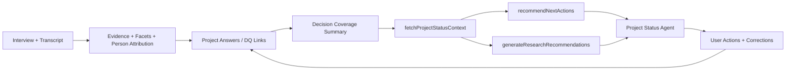

# BMad Multi-Party Spec: DQ Coverage for Agent Orchestration Quality

Date: 2026-02-09
Type: Party mode analysis + implementable quick spec
Focus: Decision Question (DQ) coverage as the missing trust/control plane for agent recommendations

## 1) Context Loaded

- `docs/00-foundation/_information_architecture.md`
- `docs/00-foundation/_lens-based-architecture-v2.md`
- `docs/10-architecture/interview-processing-explained.md`
- `app/mastra/tools/fetch-project-status-context.ts`
- `app/mastra/tools/recommend-next-actions.ts`
- `app/mastra/tools/generate-research-recommendations.ts`
- `app/mastra/agents/project-status-agent.ts`
- `app/mastra/agents/chief-of-staff-agent.ts`

## 2) Problem Statement

Agent recommendations are evidence-aware at a theme/contact level, but they are not consistently grounded in per-DQ answer state (coverage, confidence, contradiction, gaps). This creates two quality failures:

1. Recommendation quality drift: users get action suggestions without explicit proof of which decision question is under-covered.
2. Trust/UI mismatch: transcript + evidence review surfaces are improving, but orchestration cannot yet consume those corrections as DQ-level state.

## 3) Party Mode Panel (Condensed)

### PM
- The product promise should be "answer my decision questions with receipts".
- DQ coverage must become first-class in status context before more recommendation complexity.

### UX Research Lead
- Users trust recommendations only when they can trace "this action closes this specific gap".
- DQ cards need answer status + why + what would change the answer.

### Architect
- Existing schema already has foundations (`decision_questions`, `research_questions`, `project_answers`, `decision_question_summary`).
- Lowest-risk path is to expose/normalize this in tool outputs, not invent a parallel model.

### Agent/Orchestration Engineer
- `fetchProjectStatusContext` should return compact DQ coverage payload.
- `recommendNextActions` + `generateResearchRecommendations` should consume DQ gaps as a primary ranking signal.

### QA/Evals
- Add deterministic tests for ranking behavior when DQ states differ.
- Track recommendation precision: "Did this action target the highest-risk DQ?"

## 4) Target Experience

When user asks "what should I do next?":

- Agent states top 1-3 DQ gaps with confidence + coverage.
- Each recommendation explicitly maps to one DQ gap.
- User can click through to evidence/transcript and see what supports/refutes.
- Corrections in transcript/evidence workflows update DQ coverage and change future recommendations.

## 5) Scope (MVP)

### In Scope

1. Add DQ coverage payload to status context tool output.
2. Update recommendation tools to prioritize DQ risk/coverage gaps.
3. Add observability + tests for DQ-grounded recommendation quality.
4. Wire transcript/evidence correction signals into DQ refresh trigger (event or recompute hook).

### Out of Scope

1. Full DQ authoring UI redesign.
2. New confidence model beyond practical heuristics for MVP.
3. Advanced longitudinal experimentation framework.

## 6) Proposed Data Contract

Add optional `decisionCoverage` payload to `fetchProjectStatusContext` output:

```ts
{
  decisionCoverage: {
    questions: Array<{
      decisionQuestionId: string
      text: string
      status: "answered" | "partial" | "unknown"
      coverage: number // 0..1
      confidence: number | null // 0..1
      evidenceCount: number
      interviewCount: number
      openAnswerCount: number
      answeredAnswerCount: number
      topGaps: string[]
      topSupportingEvidenceIds: string[]
      topRefutingEvidenceIds: string[]
      url?: string
    }>
    summary: {
      answered: number
      partial: number
      unknown: number
      avgCoverage: number
      avgConfidence: number | null
    }
  }
}
```

Primary sources:
- `decision_question_summary`
- `project_answer_metrics`
- `project_answers`

## 7) Architecture Flow



## 8) Stories

### Story 1: Expose DQ Coverage in Status Context

As an orchestration agent,
I need DQ coverage/confidence state from a single tool call,
so I can generate traceable next actions.

Acceptance criteria:
- `fetchProjectStatusContext` supports DQ coverage in output (new optional scope or always-on lightweight payload).
- Payload includes per-DQ status, coverage, confidence, and gap indicators.
- Includes navigable links where route exists.
- Backward-compatible: existing consumers do not break.

### Story 2: Make Recommendation Ranking DQ-First

As a user asking "what next",
I want recommendations prioritized by the highest-risk DQ gaps,
so actions close decision uncertainty instead of generic backlog items.

Acceptance criteria:
- `recommendNextActions` incorporates DQ gap score into ranking.
- `generateResearchRecommendations` includes DQ mapping in reasoning text.
- At least one recommendation explicitly references highest-risk DQ when present.

### Story 3: Close the Transcript-to-DQ Loop

As a researcher correcting transcript/evidence attribution,
I want those corrections to update DQ coverage,
so agent recommendations improve immediately.

Acceptance criteria:
- Evidence correction events trigger DQ recompute path (sync or async acceptable).
- Updated DQ coverage visible in subsequent status context fetch.
- Regression tests cover correction -> DQ delta path.

### Story 4: Add Quality Benchmarks for Orchestration

As product/QA,
I need measurable recommendation quality,
so we can prove DQ coverage improves guidance.

Acceptance criteria:
- Add evaluation set with at least 10 project-state fixtures.
- Measure: top recommendation alignment with highest-risk DQ.
- Baseline + post-change report captured.

## 9) Risk & Mitigations

1. Risk: stale or partial DQ links in existing projects.
   Mitigation: mark confidence null/low with explicit "insufficient linkage" signal.
2. Risk: tool payload bloat impacts latency.
   Mitigation: compact DQ summaries by default; evidence lists truncated.
3. Risk: recommendation regressions for projects without DQs.
   Mitigation: fallback to current heuristics when no DQ rows exist.

## 10) Rollout Plan

1. Phase A: schema-safe read path in `fetchProjectStatusContext` (no behavior changes).
2. Phase B: ranking changes in recommendation tools behind feature flag.
3. Phase C: enable default + benchmark monitoring.

## 11) Bead Linkage Plan

Primary execution bead: DQ coverage orchestration spec implementation (new).

Related existing beads:
- `Insights-l6k9` (objective/question linkage UX)
- `Insights-43a.10` (chief-of-staff recommendation memory)
- `Insights-7ajv` (benchmark gates)

Suggested linkage semantics:
- Relate all three to the new DQ coverage implementation bead.
- Use dependency only where execution is truly blocked.

## 12) Definition of Done

1. DQ coverage present in status context payload and consumed by recommendation logic.
2. Recommendations show explicit DQ-gap grounding in reasoning.
3. Tests and benchmark artifact show quality improvement or no-regression.
4. Beads linked and synchronized.
