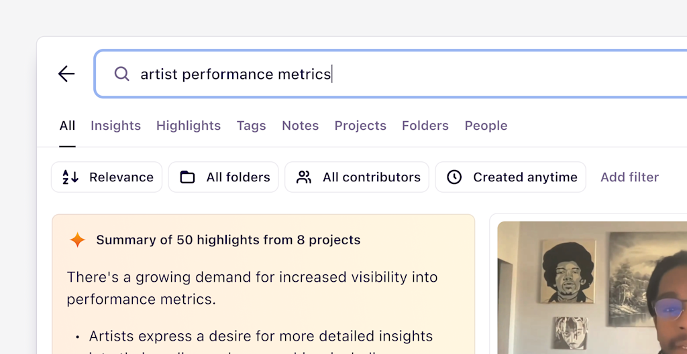
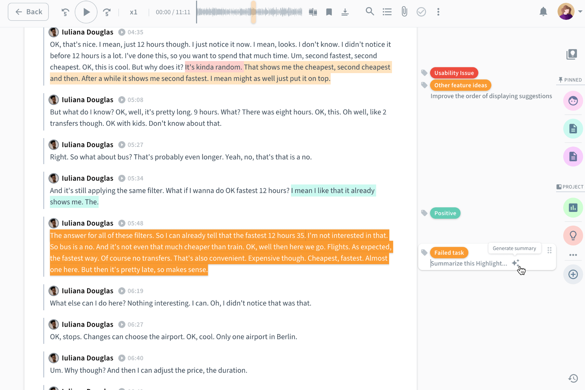
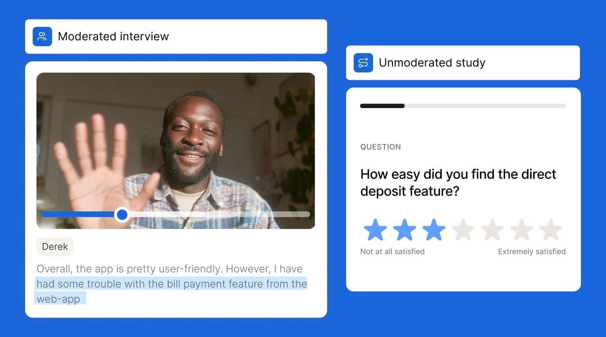
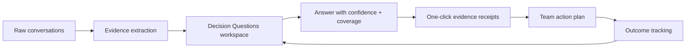
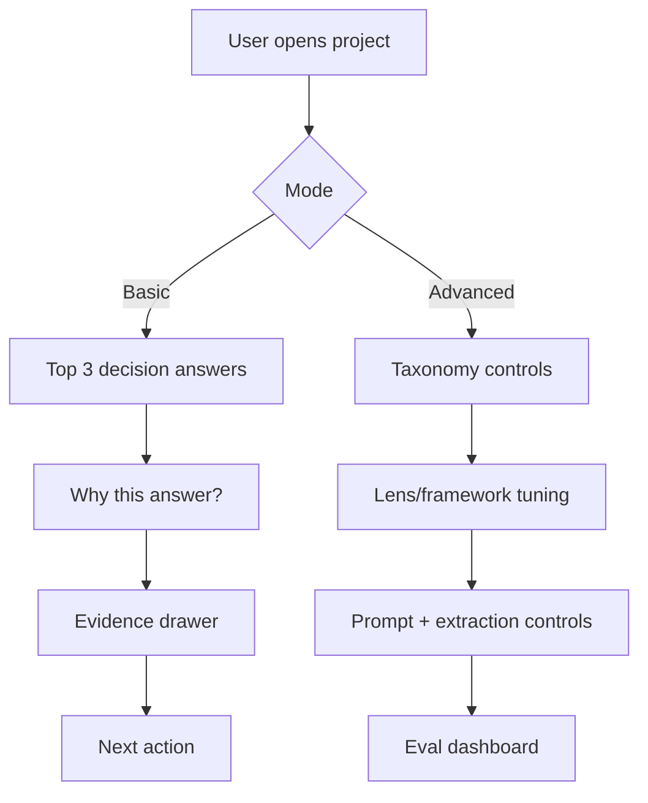

# BMad Party Mode Analysis: UX Research Focus (Beat Dovetail with What Users Want + Simplicity)

Date: 2026-02-09  
Worktree: `codex/taxonomy`

## 1. Competitive UI Snapshot Board

### Dovetail (Magic Search UX)

### Condens (Repository + AI UX)

### Maze (Research Platform UX)

### What these UIs do well
- Strong global search/discovery entry points.
- Fast visual scan of large repositories.
- AI features framed as accelerators, not opaque black boxes.

### Where we can beat them
- Decision-first workspace (not repository-first).
- Better evidence receipts for every claim.
- Lower setup and taxonomy friction in first-run experience.

## 2. Best-in-Class UX Research North Star

North-star promise: "From conversation to confident decision in minutes, with proof."

## 3. Simplicity Strategy (Basic vs Advanced)

Rule: keep Basic mode default and complete. Advanced mode should be opt-in, not required to trust output.

## 4. Top 2 Next Things (Highest Value)

## 1) Ship universal citation receipts + correction loop
Why first:
- Bryan-style trust gap closes fastest here.
- Immediate differentiation from "summary-only" tools.

Definition of done:
- Every analytical answer includes linked citations.
- User can mark claim as wrong / partial and trigger re-synthesis.
- UI shows "what changed" after correction.

Primary metrics:
- Citation completeness rate >= 95%.
- Citation validity rate >= 98%.
- Correction-to-resolution cycle <= 60s median.

## 2) Launch Decision Questions home (default project landing)
Why second:
- Moves product from repository browsing to decision velocity.
- Makes outputs useful to PM/design/exec stakeholders quickly.

Definition of done:
- DQ cards show answer status, confidence, coverage, gaps, and recommended next actions.
- Each card has evidence drill-down in <= 2 clicks.
- Shareable view for stakeholders.

Primary metrics:
- Median time-to-first-trustworthy-answer < 10 min.
- % DQs moved to high-confidence answered state per week.

## 5. Implementation Notes for Current Pipeline

- Keep ingestion unified on person attribution:
  - `evidence_people` and `evidence_facet.person_id` must be set together.
- Maintain one source of truth for extraction contracts across:
  - Trigger v2 orchestrator path
  - Desktop realtime ingestion path
- Prefer shared utilities for person resolution and facet write semantics.

## 6. Image Sources

- Dovetail changelog image: `https://images.ctfassets.net/8fl1jrx919na/4HTzmMr0lefKNwvITawt0W/af21b1a2e2f4b7a03cd19d0d84f91345/Magic_search.png?fm=png&h=529&q=80&w=1024`
- Condens feature image: `https://public-files.condens.io/images/features/repo/slides/ai_capabilities_l.png`
- Maze image: `https://www.datocms-assets.com/38511/1762727894-versatility-thumb-min.jpg?auto=format&fit=max&w=1280`
# BMad Party Mode Analysis: UX Research Focus (Beat Dovetail on User Value + Simplicity)

Date: 2026-02-09
Type: Party Mode analysis (facilitated synthesis)
Scope: UX research workflows, trust, simplicity, and competitive positioning

## 1) Context Loaded Before Analysis

- `docs/00-foundation/_information_architecture.md`
- `docs/00-foundation/_lens-based-architecture-v2.md`
- `docs/10-architecture/interview-processing-explained.md`
- `docs/20-features-prds/features/insights/PRD.md`
- `docs/20-features-prds/features/conversation-lenses/PRD.md`
- `_bmad-output/bryan-feedback-applicability-spec.md`

## 2) Competitive Baseline (Dovetail, current public docs)

Dovetail's current strengths (observed):
- AI-assisted search/chat with source tracing at multiple scopes (project/channel/workspace)
- Automated feedback pipelines via Channels (continuous classification + trend tracking)
- Broad integrations (Slack/Teams, API, MCP server, support tools)
- Strong packaging around AI summaries/transcription/clustering and enterprise controls

Implication:
- We should not compete on "has AI summaries".
- We should win on "trustworthy decisions with less setup and less cognitive load".

## 3) Party Mode Panel Output (Condensed)

### Analyst (Mary)
- Bryan's feedback still maps to one core problem: confidence in conclusions, not absence of summaries.
- Users want "show me why this answer is true" and "let me fix it when it is wrong".

### PM (John)
- Winning wedge: decision velocity with receipts.
- Product promise should be: answer decision questions with linked evidence and explicit confidence/gaps.

### UX Designer (Sally)
- Current risk: expert-level power surfaces too early.
- Needs progressive disclosure:
  - Basic mode: upload -> top answers -> evidence receipts -> next actions
  - Advanced mode: taxonomy tuning, framework edits, prompt controls, lens config

### Architect (Winston)
- Lens architecture is a strong advantage if it stays evidence-first.
- Hard requirement: every generated claim must carry navigable provenance.

### Developer (Amelia)
- Quality bottlenecks are in ingestion attribution consistency, taxonomy hygiene, and default analytical context retrieval.
- These are fixable and high leverage for answer quality.

### Test Architect (Murat)
- Best-in-class requires benchmarked answer quality, not anecdotal demos.
- Need recurring eval set + precision/recall + citation correctness tracking.

## 4) What "Best in Class" Means for UX Research Users

A product can be called best in class for this segment when:
1. A PM/designer can get a reliable answer to a decision question in minutes, not hours.
2. Every claim is verifiable in 1-2 clicks (quote/timestamp/source).
3. Users can correct the system without learning a complex ontology first.
4. Team sharing is automatic and digestible (decision + evidence + action), not repository archaeology.
5. Setup burden is low enough for small teams, while governance scales for enterprise.

## 5) Where We Should Beat Dovetail (Deliberate Differentiation)

### A. Decision-First Workspace (not repository-first)
- Default home should be active Decision Questions with:
  - answer status (answered/partial/unknown)
  - confidence + coverage
  - top supporting/refuting evidence
  - explicit gaps and recommended follow-up prompts

### B. Trust UX as Core Workflow
- Side evidence drawer should be universal and fast.
- Every AI answer should expose "why this answer" and "what would change it".
- Human overrides (edit/reclassify/reject) should trigger visible downstream updates.

### C. Simplicity by Default, Power by Intent
- New-user path: zero-taxonomy mental overhead.
- System should propose taxonomy/topic structure, but users can start with plain-language goals/questions.

### D. Actionability Beyond Insight
- Convert insight clusters into prioritized action options with confidence and expected impact.
- Keep recommendation output tied to evidence, not generic AI advice.

## 6) 90-Day Execution Plan (UX Research Priority)

## Phase 1 (Weeks 1-4): "Trust Core"
- Complete ingestion attribution correctness for person-linked evidence facets.
- Ensure analytical people/theme prompts include facet context by default.
- Ship consistent evidence drawer behavior across top analysis surfaces.
- Add explicit citation section in all analytical answers.

Success gate:
- >=95% analytical answers include at least one valid evidence citation.

## Phase 2 (Weeks 5-8): "Decision Workspace"
- Build DQ-first summary page with answer/confidence/coverage/gaps.
- Add objective <-> question linkage editing UX.
- Add "mark wrong / refine" correction loop with immediate re-synthesis.

Success gate:
- median time-to-first-trustworthy-answer < 10 minutes from first upload.

## Phase 3 (Weeks 9-12): "Simplicity + Scale"
- Launch Basic vs Advanced mode switch.
- Add benchmark harness dashboard (human-coded baseline vs AI output).
- Add governance controls for taxonomy and edit/audit permissions.

Success gate:
- reduction in "setup confusion" and "can't trust answer" support issues by >=40%.

## 7) UX Research User Jobs We Must Nail

1. "Tell me what users struggle with most, and prove it."
2. "Show me what changed this month by segment/persona."
3. "Help me decide what to build next with confidence, not vibes."
4. "Let me challenge or correct an answer without breaking the system."
5. "Share this with stakeholders in a form they can act on quickly."

## 8) Product/UX Metrics That Actually Matter

- Time to first trustworthy answer (TTFTA)
- Citation completeness rate (answer has provenance)
- Citation validity rate (citations resolve to real evidence)
- Correction adoption rate (users refine AI output)
- Rework rate after correction (does system learn)
- Decision throughput (questions moved to answered with high confidence)
- Stakeholder consumption rate (views/click-through on shared decision artifacts)

## 9) Immediate Recommendation

Top priority remains "trust architecture" before broad feature expansion.

If we sequence correctly:
1. Trust core (attribution + evidence UX)
2. Decision-first UX
3. Progressive disclosure and governance

Then we can outperform Dovetail specifically on practical UX research decision-making while keeping the product simpler for non-research specialists.

## 10) Source Notes

- Dovetail AI and search/channel docs indicate strong AI + automation capability and broad ecosystem integration.
- Bryan applicability analysis aligns with a trust-first roadmap: traceability, correction loops, objective linkage, benchmarking.
- Existing lens architecture already supports an evidence-first, role-specific output model; the leverage point is UX simplification and trust workflow completion.

## 11) UX rework onboarding and user flows (2/12)
get the bmad ux expert here for help.

our app is not just research, it enables teams to both discover and fulfill customer needs. Customer discovery and slaes in a unified intelligence and action platform. 
The simplicity strategy above misses the sales aspect. let us help user pick a success route.

onboarding collects 3 pieces of information about the user. we store that then dump them into the user journey, but there's too many choices. this is the place we can show them later. 
instead let us bridge like this:

if the goal is to differentiate based on decision outcomes, and not just being a repository...
lets guide them better.

1. onboarding get to know them (they tell us what brings them here)
2. show them 3 steps to Wow
	1. [discovery] ...
	2. [sales]... upload contacts, enrich data, reach out with a survey offer
	3. ...

the journey page can be a fall back when they want to explore more

capture the existin gscreens in onboarding.
Then create an improved flow that strives to shorten time to wow.

