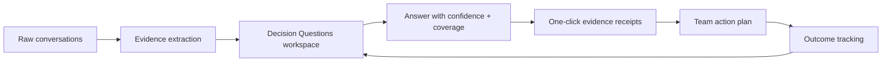
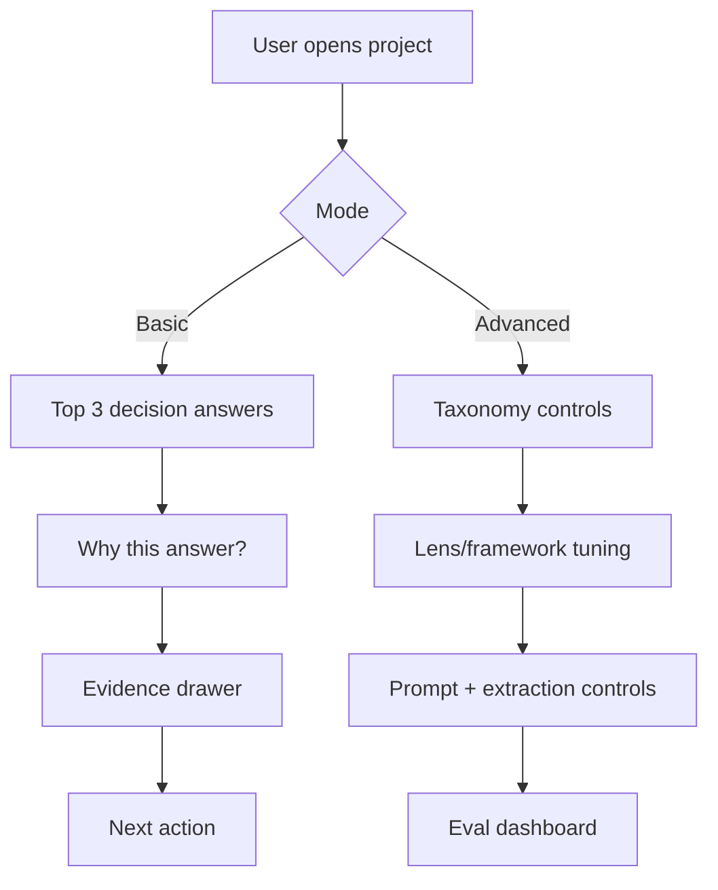

# BMad Party Mode Analysis: UX Research Focus (Beat Dovetail with What Users Want + Simplicity)

Date: 2026-02-09  
Worktree: `codex/taxonomy`

## 1. Competitive UI Snapshot Board

### Dovetail (Magic Search UX)

### Condens (Repository + AI UX)

### Maze (Research Platform UX)

### What these UIs do well
- Strong global search/discovery entry points.
- Fast visual scan of large repositories.
- AI features framed as accelerators, not opaque black boxes.

### Where we can beat them
- Decision-first workspace (not repository-first).
- Better evidence receipts for every claim.
- Lower setup and taxonomy friction in first-run experience.

## 2. Best-in-Class UX Research North Star

North-star promise: "From conversation to confident decision in minutes, with proof."

## 3. Simplicity Strategy (Basic vs Advanced)

Rule: keep Basic mode default and complete. Advanced mode should be opt-in, not required to trust output.

## 4. Top 2 Next Things (Highest Value)

## 1) Ship universal citation receipts + correction loop
Why first:
- Bryan-style trust gap closes fastest here.
- Immediate differentiation from "summary-only" tools.

Definition of done:
- Every analytical answer includes linked citations.
- User can mark claim as wrong / partial and trigger re-synthesis.
- UI shows "what changed" after correction.

Primary metrics:
- Citation completeness rate >= 95%.
- Citation validity rate >= 98%.
- Correction-to-resolution cycle <= 60s median.

## 2) Launch Decision Questions home (default project landing)
Why second:
- Moves product from repository browsing to decision velocity.
- Makes outputs useful to PM/design/exec stakeholders quickly.

Definition of done:
- DQ cards show answer status, confidence, coverage, gaps, and recommended next actions.
- Each card has evidence drill-down in <= 2 clicks.
- Shareable view for stakeholders.

Primary metrics:
- Median time-to-first-trustworthy-answer < 10 min.
- % DQs moved to high-confidence answered state per week.

## 5. Implementation Notes for Current Pipeline

- Keep ingestion unified on person attribution:
  - `evidence_people` and `evidence_facet.person_id` must be set together.
- Maintain one source of truth for extraction contracts across:
  - Trigger v2 orchestrator path
  - Desktop realtime ingestion path
- Prefer shared utilities for person resolution and facet write semantics.

## 6. Image Sources

- Dovetail changelog image: `https://images.ctfassets.net/8fl1jrx919na/4HTzmMr0lefKNwvITawt0W/af21b1a2e2f4b7a03cd19d0d84f91345/Magic_search.png?fm=png&h=529&q=80&w=1024`
- Condens feature image: `https://public-files.condens.io/images/features/repo/slides/ai_capabilities_l.png`
- Maze image: `https://www.datocms-assets.com/38511/1762727894-versatility-thumb-min.jpg?auto=format&fit=max&w=1280`
