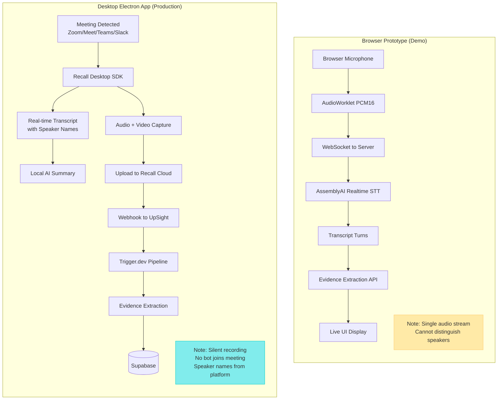
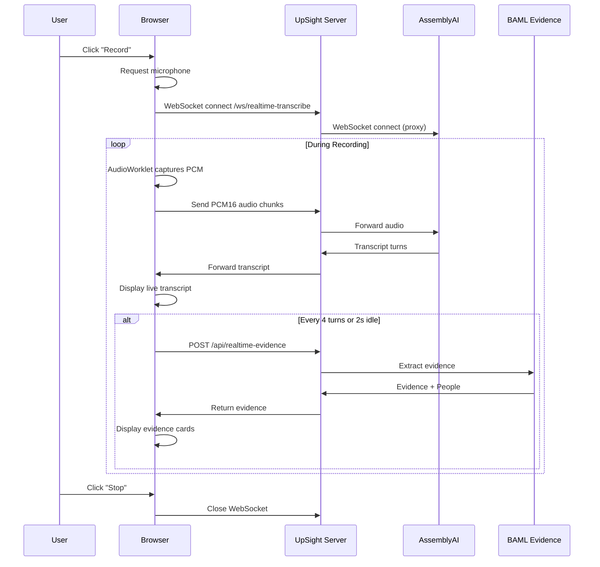
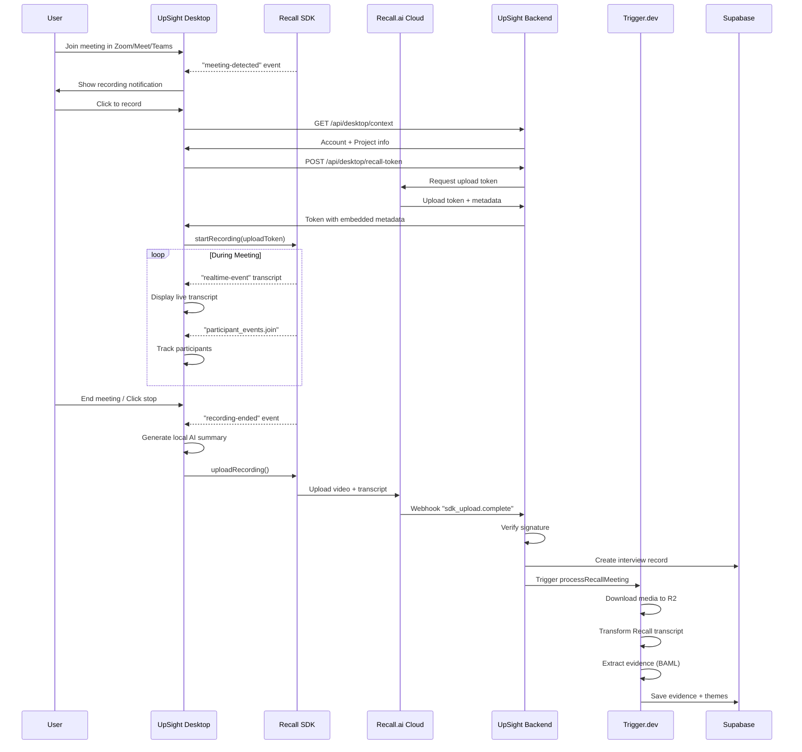

# Realtime Transcription & Evidence Extraction System Flow

This document describes the two approaches for capturing and processing real-time conversations:

1. **Browser Prototype** - For quick demos and prototyping
2. **Desktop Electron App** - For production use with Recall.ai integration

## Architecture Comparison



## Detailed Flows

### Browser Prototype Flow



### Desktop Electron App Flow



## Key Differences

| Feature | Browser Prototype | Desktop App |
|---------|-------------------|-------------|
| **Recording Method** | Browser MediaRecorder | Recall Desktop SDK |
| **Meeting Support** | Any audio source | Zoom, Meet, Teams, Slack |
| **Bot Required?** | No | No (silent capture) |
| **Speaker Names** | Generic (SPEAKER A/B) | From meeting platform |
| **Real-time Transcript** | Yes (AssemblyAI) | Yes (Recall + Deepgram) |
| **Video Capture** | No | Yes |
| **Evidence Extraction** | Real-time in browser | Backend pipeline |
| **Persistence** | Demo only | Saved to database |
| **Local Summary** | No | Yes (OpenRouter) |

## URL Parameters (Browser Demo)

Access the browser prototype at `/realtime-demo` with optional params:

```
/realtime-demo?participants=Alice,Bob&projectId=xxx&interviewId=yyy
```

| Parameter | Description |
|-----------|-------------|
| `participants` | Comma-separated participant names to label speakers |
| `projectId` | Project ID for saving evidence to database |
| `interviewId` | Interview ID for linking evidence |

## When to Use Which

**Use Browser Prototype when:**
- Quick demos or prototyping
- Testing evidence extraction logic
- No desktop app installed
- Simple audio-only capture is sufficient

**Use Desktop App when:**
- Production usage
- Need speaker identification
- Need video recording
- Want seamless meeting platform integration
- Need persistent storage and full pipeline processing
