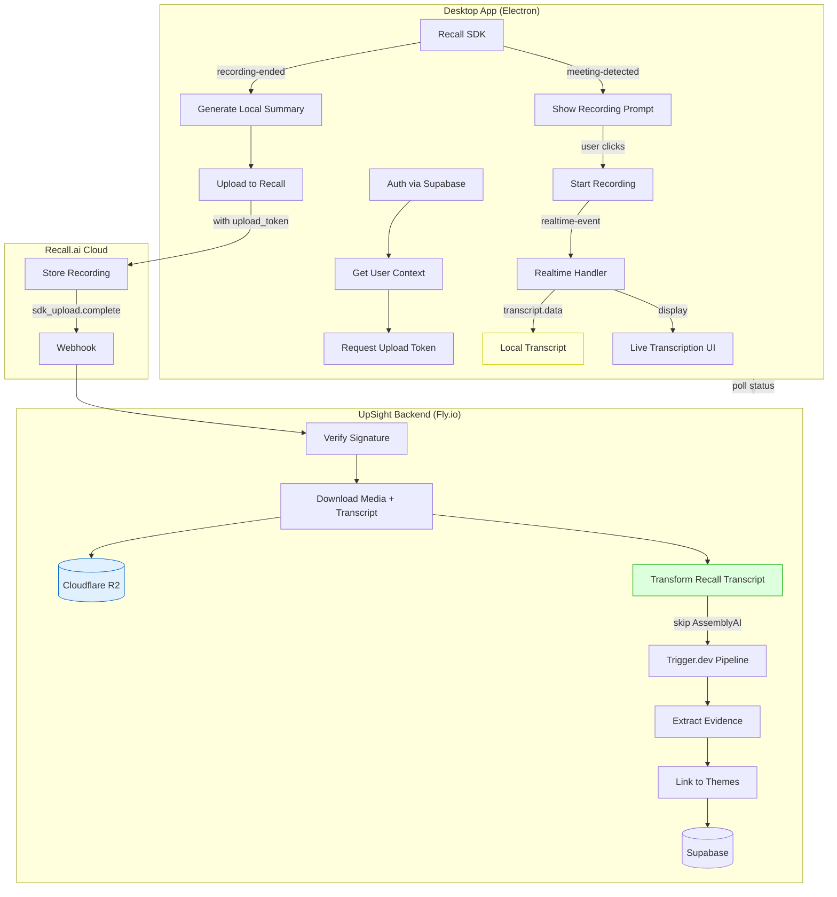

# upsight-desktop Design

## Architecture Overview

```
┌─────────────────────────────────────────────────────────────────────┐
│                        upsight-desktop (Electron)                    │
│  ┌─────────────┐  ┌─────────────┐  ┌─────────────┐  ┌─────────────┐ │
│  │   Auth UI   │  │  Recording  │  │ Transcription│  │  Settings   │ │
│  │   (React)   │  │   Controls  │  │   Display   │  │   Panel     │ │
│  └──────┬──────┘  └──────┬──────┘  └──────┬──────┘  └──────┬──────┘ │
│         │                │                │                │        │
│  ┌──────┴────────────────┴────────────────┴────────────────┴──────┐ │
│  │                     Electron Main Process                      │ │
│  │  ┌──────────────┐  ┌──────────────┐  ┌──────────────┐         │ │
│  │  │ Recall SDK   │  │ UpSight API  │  │ Local State  │         │ │
│  │  │ Integration  │  │   Client     │  │  (Keychain)  │         │ │
│  │  └──────────────┘  └──────────────┘  └──────────────┘         │ │
│  └────────────────────────────────────────────────────────────────┘ │
└─────────────────────────────────────────────────────────────────────┘
         │                      │                      │
         ▼                      ▼                      ▼
┌─────────────────┐   ┌─────────────────┐   ┌─────────────────┐
│   Recall.ai     │   │  UpSight API    │   │  UpSight Web    │
│   Cloud         │   │  (Fly.io)       │   │  (getupsight)   │
└────────┬────────┘   └────────┬────────┘   └─────────────────┘
         │                     │
         │    Webhooks         │
         └─────────────────────┤
                               ▼
                    ┌─────────────────┐
                    │  Trigger.dev    │
                    │  Pipeline       │
                    └────────┬────────┘
                             │
              ┌──────────────┼──────────────┐
              ▼              ▼              ▼
      ┌─────────────┐ ┌─────────────┐ ┌─────────────┐
      │ Cloudflare  │ │ AssemblyAI  │ │  Supabase   │
      │     R2      │ │ (skipped*)  │ │  (Postgres) │
      └─────────────┘ └─────────────┘ └─────────────┘

* AssemblyAI transcription is skipped for Recall-sourced recordings
  since Recall already provides speaker-attributed transcripts.
```

### Data Flow (Mermaid)



## Architecture Decisions (Why)

### Why Upload to Recall at End Instead of Streaming to R2?

**The recording file doesn't exist until the meeting ends.**

During recording, Recall SDK captures:
- Raw audio buffers (16K mono samples, ephemeral)
- Video frames (separate PNGs per participant, ephemeral)
- Transcript events (streamed to desktop app)

Only after `stopRecording()` does the SDK produce a combined `.mp4` file on disk. You can't upload what doesn't exist yet.

### Why Not Skip Recall Upload Entirely?

We need Recall's cloud for:
1. **Permanent storage** - Local recordings may be deleted; Recall provides backup
2. **Video processing** - Combined video with participant metadata
3. **Transcript finalization** - Recall's "accurate" mode provides final verified transcript
4. **Evidence clips** - Future feature needs video for Reels/clips

### Why Skip AssemblyAI for Recall-Sourced Recordings?

**Recall already provides speaker-attributed transcripts** with identical quality to AssemblyAI:
- Recall uses same underlying model as their "accurate" real-time mode
- Recall transcripts include `participant.name` and `participant.id`
- Cost savings: $0.15/hr AssemblyAI fee avoided

### Why Generate Local Summary Before Upload?

**Immediate user value:**
- User sees AI summary within seconds of meeting end
- Doesn't wait for upload → webhook → download → process chain
- Works even if backend is unreachable
- Backend processing still runs for full evidence extraction

### Why Use Upload Tokens with Embedded Metadata?

**Webhook routing:**
- Token contains `account_id`, `project_id`, `user_id`
- When Recall sends `sdk_upload.complete` webhook, we know where to store the interview
- No need for separate lookup or state management

### What Data is Available When?

| Data | During Recording | After Upload |
|------|------------------|--------------|
| `transcript.data` (confirmed) | ✅ Realtime | ✅ Download URL |
| `transcript.partial_data` | ✅ Realtime | ❌ |
| Participant events | ✅ Realtime | ❌ |
| Speaker names/IDs | ✅ With transcript | ✅ With transcript |
| Combined video file | ❌ | ✅ Download URL |
| Evidence/themes | ❌ | ✅ After pipeline |

## Technology Stack

### Desktop App (This Repo)

| Layer | Technology | Rationale |
|-------|------------|-----------|
| **Framework** | Electron | Required for Recall SDK, cross-platform |
| **UI** | React 18 | Matches UpSight web stack, component reuse |
| **State** | Zustand or Context | Simple state for small app |
| **Styling** | Tailwind CSS | Matches UpSight design system |
| **Build** | electron-builder | Standard Electron packaging |
| **Recording** | Recall.ai Desktop SDK | Meeting detection + capture |

### Backend (UpSight - Existing)

| Component | Technology | Notes |
|-----------|------------|-------|
| **API** | Remix on Fly.io | Add new `/api/desktop/*` routes |
| **Database** | Supabase (Postgres) | Extend `interviews` table |
| **Storage** | Cloudflare R2 | Media file storage |
| **Processing** | Trigger.dev | Existing pipeline |
| **Transcription** | AssemblyAI | Existing integration |

## Component Design

### 1. Authentication Flow

```
┌──────────────┐     ┌──────────────┐     ┌──────────────┐
│ Desktop App  │────▶│ System       │────▶│ UpSight      │
│ Login Button │     │ Browser      │     │ OAuth Page   │
└──────────────┘     └──────────────┘     └──────┬───────┘
                                                  │
       ┌──────────────────────────────────────────┘
       │ Redirect with auth code
       ▼
┌──────────────┐     ┌──────────────┐
│ Desktop App  │────▶│ UpSight API  │
│ Token Exchange│    │ /auth/token  │
└──────────────┘     └──────────────┘
```

**Implementation:**
- Use Electron's `shell.openExternal()` to open browser
- Register custom protocol handler `upsight://auth-callback`
- Exchange code for tokens via API
- Store tokens in OS keychain (keytar library)

### 2. Recording State Machine

```
┌─────────┐   meeting    ┌──────────┐   user clicks   ┌───────────┐
│  Idle   │──detected───▶│ Detected │────record──────▶│ Recording │
└─────────┘              └──────────┘                 └─────┬─────┘
     ▲                        │                             │
     │                        │ timeout/dismiss             │ call ends
     │                        ▼                             ▼
     │                   ┌──────────┐               ┌───────────┐
     └───────────────────│ Dismissed│               │ Uploading │
                         └──────────┘               └─────┬─────┘
                                                          │
                              ┌────────────────────────────┘
                              ▼
                    ┌───────────────┐    pipeline     ┌───────────┐
                    │  Processing   │────complete────▶│  Complete │
                    └───────────────┘                 └───────────┘
```

**States:**
- `idle` - No meeting detected, app waiting
- `detected` - Meeting found, showing prompt
- `recording` - Actively capturing, showing transcription
- `uploading` - Call ended, sending to server
- `processing` - Server processing (evidence extraction)
- `complete` - Done, can view in UpSight

### 3. Real-Time Transcription Display

```tsx
// Simplified component structure
interface TranscriptEntry {
  speaker: string;
  text: string;
  timestamp: number;
}

function TranscriptionView({ entries }: { entries: TranscriptEntry[] }) {
  return (
    <div className="transcript-container">
      {entries.map((entry, i) => (
        <div key={i} className="utterance">
          <span className="speaker">{entry.speaker}</span>
          <span className="text">{entry.text}</span>
        </div>
      ))}
    </div>
  );
}
```

**Data Flow:**
1. Recall SDK emits `transcript.data` events
2. Main process receives via SDK event handler
3. IPC bridge sends to renderer
4. React state updates, UI re-renders
5. Auto-scroll to bottom

### 4. API Client Design

```typescript
// src/api/upsight-client.ts

class UpSightClient {
  private baseUrl: string;
  private accessToken: string | null = null;

  // Auth
  async authenticate(code: string): Promise<AuthResponse>;
  async refreshToken(): Promise<void>;

  // Context
  async getContext(): Promise<ContextResponse>;
  async setDefaultProject(accountId: string, projectId: string): Promise<void>;

  // Recall
  async getRecallUploadToken(accountId: string, projectId: string): Promise<TokenResponse>;

  // Interviews
  async listInterviews(accountId: string, projectId: string): Promise<Interview[]>;
  async getRecordingStatus(recallRecordingId: string): Promise<StatusResponse>;
  async updateInterview(interviewId: string, data: Partial<Interview>): Promise<Interview>;
}
```

## Data Models

### Local Storage (Keychain)

```typescript
interface StoredCredentials {
  accessToken: string;
  refreshToken: string;
  expiresAt: number;
}

interface StoredPreferences {
  defaultAccountId: string;
  defaultProjectId: string;
  autoRecord: boolean;
}
```

### API Response Types

```typescript
interface ContextResponse {
  accounts: Account[];
  defaultAccountId: string;
  defaultProjectId: string;
}

interface Account {
  id: string;
  name: string;
  slug: string;
  projects: Project[];
}

interface Project {
  id: string;
  name: string;
  slug: string;
  isDefault: boolean;
}

interface RecordingStatus {
  recallRecordingId: string;
  status: 'pending' | 'processing' | 'completed' | 'error';
  interviewId: string | null;
  progress: {
    mediaDownloaded: boolean;
    transcriptComplete: boolean;
    evidenceExtracted: boolean;
    themesLinked: boolean;
  };
}
```

## Backend Changes Required

### New API Endpoints

All routes under `/api/desktop/*`:

| Endpoint | Method | Purpose |
|----------|--------|---------|
| `/api/desktop/auth` | POST | Exchange auth code for tokens |
| `/api/desktop/context` | GET | Get accounts + projects |
| `/api/desktop/recall-token` | POST | Generate Recall upload token |
| `/api/desktop/interviews` | GET | List interviews |
| `/api/desktop/interviews/:id` | GET | Get interview detail |
| `/api/desktop/interviews/:id` | PATCH | Update interview |
| `/api/desktop/recordings/:id/status` | GET | Get processing status |
| `/api/desktop/health` | GET | Health check |

### Database Schema Updates

```sql
-- Add to interviews table
ALTER TABLE interviews
  ADD COLUMN IF NOT EXISTS meeting_platform TEXT,
  ADD COLUMN IF NOT EXISTS recall_recording_id TEXT UNIQUE;

-- Index for status lookups
CREATE INDEX IF NOT EXISTS idx_interviews_recall_id
  ON interviews(recall_recording_id)
  WHERE recall_recording_id IS NOT NULL;
```

### Webhook Handler

New route: `POST /api/recall-webhook`

Handles events:
- `sdk_upload.complete` - Download media, create interview, trigger pipeline
- `transcript.done` - Update interview with transcript (if using Recall transcription)

## Security Considerations

### Token Storage
- Use `keytar` library for OS-native secure storage
- macOS: Keychain
- Windows: Credential Manager
- Never store tokens in plain files or localStorage

### API Security
- All endpoints require `Authorization: Bearer {token}` header
- Tokens expire after 24 hours
- Refresh tokens valid for 30 days
- Rate limiting: 100 requests/min per user

### Webhook Verification
- Validate HMAC signature from Recall
- Use constant-time comparison
- Reject requests with invalid signatures

## UI/UX Design

### Window States

**Minimal (Default):**
```
┌────────────────────────┐
│ ○ ○ ○   UpSight       │
├────────────────────────┤
│   [📝 Voice Note]      │
│   [🎥 Record Meeting]  │
│                        │
│   ⚙️ Settings          │
└────────────────────────┘
```

**Recording Active:**
```
┌────────────────────────────────────┐
│ ○ ○ ○   Recording • 12:34         │
├────────────────────────────────────┤
│ John: So our main challenge is...  │
│ Sarah: Can you tell me more about  │
│        how that affects your team? │
│ John: Well, the biggest issue is   │
│       that we can't...             │
│                                ▼   │
├────────────────────────────────────┤
│   [⏹️ Stop Recording]              │
└────────────────────────────────────┘
```

**Processing:**
```
┌────────────────────────────────────┐
│ ○ ○ ○   Processing                │
├────────────────────────────────────┤
│                                    │
│   ✓ Recording uploaded             │
│   ✓ Transcription complete         │
│   ◐ Extracting evidence...         │
│   ○ Linking themes                 │
│                                    │
│   [View in UpSight →]              │
└────────────────────────────────────┘
```

### Design Principles

1. **Minimal footprint** - Small window, stays out of the way
2. **Clear status** - Always know what's happening
3. **One-click actions** - No multi-step flows
4. **Consistent with UpSight** - Same colors, typography

## File Structure

```
upsight-desktop/
├── package.json
├── electron-builder.yml          # Build config
├── src/
│   ├── main/                     # Electron main process
│   │   ├── index.ts              # Entry point
│   │   ├── recall.ts             # Recall SDK integration
│   │   ├── auth.ts               # Auth handling
│   │   ├── api-client.ts         # UpSight API client
│   │   └── store.ts              # Keychain storage
│   ├── preload/                  # Preload scripts
│   │   └── index.ts              # IPC bridge
│   ├── renderer/                 # React UI
│   │   ├── App.tsx               # Root component
│   │   ├── components/
│   │   │   ├── AuthView.tsx
│   │   │   ├── IdleView.tsx
│   │   │   ├── RecordingView.tsx
│   │   │   ├── ProcessingView.tsx
│   │   │   └── SettingsView.tsx
│   │   ├── hooks/
│   │   │   ├── useAuth.ts
│   │   │   ├── useRecording.ts
│   │   │   └── useContext.ts
│   │   └── styles/
│   │       └── tailwind.css
│   └── shared/                   # Shared types
│       └── types.ts
├── assets/                       # Icons, images
└── scripts/                      # Build scripts
```

## Build & Distribution

### Platforms

| Platform | Architecture | Package Format |
|----------|--------------|----------------|
| macOS | arm64 (Apple Silicon) | .dmg |
| Windows | x64 | .exe (NSIS installer) |

Note: Intel Macs not supported by Recall SDK.

### Code Signing

- macOS: Apple Developer certificate required
- Windows: EV code signing certificate recommended
- Both: Enables auto-update without security warnings

### Auto-Update

Use `electron-updater` with GitHub releases:
- Check for updates on app launch
- Download in background
- Prompt user to restart

## References

- [Meeting Agent Spec](./meeting-agent-spec.md) - Detailed API and webhook specs
- [Recall.ai Desktop SDK](https://docs.recall.ai/docs/desktop-sdk)
- [Muesli Sample App](https://github.com/recallai/muesli-public)
