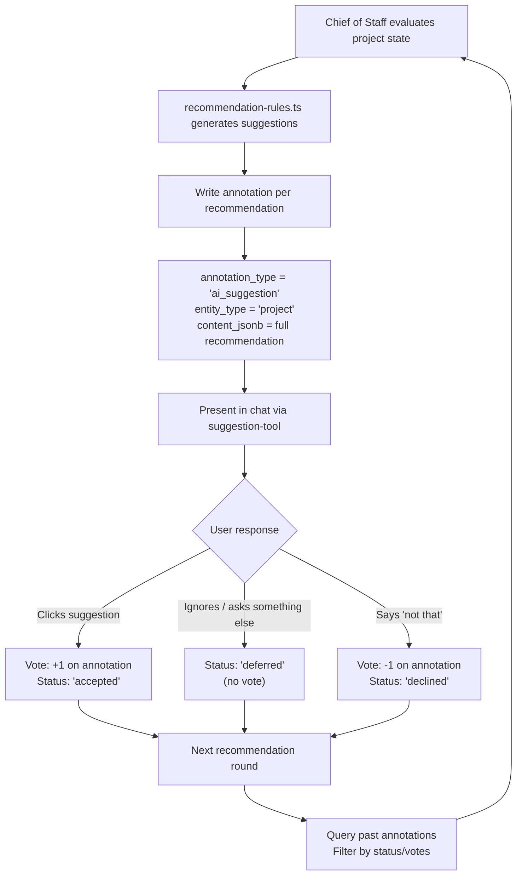

# PRD: Recommendation Memory & Decision Tracking

## Problem

The Chief of Staff agent generates 2-3 recommendations when a user asks "what should I do next?" But there's no memory of what was proposed or what the user chose. Every session starts fresh. This means:

- Declined suggestions get re-proposed
- Accepted suggestions aren't tracked for completion
- No training data for improving recommendation quality
- No signal about user intent or priorities
- The agent can't reason about patterns in what users accept vs. reject

## Goal

Every recommendation the Chief of Staff makes should be recorded. Every user response (accept, decline, defer) should be tracked. This history should feed back into future recommendations and be available as training data.

## How It Works Today

```
recommendation-rules.ts      Pure functions, analyzes project state
  -> recommend-next-actions.ts  Mastra tool, wraps rules engine
    -> chief-of-staff-agent.ts  Calls tool, presents 2-3 suggestions
      -> suggestion-tool.ts     Renders clickable buttons in chat
        -> User clicks one       ... nothing recorded
```

**Key files:**
- `app/features/research-links/utils/recommendation-rules.ts` - Rules engine
- `app/mastra/tools/recommend-next-actions.ts` - Recommendation tool
- `app/mastra/agents/chief-of-staff-agent.ts` - Agent
- `app/mastra/tools/suggestion-tool.ts` - UI suggestions
- `app/routes/api.chat.project-status.tsx` - Chat routing

## Proposed Architecture

### Storage: Use the existing annotations system

The `annotations` table already supports `ai_suggestion` type with structured JSONB content, AI authorship tracking, and a votes system for accept/decline. No new tables needed.



### Annotation record structure

Each recommendation becomes an annotation on the project:

```typescript
// Written when Chief of Staff generates a recommendation
{
  entity_type: 'project',
  entity_id: projectId,
  annotation_type: 'ai_suggestion',
  created_by_ai: true,
  ai_model: 'chief-of-staff',
  content: recommendation.title,  // Human-readable summary
  content_jsonb: {
    // The full recommendation
    recommendation_id: recommendation.id,   // e.g. "setup_incomplete"
    title: recommendation.title,
    description: recommendation.description,
    reasoning: recommendation.reasoning,
    action_type: recommendation.actionType,
    navigate_to: recommendation.navigateTo,
    focus_theme: recommendation.focusTheme,
    priority: recommendation.priority,

    // Snapshot of project state at time of recommendation
    project_stage: "discovery",
    project_state: {
      interview_count: 3,
      survey_count: 0,
      theme_count: 5,
      insight_count: 0
    },

    // Session context
    chat_thread_id: threadId,
    recommendation_batch_id: batchId,  // Groups the 2-3 suggestions from one assessment

    // Response tracking (updated when user responds)
    response: null | 'accepted' | 'declined' | 'deferred',
    responded_at: null | timestamp,
  },
  metadata: {
    batch_size: 3,        // How many suggestions were in this batch
    batch_position: 1,    // Which position (1st, 2nd, 3rd)
  }
}
```

### Feedback loop

Before generating new recommendations, the Chief of Staff queries past annotations:

```sql
SELECT content_jsonb, created_at
FROM annotations
WHERE entity_type = 'project'
  AND entity_id = $projectId
  AND annotation_type = 'ai_suggestion'
  AND created_by_ai = true
ORDER BY created_at DESC
LIMIT 20
```

The rules engine then uses this history:

1. **Don't re-propose declined suggestions** (same `recommendation_id` with `response = 'declined'`) unless project state has materially changed
2. **Follow up on accepted suggestions** — if user accepted "run a pricing survey" but `survey_count` hasn't changed, ask about it
3. **Learn priority patterns** — if user consistently accepts `interview` actions over `survey` actions, weight accordingly
4. **Respect deferrals** — deferred items can be re-proposed after a reasonable interval (e.g., next session)

### Changes needed

| Component | Change | Complexity |
|-----------|--------|------------|
| `recommend-next-actions.ts` | Write annotation per recommendation, query history before generating | Medium |
| `recommendation-rules.ts` | Accept history as input, filter/weight based on past responses | Medium |
| `suggestion-tool.ts` | Link suggestions to annotation IDs so clicks can record response | Small |
| Chat UI (suggestion click handler) | On click, update annotation with `response: 'accepted'` | Small |
| Chat API route | On new message (not a suggestion click), mark pending suggestions as `deferred` | Small |
| `chief-of-staff-agent.ts` | Include recommendation history summary in prompt context | Small |

### What we DON'T need

- No new database tables (annotations + votes already exist)
- No new UI screens (everything happens in the chat thread)
- No new API endpoints (annotation CRUD already exists via manage-annotations tool)
- No separate "recommendation dashboard" (query annotations when needed)

## User Experience

From the user's perspective, nothing changes visually. They still see 2-3 suggestion buttons in chat. The difference is behind the scenes:

1. User asks "what should I work on?"
2. Chief of Staff checks project state AND past recommendation history
3. Generates 2-3 suggestions, skipping recently-declined ones
4. Each suggestion is saved as an annotation
5. User clicks one -> recorded as accepted, others marked deferred
6. Next time, the agent knows what was tried, what was skipped, what worked

## Training Data Value

Every annotation record captures:
- **What was recommended** (full context + reasoning)
- **What project state triggered it** (snapshot)
- **What the user chose** (accept/decline/defer)
- **What happened after** (did the accepted action lead to progress?)

This creates a dataset of `(project_state, recommendations, user_choice, outcome)` tuples for future model fine-tuning.

## Open Questions

1. **Expiry** — How long before a declined recommendation can be re-proposed? Suggestion: only when the underlying project state changes (e.g., new interviews added).
2. **Cross-project learning** — Should recommendation history be per-project or account-wide? Start per-project, expand later.
3. **Batch correlation** — When 3 suggestions are shown and user picks one, should the other 2 be marked `deferred` or `declined`? Suggestion: `deferred` (not choosing isn't rejecting).

## Related Docs

- [Mastra Agent Architecture](./mastra-project-agents.md) — Agent delegation patterns
- [Agentic System Strategy](../../architecture/agentic-system-strategy.md) — Overall AI system design (see "Learning from Outcomes" section)
- [Annotations Schema](../../20-features-prds/annotations-schema-proposal.md) — Annotations table design
- [Task System Design](../../20-features-prds/features/task-system-technical-design.md) — Task/action tracking
