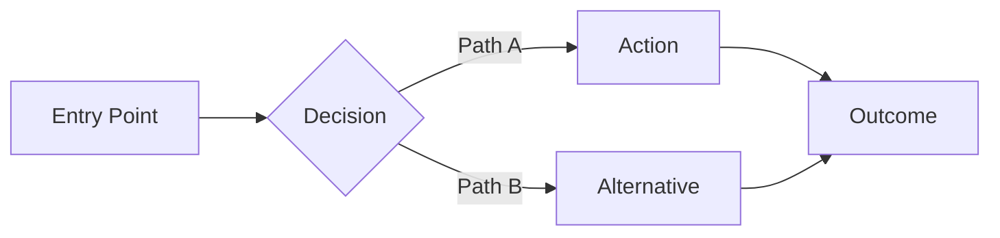
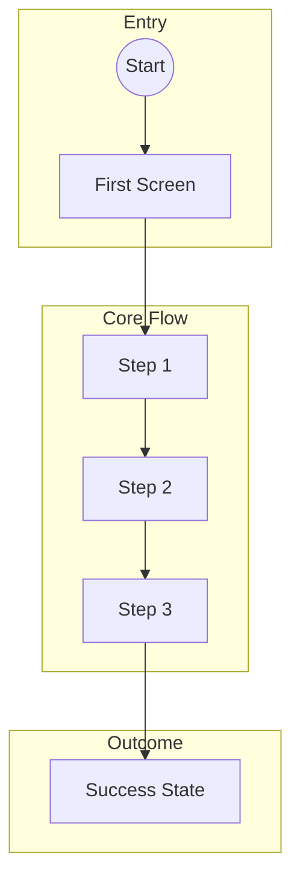
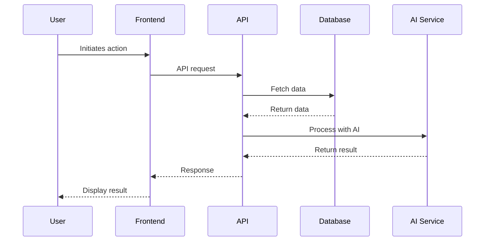
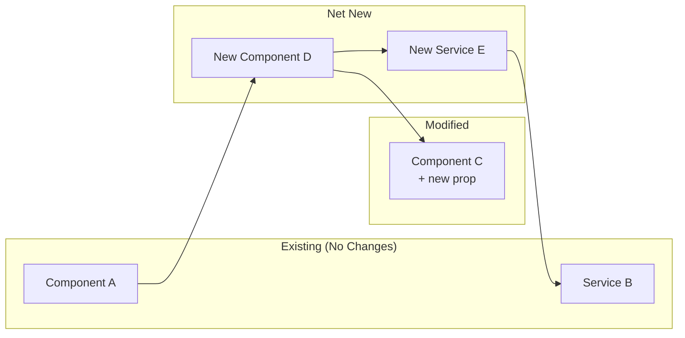
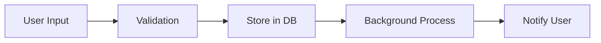

# Feature Specification Template

> **Purpose**: Standard format for all new and modified feature work at UpSight
> **Goal**: Align teams quickly with minimal cognitive load
> **Principle**: Show the journey before the code

---

## How to Use This Template

Copy this template for each new feature. Fill in sections in order—they're designed to build understanding progressively:

1. **Context First** — What problem? Who benefits?
2. **Visual Journey** — Mermaid flows before anything else
3. **Integration Map** — What exists? What's new?
4. **Risks & Effort** — Be honest about unknowns
5. **Implementation** — Code comes last, when context is clear

---

# [Feature Name]

| Field | Value |
|-------|-------|
| **Status** | Draft / In Review / Approved / In Progress / Complete |
| **Author** | [Name] |
| **Date** | YYYY-MM-DD |
| **Epic/Project** | [Link to Linear/GitHub] |
| **Branch** | `feature/...` |

---

## 1. Overview

### 1.1 Problem Statement
> What pain point or opportunity does this address? Keep it to 2-3 sentences.

### 1.2 Success Criteria
> How do we know this worked? Be specific and measurable.

- [ ] Criterion 1 (e.g., "Users can complete X in < 2 minutes")
- [ ] Criterion 2 (e.g., "80% of users choose the new flow")
- [ ] Criterion 3 (e.g., "Support tickets about Y decrease by 50%")

---

## 2. User Stories

> Format: As a [persona], I want [goal] so that [benefit]

### Primary Stories
| ID | Story | Priority | Acceptance Criteria |
|----|-------|----------|---------------------|
| US-1 | As a **researcher**, I want to... so that... | Must Have | Given/When/Then... |
| US-2 | As a **sales rep**, I want to... so that... | Must Have | Given/When/Then... |
| US-3 | As a **team lead**, I want to... so that... | Should Have | Given/When/Then... |

### Edge Cases
| ID | Scenario | Expected Behavior |
|----|----------|-------------------|
| EC-1 | User has no data yet | Show guided empty state |
| EC-2 | User loses connection mid-flow | Preserve state, resume on reconnect |

---

## 3. User Journey (Visual First)

> Start with the big picture flow. No code yet—just boxes and arrows.

### 3.1 High-Level Flow



### 3.2 Detailed User Flow



### 3.3 Sequence Diagram (If Applicable)

> Show system interactions for complex flows



---

## 4. Wireframes / Mockups

> Visual representation of key screens. Can be ASCII, Figma links, or image embeds.

### Screen 1: [Name]
```
┌─────────────────────────────────────────────────────┐
│  Header                                    [Action] │
├─────────────────────────────────────────────────────┤
│                                                     │
│  Main Content Area                                  │
│                                                     │
│  ┌─────────────────┐  ┌─────────────────┐          │
│  │    Option A     │  │    Option B     │          │
│  └─────────────────┘  └─────────────────┘          │
│                                                     │
│  [Primary CTA]                                      │
│                                                     │
└─────────────────────────────────────────────────────┘
```

### Screen 2: [Name]
[Figma Link] or embedded image

---

## 5. Integration Map

> This is critical: What exists vs. what's new?

### 5.1 Existing Components/Systems We're Using

| Component | Location | How We're Using It |
|-----------|----------|-------------------|
| `ProjectSetupProvider` | `app/features/onboarding/context/` | State management for setup flow |
| `useProjectRoutes` | `app/hooks/` | Navigation to project resources |
| `supabaseAdmin` | `app/lib/supabase/` | Database operations |

### 5.2 Existing Patterns We're Following

| Pattern | Reference | Notes |
|---------|-----------|-------|
| Form validation | `app/features/*/pages/create.tsx` | Using Conform + Zod |
| Streaming UI | `app/routes/api.chat.tsx` | AI SDK pattern |
| Background tasks | `src/trigger/` | Trigger.dev v4 |

### 5.3 What's Net New

| New Component/System | Purpose | Depends On |
|---------------------|---------|------------|
| `NewComponent.tsx` | Handles X | Existing Y |
| `new-table` (DB) | Stores Z | Migration required |
| `newTool` (Mastra) | AI capability W | BAML prompt |

### 5.4 Integration Points



---

## 6. Data Model Changes

> Only if database changes are needed

### New Tables
```sql
-- Describe the table purpose, not the full DDL
-- Table: feature_records
-- Purpose: Store X for Y
-- Columns: id, project_id, data (jsonb), created_at
```

### Modified Tables
| Table | Change | Migration Notes |
|-------|--------|-----------------|
| `projects` | Add `new_column` | Nullable, backfill not required |

### Data Flow


---

## 7. Risk Assessment

### 7.1 Technical Risks

| Risk | Likelihood | Impact | Mitigation |
|------|------------|--------|------------|
| AI response latency | Medium | High | Implement streaming, show progress |
| Database migration issues | Low | High | Test on staging with prod data copy |
| Breaking existing flows | Medium | Medium | Feature flag, gradual rollout |

### 7.2 UX Risks

| Risk | Likelihood | Impact | Mitigation |
|------|------------|--------|------------|
| Users confused by new flow | Medium | Medium | User testing, clear affordances |
| Increased abandonment | Low | High | Analytics tracking, A/B test |

### 7.3 Unknowns / Open Questions

- [ ] Question 1: How should we handle X edge case?
- [ ] Question 2: Do we need Y integration?
- [ ] Spike needed: Investigate Z performance

---

## 8. Effort Estimate

> Be honest. Ranges are better than false precision.

### 8.1 Work Breakdown

| Task | Scope | Dependencies |
|------|-------|--------------|
| Database schema | Small | None |
| API endpoints | Medium | Schema |
| UI components | Large | API |
| Testing | Medium | UI |
| Documentation | Small | All |

### 8.2 Phases

| Phase | What's Included | Deliverable |
|-------|-----------------|-------------|
| Phase 1 | Core flow, happy path | MVP usable by team |
| Phase 2 | Edge cases, polish | Production-ready |
| Phase 3 | Analytics, optimization | Data-driven iteration |

---

## 9. Implementation Details

> This section comes LAST. Only after context is established.

### 9.1 Key Technical Decisions

| Decision | Rationale | Alternatives Considered |
|----------|-----------|------------------------|
| Use X pattern | Because Y | Considered Z, but... |

### 9.2 API Contracts

> Define interfaces before implementation

```typescript
// Input/Output types only - not full implementation
type FeatureInput = {
  projectId: string
  // ...
}

type FeatureOutput = {
  success: boolean
  data: {
    // ...
  }
}
```

### 9.3 File Changes Summary

| File | Change Type | Description |
|------|-------------|-------------|
| `app/features/X/pages/new.tsx` | New | Entry page for feature |
| `app/routes.ts` | Modified | Add route |
| `src/trigger/X/process.ts` | New | Background job |

---

## 10. Testing Strategy

| Test Type | What We're Testing | Location |
|-----------|-------------------|----------|
| Unit | Component logic | `*.test.tsx` |
| Integration | API + DB | `*.integration.test.ts` |
| E2E | Full user flow | `e2e/*.spec.ts` |

---

## 11. Rollout Plan

| Stage | Audience | Success Criteria |
|-------|----------|------------------|
| Internal | Team only | No blocking bugs |
| Beta | 10% of users | Positive feedback, metrics stable |
| GA | All users | Metrics meet targets |

---

## 12. References

- [Related PRD](./link.md)
- [Design Mockups](figma.com/...)
- [Previous Discussion](linear.app/...)

---

## Changelog

| Date | Author | Change |
|------|--------|--------|
| YYYY-MM-DD | Name | Initial draft |
