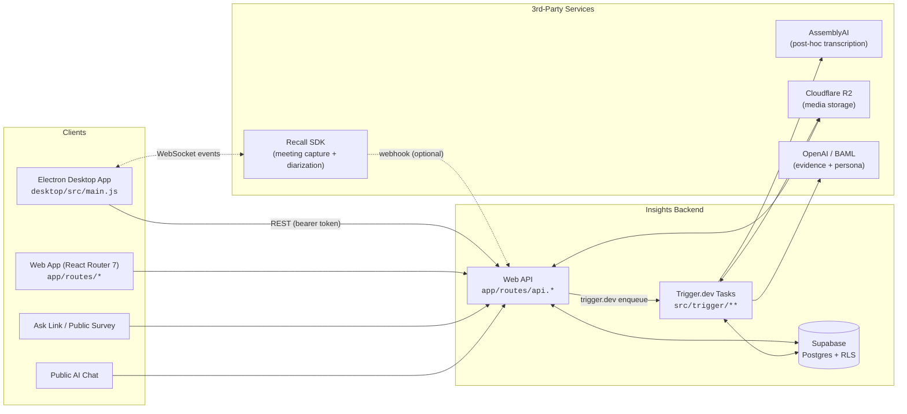
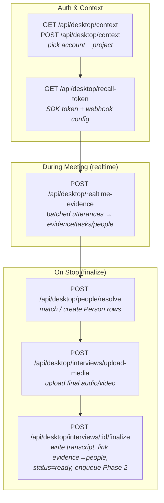
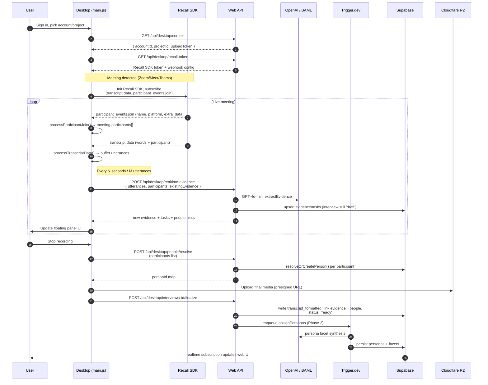
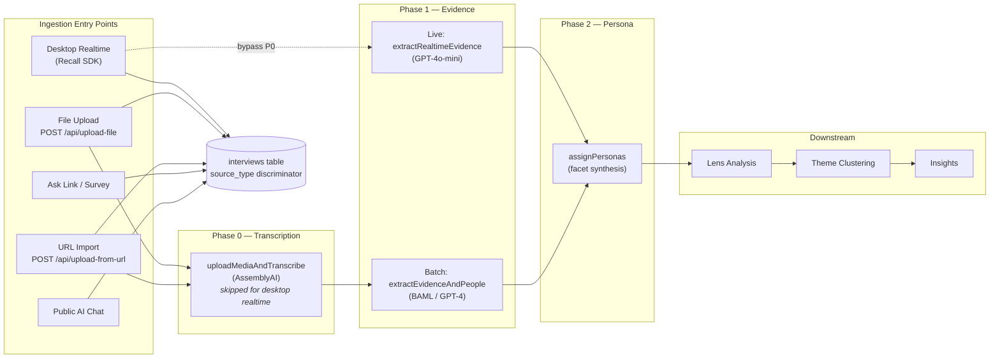
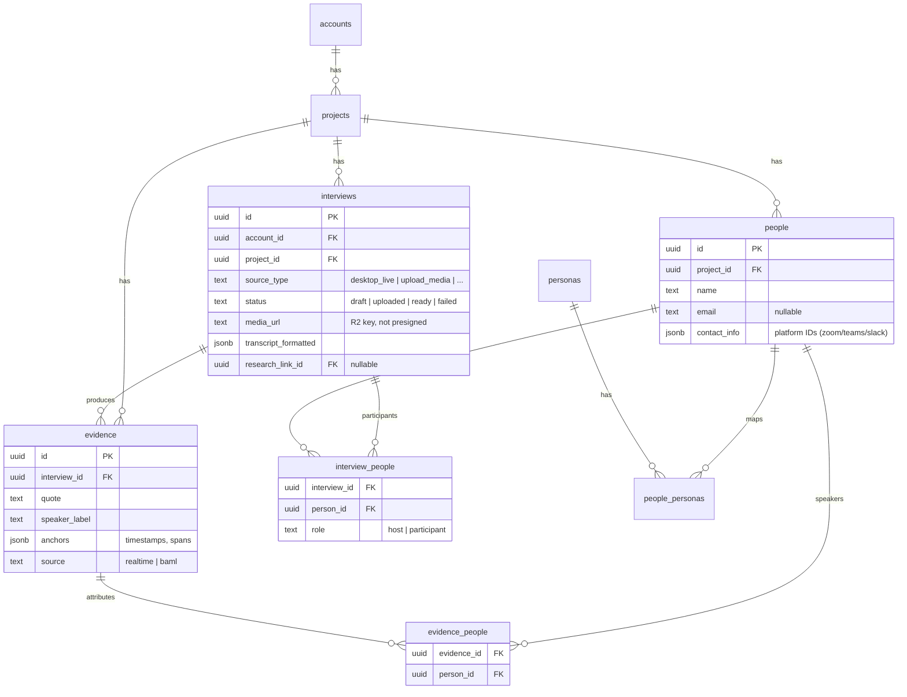

# Desktop App ↔ Web API ↔ Universal Conversation Pipeline

> **Status:** Reference diagram (current as of 2026-04-18)
> **Audience:** Engineers reasoning about desktop ingestion, realtime evidence, and the unified conversation pipeline.
> **Companions:**
> - [`docs/20-features-prds/features/unified-conversation-architecture.md`](../20-features-prds/features/unified-conversation-architecture.md) — pipeline rationale & schema
> - [`docs/10-architecture/interview-processing-explained.md`](./interview-processing-explained.md) — three-phase processing
> - [`docs/10-architecture/interview-processing-flows.md`](./interview-processing-flows.md) — media URL strategy
> - [`docs/features/desktop-speaker-identification.md`](../features/desktop-speaker-identification.md) — Recall SDK speaker spec
> - [`docs/30-howtos/desktop-build-deploy.md`](../30-howtos/desktop-build-deploy.md) — desktop build

This doc is a **map, not a spec**. It shows how the Electron desktop app, the web API, and the shared conversation pipeline fit together so you can quickly locate the right code path when debugging or extending a feature.

---

## 1. System Context

All conversation sources (desktop live recording, file upload, URL import, Ask link, public AI chat) converge on the **`interviews` table** and the same downstream pipeline. The desktop app is one of four ingestion entry points — but the only one that streams evidence *during* the conversation.

**Key observation:** the desktop app talks to the web API over plain REST with a bearer token. Real-time events come from **Recall SDK directly into the desktop process** — they do *not* flow through our backend. The desktop batches those events and posts summarized evidence/utterances to the API.

---

## 2. Desktop ↔ Web API Boundary (Endpoints)

Every desktop → backend call lives under `/api/desktop/*`. Grouped by lifecycle phase:

File references:

| Phase | Route file |
|---|---|
| Auth/context | `app/routes/api.desktop.context.ts` |
| Recall token | `app/routes/api.desktop.recall-token.ts` |
| Realtime evidence | `app/routes/api.desktop.realtime-evidence.ts` |
| Person resolve | `app/routes/api.desktop.people.resolve.ts` |
| Media upload | `app/routes/api.desktop.interviews.upload-media.ts` |
| Finalize | `app/routes/api.desktop.interviews.finalize.ts` |

---

## 3. Realtime Desktop Flow (Sequence)

This is what happens when a user is recording a live meeting on the desktop. The key insight is **evidence extraction runs continuously during the call**, not after.

**Why this matters:**
- Evidence on screen during the call is the **same shape** as post-hoc evidence — they converge in the `evidence` table.
- Person resolution is deferred to stop-time so mid-meeting name updates (`participant_events.update`) don't create duplicate rows.
- Finalization is what flips `interviews.status` to `ready` and kicks off Phase 2 (persona synthesis); Phase 1 (evidence) already ran live.

---

## 4. Unified Pipeline — All Sources, One Table

The desktop app is just one producer. Every ingestion path writes to `interviews` and then flows through the same downstream stages.

Source-type ↔ producer mapping (`interviews.source_type`):

| source_type | Producer | Transcription path |
|---|---|---|
| `desktop_live` | Desktop + Recall | Recall speaker-timeline (no AssemblyAI) |
| `upload_media` | Web upload | AssemblyAI via Trigger.dev |
| `url_import` | `/api/upload-from-url` | AssemblyAI via Trigger.dev |
| `survey_form` / `survey_chat` / `survey_voice` | Ask link | No transcription (text in) |
| `ai_chat` | Public AI chat | No transcription (text in) |

---

## 5. Core Entities (Ingestion Slice)

A narrow ER diagram focused on what the desktop pipeline touches — the full schema is larger.

**Why the junction tables exist:**
- `evidence_people` — one quote can have multiple speakers (e.g. interruption / cross-talk).
- `interview_people` — roster of the meeting, independent of whether each person actually spoke.
- `contact_info` JSONB on `people` — stores Zoom `conf_user_id`, Teams `user_id`, etc., so the same person is recognized across meetings *without* schema migrations per platform.

---

## 6. Reading Guide

If you're debugging a specific symptom, start here:

| Symptom | Start in |
|---|---|
| Wrong speaker labels on live evidence | `desktop/src/main.js` → `processTranscriptData()` + `api.desktop.realtime-evidence.ts` |
| Duplicate `people` rows across meetings | `app/lib/people/resolution.server.ts` and `contact_info` JSONB |
| Evidence missing after upload | `src/trigger/interview/v2/extractEvidence.ts` + BAML `ExtractEvidenceFromTranscriptV2` |
| Persona facets not populated | `src/trigger/interview/v2/assignPersonas.ts` |
| Media playback 403 / expired URL | `app/utils/media-url.client.ts` — regenerate presigned URL from R2 key |
| Desktop auth / project picker broken | `app/routes/api.desktop.context.ts` |

---

## 7. What This Diagram Deliberately Omits

- **Auth internals** — desktop bearer tokens and Supabase session plumbing.
- **Lens / theme / insight internals** — covered in `docs/20-features-prds/features/unified-conversation-architecture.md`.
- **R2 presigning details** — covered in `interview-processing-flows.md`.
- **Survey-specific flows** (`research_link_responses`) — see unified architecture doc §"Decision: Keep research_link_responses".

Keep this file as the single-page system map. When a flow gets its own deep dive, link it from §1 rather than growing this document.
