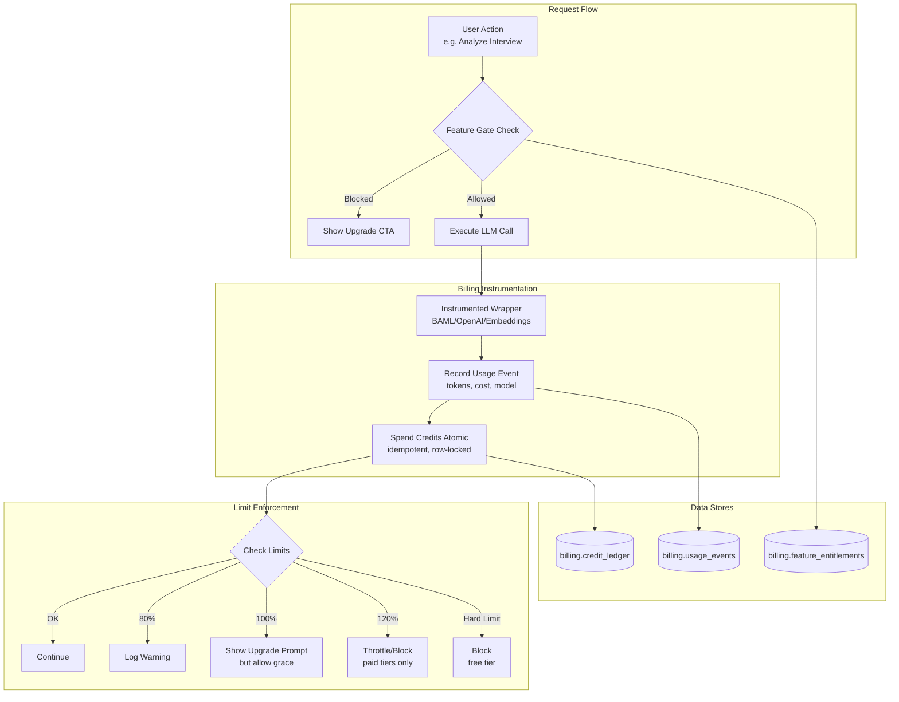

# Billing & Usage Tracking System Overview

## How It Works

The billing system implements a **hybrid model**: users see simple messaging ("Unlimited AI", "5 analyses/month") while internally tracking everything via credits for cost control.

**Core Components:**

| Component | Purpose | Location |
|-----------|---------|----------|
| **Plan Config** | Single source of truth for tiers | `app/config/plans.ts` |
| **Usage Events** | Records every LLM call | `billing.usage_events` |
| **Credit Ledger** | Immutable accounting ledger | `billing.credit_ledger` |
| **Feature Entitlements** | Gates premium features | `billing.feature_entitlements` |
| **Instrumented Wrappers** | Auto-record usage on LLM calls | `app/lib/billing/*.server.ts` |
| **Feature Gates** | Enforce limits (server + client) | `app/lib/feature-gate/` |

**Credit Mapping:** 1 credit = $0.01 USD (never shown to users)

**Plan Tiers:**
- **Free:** 500 credits, hard limit, 5 analyses/month
- **Starter ($15):** 2,000 credits, soft cap, "Unlimited"
- **Pro ($29):** 5,000 credits, soft cap, "Unlimited"
- **Team ($25/user):** 4,000 credits/user pooled, soft cap

**Key Mechanisms:**
1. **Idempotency:** All ledger operations use unique keys to prevent duplicate charges on retries
2. **Atomic Spends:** `spend_credits_atomic()` locks account row, calculates balance, inserts spend in one transaction
3. **Soft Caps:** Paid tiers warn at 80%, prompt at 100%, only throttle at 120%
4. **Feature Gates:** Server-side `checkLimitAccess()` + client-side `useFeatureGate()` hook

---

## Critical Review Items

1. **Plan Detection Not Implemented:** `getAccountPlan()` in `usage.server.ts:274` returns `"free"` for all accounts. Polar/Stripe webhook integration to sync subscriptions and update plan status is not wired up. Until this is fixed, **all users are billed as free tier**.

2. **Voice Minutes Tracking Hack:** Voice duration is stored in `output_tokens` field (see `check-limit.server.ts:174`). This works but violates schema semantics. Should add dedicated `duration_seconds` column to `usage_events` for clarity and correctness.

3. **No Credit Grant Automation:** Monthly credit grants depend on webhook handlers that aren't implemented. The `grant_credits()` function exists but nothing calls it on subscription renewal. Credits will deplete without replenishment.

---

## Confidence Level: **Medium (65%)**

**Strengths:** Schema design is solid with proper idempotency, atomic operations, and audit trails. Plan configuration is DRY. Instrumented wrappers exist for BAML/embeddings.

**Gaps:** Core integration points (Polar webhooks, plan detection, credit grants) are stubbed. Voice tracking uses a field repurposing hack. No actual enforcement happens until `getAccountPlan()` returns real data. Phase 1 monitoring (team alerts at soft cap) has no Slack integration.
