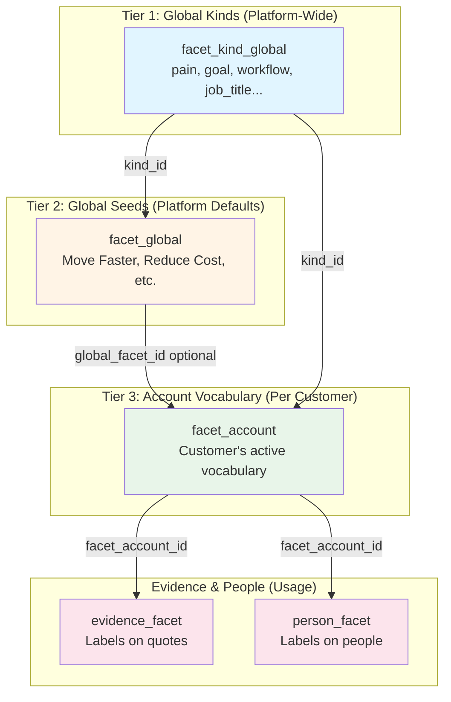
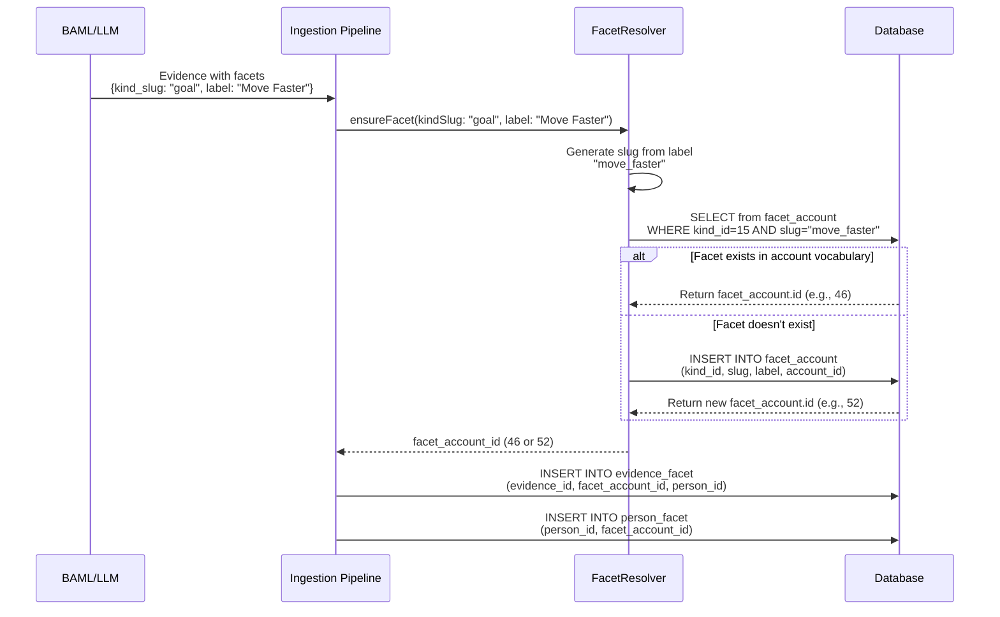

# Facet Catalog (Current Architecture)

Last verified: 2026-02-11

This document is the current source-of-truth for taxonomy in production code.

## What Are Facets? (8th Grade Explanation)

**Facets are labels that describe what people say.**

When someone says "I need to move faster," we tag that evidence with:
- **Kind**: `goal` (what type of thing)
- **Label**: "Move Faster" (the specific value)

Think of it like organizing a library:
- **Kind** = Category (Fiction, Non-Fiction, Science)
- **Label** = Specific book (Harry Potter, The Martian)

## Scope

The taxonomy system powers:

- person enrichment (`person_facet`, `person_scale`)
- evidence classification (`evidence_facet`)
- theme attribution and segment analysis (`theme_evidence` + people links)
- semantic retrieval for people/evidence tools

## How It Works: 3-Tier System



### Tier 1: Global Kinds (Platform-Wide)
**Table**: `facet_kind_global`
**Purpose**: Define what TYPES of facets exist
**Examples**: `pain`, `goal`, `workflow`, `job_title`, `industry`
**Who manages**: Platform (UpSight)
**User control**: ❌ None - these are fixed

### Tier 2: Global Seeds (Platform Defaults)
**Table**: `facet_global`
**Purpose**: Provide starter vocabulary for each kind
**Examples**:
- `pain` → "Too Slow", "Too Expensive"
- `goal` → "Move Faster", "Reduce Cost"
**Who manages**: Platform (UpSight)
**User control**: ⚠️ Read-only reference

### Tier 3: Account Vocabulary (Per Customer)
**Table**: `facet_account`
**Purpose**: Each customer's active vocabulary
**How it grows**:
1. Auto-created when AI finds new terms (e.g., "Improve UX")
2. Links to global seeds when they match
3. Can be deactivated by users (`is_active=false`)
**Who manages**: System + Users
**User control**: ✅ Full control
- View all facets for their account
- Deactivate unwanted facets
- Merge duplicates
- Add synonyms

Resolution is account-first with global seeds available for fallback seeding.

## Current ingestion flow



### Step-by-step

1. **AI extracts structured data**: BAML returns `{kind_slug: "goal", label: "Move Faster"}`
2. **FacetResolver normalizes**:
   - Looks up kind_id for "goal" → 15
   - Generates slug: "move_faster" (from label)
   - Checks if `facet_account` has (account_id, kind_id=15, slug="move_faster")
3. **Auto-create if needed**:
   - If NOT found → INSERT new `facet_account` row
   - If found → return existing `facet_account.id`
4. **Link to evidence**: Uses `facet_account_id` to create `evidence_facet` row
5. **Link to person**: Uses `facet_account_id` to create `person_facet` row

### Why this design is robust

✅ **Self-expanding vocabulary**: New terms auto-create facet_account rows
✅ **Account isolation**: Each customer has their own vocabulary (multi-tenant safe)
✅ **Deduplication**: Slug-based matching prevents "Move Faster" vs "move faster" duplicates
✅ **Semantic grouping**: All evidence tagged with same facet_account_id groups together
✅ **User override-ready**: Users can deactivate, merge, or add synonyms later

## Current tables

| Table | Purpose |
| --- | --- |
| `facet_kind_global` | Canonical facet kinds |
| `facet_global` | Global seed facets |
| `facet_account` | Account-level active taxonomy |
| `evidence_facet` | Facet labels on evidence (`facet_account_id`) |
| `person_facet` | Person-to-facet links (`facet_account_id`) |
| `person_scale` | Person-to-scale numeric values |

## Legacy model (removed)

These are no longer part of the active schema:

- `facet_ref` string references
- `facet_candidate`
- `project_facet`

If new code/docs mention those, treat it as drift.

## User Control Points (Where Users Can Manage Facets)

### Current capabilities
**Status**: ⚠️ Backend-ready, UI pending

The system is architected for user control but UI is not yet built:

1. **View all facets**: Query `facet_account WHERE account_id = ?`
   - See all terms the system has learned
   - Group by kind (pain, goal, workflow, etc.)

2. **Deactivate facets**: `UPDATE facet_account SET is_active = false`
   - Hide unwanted terms from future analysis
   - Past evidence keeps the link (historical accuracy)

3. **Merge duplicates**:
   - Update `evidence_facet` to point to primary facet
   - Add synonym to primary facet
   - Deactivate duplicate

4. **Add synonyms**: `UPDATE facet_account SET synonyms = ARRAY['alias1', 'alias2']`
   - Help system recognize variations
   - "UX" and "User Experience" → same facet

### Future capabilities (not implemented)

- **Manual facet creation**: Users add facets proactively (not just AI-discovered)
- **Custom facet kinds**: Beyond platform kinds (pain, goal, etc.)
- **Facet renaming**: Change labels across all evidence
- **Bulk operations**: Tag/untag evidence with facets manually

### Architecture design score: 8/10

**Strengths**:
- ✅ Multi-tenant safe (account_id isolation)
- ✅ Self-expanding (auto-creates new terms)
- ✅ Performant (indexed lookups on kind_id + slug)
- ✅ User override-ready (is_active, synonyms)
- ✅ Historical accuracy (past evidence preserved)
- ✅ Semantic grouping (same facet_id groups evidence)

**Weaknesses**:
- ⚠️ No UI yet for user management
- ⚠️ Slug conflicts possible if two users create "Move Faster" with different meanings
- ⚠️ No facet versioning (can't track facet definition changes over time)

## Search and answer quality implications

1. Person-focused questions are strongest when tools include facets (`person_facet`) and evidence snippets.
2. Theme attribution to people is strongest when `evidence_facet.person_id` is present.
3. Semantic people search relies on `person_facet` embeddings (`find_similar_person_facets`) and keyword fallback.
4. Theme/segment queries use `theme_evidence` + evidence/person joins, so missing person attribution lowers quality.

## Testing Implications (Why Our Test Failed)

### The Problem
Integration test tried to pre-create `facet_account` rows with:
```sql
INSERT INTO facet_account (kind_id, slug, label)
VALUES (15, 'goal_speed', 'Move Faster')
```

But `FacetResolver.ensureFacet()` generates slugs from labels:
```typescript
ensureSlug(kindId, "Move Faster") → "move_faster" ❌ (doesn't match "goal_speed")
```

### The Fix
**Don't pre-create facet_account rows in tests.** Let FacetResolver create them:

```typescript
// ❌ Bad: Pre-create with wrong slug
await db.from("facet_account").insert({ slug: "goal_speed", label: "Move Faster" })

// ✅ Good: Let FacetResolver do its job
const facetAccountId = await facetResolver.ensureFacet({
  kindSlug: "goal",
  label: "Move Faster"
})
// Creates: { slug: "move_faster", label: "Move Faster" }
```

### Why ensureFacet might return null (causing FK errors)

1. **Kind doesn't exist**: `kindSlug: "goal"` but `facet_kind_global` doesn't have "goal"
2. **INSERT fails**: Database permission issue or constraint violation
3. **Invalid input**: `kindSlug` or `label` is null/empty

### Debugging checklist
- [ ] Verify `facet_kind_global` has required kinds (goal, pain, etc.)
- [ ] Check database permissions (can test role INSERT into facet_account?)
- [ ] Enable FacetResolver logging to see why INSERT fails
- [ ] Don't mock FacetResolver in integration tests - test the real thing

## Verification anchors

- `app/lib/database/facets.server.ts`
- `app/utils/processInterview.server.ts`
- `app/mastra/tools/fetch-top-themes-with-people.ts`
- `app/features/themes/services/segmentThemeQueries.server.ts`
- `supabase/migrations/20251024154750_simplify_facets.sql`
- `supabase/migrations/20251239000000_evidence_facet_person_id.sql`
- `supabase/migrations/20251240000000_backfill_evidence_facet_person_id.sql`
- `app/test/integration/person-attribution.integration.test.ts` (TrustCore tests)
