# Gmail Email Integration PRD

> **Status**: Draft
> **Last Updated**: 2025-01-24
> **Owner**: Product/Engineering
> **Dependencies**: Pica AuthKit (existing), Pica Passthrough API (existing)

---

## Executive Summary

Enable users to send emails through their connected Gmail accounts directly from UpSight. This unlocks two high-value workflows:

1. **Survey Distribution**: Send survey/interview links to contact lists at scale
2. **Outreach & Follow-ups**: Send personalized outreach, track responses, and surface opportunities

All outbound emails flow through a **staging queue** where humans can review/approve before sending, with optional auto-approval rules.

---

## Problem Statement

### Current Pain Points

| Pain | Impact |
|------|--------|
| **Manual survey distribution** | Users export contacts, switch to Gmail, manually send invites |
| **No outreach tracking** | Follow-ups happen outside UpSight, no visibility into responses |
| **Disconnected CRM** | Email conversations with prospects aren't captured or analyzed |
| **Context switching** | "Draft email" → copy to Gmail → send → come back to UpSight |

### Why User's Gmail (not System Email)?

| Factor | System Email (Engage.so) | User's Gmail |
|--------|--------------------------|--------------|
| **Deliverability** | Good for transactional | Best - recipient knows sender |
| **Reply handling** | Requires forwarding setup | Native - replies go to user |
| **Personalization** | Limited - looks automated | High - looks personal |
| **Trust** | Lower open rates | Higher - real relationship |
| **Threading** | No context | Full conversation history |
| **Use case** | System notifications | Outreach, surveys, follow-ups |

---

## Use Cases

### Use Case 1: Survey Link Distribution

**Scenario**: PM wants to send survey invites to 50 customers from a recent event.

**Flow**:
1. User imports contact list (CSV or existing People)
2. User creates survey in UpSight
3. User selects contacts → "Send Survey Invite"
4. UpSight drafts personalized emails using AI (name, company, context)
5. Emails land in **Staging Queue** for review
6. User reviews, edits if needed, approves batch
7. Emails sent via user's connected Gmail
8. Track: opens, clicks, survey completions

**Key Requirements**:
- Batch send to 50+ recipients
- Personalization tokens (name, company, custom fields)
- AI-generated personalized intros
- Scheduling (send at optimal time)
- Unsubscribe handling

### Use Case 2: Outreach & Opportunity Follow-ups

**Scenario**: Sales/CS wants to follow up with prospects who showed interest.

**Flow**:
1. User identifies opportunities needing follow-up (from pipeline, insights, or AI suggestion)
2. AI drafts personalized follow-up based on:
   - Previous conversation evidence (quotes, themes)
   - Opportunity stage and context
   - Time since last contact
3. Email lands in **Staging Queue**
4. User reviews, approves, or edits
5. Email sent via Gmail
6. **Response Monitoring**: UpSight watches for replies
7. When reply received → create/update Opportunity, notify user, surface in pipeline

**Key Requirements**:
- Context-aware drafting (knows conversation history)
- Response detection and classification
- Opportunity creation/update from email signals
- Follow-up reminders if no response

### Use Case 3: Automated Sequences

**Scenario**: Nurture sequence for trial users or event attendees.

**Flow**:
1. User defines sequence: Day 1 → Day 3 → Day 7 emails
2. Contacts enter sequence (manual or trigger-based)
3. Each email drafts → Staging Queue (or auto-approve if rules match)
4. Sends at scheduled time
5. Stops if: reply received, unsubscribe, or manual stop

**Key Requirements**:
- Multi-step sequences with delays
- Stop conditions (reply, unsubscribe, bounce)
- A/B testing (optional, future)
- Performance analytics

---

## Technical Architecture

### High-Level Flow

```
┌─────────────────────────────────────────────────────────────────────────┐
│                           User Actions                                   │
│  ┌─────────────────┐  ┌─────────────────┐  ┌─────────────────────────┐  │
│  │ "Send Survey"   │  │ "Follow Up"     │  │ "Start Sequence"        │  │
│  └────────┬────────┘  └────────┬────────┘  └────────────┬────────────┘  │
└───────────┼────────────────────┼────────────────────────┼───────────────┘
            │                    │                        │
            ▼                    ▼                        ▼
┌─────────────────────────────────────────────────────────────────────────┐
│                        AI Email Drafting                                 │
│  ┌─────────────────────────────────────────────────────────────────┐    │
│  │ Context: Person, Org, Opportunity, Conversation History,        │    │
│  │          Previous Emails, Survey/Template                        │    │
│  │ Output: Personalized email draft                                 │    │
│  └─────────────────────────────────────────────────────────────────┘    │
└────────────────────────────────┬────────────────────────────────────────┘
                                 │
                                 ▼
┌─────────────────────────────────────────────────────────────────────────┐
│                         STAGING QUEUE                                    │
│  ┌─────────────────────────────────────────────────────────────────┐    │
│  │ Status: pending_review | approved | rejected | sent | failed    │    │
│  │                                                                  │    │
│  │ ┌─────────┐  ┌─────────┐  ┌─────────┐  ┌─────────┐             │    │
│  │ │ Email 1 │  │ Email 2 │  │ Email 3 │  │ Email 4 │  ...        │    │
│  │ │ Pending │  │ Pending │  │Approved │  │ Sent    │             │    │
│  │ └─────────┘  └─────────┘  └─────────┘  └─────────┘             │    │
│  └─────────────────────────────────────────────────────────────────┘    │
│                                                                          │
│  Actions: [Approve] [Approve All] [Edit] [Reject] [Schedule]            │
│                                                                          │
│  Auto-Approval Rules:                                                    │
│  - "Auto-approve survey invites to existing customers"                  │
│  - "Auto-approve follow-ups drafted from templates"                     │
│  - "Always review cold outreach"                                        │
└────────────────────────────────┬────────────────────────────────────────┘
                                 │
                                 ▼ (on approve)
┌─────────────────────────────────────────────────────────────────────────┐
│                    Pica Passthrough API (Gmail)                          │
│  ┌─────────────────────────────────────────────────────────────────┐    │
│  │ POST /gmail/v1/users/me/messages/send                            │    │
│  │ Authorization: Pica manages OAuth tokens                         │    │
│  └─────────────────────────────────────────────────────────────────┘    │
└────────────────────────────────┬────────────────────────────────────────┘
                                 │
                                 ▼
┌─────────────────────────────────────────────────────────────────────────┐
│                      Response Monitoring                                 │
│  ┌─────────────────────────────────────────────────────────────────┐    │
│  │ Scheduled Job: Poll Gmail for replies to sent emails             │    │
│  │ Match: threadId, In-Reply-To header, or recipient email          │    │
│  │                                                                  │    │
│  │ On Reply Detected:                                               │    │
│  │   → Parse reply content                                          │    │
│  │   → Classify intent (interested, not interested, question, etc.) │    │
│  │   → Update Opportunity status                                    │    │
│  │   → Notify user                                                  │    │
│  │   → Create follow-up task if needed                              │    │
│  └─────────────────────────────────────────────────────────────────┘    │
└─────────────────────────────────────────────────────────────────────────┘
```

### Mermaid

```mermaid
sequenceDiagram
  participant U as User (Browser)
  participant App as Your App
  participant Pica as PicaOS
  participant Gmail as Gmail API

  Note over U,Gmail: Step 1: Connect Gmail (WORKS ✅)
  U->>Pica: OAuth popup → sign in with Google
  Pica->>Pica: Store OAuth tokens (access_token, refresh_token)
  Pica->>App: Here's connection key + id
  App->>App: Save to gmail_connections table

  Note over U,Gmail: Step 2: Send Email via Passthrough (FAILS ❌)
  App->>Pica: POST /v1/passthrough/users/me/messages/send
  Note right of App: Headers: x-pica-secret, x-pica-connection-key, x-pica-action-id
  Pica--x App: 400 "Invalid request" (code 2014)
  Note over Pica: Pica SHOULD use stored OAuth token<br/>to call Gmail API on your behalf,<br/>but returns 400 instead

  Note over Pica,Gmail: What SHOULD happen:
  Pica->>Gmail: POST gmail.googleapis.com/users/me/messages/send
  Note right of Pica: Authorization: Bearer {stored_oauth_token}
  Gmail->>Pica: 200 OK {messageId, threadId}
  Pica->>App: 200 OK (forwarded response)
```



### Component Breakdown

#### 1. Gmail OAuth Connection (Pica AuthKit)

Reuse existing `PicaConnectButton` pattern:

```tsx
<PicaConnectButton
  platform="gmail"
  userId={userId}
  accountId={accountId}
  onSuccess={handleGmailConnected}
>
  <Mail className="mr-2 h-4 w-4" />
  Connect Gmail
</PicaConnectButton>
```

**Storage**: New `gmail_connections` table (or extend `calendar_connections` → `user_connections`)

**Scopes Required**:
- `gmail.send` - Send emails
- `gmail.readonly` - Read inbox for response monitoring
- `gmail.modify` - Mark emails as read, add labels (optional)

#### 2. Email Staging Queue

**Database Schema**:

```sql
-- Staged emails awaiting approval/sending
CREATE TABLE email_queue (
    id UUID PRIMARY KEY DEFAULT gen_random_uuid(),
    account_id UUID NOT NULL REFERENCES accounts(id),
    project_id UUID REFERENCES projects(id),

    -- Sender (user's Gmail connection)
    gmail_connection_id UUID NOT NULL REFERENCES gmail_connections(id),
    from_email TEXT NOT NULL,
    from_name TEXT,

    -- Recipient
    to_email TEXT NOT NULL,
    to_name TEXT,
    person_id UUID REFERENCES people(id),
    opportunity_id UUID REFERENCES opportunities(id),

    -- Content
    subject TEXT NOT NULL,
    body_html TEXT NOT NULL,
    body_text TEXT,

    -- Threading (for follow-ups)
    reply_to_message_id TEXT,  -- Gmail Message-ID for threading
    thread_id TEXT,            -- Gmail thread ID

    -- Workflow
    status email_queue_status NOT NULL DEFAULT 'pending_review',
    -- pending_review, approved, scheduled, sending, sent, failed, rejected

    scheduled_for TIMESTAMPTZ,  -- When to send (null = ASAP after approval)
    approved_by UUID REFERENCES auth.users(id),
    approved_at TIMESTAMPTZ,

    -- Sending result
    sent_at TIMESTAMPTZ,
    gmail_message_id TEXT,      -- Gmail's ID after sending
    gmail_thread_id TEXT,
    error_message TEXT,

    -- Tracking
    opens INTEGER DEFAULT 0,
    clicks INTEGER DEFAULT 0,
    replied BOOLEAN DEFAULT FALSE,
    reply_detected_at TIMESTAMPTZ,

    -- Source context
    source_type TEXT,  -- 'survey_invite', 'follow_up', 'sequence', 'manual'
    source_id UUID,    -- ID of survey, sequence step, etc.

    -- Auto-approval
    auto_approved BOOLEAN DEFAULT FALSE,
    auto_approval_rule_id UUID REFERENCES email_auto_approval_rules(id),

    created_at TIMESTAMPTZ DEFAULT NOW(),
    updated_at TIMESTAMPTZ DEFAULT NOW(),
    created_by UUID REFERENCES auth.users(id)
);

CREATE TYPE email_queue_status AS ENUM (
    'pending_review',
    'approved',
    'scheduled',
    'sending',
    'sent',
    'failed',
    'rejected',
    'cancelled'
);

-- Auto-approval rules
CREATE TABLE email_auto_approval_rules (
    id UUID PRIMARY KEY DEFAULT gen_random_uuid(),
    account_id UUID NOT NULL REFERENCES accounts(id),

    name TEXT NOT NULL,
    description TEXT,
    enabled BOOLEAN DEFAULT TRUE,

    -- Conditions (all must match)
    conditions JSONB NOT NULL,
    -- Example: {
    --   "source_type": ["survey_invite"],
    --   "recipient_has_tag": ["customer", "partner"],
    --   "template_id": ["uuid-of-approved-template"]
    -- }

    created_at TIMESTAMPTZ DEFAULT NOW(),
    created_by UUID REFERENCES auth.users(id)
);

-- Email sequences
CREATE TABLE email_sequences (
    id UUID PRIMARY KEY DEFAULT gen_random_uuid(),
    account_id UUID NOT NULL REFERENCES accounts(id),
    project_id UUID REFERENCES projects(id),

    name TEXT NOT NULL,
    description TEXT,

    -- Sequence configuration
    steps JSONB NOT NULL,
    -- Example: [
    --   { "delay_days": 0, "template_id": "uuid", "subject": "...", "body": "..." },
    --   { "delay_days": 3, "template_id": "uuid", "subject": "...", "body": "..." },
    --   { "delay_days": 7, "template_id": "uuid", "subject": "...", "body": "..." }
    -- ]

    -- Stop conditions
    stop_on_reply BOOLEAN DEFAULT TRUE,
    stop_on_bounce BOOLEAN DEFAULT TRUE,
    stop_on_unsubscribe BOOLEAN DEFAULT TRUE,

    status TEXT DEFAULT 'active',  -- active, paused, archived

    created_at TIMESTAMPTZ DEFAULT NOW(),
    updated_at TIMESTAMPTZ DEFAULT NOW()
);

-- Track people in sequences
CREATE TABLE email_sequence_enrollments (
    id UUID PRIMARY KEY DEFAULT gen_random_uuid(),
    sequence_id UUID NOT NULL REFERENCES email_sequences(id),
    person_id UUID NOT NULL REFERENCES people(id),
    opportunity_id UUID REFERENCES opportunities(id),

    current_step INTEGER DEFAULT 0,
    status TEXT DEFAULT 'active',  -- active, completed, stopped, failed
    stop_reason TEXT,  -- 'reply', 'bounce', 'unsubscribe', 'manual'

    enrolled_at TIMESTAMPTZ DEFAULT NOW(),
    completed_at TIMESTAMPTZ,

    UNIQUE(sequence_id, person_id)
);
```

#### 3. Email Sending via Pica Passthrough

```typescript
// app/lib/integrations/gmail.server.ts

export async function sendGmailEmail(params: {
  connectionKey: string
  to: string
  toName?: string
  subject: string
  bodyHtml: string
  bodyText?: string
  replyToMessageId?: string  // For threading
  threadId?: string
}): Promise<{ messageId: string; threadId: string }> {

  // Build RFC 2822 email
  const boundary = `boundary_${Date.now()}`
  const headers = [
    `To: ${params.toName ? `"${params.toName}" <${params.to}>` : params.to}`,
    `Subject: ${params.subject}`,
    `MIME-Version: 1.0`,
    `Content-Type: multipart/alternative; boundary="${boundary}"`,
  ]

  // Add threading headers if replying
  if (params.replyToMessageId) {
    headers.push(`In-Reply-To: ${params.replyToMessageId}`)
    headers.push(`References: ${params.replyToMessageId}`)
  }

  const body = [
    ...headers,
    '',
    `--${boundary}`,
    'Content-Type: text/plain; charset=UTF-8',
    '',
    params.bodyText || stripHtml(params.bodyHtml),
    '',
    `--${boundary}`,
    'Content-Type: text/html; charset=UTF-8',
    '',
    params.bodyHtml,
    '',
    `--${boundary}--`,
  ].join('\r\n')

  // Base64url encode
  const encodedMessage = Buffer.from(body)
    .toString('base64')
    .replace(/\+/g, '-')
    .replace(/\//g, '_')
    .replace(/=+$/, '')

  // Send via Pica Passthrough
  const response = await picaPassthrough({
    connectionKey: params.connectionKey,
    method: 'POST',
    path: '/gmail/v1/users/me/messages/send',
    body: {
      raw: encodedMessage,
      threadId: params.threadId,  // Adds to existing thread
    },
  })

  return {
    messageId: response.id,
    threadId: response.threadId,
  }
}
```

#### 4. Response Monitoring

**Approach**: Scheduled Trigger.dev task polls Gmail for replies

```typescript
// src/trigger/gmail/monitorReplies.ts

export const monitorGmailRepliesTask = schemaTask({
  id: 'gmail-monitor-replies',
  schema: z.object({
    accountId: z.string().uuid(),
  }),
  run: async ({ accountId }) => {
    // Get all Gmail connections for this account
    const connections = await getActiveGmailConnections(accountId)

    for (const connection of connections) {
      // Get sent emails awaiting replies
      const pendingEmails = await getEmailsAwaitingReply(accountId, connection.id)

      for (const email of pendingEmails) {
        // Check Gmail thread for new messages
        const thread = await fetchGmailThread({
          connectionKey: connection.pica_connection_key,
          threadId: email.gmail_thread_id,
        })

        // Find messages after our sent message
        const replies = thread.messages.filter(m =>
          m.id !== email.gmail_message_id &&
          new Date(m.internalDate) > email.sent_at
        )

        if (replies.length > 0) {
          const latestReply = replies[replies.length - 1]

          // Parse and classify reply
          const classification = await classifyEmailReply(latestReply.body)

          // Update email record
          await markEmailReplied(email.id, latestReply.id)

          // Update opportunity if linked
          if (email.opportunity_id) {
            await updateOpportunityFromReply({
              opportunityId: email.opportunity_id,
              replyClassification: classification,
              replyContent: latestReply.body,
            })
          }

          // Create notification
          await createNotification({
            userId: connection.user_id,
            type: 'email_reply',
            title: `Reply from ${email.to_name || email.to_email}`,
            body: truncate(latestReply.snippet, 100),
            link: `/opportunities/${email.opportunity_id}`,
          })

          // Stop sequence if enrolled
          if (email.source_type === 'sequence') {
            await stopSequenceEnrollment(email.source_id, 'reply')
          }
        }
      }
    }
  },
})

// Run every 5 minutes
export const scheduledReplyMonitor = schedules.task({
  id: 'gmail-reply-monitor-schedule',
  cron: '*/5 * * * *',
  run: async () => {
    const accounts = await getAccountsWithGmailConnections()
    for (const account of accounts) {
      await monitorGmailRepliesTask.trigger({ accountId: account.id })
    }
  },
})
```

#### 5. AI Email Drafting

```typescript
// baml_src/email_drafting.baml

function DraftOutreachEmail(context: EmailContext) -> EmailDraft {
  client GPT4o
  prompt #"
    Draft a personalized email for the following context:

    Recipient:
    - Name: {{ context.recipientName }}
    - Title: {{ context.recipientTitle }}
    - Company: {{ context.recipientCompany }}
    - Previous interactions: {{ context.previousInteractions }}

    Purpose: {{ context.purpose }}

    Key points to include:
    {{ context.keyPoints }}

    Tone: {{ context.tone }}

    Conversation evidence (use naturally if relevant):
    {{ context.relevantQuotes }}

    Write a concise, personalized email that:
    1. Opens with a personal touch (not generic)
    2. States the purpose clearly
    3. Provides value or context
    4. Has a clear call-to-action
    5. Is 3-5 sentences max

    Return JSON:
    {
      "subject": "...",
      "body": "...",
      "personalization_notes": "..." // Why this is personalized
    }
  "#
}
```

---

## Staging Queue UI

### Queue View (`/projects/:id/email-queue`)

```
┌─────────────────────────────────────────────────────────────────────────┐
│ Email Queue                                          [Bulk Actions ▼]   │
│                                                                         │
│ Filters: [All ▼] [Pending Review ▼] [Survey Invites ▼] [Today ▼]       │
│                                                                         │
│ ┌─────────────────────────────────────────────────────────────────────┐│
│ │ □  To: john@acme.com                              Pending Review    ││
│ │    Subject: Quick question about your workflow                      ││
│ │    Survey Invite • Created 2 min ago                               ││
│ │    [Preview] [Edit] [Approve] [Reject]                             ││
│ └─────────────────────────────────────────────────────────────────────┘│
│                                                                         │
│ ┌─────────────────────────────────────────────────────────────────────┐│
│ │ □  To: sarah@bigcorp.com                          Pending Review    ││
│ │    Subject: Following up on our conversation                        ││
│ │    Follow-up • Opportunity: BigCorp Enterprise • Created 5 min ago ││
│ │    [Preview] [Edit] [Approve] [Reject]                             ││
│ └─────────────────────────────────────────────────────────────────────┘│
│                                                                         │
│ ┌─────────────────────────────────────────────────────────────────────┐│
│ │ ✓  To: mike@startup.io                            Sent ✓            ││
│ │    Subject: Your feedback survey                                    ││
│ │    Survey Invite • Sent 1 hour ago • Opened • Clicked              ││
│ │    [View Thread]                                                    ││
│ └─────────────────────────────────────────────────────────────────────┘│
│                                                                         │
│ [Approve Selected (2)] [Schedule Selected] [Reject Selected]           │
└─────────────────────────────────────────────────────────────────────────┘
```

### Email Preview/Edit Modal

```
┌─────────────────────────────────────────────────────────────────────────┐
│ Edit Email                                                    [✕]      │
│                                                                         │
│ To: john@acme.com (John Smith, Acme Corp)                              │
│                                                                         │
│ Subject: ┌─────────────────────────────────────────────────────────┐   │
│          │ Quick question about your workflow                      │   │
│          └─────────────────────────────────────────────────────────┘   │
│                                                                         │
│ Body:                                                                   │
│ ┌─────────────────────────────────────────────────────────────────────┐│
│ │ Hi John,                                                            ││
│ │                                                                     ││
│ │ I noticed from our chat last week that you mentioned struggling    ││
│ │ with customer feedback organization. I'd love to get your input    ││
│ │ on a quick 2-minute survey about this.                             ││
│ │                                                                     ││
│ │ [Take Survey →]                                                     ││
│ │                                                                     ││
│ │ Thanks!                                                             ││
│ │ - Alex                                                              ││
│ └─────────────────────────────────────────────────────────────────────┘│
│                                                                         │
│ Context:                                                                │
│ ┌─────────────────────────────────────────────────────────────────────┐│
│ │ 📝 From conversation on Jan 15:                                     ││
│ │ "We have feedback everywhere - Slack, email, calls - but no        ││
│ │ single place to see what customers are actually saying"            ││
│ └─────────────────────────────────────────────────────────────────────┘│
│                                                                         │
│ Schedule: [Send immediately ▼]  or  [Pick date/time]                   │
│                                                                         │
│                              [Cancel] [Save Draft] [Approve & Send]    │
└─────────────────────────────────────────────────────────────────────────┘
```

### Auto-Approval Rules Settings

```
┌─────────────────────────────────────────────────────────────────────────┐
│ Auto-Approval Rules                                      [+ Add Rule]  │
│                                                                         │
│ ┌─────────────────────────────────────────────────────────────────────┐│
│ │ ✓ Survey invites to existing customers                 [Edit] [🗑]  ││
│ │   When: source_type = "survey_invite"                              ││
│ │   And: recipient has tag "customer" or "partner"                   ││
│ │   → Auto-approve and send immediately                              ││
│ └─────────────────────────────────────────────────────────────────────┘│
│                                                                         │
│ ┌─────────────────────────────────────────────────────────────────────┐│
│ │ ○ Follow-ups from approved templates (disabled)        [Edit] [🗑]  ││
│ │   When: source_type = "follow_up"                                  ││
│ │   And: uses template in approved list                              ││
│ │   → Auto-approve after 1 hour delay                                ││
│ └─────────────────────────────────────────────────────────────────────┘│
│                                                                         │
│ Default: All other emails require manual approval                      │
└─────────────────────────────────────────────────────────────────────────┘
```

---

## Implementation Phases

### Phase 1: Gmail Connection & Basic Sending (Week 1-2)

| Task | Effort | Dependencies |
|------|--------|--------------|
| Gmail OAuth via Pica AuthKit | 4 hrs | Existing PicaConnectButton |
| `gmail_connections` table | 2 hrs | - |
| `sendGmailEmail()` function | 4 hrs | Pica Passthrough |
| Basic email compose UI | 6 hrs | - |
| Settings page: Connect Gmail | 4 hrs | - |

**Deliverable**: Users can connect Gmail and send a single email from UpSight

### Phase 2: Staging Queue (Week 2-3)

| Task | Effort | Dependencies |
|------|--------|--------------|
| `email_queue` table schema | 2 hrs | - |
| Queue API routes (list, approve, reject, edit) | 6 hrs | - |
| Queue UI page | 8 hrs | - |
| Email preview/edit modal | 6 hrs | - |
| Bulk actions (approve all, reject all) | 4 hrs | - |
| Background job: Process approved emails | 4 hrs | Trigger.dev |

**Deliverable**: All emails go through staging queue with approval workflow

### Phase 3: Survey Distribution (Week 3-4)

| Task | Effort | Dependencies |
|------|--------|--------------|
| "Send Survey" action from survey page | 4 hrs | Phase 2 |
| Recipient selection (from People or CSV) | 6 hrs | - |
| AI personalization for survey invites | 4 hrs | BAML |
| Batch email generation | 4 hrs | - |
| Survey link tracking (who clicked) | 4 hrs | - |

**Deliverable**: Send personalized survey invites to contact lists

### Phase 4: Response Monitoring (Week 4-5)

| Task | Effort | Dependencies |
|------|--------|--------------|
| Gmail thread fetching via Passthrough | 4 hrs | - |
| `monitorGmailRepliesTask` | 6 hrs | Trigger.dev |
| Reply classification (BAML) | 4 hrs | - |
| Opportunity update from replies | 4 hrs | - |
| User notifications for replies | 4 hrs | - |
| Reply indicator in queue/sent list | 2 hrs | - |

**Deliverable**: Automatic reply detection, classification, and opportunity updates

### Phase 5: Outreach & Follow-ups (Week 5-6)

| Task | Effort | Dependencies |
|------|--------|--------------|
| "Follow Up" action from Opportunity | 4 hrs | - |
| Context-aware email drafting (conversation history) | 6 hrs | BAML |
| Follow-up reminders (if no reply in X days) | 4 hrs | - |
| Email templates library | 6 hrs | - |

**Deliverable**: One-click contextual follow-ups from opportunities

### Phase 6: Auto-Approval Rules (Week 6-7)

| Task | Effort | Dependencies |
|------|--------|--------------|
| `email_auto_approval_rules` table | 2 hrs | - |
| Rule builder UI | 8 hrs | - |
| Rule evaluation engine | 4 hrs | - |
| Auto-approval with delay option | 2 hrs | - |

**Deliverable**: Configurable auto-approval for trusted email types

### Phase 7: Sequences (Future)

| Task | Effort | Dependencies |
|------|--------|--------------|
| `email_sequences` and `email_sequence_enrollments` tables | 4 hrs | - |
| Sequence builder UI | 12 hrs | - |
| Sequence execution engine | 8 hrs | Trigger.dev |
| Stop conditions handling | 4 hrs | - |
| Sequence analytics | 6 hrs | - |

**Deliverable**: Multi-step automated email sequences

---

## Risks & Mitigations

| Risk | Impact | Mitigation |
|------|--------|------------|
| **Gmail API rate limits** | 250 quota units/user/second | Queue processing with backoff; batch wisely |
| **Spam complaints** | Account suspension | Staging queue review; unsubscribe handling; warm-up guidance |
| **OAuth token expiry** | Failed sends | Pica handles refresh; retry with fresh token |
| **Reply detection accuracy** | Missed opportunities | Manual "mark as replied" fallback; improve classification over time |
| **User sends without review** | Bad emails go out | Default to manual approval; require explicit auto-approval setup |
| **Threading breaks** | Confusing email experience | Preserve Message-ID and threadId carefully |

---

## Success Metrics

| Metric | Target | Measurement |
|--------|--------|-------------|
| **Survey response rate** | >25% (vs 15% baseline) | Surveys completed / invites sent |
| **Reply detection accuracy** | >95% | Manual audit of sample |
| **Time to follow-up** | <24 hrs (vs 3+ days) | Time from signal to email sent |
| **Opportunity conversion from email** | +20% | Opps created from email replies |
| **Queue approval time** | <1 hour median | Time from draft to approved |
| **User adoption** | >50% of accounts | Accounts with Gmail connected |

---

## Open Questions

1. **Scope: Read-only Gmail access?**
   - Do we want to ingest existing email threads (not just monitor replies to our sends)?
   - This is "Email Ingestion" from the integrations PRD - separate feature?

2. **Unsubscribe handling**
   - Add unsubscribe link to all emails?
   - Maintain suppression list per account?

3. **Email tracking (opens/clicks)**
   - Use tracking pixels/wrapped links?
   - Privacy considerations?

4. **Multi-user sending**
   - Can a team member approve emails that send from another user's Gmail?
   - Or must the Gmail owner approve their own sends?

5. **Workspace vs Consumer Gmail**
   - Different quotas and policies
   - May need different guidance in onboarding

---

## Related Documents

- [Integrations PRD](../integrations/integrations-PRD.md) - Overall integration strategy
- [Email Setup & Deliverability](./email.md) - Transactional email (Engage.so)
- [Pica Server Implementation](../../../app/lib/integrations/pica.server.ts) - Existing Passthrough API
