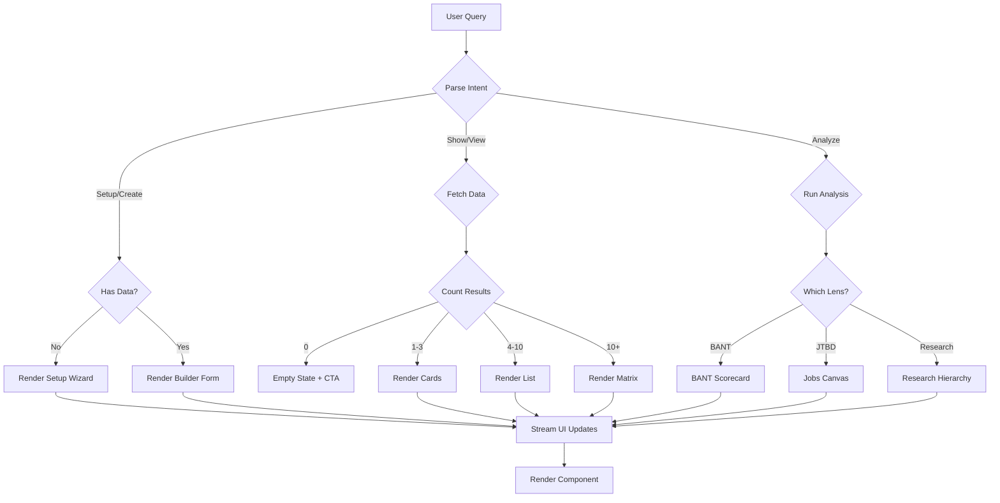
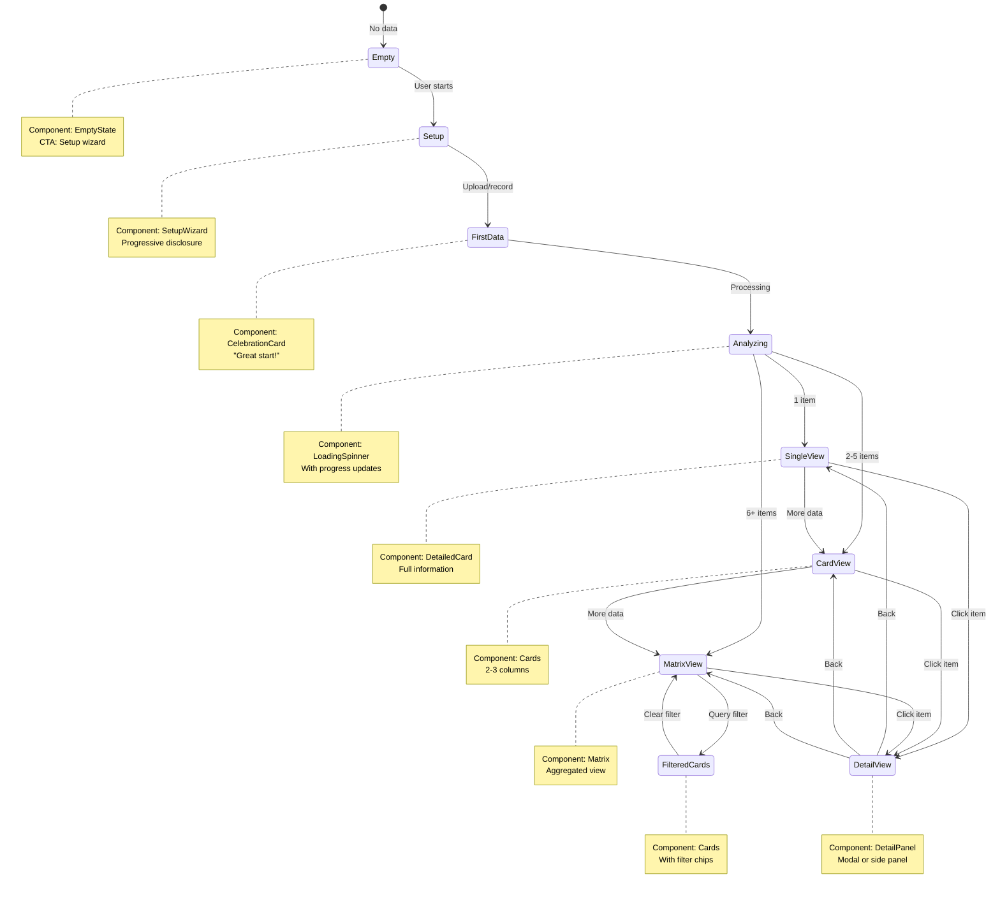

# Generative UI Architecture - Agent-Driven Interfaces

> **Status:** Design Phase
> **Core Insight:** The agent should decide what UI to show, not hardcoded route handlers
> **Stack:** Mastra + AI SDK (RSC) + Component Registry

## The Problem with Fixed UIs

**Current state:**
```typescript
// Fixed route: Always renders the same layout
export default function BANTLensPage() {
  return (
    <div>
      <BANTMatrix />      {/* Always shows */}
      <ScoreCards />      {/* Always shows */}
      <EvidenceList />    {/* Always shows */}
    </div>
  )
}
```

**Agent can't adapt the UI to context:**
- User just started → Should show setup wizard, not empty matrix
- User uploaded first interview → Should highlight evidence clips
- User has 10 interviews → Should show consolidated view
- User asked "which deals are hot?" → Should render filtered matrix, not full page

---

## The Generative UI Approach

**Agent chooses components based on context:**

```typescript
// Agent tool returns UI components dynamically
export const assessBANTStatusTool = createTool({
  execute: async (input, context) => {
    const deals = await fetchDeals(context.projectId)

    // Decision logic: What UI makes sense?
    if (deals.length === 0) {
      return {
        message: "No deals yet. Let's get started.",
        ui: <SetupWizard initialStep="create-first-deal" />
      }
    }

    if (input.question === "which deals are hot?") {
      const hotDeals = deals.filter(d => d.bant_score > 0.7)
      return {
        message: `Found ${hotDeals.length} hot deals`,
        ui: <DealCards deals={hotDeals} highlightMode="hot" />
      }
    }

    if (deals.length > 10) {
      return {
        message: "Here's your pipeline overview",
        ui: <BANTMatrixCondensed deals={deals} interactive />
      }
    }

    // Default: Full matrix
    return {
      message: "Your BANT qualification status",
      ui: <BANTMatrixFull deals={deals} />
    }
  }
})
```

---

## AI SDK + Mastra Integration Pattern

### How AI SDK Supports This

AI SDK (Vercel) supports **Streamable UI** via React Server Components:

```typescript
import { createStreamableUI } from 'ai/rsc'

// In tool execution
const uiStream = createStreamableUI(<LoadingSpinner />)

// Update as data arrives
uiStream.update(<PartialResult data={chunk1} />)
uiStream.update(<PartialResult data={chunk2} />)

// Final state
uiStream.done(<FinalComponent data={complete} />)

return uiStream.value
```

### Mastra Tool → UI Component Pattern

```typescript
// Tool definition with UI capability
export const generateBANTScorecard = createTool({
  id: 'generate-bant-scorecard',
  description: 'Analyze interview and show BANT qualification scorecard',
  inputSchema: z.object({
    interviewId: z.string(),
    personId: z.string().optional()
  }),
  execute: async ({ interviewId, personId }, context) => {
    const { createStreamableUI } = await import('ai/rsc')
    const ui = createStreamableUI(<AnalyzingSpinner />)

    // Fetch data
    const evidence = await fetchBANTEvidence(interviewId)

    // Stream partial updates
    ui.update(<BANTScorecard data={evidence} loading />)

    // AI analysis
    const analysis = await analyzeBANT(evidence)

    // Final UI
    ui.done(
      <BANTScorecardComplete
        budget={analysis.budget}
        authority={analysis.authority}
        need={analysis.need}
        timeline={analysis.timeline}
        evidenceClips={evidence}
        interactive
      />
    )

    return {
      text: `BANT Analysis complete. Score: ${analysis.overallScore}/100`,
      data: analysis,
      ui: ui.value
    }
  }
})
```

---

## Component Registry System

### Registry Design

```typescript
// File: app/components/agent-ui/registry.tsx

export const agentUIComponents = {
  // Setup & Onboarding
  'setup-wizard': SetupWizard,
  'lens-selector': LensSelector,
  'context-capture': ContextCapturePanel,

  // BANT Lens
  'bant-scorecard': BANTScorecard,
  'bant-matrix': BANTMatrix,
  'bant-matrix-condensed': BANTMatrixCondensed,
  'deal-cards': DealCards,

  // JTBD Lens
  'jobs-canvas': JobsCanvas,
  'outcome-ladder': OutcomeLadder,
  'jobs-cards': JobsCards,

  // Evidence
  'evidence-clips': EvidenceClipPlayer,
  'evidence-timeline': EvidenceTimeline,
  'evidence-cards': EvidenceCards,

  // Themes & Analysis
  'theme-clusters': ThemeClusterViz,
  'pain-matrix': PainMatrix,
  'segment-breakdown': SegmentBreakdown,

  // Forms & Input
  'voice-recorder': VoiceRecorder,
  'quick-survey': QuickSurveyBuilder,
  'interview-scheduler': InterviewScheduler,

  // Actions & Recommendations
  'action-cards': ActionCards,
  'next-steps': NextStepsWidget,
  'suggestion-chips': SuggestionChips,

  // Data Viz
  'timeline-viz': TimelineVisualization,
  'funnel-viz': FunnelVisualization,
  'confidence-meter': ConfidenceMeter,

  // Collaboration
  'share-panel': SharePanel,
  'export-options': ExportOptions,
  'comment-thread': CommentThread,
} as const

export type AgentUIComponentName = keyof typeof agentUIComponents

// Helper to render from registry
export function renderAgentComponent(
  name: AgentUIComponentName,
  props: any
) {
  const Component = agentUIComponents[name]
  return <Component {...props} />
}
```

### Type-Safe Component Props

```typescript
// Each component has typed props
type BANTScorecardProps = {
  budget: { score: number; evidence: Evidence[] }
  authority: { score: number; evidence: Evidence[] }
  need: { score: number; evidence: Evidence[] }
  timeline: { score: number; evidence: Evidence[] }
  overallScore: number
  interactive?: boolean
  onEvidenceClick?: (evidence: Evidence) => void
}

// Tool output schema includes UI metadata
const toolOutputWithUI = z.object({
  text: z.string(),
  data: z.any(),
  ui: z.object({
    component: z.enum([...Object.keys(agentUIComponents)]),
    props: z.record(z.any())
  }).optional()
})
```

---

## Dynamic UI Decision Logic

### Agent Instructions Enhancement

```markdown
## UI Component Selection Rules

You have access to a component registry. Choose components based on:

1. **User State**
   - No data → Setup/onboarding components
   - First data point → Highlight/celebration components
   - Established project → Analysis/matrix components

2. **User Intent (from query)**
   - "show me" → Visualization components (matrix, canvas, timeline)
   - "which" / "what" → Filtered cards or lists
   - "how do I" → Step-by-step wizard components
   - "create" → Form/builder components

3. **Data Characteristics**
   - 0 items → Empty state with CTA
   - 1-3 items → Cards (detailed view)
   - 4-10 items → List or small matrix
   - 10+ items → Condensed matrix or aggregate view

4. **Context Type**
   - BANT lens → Scorecard or matrix
   - JTBD lens → Jobs canvas or outcome ladder
   - Evidence review → Clip player or timeline
   - Theme analysis → Cluster visualization

## Example Component Selections

**Query: "Show me hot deals"**
→ Use `deal-cards` with filter: `{ highlightMode: 'hot' }`

**Query: "What's the BANT status for Acme Corp?"**
→ Use `bant-scorecard` with: `{ organizationId: '...' }`

**Query: "I want to start qualifying deals"**
→ Use `setup-wizard` with: `{ initialStep: 'bant-setup' }`

**Query: "Show evidence from the CTO interview"**
→ Use `evidence-timeline` with: `{ interviewId: '...' }`
```

### Tool Decision Flowchart



---

## Adaptive Companion with Generative UI

### Starting State (No Data)

```
┌─────────────────────────────────────────────────┐
│  What do you want to learn?                     │
│  [🎤 Voice] [⌨️ Type]                           │
├─────────────────────────────────────────────────┤
│                                                 │
│  User: "I need to qualify enterprise deals"    │
│                                                 │
│  Agent: [Calls assessProjectState tool]        │
│         [Tool returns: <SetupWizard />]         │
│                                                 │
│  ┌───────────────────────────────────────────┐ │
│  │  Let's set up BANT qualification          │ │
│  │                                            │ │
│  │  Step 1: Target Roles                     │ │
│  │  ┌────────────────────────────────────┐   │ │
│  │  │ Who makes buying decisions?        │   │ │
│  │  │ [VP Engineering]  [CTO]  [+ Add]   │   │ │
│  │  └────────────────────────────────────┘   │ │
│  │                                            │ │
│  │  [Continue →]                              │ │
│  └───────────────────────────────────────────┘ │
│                                                 │
└─────────────────────────────────────────────────┘
```

### After First Interview (Streaming Updates)

```
┌─────────────────────────────────────────────────┐
│  [Voice recording in progress...]               │
├─────────────────────────────────────────────────┤
│                                                 │
│  User: "The CTO said their budget is $50K..."  │
│                                                 │
│  Agent: [Calls extractBANTEvidence tool]       │
│         [Tool streams: <BANTScorecard />]       │
│                                                 │
│  ┌───────────────────────────────────────────┐ │
│  │  BANT Scorecard - Acme Corp               │ │
│  │                                            │ │
│  │  Budget: ████████░░ 80%                   │ │
│  │  🎥 "budget is $50K" [0:08]               │ │
│  │                                            │ │
│  │  Authority: ██████████ 100%  ← UPDATING   │ │
│  │  🎥 "CTO has final say" [0:23]            │ │
│  │                                            │ │
│  │  Need: ░░░░░░░░░░ Analyzing...            │ │
│  │                                            │ │
│  │  Timeline: ░░░░░░░░░░ Not captured        │ │
│  │                                            │ │
│  │  Overall Score: 60/100 (In Progress)      │ │
│  └───────────────────────────────────────────┘ │
│                                                 │
└─────────────────────────────────────────────────┘
```

### Query-Driven UI Changes

```
User: "Which deals are hot?"

Agent: [Calls filterDeals tool]
       [Tool returns: <DealCards highlightMode="hot" />]

┌─────────────────────────────────────────────────┐
│  Found 3 hot deals 🔥                           │
├─────────────────────────────────────────────────┤
│                                                 │
│  ┌─────────────────────────────────────────┐   │
│  │ 🔥 Acme Corp         BANT: 85/100       │   │
│  │ Budget: High  Authority: Yes            │   │
│  │ Last contact: 2 days ago                │   │
│  │ [View Details] [Schedule Call]          │   │
│  └─────────────────────────────────────────┘   │
│                                                 │
│  ┌─────────────────────────────────────────┐   │
│  │ 🔥 TechStart Inc     BANT: 78/100       │   │
│  │ Budget: Medium  Authority: Yes          │   │
│  │ Last contact: 1 week ago                │   │
│  │ [View Details] [Schedule Call]          │   │
│  └─────────────────────────────────────────┘   │
│                                                 │
│  ┌─────────────────────────────────────────┐   │
│  │ 🔥 BigCo LLC         BANT: 72/100       │   │
│  │ Budget: High  Authority: Maybe          │   │
│  │ Last contact: 3 days ago                │   │
│  │ [View Details] [Schedule Call]          │   │
│  └─────────────────────────────────────────┘   │
│                                                 │
└─────────────────────────────────────────────────┘

User: "Show me the full pipeline"

Agent: [Calls getAllDeals tool]
       [Tool returns: <BANTMatrix deals={all} />]

┌─────────────────────────────────────────────────┐
│  BANT Qualification Matrix (12 deals)          │
├─────────────────────────────────────────────────┤
│                                                 │
│         Low Authority    High Authority         │
│  High  ┌──────────────┬──────────────┐         │
│  Budget│   Warm (2)   │   Hot (3) 🔥 │         │
│        │   • Deal E   │   • Acme     │         │
│        │   • Deal F   │   • TechStart│         │
│        │              │   • BigCo    │         │
│        └──────────────┴──────────────┘         │
│  Low   ┌──────────────┬──────────────┐         │
│  Budget│   Cold (4)   │  Nurture (3) │         │
│        │   • Deal A   │   • Deal G   │         │
│        │   • Deal B   │   • Deal H   │         │
│        │   • Deal C   │   • Deal I   │         │
│        │   • Deal D   │              │         │
│        └──────────────┴──────────────┘         │
│                                                 │
│  [Click any cell to filter]                    │
└─────────────────────────────────────────────────┘
```

---

## Component State Machine

### UI Adapts Based on State Transitions



---

## Example Tool Implementations

### 1. Voice Recorder Tool

```typescript
export const startVoiceRecordingTool = createTool({
  id: 'start-voice-recording',
  description: 'Start recording voice interview with real-time transcription',
  execute: async ({ interviewId, lensType }, context) => {
    const { createStreamableUI } = await import('ai/rsc')
    const ui = createStreamableUI(
      <VoiceRecorder
        status="initializing"
        interviewId={interviewId}
      />
    )

    // Initialize recorder
    const session = await initializeRecording(interviewId)

    ui.update(
      <VoiceRecorder
        status="recording"
        interviewId={interviewId}
        sessionId={session.id}
        lens={lensType}
        onTranscript={(text) => {
          // Stream transcript updates
          ui.append(<TranscriptLine text={text} />)
        }}
        onEvidenceExtracted={(evidence) => {
          // Stream evidence as it's detected
          ui.append(<EvidenceChip evidence={evidence} />)
        }}
      />
    )

    return {
      text: "Recording started. Speak naturally.",
      ui: ui.value
    }
  }
})
```

### 2. Lens Analyzer Tool

```typescript
export const analyzeThroughLensTool = createTool({
  id: 'analyze-through-lens',
  description: 'Analyze interview data through a specific lens (BANT, JTBD, etc.)',
  inputSchema: z.object({
    interviewId: z.string(),
    lensType: z.enum(['bant', 'jtbd', 'empathy_map', 'problem_solution'])
  }),
  execute: async ({ interviewId, lensType }, context) => {
    const { createStreamableUI } = await import('ai/rsc')

    // Different component based on lens
    const lensComponents = {
      bant: BANTScorecard,
      jtbd: JobsCanvas,
      empathy_map: EmpathyMapQuadrants,
      problem_solution: PainMatrix
    }

    const Component = lensComponents[lensType]
    const ui = createStreamableUI(<Component loading />)

    // Run analysis
    const analysis = await runLensAnalysis(interviewId, lensType)

    // Render final component
    ui.done(<Component data={analysis} interactive />)

    return {
      text: `Analysis complete using ${lensType} lens`,
      data: analysis,
      ui: ui.value
    }
  }
})
```

### 3. Smart Recommendations Tool

```typescript
export const getRecommendationsTool = createTool({
  id: 'get-smart-recommendations',
  description: 'Get context-aware action recommendations',
  execute: async (input, context) => {
    const { createStreamableUI } = await import('ai/rsc')
    const ui = createStreamableUI(<LoadingRecommendations />)

    // Fetch recommendations
    const recs = await fetchRecommendations(context.projectId)

    // Choose component based on number and type
    if (recs.length === 1) {
      ui.done(<SingleActionCard action={recs[0]} prominent />)
    } else if (recs.length <= 3) {
      ui.done(<ActionCards actions={recs} />)
    } else {
      ui.done(<ActionList actions={recs} collapsible />)
    }

    return {
      text: `Found ${recs.length} recommended actions`,
      ui: ui.value
    }
  }
})
```

---

## Implementation Phases

### Phase 1: Foundation (Week 1)
- [ ] Set up AI SDK RSC streaming
- [ ] Create component registry
- [ ] Build 5 core components (cards, matrix, scorecard, wizard, empty state)
- [ ] Create streaming UI wrapper for Mastra tools

### Phase 2: Tool Integration (Week 2)
- [ ] Convert 3 key tools to return UI (assess-status, analyze-lens, get-recommendations)
- [ ] Add UI decision logic to agent instructions
- [ ] Test streaming updates during voice recording
- [ ] Build evidence clip player component

### Phase 3: State Management (Week 3)
- [ ] Implement component state machine
- [ ] Add transition animations between UI states
- [ ] Handle error states with fallback components
- [ ] Add skeleton/loading states for all components

### Phase 4: Advanced Components (Week 4)
- [ ] Build all lens-specific components (BANT, JTBD, Empathy Map)
- [ ] Create interactive data viz (timeline, clusters, matrices)
- [ ] Add collaboration components (comments, sharing)
- [ ] Implement multi-component composition

### Phase 5: Polish & Testing (Week 5)
- [ ] A/B test: Fixed vs Generative UI
- [ ] Measure: Time to insight, user satisfaction
- [ ] Optimize: Streaming performance, component bundle size
- [ ] Document: Component API, decision patterns

---

## Competitive Advantage

| Capability | Fixed UI Competitors | Generative UI (Us) |
|------------|---------------------|---------------------|
| **Adaptability** | One UI for all states | UI adapts to data/query |
| **Streaming** | Load all → render | Progressive disclosure |
| **Personalization** | User configures | Agent chooses optimal view |
| **Complexity** | Show everything | Show what's relevant |
| **Learning curve** | User learns UI | UI teaches itself |

---

## Technical Requirements

### AI SDK Setup

```typescript
// app/lib/ai-sdk/config.ts
import { createAI } from 'ai/rsc'
import { mastra } from '~/mastra'

export const AI = createAI({
  actions: {
    // Map Mastra agents to RSC actions
    projectSetup: async (message: string) => {
      const agent = mastra.agents.projectSetupAgent
      return agent.generate(message, {
        streamUI: true,
        onToolCall: (tool, result) => {
          // Return UI from tool result if present
          return result.ui || null
        }
      })
    }
  },
  initialAIState: {},
  initialUIState: {},
})
```

### Component Requirements

All components in registry must:
1. Accept `loading?: boolean` prop
2. Support `interactive?: boolean` for click handlers
3. Include accessibility (ARIA labels, keyboard nav)
4. Handle empty/error states gracefully
5. Be server-renderable (no client-only code in initial render)

### Tool Contract Extension

```typescript
interface ToolResultWithUI {
  text: string           // LLM-readable response
  data?: any            // Structured data for follow-up
  ui?: ReactElement     // Optional UI component
}
```

---

## Open Questions

1. **Caching:** Should we cache rendered components or always re-render?
2. **State persistence:** How long to keep UI state in memory?
3. **Component versioning:** How to handle breaking changes in components?
4. **Mobile:** Do all components need mobile equivalents?
5. **Accessibility:** WCAG compliance for dynamically rendered UI?
6. **Testing:** How to test agent UI decisions (snapshot? visual regression?)

---

## Next Steps

1. ✅ Document architecture (this doc)
2. Create wireframes showing UI state variations
3. Build proof-of-concept with 3 components
4. Test streaming performance
5. Measure: Render time, bundle size, user comprehension
