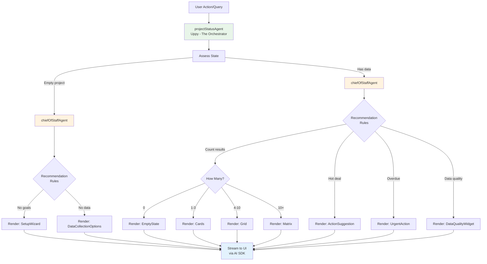
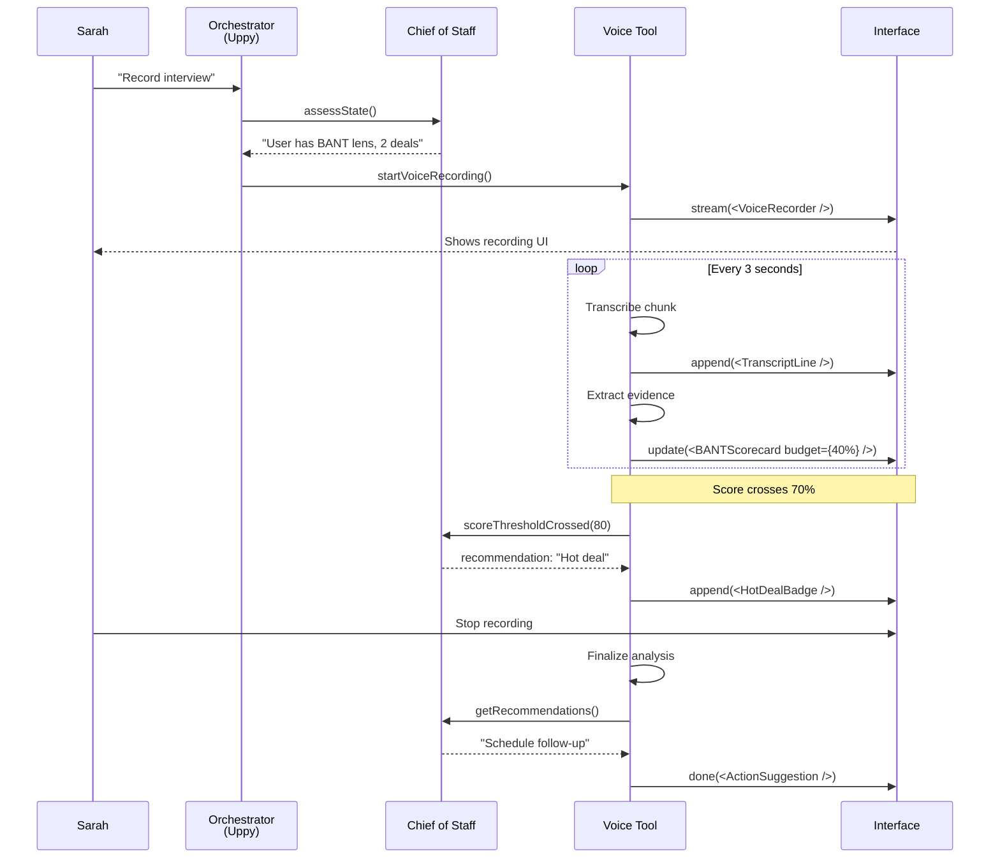

# The Generative UI Story - How the System Works

> **Companion Docs:** generative-ui-architecture.md, adaptive-companion-spec-v2.md
> **Purpose:** Narrative walkthrough showing how agent-driven UI adapts to user needs

## Meet Sarah: Sales Manager at TechCorp

Sarah just signed up for UpSight. She needs to qualify her Q1 pipeline of 15 enterprise deals. Let's watch the interface adapt to guide her to success.

---

## Act 1: The First Question

### Sarah lands on the app

```
┌─────────────────────────────────────────────────────┐
│  Welcome to UpSight                          [···]  │
├─────────────────────────────────────────────────────┤
│                                                     │
│        "What do you want to learn about            │
│         your customers?"                            │
│                                                     │
│  ┌───────────────────────────────────────────────┐ │
│  │                                               │ │
│  │  [🎤 Speak]           [⌨️ Type]               │ │
│  │                                               │ │
│  └───────────────────────────────────────────────┘ │
│                                                     │
│  💡 Examples:                                       │
│     "I need to qualify enterprise deals"            │
│     "Find product-market fit for our new feature"   │
│     "Understand why customers churn"                │
│                                                     │
└─────────────────────────────────────────────────────┘
```

**Behind the scenes:**
- Agent: `projectStatusAgent` (Uppy - the orchestrator)
- State: Empty project, no data
- Decision: Show open-ended entry, not a form

---

## Act 2: The Chief of Staff Steps In

### Sarah types: "I need to qualify enterprise deals"

```
Agent reasoning:
1. Parse intent: "qualify" + "enterprise deals" → BANT lens
2. Check project state: No goals, no deals, no data
3. Consult chiefOfStaffAgent: "Setup incomplete" rule triggers
4. Decision: Render SetupWizard (not empty form)

┌─────────────────────────────────────────────────────┐
│  Let's set up BANT qualification                    │
├─────────────────────────────────────────────────────┤
│                                                     │
│  Agent: "I'll help you qualify deals using BANT     │
│          framework (Budget, Authority, Need,        │
│          Timeline). First, who are we targeting?"   │
│                                                     │
│  ┌─ Captured ──────────────────────────────────┐   │
│  │  Research Goal ✓                            │   │
│  │  "Qualify enterprise deals"                 │   │
│  └─────────────────────────────────────────────┘   │
│                                                     │
│  Step 1: Target Roles                               │
│  ┌───────────────────────────────────────────────┐ │
│  │  Who makes buying decisions?                  │ │
│  │                                               │ │
│  │  Suggestions:                                 │ │
│  │  [VP Engineering] [CTO] [CFO]                 │ │
│  │  [VP Product]     [CEO]                       │ │
│  │                                               │ │
│  │  [+ Add custom role]                          │ │
│  └───────────────────────────────────────────────┘ │
│                                                     │
│  [Continue →]                                       │
│                                                     │
└─────────────────────────────────────────────────────┘
```

**What just happened:**
- Orchestrator detected intent ("qualify deals")
- Chief of Staff assessed state ("no data, needs setup")
- Agent chose `SetupWizard` component (not generic form)
- Suggested roles based on "enterprise" keyword
- Captured panel shows what's been saved

**Existing components used:**
- `project-setup-context.tsx` (state management)
- `project-setup-store.ts` (data persistence)

---

## Act 3: Sarah's First Deal Recording

### Sarah completes setup, clicks "Record first call"

```
Agent reasoning:
1. Setup complete → transition to data collection
2. User chose "record" → VoiceRecorder component
3. Lens = BANT → stream BANT scorecard alongside

┌─────────────────────────────────────────────────────┐
│  Recording: 00:00 / ∞                       [■ Stop]│
├─────────────────────────────────────────────────────┤
│                                                     │
│  Deal: Acme Corp                   [BANT Lens ▼]   │
│                                                     │
│  ┌────────────────────┬──────────────────────────┐ │
│  │ 🎤 Live Recording  │  BANT Scorecard          │ │
│  ├────────────────────┼──────────────────────────┤ │
│  │                    │                          │ │
│  │  [Initializing...] │  Budget:    [─────────] │ │
│  │                    │  Authority: [─────────] │ │
│  │                    │  Need:      [─────────] │ │
│  │                    │  Timeline:  [─────────] │ │
│  │                    │                          │ │
│  │                    │  Overall: 0/100          │ │
│  │                    │                          │ │
│  └────────────────────┴──────────────────────────┘ │
│                                                     │
│  💡 Speak naturally. I'll extract BANT signals.     │
│                                                     │
└─────────────────────────────────────────────────────┘
```

**Component composition:**
- Left: `VoiceRecorder` (streaming transcription)
- Right: `BANTScorecard` (streaming updates)

---

## Act 4: Real-Time Evidence Extraction

### 15 seconds in - Sarah starts describing the call

```
┌─────────────────────────────────────────────────────┐
│  Recording: 00:15 / ∞                       [■ Stop]│
├─────────────────────────────────────────────────────┤
│  ┌────────────────────┬──────────────────────────┐ │
│  │ Transcript         │  BANT Scorecard          │ │
│  ├────────────────────┼──────────────────────────┤ │
│  │                    │                          │ │
│  │ "The CTO said their│  Budget: ████░░░░░ 40%   │ │
│  │ current tool costs │  🎥 [0:08]               │ │
│  │ $50K annually and  │  "costs $50K annually"   │ │
│  │ they're frustrated │  ← Click to play clip    │ │
│  │ with the reporting.│                          │ │
│  │ He mentioned..."   │  Authority: Analyzing... │ │
│  │                    │                          │ │
│  │                    │  Need: [─────────]       │ │
│  │                    │                          │ │
│  │                    │  Timeline: [─────────]   │ │
│  │                    │                          │ │
│  │                    │  Overall: 13/100         │ │
│  │                    │                          │ │
│  └────────────────────┴──────────────────────────┘ │
│                                                     │
└─────────────────────────────────────────────────────┘

Agent action:
- Detected "costs $50K annually" → Budget evidence
- Rendered evidence chip with timestamp
- Updated scorecard (Budget: 40%)
- Still analyzing for Authority signals
```

**Behind the scenes:**
- Tool: `extractBANTEvidence` running every 3 seconds
- Streaming: `createStreamableUI()` updates scorecard
- Evidence: Saved with audio anchor (timestamp: 8s)

---

### 45 seconds in - More evidence accumulates

```
┌─────────────────────────────────────────────────────┐
│  Recording: 00:45 / ∞                       [■ Stop]│
├─────────────────────────────────────────────────────┤
│  ┌────────────────────┬──────────────────────────┐ │
│  │ [Earlier...]       │  BANT Scorecard          │ │
│  │                    ├──────────────────────────┤ │
│  │ "...has final say  │  Budget: ████████░ 80%   │ │
│  │ on vendor          │  🎥 [0:08] "$50K/year"   │ │
│  │ selection. They    │  🎥 [0:42] "over budget" │ │
│  │ need this in place │                          │ │
│  │ by Q2, about 3     │  Authority: ██████████   │ │
│  │ months."           │  100% ✓                  │ │
│  │                    │  🎥 [0:23] "final say"   │ │
│  │ ← LATEST           │                          │ │
│  │                    │  Need: ██████░░░░ 60%    │ │
│  │                    │  🎥 [0:15] "frustrated"  │ │
│  │                    │                          │ │
│  │                    │  Timeline: ████████░ 80% │ │
│  │                    │  🎥 [0:41] "Q2, 3mo"     │ │
│  │                    │                          │ │
│  │                    │  Overall: 80/100 🔥      │ │
│  │                    │                          │ │
│  └────────────────────┴──────────────────────────┘ │
│                                                     │
│  💡 Strong signals! This is a hot deal.             │
│                                                     │
└─────────────────────────────────────────────────────┘

Agent reasoning:
1. Overall score crossed 70% threshold
2. Chief of Staff rule: "Hot deal detected"
3. Decision: Append suggestion widget (not interrupt)
```

---

### Sarah stops recording

```
Agent reasoning:
1. Recording complete → finalize analysis
2. Score = 80/100 (hot deal)
3. chiefOfStaffAgent recommendations:
   - Rule triggered: "Hot deal → schedule follow-up"
4. Decision: Render ActionSuggestion component

┌─────────────────────────────────────────────────────┐
│  Recording Complete ✓                               │
├─────────────────────────────────────────────────────┤
│                                                     │
│  Acme Corp - BANT Analysis                          │
│                                                     │
│  ┌──────────────────────────────────────────────┐  │
│  │  Budget: ████████░ 80%                       │  │
│  │  Authority: ██████████ 100% ✓               │  │
│  │  Need: ██████░░░░ 60%                        │  │
│  │  Timeline: ████████░ 80%                     │  │
│  │                                              │  │
│  │  Overall: 80/100 🔥 Hot Deal                 │  │
│  └──────────────────────────────────────────────┘  │
│                                                     │
│  💬 Chief of Staff:                                 │
│  "Strong BANT signals! This deal is qualified.      │
│   Recommended next action:"                         │
│                                                     │
│  ┌──────────────────────────────────────────────┐  │
│  │  📅 Schedule Technical Demo                  │  │
│  │  ────────────────────────────────────────    │  │
│  │  CTO has authority and timeline is urgent.   │  │
│  │  Strike while interest is high.              │  │
│  │                                              │  │
│  │  [Suggest times] [Draft email] [Skip]        │  │
│  └──────────────────────────────────────────────┘  │
│                                                     │
│  [View evidence clips] [Add to pipeline]            │
│                                                     │
└─────────────────────────────────────────────────────┘

Components rendered:
1. BANTScorecardComplete (final state)
2. ActionRecommendation (from chief of staff)
3. EvidenceClips (available on click)
```

---

## Act 5: Sarah Adds More Deals

### Sarah records 2 more calls, then asks: "Show me my pipeline"

```
Agent reasoning:
1. Parse query: "show" + "pipeline"
2. Fetch data: 3 deals now
3. Count = 3 → render DealCards (detailed view)

┌─────────────────────────────────────────────────────┐
│  Your Pipeline (3 deals)                            │
├─────────────────────────────────────────────────────┤
│                                                     │
│  ┌──────────────────────────────────────────────┐  │
│  │ 🔥 Acme Corp               BANT: 80/100      │  │
│  │ ──────────────────────────────────────────   │  │
│  │ Budget: High      Authority: CTO             │  │
│  │ Need: Validated   Timeline: Q2 (3 months)    │  │
│  │                                              │  │
│  │ Last activity: Just now                      │  │
│  │ Next: Schedule demo                          │  │
│  │                                              │  │
│  │ [View] [Schedule] [Share]                    │  │
│  └──────────────────────────────────────────────┘  │
│                                                     │
│  ┌──────────────────────────────────────────────┐  │
│  │ TechStart Inc              BANT: 45/100      │  │
│  │ ──────────────────────────────────────────   │  │
│  │ Budget: Medium    Authority: Unknown         │  │
│  │ Need: Strong      Timeline: Not mentioned    │  │
│  │                                              │  │
│  │ Last activity: 1 day ago                     │  │
│  │ Next: Confirm authority & timeline           │  │
│  │                                              │  │
│  │ [View] [Follow up] [Share]                   │  │
│  └──────────────────────────────────────────────┘  │
│                                                     │
│  [+ More] [Switch to matrix view]                   │
│                                                     │
└─────────────────────────────────────────────────────┘

Agent chose DealCards because:
- 3 items = show detailed cards
- Not enough for matrix (needs 6+)
```

---

### Sarah adds 10 more deals over the week

### Now asks: "Show me my pipeline"

```
Agent reasoning:
1. Same query: "show pipeline"
2. Fetch data: 13 deals now
3. Count > 10 → render BANTMatrix (aggregated view)
   ↑ DIFFERENT component for same query!

┌─────────────────────────────────────────────────────┐
│  Your Pipeline (13 deals)                           │
├─────────────────────────────────────────────────────┤
│                                                     │
│         Low Authority      High Authority           │
│  High  ┌────────────────┬────────────────┐         │
│  Budget│  Warm (3)      │  Hot (4) 🔥    │         │
│        │  • TechStart   │  • Acme Corp   │         │
│        │  • DataCo      │  • BigEnt      │         │
│        │  • CloudInc    │  • FastScale   │         │
│        │                │  • MegaCorp    │         │
│        └────────────────┴────────────────┘         │
│  Low   ┌────────────────┬────────────────┐         │
│  Budget│  Cold (3)      │  Nurture (3)   │         │
│        │  • SmallCo     │  • MidMarket   │         │
│        │  • Startup1    │  • Growing     │         │
│        │  • Startup2    │  • Scaling     │         │
│        └────────────────┴────────────────┘         │
│                                                     │
│  💬 Chief of Staff:                                 │
│  "4 hot deals need immediate attention. 3 cold     │
│   leads should be nurtured or disqualified."        │
│                                                     │
│  [Focus on hot] [Review cold] [Export]              │
│                                                     │
└─────────────────────────────────────────────────────┘

Component: BANTMatrix
Reason: More than 10 deals → aggregate view
Chief of Staff: Added strategic summary
```

---

## Act 6: Query-Driven UI Changes

### Sarah asks: "Which deals are hot?"

```
Agent reasoning:
1. Parse: "which" + filter "hot"
2. Fetch & filter: score > 70 → 4 deals
3. Count = 4 → back to DealCards (filtered)

┌─────────────────────────────────────────────────────┐
│  Hot Deals (4) 🔥                                   │
├─────────────────────────────────────────────────────┤
│                                                     │
│  ┌──────────────────────────────────────────────┐  │
│  │ 🔥 Acme Corp               BANT: 80/100      │  │
│  │ Last contact: 6 days ago ⚠️ OVERDUE          │  │
│  │ Next: Schedule demo NOW                      │  │
│  │ [Schedule] [Email] [Call]                    │  │
│  └──────────────────────────────────────────────┘  │
│                                                     │
│  ┌──────────────────────────────────────────────┐  │
│  │ 🔥 BigEnt                  BANT: 78/100      │  │
│  │ Last contact: 2 days ago                     │  │
│  │ Next: Send proposal                          │  │
│  │ [Draft proposal] [Schedule]                  │  │
│  └──────────────────────────────────────────────┘  │
│                                                     │
│  [+ 2 more hot deals]                               │
│                                                     │
│  💬 Chief of Staff:                                 │
│  "⚠️ Acme Corp is overdue for follow-up (6 days).  │
│   Risk of losing this hot deal. Suggested action:"  │
│                                                     │
│  ┌──────────────────────────────────────────────┐  │
│  │  📧 Draft Follow-up Email                    │  │
│  │  Reference: CTO mentioned Q2 deadline        │  │
│  │  [Generate draft] [Skip]                     │  │
│  └──────────────────────────────────────────────┘  │
│                                                     │
└─────────────────────────────────────────────────────┘

Agent reasoning:
1. Filtered to 4 deals → DealCards (not matrix)
2. Chief of Staff detected overdue (last contact > 5 days)
3. Rendered urgent action suggestion
4. Included deal context in suggestion
```

---

## Act 7: Lens Switching

### Sarah clicks: "Switch to JTBD lens"

```
Agent reasoning:
1. User switched lens: BANT → JTBD
2. Re-analyze same data through JTBD framework
3. Render JobsCanvas instead of BANTScorecard

┌─────────────────────────────────────────────────────┐
│  Interview: Acme Corp CTO          [JTBD Lens ▼]   │
├─────────────────────────────────────────────────────┤
│                                                     │
│  Jobs Canvas                                        │
│                                                     │
│  ┌──────────────────────────────────────────────┐  │
│  │  Job: Generate accurate team reports         │  │
│  │  ────────────────────────────────────────    │  │
│  │                                              │  │
│  │  When: End of sprint / Monthly reviews       │  │
│  │  🎥 [0:15] "Every sprint we struggle..."     │  │
│  │  🎥 [0:42] "Monthly reports take days"       │  │
│  │                                              │  │
│  │  Desired Outcome:                            │  │
│  │  "Reports that help us make decisions,       │  │
│  │   not just show data"                        │  │
│  │                                              │  │
│  │  Current Solution: [Competitor Tool]         │  │
│  │  Pain Level: High 🔴                         │  │
│  │  🎥 [0:15] "frustrated with reporting"       │  │
│  │                                              │  │
│  │  Constraints:                                │  │
│  │  • Must work with existing stack             │  │
│  │  • Need decision maker buy-in (CTO)          │  │
│  │  • Timeline: Q2 implementation               │  │
│  │                                              │  │
│  └──────────────────────────────────────────────┘  │
│                                                     │
│  💬 Chief of Staff:                                 │
│  "This job-to-be-done has strong evidence. Core     │
│   outcome is 'decision support, not data dumps.'    │
│   Use this framing in your demo."                   │
│                                                     │
│  [Save job story] [Export canvas] [Switch lens]     │
│                                                     │
└─────────────────────────────────────────────────────┘

What happened:
- SAME interview data
- DIFFERENT lens (JTBD not BANT)
- DIFFERENT component (JobsCanvas not BANTScorecard)
- Chief of Staff adapted recommendation
```

---

## How the Orchestrator Makes Decisions

### The Decision Tree



### The Recommendation Engine (Chief of Staff)

**Input:** Project state
```typescript
{
  interviewCount: 13,
  dealCount: 13,
  themeCount: 5,
  hotDeals: 4,
  overdueDeals: 1,
  peopleNeedingSegments: 8
}
```

**Rules Applied:**
```typescript
// From recommendation-rules.ts
if (hotDeals > 0 && overdueDeals > 0) {
  return {
    priority: 'urgent',
    action: 'follow_up_overdue_hot_deal',
    component: 'UrgentActionCard'
  }
}

if (dealCount > 10) {
  return {
    component: 'BANTMatrix', // Aggregate view
    insights: summaryStats
  }
}

if (dealCount <= 3) {
  return {
    component: 'DealCards', // Detailed view
    insights: perDealRecommendations
  }
}
```

**Output:** Component + Props + Recommendations

---

## The Streaming Sequence



---

## Why This Works

### 1. Context-Aware
The orchestrator knows:
- What Sarah wants (qualify deals)
- What lens she's using (BANT)
- What she has (13 deals, 4 hot)
- What's urgent (Acme overdue)

### 2. Data-Driven
Chief of Staff uses deterministic rules:
- Not LLM guessing
- Consistent recommendations
- Based on actual project data

### 3. Progressive Disclosure
UI adapts to data volume:
- 0 deals → Setup wizard
- 3 deals → Detailed cards
- 13 deals → Aggregated matrix

### 4. Streaming Updates
User sees progress in real-time:
- Evidence extracts as they speak
- Scorecard fills during recording
- Suggestions appear when relevant

### 5. Lens Flexibility
Same data, different views:
- BANT for sales qualification
- JTBD for product discovery
- Empathy map for user research

---

## Technical Implementation

### Orchestrator (Uppy - projectStatusAgent)
```typescript
// app/mastra/agents/project-status-agent.ts
export const projectStatusAgent = {
  tools: [
    // Assesses current state
    assessProjectState,

    // Gets recommendations from chief of staff
    getRecommendations,

    // Renders components based on state
    renderComponent,

    // All 65+ tools for data operations
    ...dataTool
  ],

  instructions: `
    You are Uppy, the research orchestrator.

    When user makes a request:
    1. Assess project state (assessProjectState)
    2. Get recommendations (calls chiefOfStaffAgent)
    3. Choose appropriate component
    4. Stream UI updates

    Component selection rules:
    - Empty state → SetupWizard
    - 1-3 items → Cards (detailed)
    - 10+ items → Matrix (aggregated)
    - Hot deals → Include action suggestions
    - Overdue → Render urgent alerts
  `
}
```

### Chief of Staff (chiefOfStaffAgent)
```typescript
// app/mastra/agents/chief-of-staff-agent.ts
export const chiefOfStaffAgent = {
  tools: [
    recommendNextActions, // Uses deterministic rules
    assessDataQuality,
    identifyUrgentActions
  ],

  instructions: `
    You provide strategic recommendations based on project state.

    Use deterministic rules from recommendation-rules.ts:
    - No data → "Start collecting"
    - Hot deals → "Schedule follow-ups"
    - Overdue → "Urgent action needed"
    - Low evidence → "Validate this theme"

    Always return 2-3 prioritized actions with reasoning.
  `
}
```

### Existing Components Leveraged
```typescript
// app/features/projects/contexts/project-setup-context.tsx
// Already handles state management for setup flow

// app/features/projects/stores/project-setup-store.ts
// Already persists captured fields

// app/features/projects/pages/setup.tsx
// Already has chat + captured panel UI
```

---

## Next: Figma Mockups + Video

I'll create:

1. **Figma Mockups** showing:
   - The entry screen
   - Setup wizard states
   - Voice recording with streaming scorecard
   - Query-driven component switches
   - Lens switching visualization

2. **Video Walkthrough** demonstrating:
   - User asks question
   - Agent chooses component
   - Real-time streaming updates
   - Chief of Staff recommendations
   - Component adapting to data volume

**Keep it simple and clear** - focus on the core narrative.

Ready to create the visuals?
