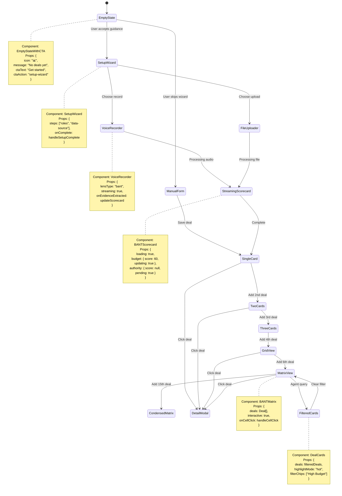
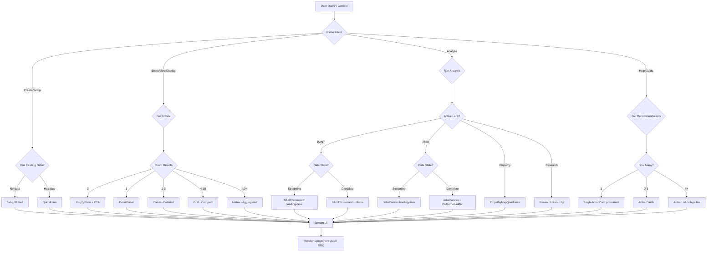
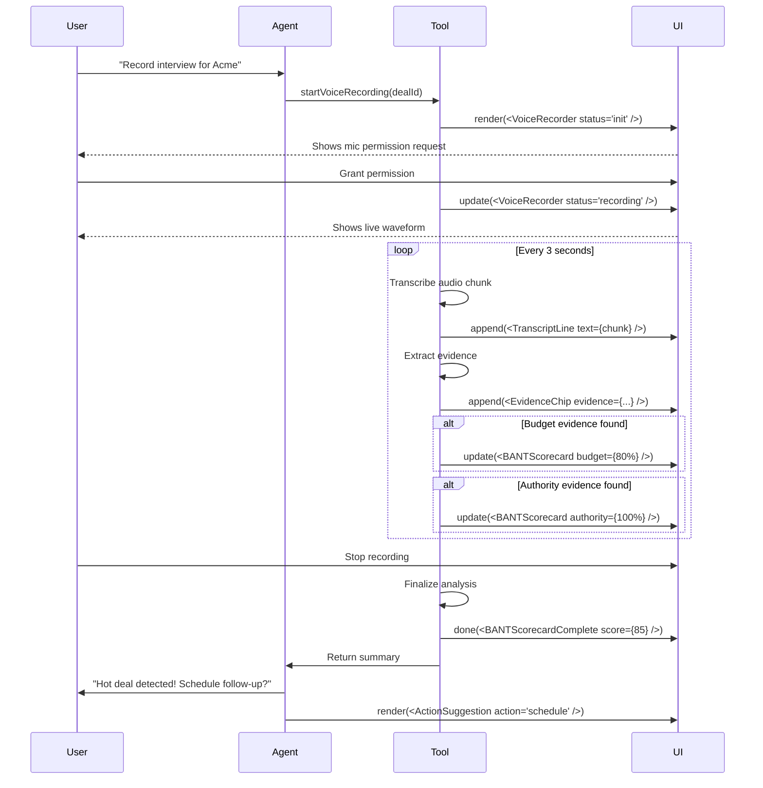

# Generative UI Wireframes - Agent-Driven Interface States

> **Companion Doc:** generative-ui-architecture.md
> **Purpose:** Visual specification of dynamic UI states based on agent decisions

## Core Concept: UI as a Function of Context

```
UI = f(UserQuery, ProjectState, AgentDecision)

NOT:
UI = fixed_template(data)
```

---

## Comparison: Fixed vs Generative UI

### Scenario: User Opens BANT Lens

#### Fixed UI (Current)
```
┌─────────────────────────────────────────────────┐
│  BANT Lens                              [···]   │
├─────────────────────────────────────────────────┤
│                                                 │
│  Budget ×Authority Matrix                      │
│  ┌──────────────────────────────────────────┐  │
│  │                                          │  │
│  │         [Empty - No Deals Yet]           │  │
│  │                                          │  │
│  │      (User sees empty matrix)            │  │
│  │      (Confusing - what do I do?)         │  │
│  │                                          │  │
│  └──────────────────────────────────────────┘  │
│                                                 │
│  [Create Deal] button (easy to miss)            │
│                                                 │
└─────────────────────────────────────────────────┘

❌ Problems:
- Shows empty matrix (not helpful)
- No guidance on next steps
- Fixed layout doesn't adapt
```

#### Generative UI (New)
```
┌─────────────────────────────────────────────────┐
│  BANT Qualification                     [···]   │
├─────────────────────────────────────────────────┤
│                                                 │
│  Agent: "No deals tracked yet. Let's set up    │
│          your first qualification."             │
│                                                 │
│  ┌─────────────────────────────────────────┐   │
│  │  Quick Setup                            │   │
│  │  ────────────────────────────────────── │   │
│  │                                          │   │
│  │  Step 1: Who are you qualifying?        │   │
│  │  ┌────────────────────────────────────┐ │   │
│  │  │ [VP Engineering] [CTO] [CFO]       │ │   │
│  │  │ [+ Add role]                       │ │   │
│  │  └────────────────────────────────────┘ │   │
│  │                                          │   │
│  │  Step 2: Record or upload first call?   │   │
│  │  ┌──────────────┐  ┌──────────────────┐ │   │
│  │  │ 🎤 Record   │  │ 📁 Upload File   │ │   │
│  │  └──────────────┘  └──────────────────┘ │   │
│  │                                          │   │
│  └─────────────────────────────────────────┘   │
│                                                 │
│  Or skip to: [Create deal manually →]          │
│                                                 │
└─────────────────────────────────────────────────┘

✅ Advantages:
- Agent detects empty state
- Renders setup wizard
- Guides user to success
- Adapts to user's choice
```

---

## UI State Machine with Component Mapping



---

## Detailed Wireframes by Scenario

### Scenario 1: Voice Recording → Real-Time UI Updates

#### State 1.1: Before Recording
```
┌──────────────────────────────────────────────────────┐
│  Acme Corp Discovery Call                            │
├──────────────────────────────────────────────────────┤
│                                                      │
│  Agent: "Ready to record. I'll extract BANT info    │
│          as we talk."                                │
│                                                      │
│  ┌────────────────────────────────────────────────┐ │
│  │                                                │ │
│  │              ⬤  Press to Record                │ │
│  │                                                │ │
│  │         [ Start Recording ]                    │ │
│  │                                                │ │
│  │  Auto-extracts:                                │ │
│  │  • Budget signals                              │ │
│  │  • Authority mentions                          │ │
│  │  • Need/pain statements                        │ │
│  │  • Timeline indicators                         │ │
│  │                                                │ │
│  └────────────────────────────────────────────────┘ │
│                                                      │
└──────────────────────────────────────────────────────┘
```

#### State 1.2: Recording (15 seconds in)
```
┌──────────────────────────────────────────────────────┐
│  Recording: 00:15 / ∞                        [■ Stop]│
├──────────────────────────────────────────────────────┤
│  ┌────────────────────┬───────────────────────────┐ │
│  │ Live Transcript    │  BANT Scorecard           │ │
│  ├────────────────────┼───────────────────────────┤ │
│  │ User:              │  Budget: ████░░ 40%       │ │
│  │ "Yeah, so the CTO  │  🎥 [0:08] "costs $50K"   │ │
│  │ said their current │                           │ │
│  │ tool costs $50K    │  Authority: Analyzing...  │ │
│  │ annually and       │                           │ │
│  │ they're frustrated │  Need: ░░░░░░ Pending     │ │
│  │ with the reporting.│                           │ │
│  │ He mentioned he    │  Timeline: ░░░░░░ Pending │ │
│  │ has final say..."  │                           │ │
│  │                    │  Overall: 13/100          │ │
│  └────────────────────┴───────────────────────────┘ │
│                                                      │
│  [Pause] [Add Note] [Flag Issue]                    │
└──────────────────────────────────────────────────────┘

Agent renders BOTH panes dynamically:
- Left: VoiceRecorderTranscript (streaming)
- Right: BANTScorecard (streaming updates)
```

#### State 1.3: Recording (45 seconds in) - More Evidence
```
┌──────────────────────────────────────────────────────┐
│  Recording: 00:45 / ∞                        [■ Stop]│
├──────────────────────────────────────────────────────┤
│  ┌────────────────────┬───────────────────────────┐ │
│  │ [Earlier messages] │  BANT Scorecard           │ │
│  │                    ├───────────────────────────┤ │
│  │ "...has final say  │  Budget: ████████░ 80%    │ │
│  │ on vendor          │  🎥 [0:08] "costs $50K"   │ │
│  │ selection. They    │  🎥 [0:42] "over budget"  │ │
│  │ need this in place │                           │ │
│  │ by Q2, so about    │  Authority: ██████████100%│ │
│  │ 3 months."         │  🎥 [0:23] "final say"    │ │
│  │                    │                           │ │
│  │ ← LATEST           │  Need: ██████░░░░ 60%     │ │
│  │                    │  🎥 [0:15] "frustrated"   │ │
│  │                    │                           │ │
│  │                    │  Timeline: ████████░ 80%  │ │
│  │                    │  🎥 [0:41] "Q2, 3 months" │ │
│  │                    │                           │ │
│  │                    │  Overall: 80/100 🔥 HOT   │ │
│  └────────────────────┴───────────────────────────┘ │
│                                                      │
│  💡 Agent: "Strong signals! This looks like a hot   │
│            deal. Want to schedule a follow-up?"      │
│                                                      │
│  [Yes, suggest times] [No, keep recording]           │
└──────────────────────────────────────────────────────┘

Agent detects score crossed threshold (>70%) and proactively
renders suggestion widget.
```

---

### Scenario 2: Query-Driven UI Changes

#### Query 2.1: "Show me all deals"
```
Agent Decision Tree:
1. Parse intent: "show" + "all deals"
2. Fetch deals: count = 12
3. Choose component: count > 10 → MatrixView

Renders:
┌──────────────────────────────────────────────────────┐
│  All Deals (12)                                  [×] │
├──────────────────────────────────────────────────────┤
│                                                      │
│         Low Authority      High Authority            │
│  High  ┌────────────────┬────────────────┐          │
│  Budget│  Warm (2)      │  Hot (3) 🔥    │          │
│        │  [Deal E]      │  [Acme Corp]   │          │
│        │  [Deal F]      │  [TechStart]   │          │
│        │                │  [BigCo]       │          │
│        └────────────────┴────────────────┘          │
│  Low   ┌────────────────┬────────────────┐          │
│  Budget│  Cold (4)      │  Nurture (3)   │          │
│        │  [Deal A] [B]  │  [Deal G]      │          │
│        │  [Deal C] [D]  │  [Deal H] [I]  │          │
│        └────────────────┴────────────────┘          │
│                                                      │
│  💬 Agent: "Your pipeline has 3 hot deals and 4     │
│            cold leads. Want to focus on hot ones?"   │
│                                                      │
│  [Show hot deals only] [Export matrix]               │
└──────────────────────────────────────────────────────┘
```

#### Query 2.2: "Which deals are hot?"
```
Agent Decision Tree:
1. Parse intent: "which" + filter condition "hot"
2. Fetch deals: filter by BANT score > 70
3. Count results: 3
4. Choose component: count <= 3 → DealCards (detailed)

Renders:
┌──────────────────────────────────────────────────────┐
│  Hot Deals (3)                                   [×] │
├──────────────────────────────────────────────────────┤
│                                                      │
│  ┌──────────────────────────────────────────────┐   │
│  │ 🔥 Acme Corp                   BANT: 85/100  │   │
│  │ ──────────────────────────────────────────── │   │
│  │ Budget: High ($50K+)      Authority: CTO     │   │
│  │ Need: Validated           Timeline: Q2       │   │
│  │                                              │   │
│  │ Last activity: 2 days ago                    │   │
│  │ Next step: Schedule demo                     │   │
│  │                                              │   │
│  │ [View Details] [Schedule Call] [Add Note]    │   │
│  └──────────────────────────────────────────────┘   │
│                                                      │
│  ┌──────────────────────────────────────────────┐   │
│  │ 🔥 TechStart Inc               BANT: 78/100  │   │
│  │ ──────────────────────────────────────────── │   │
│  │ Budget: Medium ($30K)     Authority: VP Eng  │   │
│  │ Need: Strong              Timeline: Q3       │   │
│  │                                              │   │
│  │ Last activity: 1 week ago                    │   │
│  │ Next step: Send proposal                     │   │
│  │                                              │   │
│  │ [View Details] [Schedule Call] [Add Note]    │   │
│  └──────────────────────────────────────────────┘   │
│                                                      │
│  [+ More details] [Switch to matrix view]            │
└──────────────────────────────────────────────────────┘

Different component! Agent chose cards over matrix
because filtered set is small enough for detailed view.
```

#### Query 2.3: "What's the status of Acme Corp?"
```
Agent Decision Tree:
1. Parse intent: "status" + entity "Acme Corp"
2. Fetch deal: single deal
3. Choose component: single entity → DetailPanel

Renders:
┌──────────────────────────────────────────────────────┐
│  Acme Corp                                       [×] │
├──────────────────────────────────────────────────────┤
│                                                      │
│  ┌────────────────────┬───────────────────────────┐ │
│  │ BANT Scorecard     │  Evidence Timeline        │ │
│  ├────────────────────┼───────────────────────────┤ │
│  │ Budget: 85%        │  [····|····|····|····]    │ │
│  │ ████████░░         │    ↑    ↑    ↑            │ │
│  │ 🎥 "costs $50K"    │   8s  23s  42s            │ │
│  │                    │                           │ │
│  │ Authority: 100%    │  Click any marker to      │ │
│  │ ██████████         │  play audio clip          │ │
│  │ 🎥 "final say"     │                           │ │
│  │                    │  ┌─────────────────────┐  │ │
│  │ Need: 80%          │  │ 🎥 [0:23-0:28]      │  │
│  │ ████████░░         │  │ "He mentioned he    │  │
│  │ 🎥 "frustrated"    │  │  has final say on   │  │
│  │                    │  │  vendor selection"  │  │
│  │ Timeline: 90%      │  │                     │  │
│  │ █████████░         │  │ [◄] [►] [⬇ Save]   │  │
│  │ 🎥 "Q2, 3 months"  │  └─────────────────────┘  │ │
│  │                    │                           │ │
│  │ Overall: 89/100 🔥 │                           │ │
│  └────────────────────┴───────────────────────────┘ │
│                                                      │
│  💬 Agent: "Acme is a hot deal with strong BANT.    │
│            All signals are green. Suggested next     │
│            action: Schedule technical demo."         │
│                                                      │
│  [Schedule demo] [Export to CRM] [Share with team]   │
└──────────────────────────────────────────────────────┘

Agent chose DetailPanel + EvidenceTimeline
because query was about a specific entity.
```

---

### Scenario 3: Multi-Component Composition

#### Query: "Analyze my pipeline and suggest next steps"

```
Agent Decision:
1. Run multiple analyses in parallel
2. Compose 3 components vertically
3. Stream each as it completes

Final Composition:
┌──────────────────────────────────────────────────────┐
│  Pipeline Analysis                                    │
├──────────────────────────────────────────────────────┤
│                                                      │
│  ┌─ Overview ────────────────────────────────────┐  │
│  │                                               │  │
│  │  12 Total Deals                               │  │
│  │  ├─ 3 Hot (25%)     ████                      │  │
│  │  ├─ 2 Warm (17%)    ███                       │  │
│  │  ├─ 3 Nurture (25%) ████                      │  │
│  │  └─ 4 Cold (33%)    █████                     │  │
│  │                                               │  │
│  │  Total Value: $847K                           │  │
│  │  Weighted (by score): $412K                   │  │
│  │                                               │  │
│  └───────────────────────────────────────────────┘  │
│                                                      │
│  ┌─ Hot Deals Needing Attention ────────────────┐  │
│  │                                               │  │
│  │  🔥 Acme Corp - No activity in 2 days         │  │
│  │     Next: Schedule demo [Schedule →]          │  │
│  │                                               │  │
│  │  🔥 BigCo LLC - Missing timeline info         │  │
│  │     Next: Confirm Q2 deadline [Call →]        │  │
│  │                                               │  │
│  └───────────────────────────────────────────────┘  │
│                                                      │
│  ┌─ Recommended Actions ─────────────────────────┐  │
│  │                                               │  │
│  │  1. ⚠️ Follow up with Acme (overdue)          │  │
│  │     [Draft email] [Schedule call]             │  │
│  │                                               │  │
│  │  2. 💰 Move TechStart to proposal stage       │  │
│  │     [Generate proposal] [Set reminder]        │  │
│  │                                               │  │
│  │  3. 🧊 Nurture or disqualify 4 cold leads     │  │
│  │     [Review cold deals →]                     │  │
│  │                                               │  │
│  └───────────────────────────────────────────────┘  │
│                                                      │
└──────────────────────────────────────────────────────┘

Components rendered:
1. PipelineOverviewChart (streaming: done)
2. UrgentDealsWidget (streaming: done)
3. ActionRecommendations (streaming: done)

All composed by agent based on analysis results.
```

---

### Scenario 4: Lens Switching (Same Data, Different UI)

#### State 4.1: Interview Analyzed with BANT Lens
```
┌──────────────────────────────────────────────────────┐
│  Interview: Acme Corp CTO            [BANT Lens ▼]  │
├──────────────────────────────────────────────────────┤
│                                                      │
│  BANT Scorecard                                      │
│  ┌──────────────────────────────────────────────┐   │
│  │ Budget: ████████░░ 80%                       │   │
│  │ Authority: ██████████ 100%                   │   │
│  │ Need: ██████░░░░ 60%                         │   │
│  │ Timeline: ████████░ 80%                      │   │
│  │ Overall: 80/100 🔥                           │   │
│  └──────────────────────────────────────────────┘   │
│                                                      │
│  Key Evidence:                                       │
│  • "costs $50K annually" (Budget)                    │
│  • "has final say" (Authority)                       │
│  • "frustrated with reporting" (Need)                │
│  • "need by Q2" (Timeline)                           │
│                                                      │
└──────────────────────────────────────────────────────┘
```

#### State 4.2: User Switches to JTBD Lens
```
User clicks: [BANT Lens ▼] → Selects "Jobs-to-be-Done"

Agent re-analyzes same interview through JTBD lens:

┌──────────────────────────────────────────────────────┐
│  Interview: Acme Corp CTO            [JTBD Lens ▼]  │
├──────────────────────────────────────────────────────┤
│                                                      │
│  Jobs Canvas                                         │
│  ┌──────────────────────────────────────────────┐   │
│  │                                              │   │
│  │  Job: Generate accurate team reports        │   │
│  │  ────────────────────────────────────────── │   │
│  │                                              │   │
│  │  When: End of sprint / Monthly reviews      │   │
│  │  🎥 [Evidence: 0:15, 0:42]                   │   │
│  │                                              │   │
│  │  Desired Outcome:                            │   │
│  │  "Reports that actually help us make         │   │
│  │   decisions instead of just data dumps"      │   │
│  │                                              │   │
│  │  Current Solution: [Competitor Tool]         │   │
│  │  Pain: "Frustrated with reporting" ⚠️        │   │
│  │                                              │   │
│  │  Constraints:                                │   │
│  │  • Budget: $50K/year                         │   │
│  │  • Timeline: Need by Q2                      │   │
│  │  • Decision maker: CTO (final say)           │   │
│  │                                              │   │
│  └──────────────────────────────────────────────┘   │
│                                                      │
│  💬 Agent: "I've reframed this as a job-to-be-done. │
│            The core job is 'generate accurate team   │
│            reports' with outcome focused on decision │
│            support, not just data."                  │
│                                                      │
└──────────────────────────────────────────────────────┘

SAME interview data, DIFFERENT component!
Agent re-analyzed and chose JobsCanvas instead of BANTScorecard.
```

---

## Component Decision Flowchart



---

## Streaming UI Update Sequence



---

## Component Composition Patterns

### Pattern 1: Vertical Stack (Most Common)
```
Agent composes multiple components vertically:

┌────────────────────────┐
│  Component A (Primary) │  ← Main content
├────────────────────────┤
│  Component B (Context) │  ← Supporting info
├────────────────────────┤
│  Component C (Actions) │  ← Next steps
└────────────────────────┘

Example:
- A: BANTScorecard
- B: EvidenceTimeline
- C: ActionRecommendations
```

### Pattern 2: Side-by-Side (Detail View)
```
Two-column layout for related info:

┌────────────┬───────────┐
│ Component A│Component B│
│  (Detail)  │  (Meta)   │
│            │           │
└────────────┴───────────┘

Example:
- A: InterviewTranscript
- B: LiveBANTScorecard
```

### Pattern 3: Modal Overlay (Focus)
```
Component appears over main view:

┌──────────────────────────┐
│  Background (dimmed)     │
│  ┌────────────────────┐  │
│  │  Component (focus) │  │
│  │                    │  │
│  └────────────────────┘  │
└──────────────────────────┘

Example: DetailPanel, ShareDialog
```

### Pattern 4: Inline Expansion (Progressive Disclosure)
```
Component expands inline:

┌────────────────┐
│ Component A    │
├────────────────┤  ← Click to expand
│ Component B    │
│ (expanded)     │
│ [More details] │
├────────────────┤
│ Component C    │
└────────────────┘

Example: CollapsibleEvidenceList
```

---

## Mobile Adaptations

### Desktop: Two-Pane Layout
```
┌────────────────┬──────────────┐
│                │              │
│   Chat Pane    │  Lens Panel  │
│   (60%)        │  (40%)       │
│                │              │
└────────────────┴──────────────┘
```

### Mobile: Tabs
```
┌──────────────────────────────┐
│  [Chat] [Scorecard]          │
├──────────────────────────────┤
│                              │
│   Active Tab Content         │
│                              │
│                              │
└──────────────────────────────┘

Agent detects mobile viewport and renders
tabbed interface instead of side-by-side.
```

---

## Implementation Checklist

### Phase 1: Proof of Concept
- [ ] Set up AI SDK streaming UI
- [ ] Create 3 test components (Cards, Matrix, EmptyState)
- [ ] Build one tool that returns UI (assessBANTStatus)
- [ ] Test streaming updates in UI

### Phase 2: Component Registry
- [ ] Define component registry structure
- [ ] Build 10 core components
- [ ] Add TypeScript types for component props
- [ ] Document component decision rules

### Phase 3: Agent Integration
- [ ] Update agent instructions with UI selection rules
- [ ] Add UI decision logic to 5 key tools
- [ ] Test component composition patterns
- [ ] Measure: Render performance, bundle size

### Phase 4: Advanced Patterns
- [ ] Implement lens switching (re-render with different component)
- [ ] Build multi-component composition
- [ ] Add transition animations
- [ ] Handle error/loading states

---

## Success Criteria

| Metric | Target |
|--------|--------|
| **Time to relevant UI** | <500ms (component appears) |
| **Streaming update lag** | <100ms (per update) |
| **Component decision accuracy** | >90% (agent chooses right component) |
| **User preference** | 70%+ prefer generative over fixed UI |
| **Comprehension** | Users understand what agent rendered (>85%) |

---

## Next: Build First Component

Start with **SetupWizard** (highest impact):
1. Wire frame all wizard steps
2. Build React components
3. Create tool that returns wizard
4. Test agent decides when to show wizard vs form
5. Measure: Setup completion rate improvement
