```mermaid
flowchart TD
    subgraph CONTEXT["1️⃣ BUSINESS CONTEXT (2-3 min)"]
        A1["Website URL<br/><small>Auto-fills company info</small>"] --> A2["Confirm/Edit Company<br/><small>What you do, who you serve</small>"]
        A2 --> A3["Customer Problem<br/><small>Pain point you solve</small>"]
        A3 --> A4["Target Audience<br/><small>Roles + org types</small>"]
    end

    subgraph RESEARCH["2️⃣ RESEARCH FOCUS (1 min)"]
        A4 --> A5["Research Goal<br/><small>What are you trying to learn?</small>"]
        A5 --> A7["Unknowns<br/><small>What specific questions do you have?</small>"]
    end

    subgraph VALUE["3️⃣ VALUE DELIVERY"]
        A7 --> GEN["⚡ Generate Interview Prompts<br/><small>Based on goals + unknowns</small>"]
        GEN --> PREVIEW["Preview Questions<br/><small>User sees what they'll ask</small>"]
        PREVIEW --> COLLECT{"How to collect<br/>responses?"}
    end

    COLLECT -->|"Share survey"| OUT1["✅ /questions<br/>Survey link ready"]
    COLLECT -->|"Schedule calls"| OUT2["✅ /interviews/schedule<br/>Calendar link ready"]
    COLLECT -->|"I'll handle outreach"| OUT3["✅ /dashboard<br/>Questions saved"]

    A1 -.->|skip| A2
    A2 -.->|skip| A3
    A3 -.->|skip| A4
    A4 -.->|skip| A5
    A5 -.->|skip| A7

    style CONTEXT fill:#e8f5e9
    style RESEARCH fill:#c8e6c9
    style VALUE fill:#a5d6a7
    style GEN fill:#66bb6a,stroke:#2e7d32,stroke-width:3px
```

```mermaid
flowchart TD
    subgraph UPLOAD["1️⃣ UPLOAD (immediate)"]
        B1["Existing UploadScreen<br/><small>Drag & drop or click to upload</small>"]
    end

    subgraph CONTEXT["2️⃣ CONTEXT (during processing, Phase 2)"]
        B1 --> B2["What type of calls?<br/><small>Sales, support, research?</small>"]
        B2 --> B3["What to learn?<br/><small>Brief research goal</small>"]
        B3 --> B4["Company context<br/><small>Optional - improves insights</small>"]
    end

    subgraph VALUE["3️⃣ VALUE DELIVERY"]
        B4 --> PROCESS["⏳ Processing...<br/><small>Usually 2-3 min per file</small>"]
        PROCESS --> READY["⚡ First insights ready"]
        READY --> WALKTHROUGH["Agent walks through<br/>top findings"]
    end

    WALKTHROUGH --> OUT["✅ /evidence<br/>All insights available"]

    B2 -.->|skip| B3
    B3 -.->|skip| B4
    B4 -.->|skip| PROCESS

    style UPLOAD fill:#fff3e0
    style CONTEXT fill:#ffe0b2
    style VALUE fill:#ffcc80
    style READY fill:#ffa726,stroke:#ef6c00,stroke-width:3px
```

```mermaid
flowchart TD
    subgraph RECORD["1️⃣ QUICK RECORDING"]
        C1["🎙️ Open recorder<br/><small>Browser-based, no install</small>"]
        C1 --> C2["Record 30-60 seconds<br/><small>Test call or real conversation</small>"]
    end

    subgraph PROCESS["2️⃣ INSTANT PROCESSING"]
        C2 --> C3["⏳ Transcribing...<br/><small>Usually 10-20 seconds</small>"]
        C3 --> C4["✅ Transcript ready"]
    end

    subgraph VALUE["3️⃣ VALUE DEMONSTRATION"]
        C4 --> C5["Show transcript +<br/>AI-extracted highlights"]
        C5 --> C6{"What next?"}
    end

    C6 -->|"Record a real call"| OUT1["📊 Dashboard<br/>Ready to capture"]
    C6 -->|"Tell me more about my business"| OUT2["→ Path A<br/>Plan Discovery"]
    C6 -->|"Upload more recordings"| OUT3["→ Path B<br/>Analyze Recordings"]

    style RECORD fill:#fce4ec
    style PROCESS fill:#f8bbd9
    style VALUE fill:#f48fb1
    style C5 fill:#ec407a,stroke:#c2185b,stroke-width:3px
```

# Onboarding Specification v2

> **This is the canonical onboarding spec.** Previous design explorations have been consolidated here.
> See [ARCHIVED/](#archived-documents) for historical context.

## Related Documents

- **[Sidebar UX Analysis](./sidebar-ux-analysis.md)** - UX teardown of sidebar in onboarding vs post-onboarding states, with prioritized improvement plan
- **[Navigation Redesign Proposal](./navigation-redesign-proposal.md)** - Navigation architecture and journey-based navigation
- **[Adaptive Companion Spec](./adaptive-companion-spec.md)** - AI companion for guided setup

## Overview

Single continuous conversation that routes users to the right outcome. No separate "entry screen" - the conversation IS the onboarding.

**Interface:** Voice conversation (LiveKit + Mastra) with text fallback
**Key insight:** Start with conversation, not a fake input box that leads to conversation

---

## Architecture Evolution

### V1 → V2 Progression

| Version | Approach | Status |
|---------|----------|--------|
| **V1** (unified-project-setup-design.md) | Chat/Form dual-mode with 5 steps, Zustand store | Stepping stone |
| **V2** (this spec) | Voice-first with LiveKit, conversation IS onboarding | Current direction |

### Target Architecture (V2+)

```
┌─────────────────────────────────────────────────────────────────┐
│                     VOICE-FIRST ONBOARDING                      │
├─────────────────────────────────────────────────────────────────┤
│                                                                 │
│  ┌─────────────┐     ┌─────────────┐     ┌─────────────┐       │
│  │   LiveKit   │ ←→  │   Mastra    │ ←→  │    MCP      │       │
│  │ Voice Room  │     │   Agent     │     │   Server    │       │
│  └─────────────┘     └─────────────┘     └─────────────┘       │
│         ↑                   ↑                   ↑               │
│    Real-time          Tool access:        All project tools:    │
│    voice I/O          - researchWebsite   - saveProjectSections │
│    (WebRTC)           - saveContext       - generateQuestions   │
│                       - navigatePage      - manageDocuments     │
│                                                                 │
│  ┌─────────────────────────────────────────────────────────────┐│
│  │                    FALLBACK MODES                           ││
│  │  • Text chat (same agent, typed input)                      ││
│  │  • Form mode (structured input, same data)                  ││
│  └─────────────────────────────────────────────────────────────┘│
│                                                                 │
└─────────────────────────────────────────────────────────────────┘
```

**Key insight from design critique:** Users think in goals ("help me figure out what to ask"), not input modes ("voice/chat/form"). The interface should route based on intent, not input method.

### Related Documents

| Document | Purpose |
|----------|---------|
| `unified-setup-v2-voice-first.md` | Voice-first implementation details, VoiceOrb component |
| `unified-conversation-architecture.md` | Backend data pipeline unification |
| `signup-chat.md` | Pre-signup conversational flow |

---

## Value Proposition (What Users Get)

| Path | What They Walk Away With |
|------|--------------------------|
| **Plan Discovery** | Clear research goals, validated assumptions, and ready-to-use interview questions |
| **Analyze Recordings** | Insights, themes, and evidence clips from their conversations |
| **Record Calls** | Recording setup ready, first call captured |
| **Exploring** | Hands-on experience with sample data, understanding of value |

---

## Entry Point

### Opening Prompt

```
"I'll help you get insights from customer conversations.

Do you want to:

📋 Help me figure out what to ask customers
📊 Find patterns in recordings I have
🎙️ Take notes on a call for me
🔍 See how it works first"
```

**Why this works:**
- States value upfront ("get insights from customer conversations")
- Direct question ("Do you want to") not vague ("What brings you here")
- Options are BENEFITS, not activities:
  - "Help me figure out what to ask" (not "Plan research")
  - "Find patterns in recordings" (not "Analyze recordings")
  - "Take notes on a call" (not "Record calls")
  - "See how it works" (low commitment trial)

### UI: Single Conversation Screen

```
┌─────────────────────────────────────────────────────────────────┐
│  UpSight                                    [Skip to Dashboard] │
├─────────────────────────────────────────────────────────────────┤
│                                                                 │
│  ┌─────────────────────────────────────────────────────────┐   │
│  │ 🤖 I'll help you get insights from customer             │   │
│  │    conversations.                                       │   │
│  │                                                         │   │
│  │    Do you want to:                                      │   │
│  └─────────────────────────────────────────────────────────┘   │
│                                                                 │
│  ┌─────────────────────────────────────────────────────────┐   │
│  │ 📋 Help me figure out what to ask customers             │   │
│  │    <small>Get interview questions & a research plan</small> │
│  └─────────────────────────────────────────────────────────┘   │
│  ┌─────────────────────────────────────────────────────────┐   │
│  │ 📊 Find patterns in recordings I have                   │   │
│  │    <small>Upload calls, get insights in minutes</small> │   │
│  └─────────────────────────────────────────────────────────┘   │
│  ┌─────────────────────────────────────────────────────────┐   │
│  │ 🎙️ Take notes on a call for me                          │   │
│  │    <small>Record a call now, I'll capture everything</small>│
│  └─────────────────────────────────────────────────────────┘   │
│  ┌─────────────────────────────────────────────────────────┐   │
│  │ 🔍 See how it works first                               │   │
│  │    <small>Explore with sample data, no commitment</small>  │
│  └─────────────────────────────────────────────────────────┘   │
│                                                                 │
│  ─────────────────────────────────────────────────────────────  │
│  [🎤 Tap to speak]        [Type a message...]            [➤]   │
└─────────────────────────────────────────────────────────────────┘
```

**Key:** These are suggested responses IN the chat, not a separate UI. User can tap OR type OR speak.

---

## Path Routing

```mermaid
flowchart TD
    START["🎯 Single Conversation<br/>Starts Here"] --> Q{"Do you want to..."}

    Q -->|"Help me figure out<br/>what to ask customers"| A["📋 PATH A<br/>Plan Discovery"]

    Q -->|"Find patterns in<br/>recordings I have"| B["📊 PATH B<br/>Analyze Recordings"]

    Q -->|"Take notes on<br/>a call for me"| C["🎙️ PATH C<br/>Record a Call"]

    Q -->|"See how it<br/>works first"| D["🔍 PATH D<br/>Explore"]

    Q -.->|"Skip to Dashboard"| SKIP["Dashboard<br/>(partial data saved)"]

    A --> A_OUT["✅ Interview questions<br/>+ research plan"]
    B --> B_OUT["✅ Insights & evidence<br/>from your calls"]
    C --> C_OUT["✅ First call recorded<br/>& analyzed"]
    D --> D_OUT["✅ Hands-on experience<br/>with sample data"]

    style A fill:#e8f5e9,stroke:#2e7d32,stroke-width:3px
    style B fill:#fff3e0,stroke:#ef6c00,stroke-width:3px
    style C fill:#fce4ec,stroke:#c2185b,stroke-width:3px
    style D fill:#e3f2fd,stroke:#1565c0,stroke-width:3px
    style A_OUT fill:#c8e6c9
    style B_OUT fill:#ffe0b2
    style C_OUT fill:#f8bbd9
    style D_OUT fill:#bbdefb
```



---

## PATH A: Plan Customer Discovery

### Who This Is For
- PMs validating product direction
- Founders doing customer development
- Researchers planning interview studies
- Anyone who wants to better understand and serve their customers

### Value Delivered
1. **Clarity on your business** - Articulated problem, audience, assumptions
2. **Research focus** - Clear goal and unknowns to explore
3. **Interview prompts** - Ready-to-use questions for conversations
4. **Collection method** - Survey link, calendar, or chatbot to reach people

### Flow Diagram



### Conversation Script

```
CONTEXT PHASE:

Agent: "Great, let's plan your customer research. What's your company website?
        I'll pull in context automatically."

User: "acme.io"

Agent: "Got it - looks like Acme is a project management tool for agencies.
        Sound right?"

User: "Yeah"

Agent: "What's the main problem you solve for agencies?
        Like, why do they choose you over Asana or Monday?"

User: "They need client-facing project views without the complexity"

Agent: "Ah, so visibility for clients without overwhelming them.
        Who typically makes the buying decision - agency owners, project managers?"

User: "Usually the ops lead or agency owner"

---

RESEARCH PHASE:

Agent: "Now let's focus your research. What are you trying to learn?
        For example: 'Why are trials not converting?' or 'What features do customers need most?'"

User: "We're trying to figure out why people churn after 3 months"

Agent: "Churn research - important. What specific questions do you want answered?
        For example: What triggers them to leave? What would make them stay?"

User: "Whether they're using other tools for ongoing work, and what triggers them to leave"

---

VALUE PHASE:

Agent: "Perfect. Based on your goal and unknowns, here are interview questions I'd suggest:

        Opening:
        • Walk me through how you first started using Acme
        • What were you using before?

        Churn signals:
        • When was the last time you logged in? What prompted it?
        • What tools do you use for ongoing project management?

        Validation:
        • If Acme disappeared tomorrow, what would you miss most?
        • What would make Acme essential for your day-to-day work?

        Want me to adjust these, or are you ready to start collecting responses?"

User: "These are great"

Agent: "How do you want to reach people?
        • I can give you a survey link to share
        • Set up a calendar link for live interviews
        • Or just save these questions and you handle outreach"
```

### Fields Captured

| Step | Field | Saved To | Purpose |
|------|-------|----------|---------|
| 1 | `website_url` | `accounts.accounts` | Auto-research |
| 2 | `company_description` | `accounts.accounts` | Context for AI |
| 3 | `customer_problem` | `accounts.accounts` | Frame insights |
| 4 | `target_roles[]`, `target_orgs[]` | `accounts.accounts` | Filter people |
| 5 | `research_goal` | `project_sections` | Focus analysis |
| 6 | `unknowns[]` | `project_sections` | What to explore |
| — | `interview_questions[]` | `project_sections` | Generated output |

### Paste-Friendly Inputs

Users can paste text from docs, decks, or ChatGPT at any point. The agent will:

1. **Business context paste** → Extract company description, problem, audience
2. **Interview questions paste** → Parse, organize by theme, suggest improvements
3. **Research goals paste** → Extract core unknowns and frame the research

Example:
```
User: [pastes 3 paragraphs from pitch deck]

Agent: "Got it! I extracted:
        • Company: Project management for agencies
        • Problem: Clients need visibility without complexity
        • Audience: Agency ops leads and owners

        Sound right? Anything to adjust?"
```

---

## PATH B: Analyze Existing Recordings

### Who This Is For
- Sales teams with Gong/Chorus exports
- Researchers with interview recordings
- Anyone with conversations already captured

### Value Delivered
1. **Immediate processing** - Upload starts instantly
2. **Insights without waiting** - Context gathered DURING processing
3. **Themes and evidence** - Patterns across conversations
4. **Actionable clips** - Quotes to share with team

### Implementation Note

Uses existing `/interviews/upload` page with `OnboardingFlow` component:
- Already has drag & drop file handling
- Shows processing progress with real-time updates
- Context questions (Phase 2) can be added to `ProcessingScreen`

### Flow Diagram



### Conversation Script

```
Agent: "Nice, let's get those analyzed. Drag files here or I'll open the uploader."

[Upload UI appears inline]

Agent: "Uploading 3 files... This usually takes a couple minutes.
        Quick question while we wait - what kind of conversations are these?
        Sales calls, user interviews, support calls?"

User: "Sales discovery calls"

Agent: "Got it. What's the main thing you're hoping to learn?"

User: "Why deals are stalling in the pipeline"

Agent: "I'll focus on objections, hesitation, and what's blocking decisions.
        Want to add your company context for better insights, or should I just analyze?"

User: "Just analyze for now"

[2 minutes pass]

Agent: "First call is ready. I found 4 evidence clips:

        🔴 Budget concern: 'We'd need to get finance approval for anything over 10k'
        🟡 Timeline: 'We're not looking to make changes until Q2'
        🟢 Champion signal: 'I've been pushing for something like this internally'

        Want me to walk through the other findings, or dive into the dashboard?"
```

### Fields Captured (Lightweight)

| Step | Field | Purpose |
|------|-------|---------|
| 1 | `conversation_type` | Lens selection |
| 2 | `research_goal` (brief) | Focus analysis |
| 3 | Company context (optional) | Better insights |

---

## PATH C: Record a Call

### Who This Is For
- Sales teams wanting quick trial
- Founders doing their own sales calls
- Anyone who wants to see value immediately with their own voice

### Value Delivered
1. **Instant trial** - Record something NOW, see it transcribed
2. **Proof it works** - Verify the tool captures what you need
3. **Immediate insights** - Even a test call shows the analysis

### Flow Diagram



### Conversation Script

```
Agent: "Let's record something now. I'll open the recorder -
        just speak for 30-60 seconds. Could be a test, or jump on a real call.

        [🎙️ Start Recording]"

[User records]

Agent: "Got it! Processing...

        Here's what I captured:

        📝 Transcript:
        'So the main thing we're trying to solve is getting visibility
        into our pipeline without having to manually update Salesforce...'

        💡 I noticed:
        • Pain point: Manual Salesforce updates
        • Goal: Pipeline visibility

        This is what I'll extract from every call. Want to:
        • Record a real sales call now?
        • Tell me more about your business so I can give better insights?
        • Upload recordings you already have?"
```

### Why This Path Works

- **Lowest commitment** - 30 seconds of their time
- **Immediate proof** - They see the value with their own content
- **Natural upsell** - "Want better insights? Tell me about your business"

---

## PATH D: Just Exploring

### Who This Is For
- Evaluating for team purchase
- Curious about capabilities
- Not ready to commit data yet

### Value Delivered
1. **Hands-on experience** - Real sample data to explore
2. **No commitment** - No upload or setup required
3. **Clear path forward** - Easy transition when ready

### Flow Diagram



```mermaid
flowchart TD
    subgraph EXPLORE["🔍 EXPLORATION MODE"]
        D1["Load sample project<br/><small>Pre-populated demo data</small>"]
        D1 --> D2["Guided tour<br/><small>Key features highlighted</small>"]
        D2 --> D3["Free exploration<br/><small>Click around, ask questions</small>"]
    end

    subgraph CONVERT["WHEN READY"]
        D3 --> PROMPT["Contextual prompts:<br/>'Want to see this with YOUR data?'"]
        PROMPT --> READY{"User ready?"}
        READY -->|"Yes - have recordings"| PATH_B["→ Path B: Analyze"]
        READY -->|"Yes - need to plan"| PATH_A["→ Path A: Plan"]
        READY -->|"Not yet"| CONTINUE["Continue exploring"]
    end

    style EXPLORE fill:#e3f2fd
    style CONVERT fill:#bbdefb
```

### Sample Project Contents

The demo project includes:
- **5 sample conversations** (sales discovery, user interview, support call)
- **12 evidence clips** with timestamps
- **3 themes** (pricing concerns, feature gaps, onboarding friction)
- **2 personas** generated from patterns
- **Sample interview questions** showing what they'd get

### Conversion Prompts (Non-Intrusive)

After exploring for 2+ minutes:
> "This insight is from a sample sales call. Want to see patterns from YOUR conversations?"

After viewing evidence:
> "These are demo clips. Upload a recording and I'll find moments like this in your calls."

After viewing questions:
> "These questions were generated for a sample project. Tell me your research goals and I'll create ones tailored to you."

---

## Context Panel (All Paths)

Shows captured data in real-time during conversation:

```
┌─────────────────────────────────────────────────────────────────┐
│  📋 YOUR SETUP                                         [Edit ✏️] │
├─────────────────────────────────────────────────────────────────┤
│                                                                 │
│  COMPANY                                            ✓ Complete  │
│  ┌─────────────────────────────────────────────────────────┐   │
│  │ Acme (acme.io)                                          │   │
│  │ PM tool for agencies • Client-facing project views      │   │
│  └─────────────────────────────────────────────────────────┘   │
│                                                                 │
│  RESEARCH                                           ✓ Complete  │
│  ┌─────────────────────────────────────────────────────────┐   │
│  │ Goal: Why users churn after 3 months                    │   │
│  │ Assumption: Users see it as project-specific            │   │
│  │ Unknown: What triggers them to leave                    │   │
│  └─────────────────────────────────────────────────────────┘   │
│                                                                 │
│  INTERVIEW QUESTIONS                               ⚡ Generated  │
│  ┌─────────────────────────────────────────────────────────┐   │
│  │ 8 questions ready                        [View] [Edit]  │   │
│  └─────────────────────────────────────────────────────────┘   │
│                                                                 │
│  ───────────────────────────────────────────────────────────   │
│  Setup: ████████░░ 80% complete                                │
│                                                                 │
└─────────────────────────────────────────────────────────────────┘
```

---

## Escape Hatches (Always Available)

| Control | Location | What Happens |
|---------|----------|--------------|
| **Skip to Dashboard** | Top right | Goes to dashboard, partial data saved |
| **Skip this question** | Per message | Agent acknowledges and moves on |
| **Go back** | Type "go back" | Re-asks previous question |
| **Type instead** | Tap input | Switches from voice to text |
| **Edit any field** | Context panel | Inline edit, conversation continues |

---

## Error Recovery

| Error | Recovery |
|-------|----------|
| Website research fails | "Couldn't find info for that URL. Can you tell me briefly what your company does?" |
| Upload fails | "That file didn't work. Try a different format (MP3, MP4, WAV) or a smaller file." |
| Transcription fails | "Had trouble with that recording. Audio quality might be low - want to try another?" |
| User goes silent | After 30s: "Still there? No rush - take your time or type if that's easier." |

---

## Resume Experience

When user returns with incomplete setup:

```
Agent: "Welcome back! Last time we were setting up your churn research for Acme.

        You've got:
        ✓ Company context
        ✓ Research goal
        ○ Interview questions (next)

        Want to pick up there, or start fresh?"
```

UI shows context panel pre-filled with saved data.

---

## Success Metrics

| Metric | Target | Why It Matters |
|--------|--------|----------------|
| **Path A completion** | 70%+ | Users get interview questions |
| **Path B time-to-insight** | < 5 min | Value before attention fades |
| **Path C first recording** | 50%+ | Proves setup works |
| **Path D → conversion** | 30%+ | Explorers become users |
| **Overall skip rate** | < 20% | Paths are compelling enough |
| **Voice vs text split** | Track | Learn user preference |

---

## Implementation Priority

### Phase 1: Core Flow
- [ ] Single conversation entry (kill SetupModeSelector)
- [ ] Path A: Plan Discovery (full flow with question generation)
- [ ] Path B: Analyze Recordings (upload + context during processing)
- [ ] Path C: Record a Call (quick trial - already have recorder)
- [ ] Context panel showing captured data in real-time

### Phase 2: Polish
- [ ] Path D: Explore (sample project with guided tour)
- [ ] Resume experience (pick up where you left off)
- [ ] Error recovery (graceful handling)
- [ ] Collection method options (survey link, calendar, chatbot)

### Phase 3: Optimization
- [ ] Voice mode refinement
- [ ] Mobile experience
- [ ] A/B test conversation scripts

---

## Don Norman Compliance Checklist

| Principle | Implementation | Status |
|-----------|----------------|--------|
| **Visibility** | Context panel shows system state | ✓ |
| **Feedback** | Agent confirms each captured field | ✓ |
| **Constraints** | Suggested responses guide valid paths | ✓ |
| **Mapping** | Conversation UI matches conversation flow | ✓ |
| **Consistency** | Same escape hatches everywhere | ✓ |
| **Affordance** | Tappable suggestions, visible mic | ✓ |
| **Error recovery** | Skip, go back, edit any field | ✓ |

---

## Appendix: Research Support

| Finding | Our Implementation |
|---------|-------------------|
| Voice AI: 90% completion | Voice-first with text fallback |
| Chatbot-only: 3x abandonment | Skip to Dashboard always visible |
| 78% want escape option | Skip per question + mode switching |
| Progress indicators +43% | Context panel with completion % |
| Forms >3 min: 47% abandonment | Path B is 2-3 questions |
| Value before commitment | Path B: upload first, context during processing |
