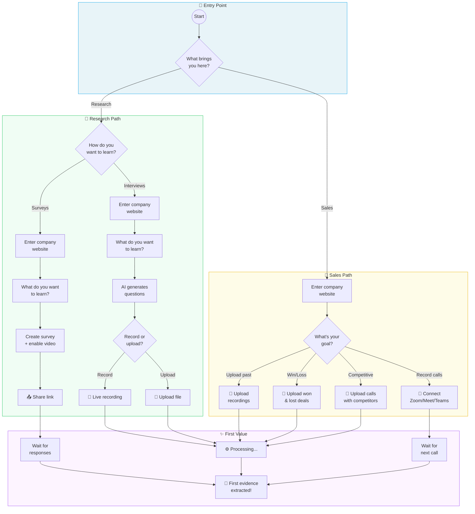
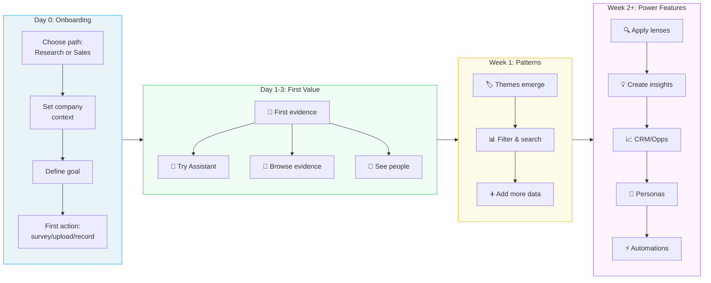
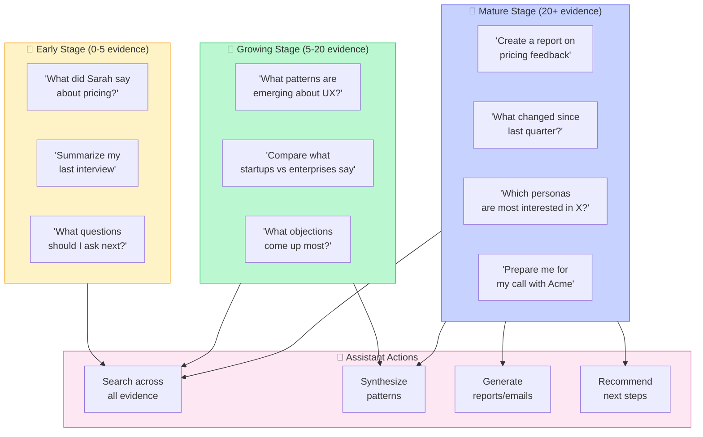
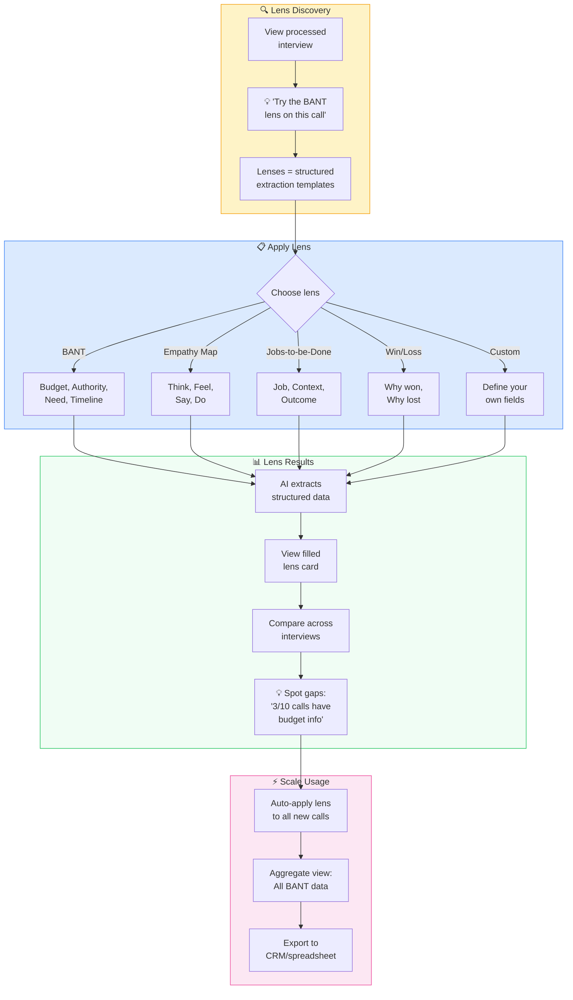
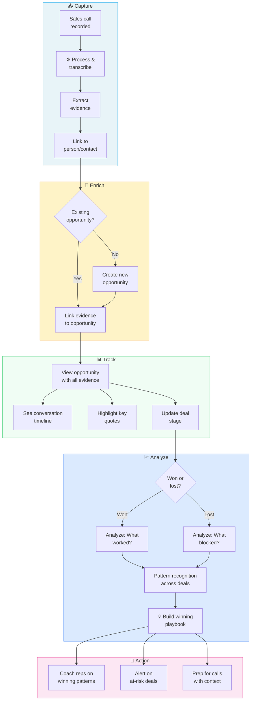
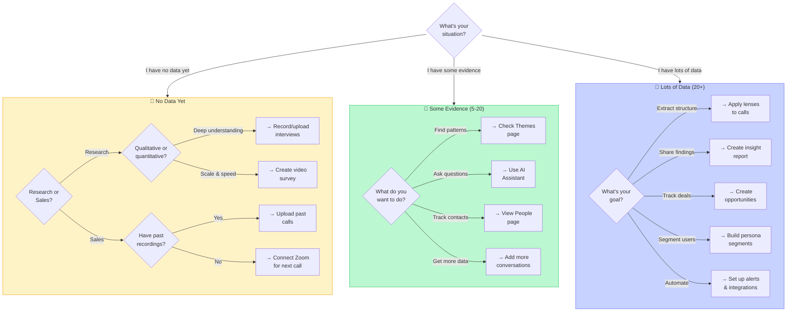

# Streamlined Onboarding UX Analysis

**Author**: UX Analysis
**Date**: January 2026
**Status**: Proposal
**Branch**: `claude/redesign-onboarding-flow-Y0NoU`

---

## Executive Summary

This document analyzes the current UpSight onboarding experience and proposes a streamlined flow that:
1. **Reduces cognitive load** by deferring advanced concepts (lenses, insights) until users have context
2. **Clarifies intent early** with a simple Research vs. Sales fork
3. **Promotes multimedia surveys** as a first-class research method
4. **Captures company context naturally** through conversational UI
5. **Gets users to value faster** by focusing on their immediate goal

---

## Current State Analysis

### Problems Identified

| Issue | Impact | Severity |
|-------|--------|----------|
| **Too many paths upfront** | Users freeze on 4+ options (Plan Discovery, Analyze Recordings, Record a Call, Just Exploring) | High |
| **Premature complexity** | Lenses, themes, insights explained before users understand their value | High |
| **Surveys underexposed** | Multimedia survey capabilities hidden behind "Ask Links" terminology | High |
| **Context captured late** | Company info gathered after research goal, feels disconnected | Medium |
| **Generic entry point** | No distinction between research and sales use cases | Medium |
| **Feature overload** | Voice, chat, form modes all presented simultaneously | Medium |

### Current Flow (Simplified)

```
┌─────────────────┐     ┌─────────────────┐     ┌─────────────────┐
│  Welcome Tour   │ ──► │  4 Path Choice  │ ──► │  Research Goal  │
└─────────────────┘     └─────────────────┘     └─────────────────┘
                                                        │
                        ┌───────────────────────────────┘
                        ▼
┌─────────────────┐     ┌─────────────────┐     ┌─────────────────┐
│  AI Questions   │ ──► │  Upload/Record  │ ──► │   Processing    │
└─────────────────┘     └─────────────────┘     └─────────────────┘
```

**Pain Points:**
- Users must understand research methodology before stating goals
- Company context (website, description) feels like an afterthought
- Survey creation is a separate flow, not integrated with onboarding
- "What are lenses?" interrupts the flow

---

## Proposed Streamlined Flow

### Core Principle: **Intent → Context → Method → Action**

Instead of asking users to understand the tool, ask what they want to accomplish.

### Phase 1: Intent Recognition (10 seconds)

```
┌─────────────────────────────────────────────────────────────────────┐
│                                                                     │
│                        What brings you to UpSight?                  │
│                                                                     │
│  ┌─────────────────────────────┐  ┌─────────────────────────────┐  │
│  │                             │  │                             │  │
│  │     🔬 Customer Research    │  │     💼 Sales Intelligence   │  │
│  │                             │  │                             │  │
│  │  Understand what customers  │  │  Capture and analyze your   │  │
│  │  think, feel, and need      │  │  sales conversations        │  │
│  │                             │  │                             │  │
│  └─────────────────────────────┘  └─────────────────────────────┘  │
│                                                                     │
│                    ○ ○ ○                                            │
│                                                                     │
└─────────────────────────────────────────────────────────────────────┘
```

**Why two paths?**
- Clear mental model: "Research = learning", "Sales = winning"
- Different downstream needs (surveys vs. call recordings)
- Allows tailored onboarding copy and suggestions

---

### Phase 2A: Research Path

#### Step 2A.1: Method Selection

```
┌─────────────────────────────────────────────────────────────────────┐
│                                                                     │
│  ← Back                                        Skip to dashboard →  │
│                                                                     │
│                    How do you want to learn?                        │
│                                                                     │
│  ┌─────────────────────────────┐  ┌─────────────────────────────┐  │
│  │                             │  │                             │  │
│  │     📋 Surveys              │  │     🎙️ Interviews           │  │
│  │                             │  │                             │  │
│  │  Send a link, collect       │  │  Have conversations and     │  │
│  │  responses at scale         │  │  capture the insights       │  │
│  │                             │  │                             │  │
│  │  ✓ Video responses          │  │  ✓ Live or recorded         │  │
│  │  ✓ Voice & chat modes       │  │  ✓ AI-powered analysis      │  │
│  │  ✓ Anonymous or identified  │  │  ✓ Automatic transcription  │  │
│  │                             │  │                             │  │
│  └─────────────────────────────┘  └─────────────────────────────┘  │
│                                                                     │
│                    ◉ ○ ○                                            │
│                                                                     │
└─────────────────────────────────────────────────────────────────────┘
```

**Key UX Decisions:**
- **Surveys get equal visual weight** — no longer buried as "Ask Links"
- **Feature bullets highlight multimedia** — video responses, voice modes
- **Both paths lead to same context capture** — consistent experience

---

#### Step 2A.2: Company Context (Conversational)

```
┌─────────────────────────────────────────────────────────────────────┐
│                                                                     │
│  ← Back                                        Skip to dashboard →  │
│                                                                     │
│  Let's learn about your company so we can help you ask              │
│  better questions.                                                  │
│                                                                     │
│  ┌─────────────────────────────────────────────────────────────┐   │
│  │  What's your company website?                               │   │
│  │                                                             │   │
│  │  ┌─────────────────────────────────────────────────────┐   │   │
│  │  │  https://                                           │   │   │
│  │  └─────────────────────────────────────────────────────┘   │   │
│  │                                                             │   │
│  │  We'll use this to understand your business                 │   │
│  │  and suggest relevant research questions.                   │   │
│  │                                                             │   │
│  └─────────────────────────────────────────────────────────────┘   │
│                                                                     │
│                           [ Continue ]                              │
│                                                                     │
│                    ○ ◉ ○                                            │
│                                                                     │
└─────────────────────────────────────────────────────────────────────┘
```

**After URL submission:**

```
┌─────────────────────────────────────────────────────────────────────┐
│                                                                     │
│  ← Back                                        Skip to dashboard →  │
│                                                                     │
│  ✓ Found: Acme Corp - B2B SaaS for project management              │
│                                                                     │
│  ┌─────────────────────────────────────────────────────────────┐   │
│  │  What do you want to learn from your customers?             │   │
│  │                                                             │   │
│  │  ┌─────────────────────────────────────────────────────┐   │   │
│  │  │  Why are users churning after the first month?      │   │   │
│  │  └─────────────────────────────────────────────────────┘   │   │
│  │                                                             │   │
│  │  Examples:                                                  │   │
│  │  • "Why do customers choose us over competitors?"           │   │
│  │  • "What features are most valuable to enterprise users?"   │   │
│  │  • "How can we improve onboarding for new teams?"           │   │
│  │                                                             │   │
│  └─────────────────────────────────────────────────────────────┘   │
│                                                                     │
│                           [ Generate Questions ]                    │
│                                                                     │
│                    ○ ○ ◉                                            │
│                                                                     │
└─────────────────────────────────────────────────────────────────────┘
```

**Why this order?**
- Company context first enables **smarter suggestions**
- Research goal feels natural after "what's your company?"
- Examples are tailored based on detected industry/business type

---

#### Step 2A.3: Survey Path - Multimedia Promotion

If user selected **Surveys**, show the multimedia capabilities prominently:

```
┌─────────────────────────────────────────────────────────────────────┐
│                                                                     │
│  Your survey is ready!                                              │
│                                                                     │
│  ┌─────────────────────────────────────────────────────────────┐   │
│  │                                                             │   │
│  │  🎬 Want richer responses?                                  │   │
│  │                                                             │   │
│  │  Enable video responses to let participants show you        │   │
│  │  their screen, demonstrate workflows, or express            │   │
│  │  emotions you can't capture in text.                        │   │
│  │                                                             │   │
│  │  ┌───────────────────────────────────────────────────────┐ │   │
│  │  │  Response Modes                                       │ │   │
│  │  │                                                       │ │   │
│  │  │  [✓] Text responses                                   │ │   │
│  │  │  [✓] Video responses (up to 2 min each)               │ │   │
│  │  │  [ ] Voice chat mode (AI conducts interview)          │ │   │
│  │  │                                                       │ │   │
│  │  └───────────────────────────────────────────────────────┘ │   │
│  │                                                             │   │
│  │  ┌───────────────────────────────────────────────────────┐ │   │
│  │  │  Respondent Identity                                  │ │   │
│  │  │                                                       │ │   │
│  │  │  ( ) Anonymous                                        │ │   │
│  │  │  (●) Identified by email                              │ │   │
│  │  │  ( ) Identified by phone                              │ │   │
│  │  │                                                       │ │   │
│  │  └───────────────────────────────────────────────────────┘ │   │
│  │                                                             │   │
│  └─────────────────────────────────────────────────────────────┘   │
│                                                                     │
│  [ Preview Survey ]              [ Copy Link & Share ]              │
│                                                                     │
└─────────────────────────────────────────────────────────────────────┘
```

**Multimedia Survey Promotion Strategy:**
1. **Default video ON** — opt-out rather than opt-in
2. **Visual examples** — show a video thumbnail of a sample response
3. **Benefits copy** — emphasize "see their screen", "capture emotions"
4. **Voice mode exposed** — but marked as optional/experimental

---

### Phase 2B: Sales Path

#### Step 2B.1: Company Context First

```
┌─────────────────────────────────────────────────────────────────────┐
│                                                                     │
│  ← Back                                        Skip to dashboard →  │
│                                                                     │
│  Let's set up your sales intelligence.                              │
│                                                                     │
│  ┌─────────────────────────────────────────────────────────────┐   │
│  │  What's your company website?                               │   │
│  │                                                             │   │
│  │  ┌─────────────────────────────────────────────────────┐   │   │
│  │  │  https://acme.com                                   │   │   │
│  │  └─────────────────────────────────────────────────────┘   │   │
│  │                                                             │   │
│  │  We'll analyze your business to help you:                   │   │
│  │  • Understand competitor mentions in calls                  │   │
│  │  • Track objection patterns                                 │   │
│  │  • Identify what's winning deals                            │   │
│  │                                                             │   │
│  └─────────────────────────────────────────────────────────────┘   │
│                                                                     │
│                           [ Continue ]                              │
│                                                                     │
│                    ◉ ○ ○                                            │
│                                                                     │
└─────────────────────────────────────────────────────────────────────┘
```

---

#### Step 2B.2: Goal Selection

```
┌─────────────────────────────────────────────────────────────────────┐
│                                                                     │
│  ← Back                                        Skip to dashboard →  │
│                                                                     │
│  ✓ Found: Acme Corp - B2B SaaS for project management              │
│                                                                     │
│  What's your main goal?                                             │
│                                                                     │
│  ┌─────────────────────────────┐  ┌─────────────────────────────┐  │
│  │                             │  │                             │  │
│  │  📞 Record Sales Calls      │  │  📤 Upload Past Calls       │  │
│  │                             │  │                             │  │
│  │  Connect your meeting tool  │  │  Analyze recordings you     │  │
│  │  or record directly         │  │  already have               │  │
│  │                             │  │                             │  │
│  └─────────────────────────────┘  └─────────────────────────────┘  │
│                                                                     │
│  ┌─────────────────────────────┐  ┌─────────────────────────────┐  │
│  │                             │  │                             │  │
│  │  🎯 Win/Loss Analysis       │  │  📊 Competitive Intel       │  │
│  │                             │  │                             │  │
│  │  Understand why you win     │  │  Track what prospects say   │  │
│  │  and lose deals             │  │  about competitors          │  │
│  │                             │  │                             │  │
│  └─────────────────────────────┘  └─────────────────────────────┘  │
│                                                                     │
│                    ○ ◉ ○                                            │
│                                                                     │
└─────────────────────────────────────────────────────────────────────┘
```

---

#### Step 2B.3: Quick Start Action

```
┌─────────────────────────────────────────────────────────────────────┐
│                                                                     │
│  ← Back                                        Skip to dashboard →  │
│                                                                     │
│  Ready to capture your first call!                                  │
│                                                                     │
│  ┌─────────────────────────────────────────────────────────────┐   │
│  │                                                             │   │
│  │  Choose how to get started:                                 │   │
│  │                                                             │   │
│  │  ┌───────────────────────────────────────────────────────┐ │   │
│  │  │  🎤  Record a test call now (30 seconds)              │ │   │
│  │  │      Try the instant analysis                         │ │   │
│  │  └───────────────────────────────────────────────────────┘ │   │
│  │                                                             │   │
│  │  ┌───────────────────────────────────────────────────────┐ │   │
│  │  │  📁  Upload a past recording                          │ │   │
│  │  │      MP3, MP4, WAV, or video                          │ │   │
│  │  └───────────────────────────────────────────────────────┘ │   │
│  │                                                             │   │
│  │  ┌───────────────────────────────────────────────────────┐ │   │
│  │  │  🔗  Connect Zoom/Meet/Teams                          │ │   │
│  │  │      Auto-sync future recordings                      │ │   │
│  │  └───────────────────────────────────────────────────────┘ │   │
│  │                                                             │   │
│  └─────────────────────────────────────────────────────────────┘   │
│                                                                     │
│                    ○ ○ ◉                                            │
│                                                                     │
└─────────────────────────────────────────────────────────────────────┘
```

---

## Complete Flow Diagram

```
                              ┌───────────────────┐
                              │   What brings     │
                              │   you here?       │
                              └─────────┬─────────┘
                                        │
                    ┌───────────────────┴───────────────────┐
                    │                                       │
                    ▼                                       ▼
          ┌─────────────────┐                     ┌─────────────────┐
          │    Research     │                     │      Sales      │
          └────────┬────────┘                     └────────┬────────┘
                   │                                       │
                   ▼                                       ▼
          ┌─────────────────┐                     ┌─────────────────┐
          │ Survey or       │                     │ Company Website │
          │ Interview?      │                     │ (auto-analyze)  │
          └────────┬────────┘                     └────────┬────────┘
                   │                                       │
        ┌──────────┴──────────┐                            ▼
        │                     │                   ┌─────────────────┐
        ▼                     ▼                   │ What's your     │
┌───────────────┐   ┌───────────────┐             │ goal?           │
│   Surveys     │   │  Interviews   │             │ - Record calls  │
└───────┬───────┘   └───────┬───────┘             │ - Upload past   │
        │                   │                     │ - Win/Loss      │
        ▼                   ▼                     │ - Competitive   │
┌───────────────┐   ┌───────────────┐             └────────┬────────┘
│ Company       │   │ Company       │                      │
│ Website       │   │ Website       │                      ▼
└───────┬───────┘   └───────┬───────┘             ┌─────────────────┐
        │                   │                     │ Quick Action:   │
        ▼                   ▼                     │ - Test record   │
┌───────────────┐   ┌───────────────┐             │ - Upload file   │
│ Research Goal │   │ Research Goal │             │ - Connect tool  │
│ + Generate    │   │ + Generate    │             └────────┬────────┘
│ Questions     │   │ Questions     │                      │
└───────┬───────┘   └───────┬───────┘                      │
        │                   │                              │
        ▼                   ▼                              ▼
┌───────────────┐   ┌───────────────┐             ┌─────────────────┐
│ Survey Setup  │   │ Upload/Record │             │   Processing    │
│ + Multimedia  │   │               │             │   + Dashboard   │
│ Options       │   │               │             │                 │
└───────┬───────┘   └───────┬───────┘             └─────────────────┘
        │                   │
        ▼                   ▼
┌───────────────┐   ┌───────────────┐
│ Share Link    │   │  Processing   │
└───────────────┘   └───────────────┘
```

---

## What We're NOT Showing Yet

### Deferred to Post-Onboarding

| Concept | Why Defer | When to Introduce |
|---------|-----------|-------------------|
| **Lenses** | Abstract concept; requires data context | After first insights appear |
| **Themes** | Need evidence to cluster | After 3+ conversations processed |
| **Insights** | Builds on themes | After themes are established |
| **People/Personas** | Secondary to core workflow | When viewing individual evidence |
| **Opportunities** | Sales-specific, advanced | After win/loss patterns emerge |
| **Tasks** | Action-oriented, not discovery | After insights are actionable |

### Progressive Disclosure Strategy

```
Onboarding          First Week           Power User
─────────────────────────────────────────────────────

Goal → Method       "Try a lens on       "Create custom
→ Quick Win         this interview"      lens templates"

                    "We found a          "Configure
                    theme in your        theme alerts"
                    responses"

                    "Meet your           "Build persona
                    first persona"       segments"
```

---

## Multimedia Survey Promotion Strategy

### Current Problems

1. **Hidden terminology**: "Ask Links" doesn't convey survey capabilities
2. **Video opt-in friction**: Users don't know video is possible
3. **Voice mode buried**: Experimental badge discourages use
4. **No preview/demo**: Users can't see what video responses look like

### Proposed Solutions

#### 1. Rename "Ask Links" → "Surveys" Everywhere

| Current | Proposed |
|---------|----------|
| "Ask Links" | "Surveys" |
| "Create Ask Link" | "Create Survey" |
| "Ask Link responses" | "Survey responses" |

#### 2. Video Response Gallery in Onboarding

```
┌─────────────────────────────────────────────────────────────────────┐
│                                                                     │
│  See what video responses look like                                 │
│                                                                     │
│  ┌─────────────────┐  ┌─────────────────┐  ┌─────────────────┐     │
│  │  ▶              │  │  ▶              │  │  ▶              │     │
│  │ [Thumbnail 1]   │  │ [Thumbnail 2]   │  │ [Thumbnail 3]   │     │
│  │                 │  │                 │  │                 │     │
│  │ "I love how..." │  │ "My biggest..." │  │ "Watch me..."   │     │
│  │ 0:47            │  │ 1:23            │  │ 0:58            │     │
│  └─────────────────┘  └─────────────────┘  └─────────────────┘     │
│                                                                     │
│  Video responses capture emotion, context, and demonstrations       │
│  that text alone can't convey.                                      │
│                                                                     │
│                    [ Enable Video Responses ]                       │
│                                                                     │
└─────────────────────────────────────────────────────────────────────┘
```

#### 3. Smart Defaults

| Setting | Default | Rationale |
|---------|---------|-----------|
| Video responses | **Enabled** | Higher engagement, richer data |
| Response mode | Form | Most familiar, lowest friction |
| Voice mode | Visible but off | Experimental; show capability |
| Identity mode | Identified (email) | Enables follow-up, linking |

#### 4. Contextual Nudges

Show these at key moments:

- **After 5 text-only responses**: "Want richer feedback? Enable video responses."
- **On question with low completion**: "Video prompts increase completion by 23%"
- **When creating UX research survey**: "Tip: Enable video to see users demonstrate workflows"

---

## Implementation Recommendations

### Phase 1: Immediate Wins (1-2 weeks)

1. **Rename Ask Links → Surveys** throughout UI
2. **Add Research/Sales fork** as first onboarding step
3. **Move company context before research goal**
4. **Default video responses to ON**

### Phase 2: Enhanced Flow (2-4 weeks)

1. **Build dedicated Sales onboarding path**
2. **Create video response gallery preview**
3. **Implement progressive lens/theme disclosure**
4. **Add contextual multimedia nudges**

### Phase 3: Optimization (4-6 weeks)

1. **A/B test path completion rates**
2. **Track video enablement conversion**
3. **Measure time-to-first-insight by path**
4. **Iterate on Sales path goals**

---

## Success Metrics

| Metric | Current | Target |
|--------|---------|--------|
| Onboarding completion rate | ~60% | 80%+ |
| Time to first insight | 8+ minutes | < 5 minutes |
| Survey creation rate | Low | 3x increase |
| Video response enablement | ~10% | 50%+ |
| Research/Sales path clarity | N/A | 90%+ correct path selection |
| Skip-to-dashboard rate | High | < 15% |

---

## Appendix: Wireframe Annotations

### Mobile Considerations

- All cards should be single-column on mobile
- Video preview thumbnails should be swipeable
- Voice mode recording should work on mobile browsers
- QR code for survey sharing should be prominently displayed

### Accessibility Notes

- All multimedia content needs captions/transcripts
- Video recording should have audio-only fallback
- High contrast mode for all path selection cards
- Screen reader announcements for async processing

### Edge Cases

| Scenario | Handling |
|----------|----------|
| User wants both research + sales | Allow project type selection per project |
| User has no website | Skip auto-analysis, use manual input |
| User already has recordings | Detect from file system, offer import |
| User is evaluating tool | Add "Just exploring" tertiary option |

---

## Mermaid Flow Diagrams

### Level 1: Simple Onboarding Flow (First 5 Minutes)

This is the streamlined entry experience - get users to their first "aha moment" fast.



---

### Level 2: After First Content (Day 1-3)

Once users have their first evidence, introduce the core value props progressively.

```mermaid
flowchart TD
    subgraph trigger["📬 Content Triggers"]
        EVIDENCE[First evidence<br/>extracted] --> NOTIFY[🔔 Notification:<br/>"We found insights!"]
        RESPONSES[3+ survey<br/>responses] --> THEME_TRIGGER[🔔 "Patterns<br/>emerging"]
        CALLS[2+ calls<br/>processed] --> PERSON_TRIGGER[🔔 "Meet your<br/>contacts"]
    end

    subgraph assistant["🤖 AI Assistant Introduction"]
        NOTIFY --> ASSISTANT_PROMPT["💬 Ask me anything<br/>about your data"]
        ASSISTANT_PROMPT --> ASK_EXAMPLE["Try: 'What are<br/>customers saying<br/>about pricing?'"]
        ASK_EXAMPLE --> ASSISTANT_RESPONSE[AI synthesizes<br/>across all evidence]
        ASSISTANT_RESPONSE --> ASSISTANT_HABIT[User learns to<br/>query naturally]
    end

    subgraph evidence["📋 Evidence Dashboard"]
        NOTIFY --> VIEW_EVIDENCE[View evidence<br/>cards]
        VIEW_EVIDENCE --> FILTER_EVIDENCE[Filter by person,<br/>source, date]
        FILTER_EVIDENCE --> UNDERSTAND_RECEIPTS["💡 Aha: Evidence = <br/>verifiable quotes"]
    end

    subgraph themes["🏷️ Themes Discovery"]
        THEME_TRIGGER --> AUTO_THEME[AI clusters<br/>similar evidence]
        AUTO_THEME --> VIEW_THEMES[View theme<br/>cards]
        VIEW_THEMES --> THEME_DRILL[Click theme →<br/>see all evidence]
        THEME_DRILL --> UNDERSTAND_THEMES["💡 Aha: Themes = <br/>patterns across data"]
    end

    subgraph people["👤 People/CRM"]
        PERSON_TRIGGER --> VIEW_PEOPLE[See people<br/>mentioned]
        VIEW_PEOPLE --> PERSON_PROFILE[Click person →<br/>all their quotes]
        PERSON_PROFILE --> LINK_CONTACT["💡 Aha: CRM = <br/>evidence per person"]
    end

    style trigger fill:#fef3c7,stroke:#f59e0b
    style assistant fill:#dbeafe,stroke:#3b82f6
    style evidence fill:#f0fdf4,stroke:#22c55e
    style themes fill:#fce7f3,stroke:#ec4899
    style people fill:#e0e7ff,stroke:#6366f1
```

---

### Level 3: Power User Features (Week 2+)

As users build content and habits, progressively reveal advanced capabilities.

```mermaid
flowchart TD
    subgraph lenses["🔍 Lenses Introduction"]
        EVIDENCE_HABIT[User regularly<br/>views evidence] --> LENS_PROMPT["💡 Tip: Try a<br/>lens on this call"]
        LENS_PROMPT --> LENS_EXPLAIN["Lenses extract<br/>specific angles:<br/>BANT, empathy, etc."]
        LENS_EXPLAIN --> APPLY_LENS[Apply lens<br/>to interview]
        APPLY_LENS --> LENS_RESULTS[See structured<br/>extraction]
        LENS_RESULTS --> LENS_COMPARE[Compare across<br/>multiple calls]
        LENS_COMPARE --> CUSTOM_LENS["⚡ Power: Create<br/>custom lens"]
    end

    subgraph insights["💡 Insights & Reports"]
        THEME_HABIT[User views<br/>themes regularly] --> INSIGHT_PROMPT["💡 Ready to create<br/>an insight?"]
        INSIGHT_PROMPT --> CREATE_INSIGHT[Bundle themes +<br/>evidence]
        CREATE_INSIGHT --> INSIGHT_REPORT[Generate<br/>shareable report]
        INSIGHT_REPORT --> EXPORT_INSIGHT["📤 Export to<br/>Notion/Slides"]
    end

    subgraph crm["📊 CRM & Opportunities"]
        SALES_CALLS[5+ sales calls<br/>processed] --> OPP_PROMPT["💡 Track this<br/>as opportunity?"]
        OPP_PROMPT --> CREATE_OPP[Create<br/>opportunity]
        CREATE_OPP --> LINK_EVIDENCE[Link supporting<br/>evidence]
        LINK_EVIDENCE --> OPP_STAGE[Track deal<br/>stages]
        OPP_STAGE --> WINLOSS[Win/Loss<br/>analysis]
    end

    subgraph automation["⚡ Automation & Scale"]
        POWER_USER[Regular<br/>usage] --> PERSONA_PROMPT["💡 Create a<br/>persona segment?"]
        PERSONA_PROMPT --> CREATE_PERSONA[Define persona<br/>criteria]
        CREATE_PERSONA --> PERSONA_FILTER[Filter all data<br/>by persona]

        POWER_USER --> ALERT_PROMPT["💡 Set up<br/>theme alerts?"]
        ALERT_PROMPT --> CREATE_ALERT[Alert when theme<br/>mentioned]

        POWER_USER --> INTEGRATE_PROMPT["💡 Connect to<br/>Slack/Notion?"]
        INTEGRATE_PROMPT --> INTEGRATIONS[Set up<br/>integrations]
    end

    style lenses fill:#fef3c7,stroke:#f59e0b
    style insights fill:#dbeafe,stroke:#3b82f6
    style crm fill:#f0fdf4,stroke:#22c55e
    style automation fill:#fce7f3,stroke:#ec4899
```



---

### Complete User Journey: From Zero to Power User



---

### Assistant Usage Patterns

How users interact with the AI assistant at different stages.



---

### Lens Usage Flow

When and how users discover and apply lenses.



---

### CRM Integration Flow

How evidence connects to opportunities and deal tracking.



---

### Feature Unlock Timeline

Visual representation of progressive disclosure based on user activity.

```mermaid
gantt
    title Feature Unlock Timeline
    dateFormat X
    axisFormat %s

    section Onboarding
    Choose path (Research/Sales)     :done, 0, 1
    Company context                  :done, 1, 2
    First survey/upload              :done, 2, 3

    section Day 1
    View first evidence              :active, 3, 4
    Browse evidence dashboard        :4, 5
    Try AI Assistant                 :5, 6

    section Week 1
    See auto-generated themes        :7, 8
    View people/contacts             :8, 9
    Filter & search                  :9, 10

    section Week 2
    Apply first lens                 :12, 13
    Create insight report            :13, 14
    Create opportunity (Sales)       :14, 15

    section Power User
    Custom lenses                    :18, 19
    Persona segments                 :19, 20
    Integrations & alerts            :20, 21
```



---

### Decision Tree: What Should User Do Next?



---

## References

- [Current Onboarding Spec](./onboarding-spec.md)
- [Unified Setup V2 Voice-First](./unified-setup-v2-voice-first.md)
- [Unified Onboarding UI Spec](./unified-onboarding-ui-spec.md)
