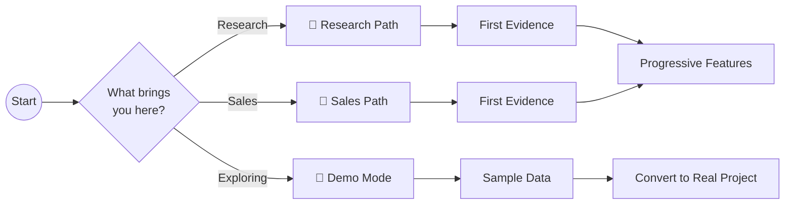
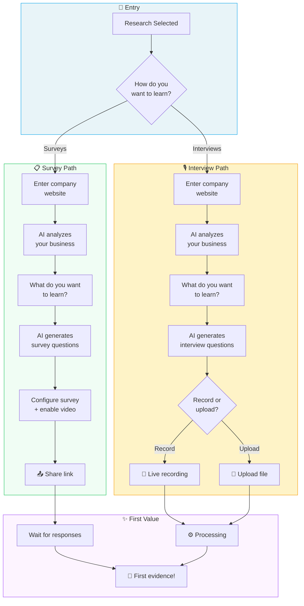
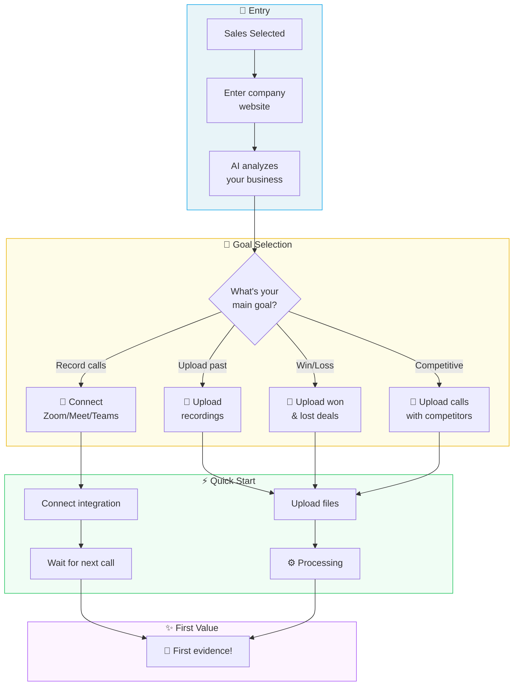
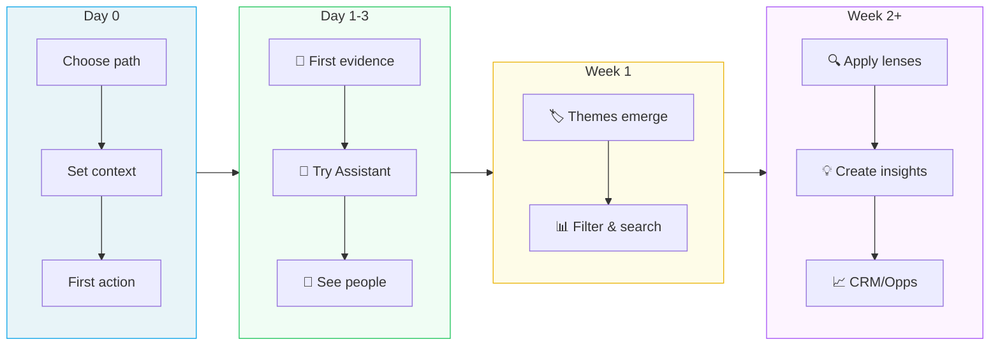
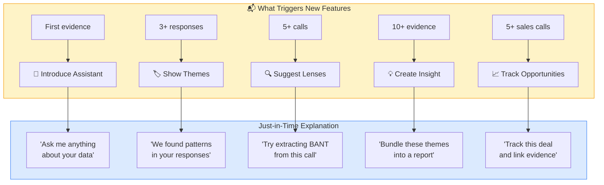
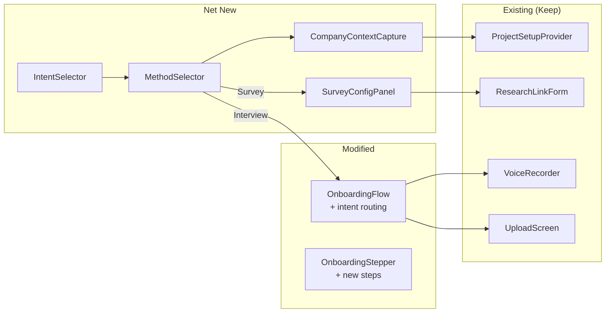

# Unified Onboarding Redesign

| Field | Value |
|-------|-------|
| **Status** | In Review |
| **Author** | UX Analysis + Engineering |
| **Date** | 2026-01-31 |
| **Branch** | `claude/redesign-onboarding-flow-Y0NoU` |

---

## 1. Overview

### 1.1 Problem Statement

Current onboarding has too many choices upfront (4 paths), introduces complex concepts too early (lenses, themes, insights), and buries our strongest differentiator—multimedia surveys with video responses. Users need a simpler mental model: **"Am I doing research or sales?"** followed by the right guided path.

### 1.2 Success Criteria

- [ ] Onboarding completion rate: 60% → 80%
- [ ] Time to first insight: 8+ min → < 5 min
- [ ] Survey creation rate: 3x increase
- [ ] Video response enablement: 10% → 50%
- [ ] Skip-to-dashboard rate: High → < 15%

---

## 2. User Stories

### Primary Stories

| ID | Story | Priority | Acceptance Criteria |
|----|-------|----------|---------------------|
| US-1 | As a **researcher**, I want to quickly set up a survey so that I can start collecting customer feedback today | Must Have | Can share survey link within 3 minutes of signup |
| US-2 | As a **sales manager**, I want to upload my team's call recordings so that I can see why deals are won/lost | Must Have | Can upload and see first insights within 5 minutes |
| US-3 | As a **PM**, I want to interview users about a feature so that I can validate assumptions before building | Must Have | AI generates relevant questions based on my goal |
| US-4 | As a **new user**, I want to understand what this tool does so that I can decide if it's right for me | Should Have | Clear value prop without jargon on first screen |

### Edge Cases

| ID | Scenario | Expected Behavior |
|----|----------|-------------------|
| EC-1 | User wants both research AND sales | Allow project type selection per project |
| EC-2 | User has no company website | Skip auto-analysis, use manual description |
| EC-3 | User has existing recordings | Detect intent, offer bulk import |
| EC-4 | User is just evaluating | Tertiary "Just exploring" option with demo data |

---

## 3. User Journey

### 3.1 High-Level Flow: Research vs Sales Fork



### 3.2 Research Path: Detailed Flow



### 3.3 Sales Path: Detailed Flow



### 3.4 Progressive Feature Unlock



### 3.5 Feature Discovery Triggers



---

## 4. Wireframes

### Screen 1: Intent Selection (Entry Point)

```
┌─────────────────────────────────────────────────────────────────────┐
│  [Logo] UpSight                                         [Sign Out]  │
├─────────────────────────────────────────────────────────────────────┤
│                                                                     │
│                                                                     │
│                     What brings you to UpSight?                     │
│                                                                     │
│  ┌─────────────────────────────┐  ┌─────────────────────────────┐  │
│  │                             │  │                             │  │
│  │     🔬 Customer Research    │  │     💼 Sales Intelligence   │  │
│  │                             │  │                             │  │
│  │  Understand what customers  │  │  Capture and analyze your   │  │
│  │  think, feel, and need      │  │  sales conversations        │  │
│  │                             │  │                             │  │
│  │  • Surveys with video       │  │  • Call recording & upload  │  │
│  │  • Live interviews          │  │  • Win/loss analysis        │  │
│  │  • AI-powered analysis      │  │  • Competitor tracking      │  │
│  │                             │  │                             │  │
│  └─────────────────────────────┘  └─────────────────────────────┘  │
│                                                                     │
│                        Just exploring? [Try demo →]                 │
│                                                                     │
└─────────────────────────────────────────────────────────────────────┘
```

### Screen 2: Research Method Selection

```
┌─────────────────────────────────────────────────────────────────────┐
│  ← Back                                        Skip to dashboard →  │
├─────────────────────────────────────────────────────────────────────┤
│                                                                     │
│                     How do you want to learn?                       │
│                                                                     │
│  ┌─────────────────────────────┐  ┌─────────────────────────────┐  │
│  │                             │  │                             │  │
│  │     📋 Surveys              │  │     🎙️ Interviews           │  │
│  │                             │  │                             │  │
│  │  Send a link, collect       │  │  Have conversations and     │  │
│  │  responses at scale         │  │  capture the insights       │  │
│  │                             │  │                             │  │
│  │  ✓ Video responses          │  │  ✓ Live or recorded         │  │
│  │  ✓ Voice & chat modes       │  │  ✓ AI-powered analysis      │  │
│  │  ✓ Anonymous or identified  │  │  ✓ Automatic transcription  │  │
│  │                             │  │                             │  │
│  │  Best for: Scale, async     │  │  Best for: Depth, rapport   │  │
│  │                             │  │                             │  │
│  └─────────────────────────────┘  └─────────────────────────────┘  │
│                                                                     │
│                         ◉ ○ ○ ○ (Progress)                          │
│                                                                     │
└─────────────────────────────────────────────────────────────────────┘
```

### Screen 3: Company Context

```
┌─────────────────────────────────────────────────────────────────────┐
│  ← Back                                        Skip to dashboard →  │
├─────────────────────────────────────────────────────────────────────┤
│                                                                     │
│  Let's learn about your company so we can ask better questions.     │
│                                                                     │
│  ┌─────────────────────────────────────────────────────────────┐   │
│  │                                                             │   │
│  │  What's your company website?                               │   │
│  │                                                             │   │
│  │  ┌─────────────────────────────────────────────────────┐   │   │
│  │  │  https://acme.com                                   │   │   │
│  │  └─────────────────────────────────────────────────────┘   │   │
│  │                                                             │   │
│  │  We'll analyze your website to understand your business     │   │
│  │  and suggest relevant research questions.                   │   │
│  │                                                             │   │
│  │                                          [Continue →]       │   │
│  │                                                             │   │
│  └─────────────────────────────────────────────────────────────┘   │
│                                                                     │
│  ○ No website? [Describe your company instead]                      │
│                                                                     │
│                         ○ ◉ ○ ○ (Progress)                          │
│                                                                     │
└─────────────────────────────────────────────────────────────────────┘
```

### Screen 4: Research Goal + AI Context

```
┌─────────────────────────────────────────────────────────────────────┐
│  ← Back                                        Skip to dashboard →  │
├─────────────────────────────────────────────────────────────────────┤
│                                                                     │
│  ✓ Found: Acme Corp - B2B project management SaaS                   │
│    Serves: Tech startups, mid-market teams                          │
│                                                                     │
│  ┌─────────────────────────────────────────────────────────────┐   │
│  │                                                             │   │
│  │  What do you want to learn from your customers?             │   │
│  │                                                             │   │
│  │  ┌─────────────────────────────────────────────────────┐   │   │
│  │  │  Why do users churn after the first month?          │   │   │
│  │  └─────────────────────────────────────────────────────┘   │   │
│  │                                                             │   │
│  │  Suggestions based on your business:                        │   │
│  │                                                             │   │
│  │  [Why do teams choose us over Asana?]                       │   │
│  │  [What features do enterprise buyers need?]                 │   │
│  │  [How do teams onboard new members?]                        │   │
│  │                                                             │   │
│  │                                   [Generate Questions →]    │   │
│  │                                                             │   │
│  └─────────────────────────────────────────────────────────────┘   │
│                                                                     │
│                         ○ ○ ◉ ○ (Progress)                          │
│                                                                     │
└─────────────────────────────────────────────────────────────────────┘
```

### Screen 5: Survey Configuration (Multimedia Promotion)

```
┌─────────────────────────────────────────────────────────────────────┐
│  ← Back                                        Skip to dashboard →  │
├─────────────────────────────────────────────────────────────────────┤
│                                                                     │
│  Your survey is ready! Configure how respondents can answer.        │
│                                                                     │
│  ┌────────────────────────────────┬────────────────────────────┐   │
│  │  Response Modes                │  Preview                   │   │
│  │                                │                            │   │
│  │  [✓] Text responses            │  ┌──────────────────────┐  │   │
│  │      Always available          │  │                      │  │   │
│  │                                │  │  "Why do users       │  │   │
│  │  [✓] Video responses           │  │   churn after the    │  │   │
│  │      Let respondents record    │  │   first month?"      │  │   │
│  │      up to 2 min each          │  │                      │  │   │
│  │      ⭐ Recommended             │  │  [Record Video 🎥]   │  │   │
│  │                                │  │                      │  │   │
│  │  [ ] Voice chat mode           │  │  [Type Answer ⌨️]    │  │   │
│  │      AI conducts interview     │  │                      │  │   │
│  │      (Experimental)            │  └──────────────────────┘  │   │
│  │                                │                            │   │
│  ├────────────────────────────────┤                            │   │
│  │  Respondent Identity           │                            │   │
│  │                                │                            │   │
│  │  ( ) Anonymous                 │                            │   │
│  │  (●) Identified by email       │                            │   │
│  │  ( ) Identified by phone       │                            │   │
│  │                                │                            │   │
│  └────────────────────────────────┴────────────────────────────┘   │
│                                                                     │
│  [Preview Survey]                            [Copy Link & Share →]  │
│                                                                     │
│                         ○ ○ ○ ◉ (Progress)                          │
│                                                                     │
└─────────────────────────────────────────────────────────────────────┘
```

---

## 5. Integration Map

### 5.1 Existing Components We're Using

| Component | Location | How We're Using It |
|-----------|----------|-------------------|
| `ProjectSetupProvider` | `app/features/onboarding/context/project-setup-context.tsx` | State management for multi-step flow |
| `project-setup-store.ts` | `app/features/onboarding/context/` | Zustand store for persistence |
| `useProjectRoutes` | `app/hooks/useProjectRoutes.ts` | Navigation after setup complete |
| `ResearchLinkForm` | `app/features/research-links/components/` | Survey creation form |
| `VoiceRecorder` | `app/features/onboarding/components/` | Live recording capability |
| `UploadScreen` | `app/features/onboarding/components/` | File upload flow |

### 5.2 Existing Patterns We're Following

| Pattern | Reference | Notes |
|---------|-----------|-------|
| Multi-step wizard | `OnboardingFlow.tsx` | Stepper with state machine |
| AI suggestions | `ContextualSuggestions.tsx` | Based on captured context |
| Mode switching | `SetupModeSelector.tsx` | Chat/Voice/Form patterns |
| Survey identity modes | Recent commits (b2a2a49, 3bd88f0) | Anonymous/Email/Phone toggle |

### 5.3 What's Net New

| New Component/System | Purpose | Depends On |
|---------------------|---------|------------|
| `IntentSelector` | Research/Sales fork at entry | None |
| `MethodSelector` | Survey/Interview choice | IntentSelector |
| `CompanyContextCapture` | Website → AI analysis | project-setup-store |
| `SurveyConfigPanel` | Multimedia options promotion | ResearchLinkForm |
| `FeatureUnlockBanner` | Progressive feature introduction | User activity tracking |

### 5.4 Integration Diagram



---

## 6. What We're NOT Changing (Yet)

### Concepts Deferred to Progressive Disclosure

| Concept | Why Defer | When to Introduce |
|---------|-----------|-------------------|
| **Lenses** | Abstract; requires data context | After 5+ conversations: "Try the BANT lens" |
| **Themes** | Need evidence to cluster | After 3+ responses: "We found patterns" |
| **Insights** | Builds on themes | After themes exist: "Bundle into a report" |
| **Opportunities** | Sales-specific, advanced | After 5+ sales calls: "Track this deal" |
| **Personas** | Requires segmentation data | After 10+ people: "Create a segment" |

### UI Changes NOT in Scope

- Navigation restructuring
- Dashboard redesign
- Evidence card redesign
- Theme clustering algorithm

---

## 7. Risk Assessment

### 7.1 Technical Risks

| Risk | Likelihood | Impact | Mitigation |
|------|------------|--------|------------|
| Website analysis latency | Medium | Medium | Show skeleton, cache results |
| Breaking existing user flows | Medium | High | Feature flag, A/B test |
| State management complexity | Low | Medium | Leverage existing Zustand store |

### 7.2 UX Risks

| Risk | Likelihood | Impact | Mitigation |
|------|------------|--------|------------|
| Users pick wrong path | Low | Medium | Allow switching, clear descriptions |
| Video default confuses users | Medium | Low | Clear explanation, easy toggle |
| Sales users want research too | Medium | Medium | Per-project type selection |

### 7.3 Open Questions

- [ ] Should "exploring" mode use synthetic data or real demo project?
- [ ] How do we handle users who signed up before this change?
- [ ] Do we need separate onboarding for team invites vs new signups?

---

## 8. Effort Estimate

### 8.1 Work Breakdown

| Task | Scope | Dependencies |
|------|-------|--------------|
| IntentSelector component | Small | None |
| MethodSelector component | Small | IntentSelector |
| CompanyContextCapture integration | Medium | AI endpoint exists |
| SurveyConfigPanel with video promotion | Medium | ResearchLinkForm |
| Route/flow modifications | Medium | All components |
| Progressive feature banners | Medium | Activity tracking |
| Testing & QA | Medium | All above |

### 8.2 Phases

| Phase | What's Included | Deliverable |
|-------|-----------------|-------------|
| **Phase 1: Fork** | Intent + Method selectors, basic routing | Users see Research/Sales choice |
| **Phase 2: Context** | Company analysis before goal, AI suggestions | Smarter question generation |
| **Phase 3: Multimedia** | Survey config panel, video default ON | Higher video adoption |
| **Phase 4: Progressive** | Feature unlock banners, just-in-time tooltips | Reduced cognitive load |

---

## 9. Measuring Success

### Analytics Events to Track

| Event | Trigger | Purpose |
|-------|---------|---------|
| `onboarding_intent_selected` | Click Research/Sales | Path distribution |
| `onboarding_method_selected` | Click Survey/Interview | Method preference |
| `onboarding_company_analyzed` | Website analysis complete | Context capture rate |
| `onboarding_completed` | First action taken | Completion rate |
| `survey_video_enabled` | Video toggle on at creation | Video adoption |
| `feature_banner_shown` | Progressive feature introduced | Discovery timing |
| `feature_banner_clicked` | User engages with feature | Conversion rate |

---

## 10. References

- [Previous: Streamlined Onboarding UX Analysis](./streamlined-onboarding-ux-analysis.md)
- [Generative UI Story](./generative-ui-story.md) (unified-research-flow branch)
- [Generative UI Architecture](./generative-ui-architecture.md) (unified-research-flow branch)
- [Unified Onboarding UI Spec](./unified-onboarding-ui-spec.md)
- [Current Onboarding Spec](./onboarding-spec.md)

---

## Changelog

| Date | Author | Change |
|------|--------|--------|
| 2026-01-31 | Claude | Initial consolidated spec from UX analysis + unified-research-flow content |
