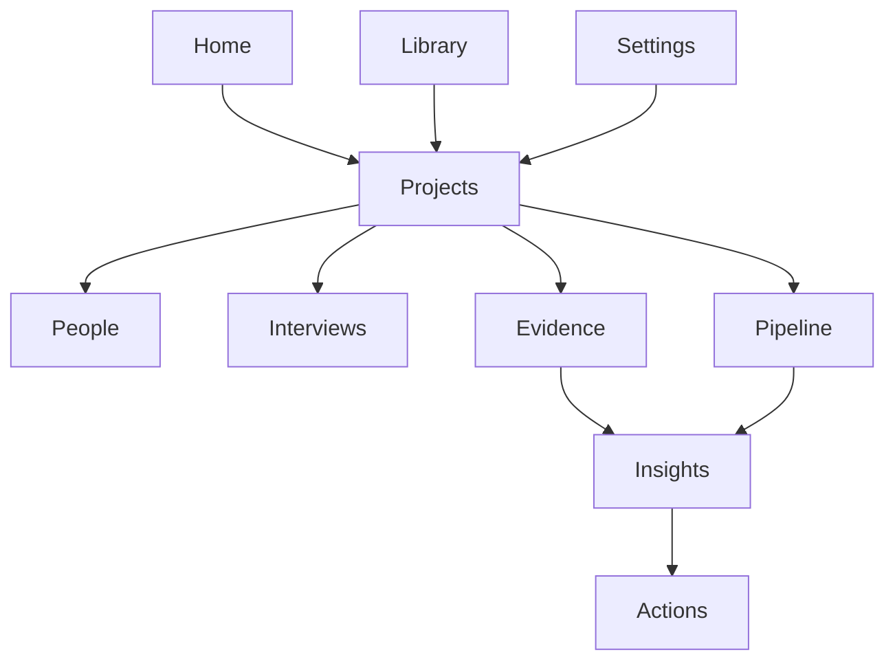
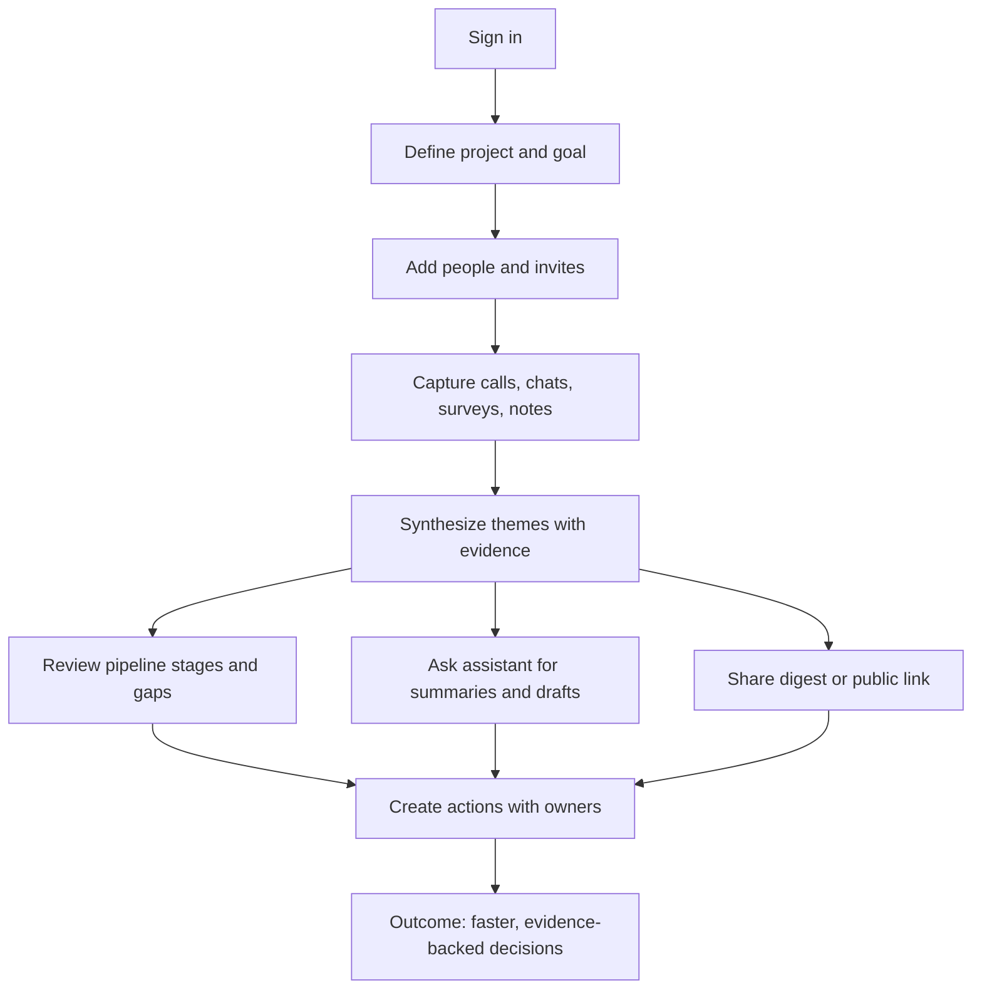

# UpSight Positioning & Experience Doc

## 1. Product + ICP

**Product**
UpSight = “shared reality from customer conversations.” Insight layer on top of calls, notes, tickets, and docs.

**Primary ICP**
B2B SaaS companies (20–500 employees) with distributed teams across product, sales, and CS who:

- Run frequent customer conversations.
- Keep data in many tools.
- Need one place to turn talk into action.

**Secondary personas**

- **Sales / CS / RevOps leaders**
  Need one source of truth on what customers say across deals and accounts.
- **Product / UX / Research leads**
  Want a steady, lightweight insight engine, not one-off studies.

---

## 2. Core Problem & Promise

**Problem (knife sentence)**
Teams log calls like a CRM, but conversations, tickets, and notes stay split across tools and AI slop, so pipeline, product, and CS choices still ride on opinions.

**Symptoms**

- Evidence sits in call tools, docs, tickets, and DMs with no shared map.
- AI summaries are ungrounded text with no receipts to trust.
- Leaders cannot see gaps in the sales process, handoffs, or pipeline health.
- Distributed teams and partners argue over “who heard what” and redo discovery.

**Promise / Value prop**

> UpSight is a trustable, verifiable conversation CRM: it ingests every source, grounds AI in receipts, and shows pipeline, product, and CS what is real—so teams act together, not on hunches.

**Key outcomes**

- **Grounded clarity** – AI stays tied to quotes, clips, and tickets you can verify.
- **Pipeline and process health** – find gaps in stages, handoffs, and follow-ups.
- **Shared action** – insights roll into tasks with owners, due dates, and receipts.
- **Less noise** – one place to work instead of scattered note-takers and slides.
- **Better sales engagement** – clear asks, follow-ups, and gaps by stage keep deals moving.
- **Stronger marketing and product choices** – research-backed personas, themes, and content.

---

## 3. Key User Stories

- **Product/Research lead:** Start a project, run five calls, and share a digest with clips in one day.
- **CS leader:** Spot churn signals this week and share a plan with account owners.
- **AE/AM:** Prep for a meeting with one view of quotes, blockers, past actions, and current stage gaps.
- **RevOps:** Publish a public link for a theme or insight without giving full app access; track pipeline risks by stage.
- **Partner manager:** Give partners a safe view of insights and actions so they stay aligned without new tools.
- **Founder:** Ask the assistant to summarize a theme, create tasks, and draft follow-ups.
- **Researcher/PM:** Generate a conversation guide and prompts, then derive themes and personas from the evidence.
- **Marketing lead:** Produce sales and marketing copy grounded in recent customer research.
- **Product lead:** Prioritize features with linked evidence, personas, and segment signals.

---

## 4. Brand Archetype + Voice

**Primary archetype: Guide / Sage**

- Calm, experienced operator.
- Explains the mess in simple terms.
- Evidence-based, not hype.
- You (user) are the hero; UpSight is the guide.

**Voice**

- Sound like a seasoned Head of Product / RevOps.
- Plain language; low drama.
- “Here’s what’s really happening and what to do next.”

**Do**

- “Here’s what changed this week in your customer conversations.”
- “These three themes keep showing up in mid-market calls.”
- “Start with one project and five conversations.”

**Don’t**

- “Crush your market with AI superpowers.”
- “Dominate every conversation with magical insight.”

---

## 5. Mental Model

**Loop:** `Prepare → Connect → Collect → Synthesize → Act`

This is the *story spine* for website copy, onboarding, navigation, and empty states.

### 5.1 Prepare – Align what you’re trying to learn

- Define projects around decisions (e.g. churn, new segment, pricing).
- Capture goals, bets, and decision questions.
- Generate interview guides and surveys tied to those goals.

**Pain killed:** random conversations with no clear purpose.

### 5.2 Connect – Recruit the right voices, humanely

- Manage people and orgs to learn from.
- Invite via email, links, embedded forms.
- Offer choice of mode: survey, bot chat, live call.
- Handle incentives and time expectations.

**Pain killed:** ad-hoc recruiting in inboxes; no system of “who we spoke with and why.”

### 5.3 Collect – Capture conversations and context in one place

- Ingest recordings, transcripts, notes, tickets, docs.
- Auto-tag by person, account, project, goal.
- Keep raw evidence attached to its source.

**Pain killed:** hunting across many tools for “what did they say?”

### 5.4 Synthesize – From noise to shared signal

- AI groups evidence into themes tied to goals.
- Per-role lenses:
  - Sales → deal blockers, objections, triggers.
  - Product → feature gaps, UX issues, unmet needs.
  - CS → churn risks, success patterns.
- Weekly digests and alerts instead of static reports.

**Pain killed:** manual deck/Notion synthesis; monthly “what did we learn?” fire drills.

### 5.5 Act – Turn insight into owned next steps

- Create actions directly from insights.
- Assign owners and time windows.
- Keep evidence attached (quotes, clips, docs).
- Agentic AI drafts outreach, experiments, briefs; humans approve.

**Pain killed:** insights dying in docs/slide decks.

---

## 6. Information Architecture (IA)

Top-level nav in plain language, mapped to the loop:

- **Home** – digest of changes, tasks, and alerts.
- **Projects** – goals, guides, and active work.
- **People** – contacts, orgs, roles, and recruiting.
- **Interviews** – live calls, bot chats, and surveys by project; first-class conversations.
- **Evidence** – recordings, transcripts, notes, tickets, docs; multi-source inputs.
- **Pipeline** – opportunities, stages, gaps, and handoff health.
- **Insights** – themes, findings, and public links with receipts.
- **Actions** – tasks, experiments, playbooks, and owners.
- **Library** – templates for guides, invites, briefs, and emails.
- **Settings** – team, connections, and permissions.

### 6.1 IA Table

| Step      | Nav         | Primary owner(s)               | Key artifacts                                       |
|-----------|-------------|---------------------------------|-----------------------------------------------------|
| Prepare   | Projects    | Founder, PM, RevOps, CS lead   | Projects, decision questions, goals, guides         |
| Connect   | People      | Sales, CS, PM, founder         | People, orgs, invites, recruiting templates         |
| Collect   | Interviews / Evidence | Anyone talking to customers    | Calls, chats, surveys, recordings, transcripts, notes, tickets |
| Synthesize| Insights    | Product, RevOps, leadership    | Themes, insights, digests, public links with receipts|
| Act       | Actions / Pipeline | Managers and ICs across teams  | Tasks, experiments, playbooks, pipeline stages with owners and dates |
| Support   | Library / Settings | Ops, admins                   | Templates, connections, permissions                  |

### 6.2 IA Diagram (Mermaid)

---

## 7. Key Flows

### 7.1 Run a discovery sprint (5 conversations)

1. **Create project** – add name, decision question, goal; UpSight suggests segments and draft guides.
2. **Add people** – import from CRM or add contacts; UpSight suggests ideal profiles.
3. **Invite participants** – pick survey, bot chat, or live call templates; send links or emails.
4. **Capture evidence** – calls recorded and transcribed; bot/survey answers stored as structured evidence; manual notes attached.
5. **Generate insights** – click “Analyze latest evidence”; merge or rename themes; pin and share with receipts.
6. **Create actions** – from an insight, create a task with owner and time window; AI drafts outreach, briefs, or experiments.

### 7.2 Share an insight safely

1. Select an insight and choose “Share.”
2. Create a public link with time-boxed access and visible receipts.
3. Send to stakeholders; see opens and comments.
4. Pull comments back into the insight thread and update the action list.

### 7.3 Handle churn risk from signals

1. Support ticket or call lands in Evidence with account and person tags.
2. UpSight flags churn signals in Insights with quotes and clips.
3. CS lead reviews, assigns an action, and drafts outreach via the assistant.
4. Track follow-up tasks and see status in Actions and Project view.

### 7.4 Work with the assistant

1. Ask the assistant for “top three themes for mid-market churn.”
2. Assistant cites evidence and proposes tasks or emails.
3. User accepts, edits, or declines; changes write back to Insights and Actions.

### 7.5 Create conversation guides and prompts

1. Define the goal and audience in a project.
2. UpSight drafts an interview or call guide with prompts tied to goals and personas.
3. User edits tone and length; save to Library and share with the team.
4. Use the guide in live calls, chats, or surveys; evidence stays linked to prompts.

### 7.6 Capture, analyze, and enrich with market data

1. Ingest calls, chats, tickets, and notes for the project.
2. Pull in market/competitive notes or links; UpSight grounds them to accounts and segments.
3. Analysis stays tied to receipts so anyone can verify claims.

### 7.7 Derive themes, personas, and segments from evidence

1. Run “Analyze latest evidence.”
2. UpSight groups themes and suggests personas/segments using receipts.
3. User merges or edits; personas stay linked to quotes, clips, and accounts.

### 7.8 Generate research-grounded sales and marketing material

1. Pick an insight, persona, or theme.
2. Ask for a draft email, call script, or one-pager; UpSight cites evidence.
3. Edit and approve; share via public link or copy to your tools.

### 7.9 Spot pipeline gaps and fix handoffs

1. UpSight shows pipeline stages with recent signals and missing follow-ups.
2. Gaps highlight stalled stages, weak next steps, or missing contacts.
3. AE/CS/RevOps reviews grounded receipts (quotes, tickets, notes).
4. Create actions to close gaps; track status by stage with owners and dates.

### 7.10 Prioritize features with evidence

1. Product lead opens a project backlog.
2. Link features to themes, personas, and segments with receipts.
3. UpSight ranks by impact signals (frequency, segment value, pipeline effect).
4. Create actions or briefs for the top picks.

### 7.11 Additional flows

- Add notes or docs to people, orgs, or projects to keep context together.
- Create questions for external feedback via text, voice, or scheduled meetings.
- Create or edit tasks by voice/text, assign owners and deadlines, debate priorities with the assistant.
- Create opportunities and manage pipeline stages like a focused, conversation-first CRM.

### 7.12 High-Level Flow Diagram (Mermaid)

---

## 8. Landing Page Outline (Externally Facing)

### Hero

- **Headline:** “Turn customer conversations into shared reality”
- **Subheadline:** “UpSight connects your calls, notes, and feedback into one insight layer for sales, product, and CS—so everyone acts on the same customer truth.”
- **Primary CTA:** “Start a free discovery project”
- **Secondary CTA:** “Watch 2-minute demo”

### Problem section

- Title: “You talk to customers all day. Insight is still scattered.”
- Bullets: Calls/notes/tickets/AI summaries in silos.
- Outcome: repeated discovery, slow decisions, “we heard…” arguments.

### What UpSight does

Three outcomes: Clarity, Alignment, Action.

### How it works: 5-step loop

Short cards or horizontal steps corresponding to Prepare → Connect → Collect → Synthesize → Act.

### For whom

Three columns: Founders & Product, Sales & CS, RevOps & Research.

### Humane recruiting differentiator

Explain “3 ways to share feedback” pattern and respect for customer time.

### Final CTA

“Start with one project and five conversations.”

---

## 9. Design Principles

- **Fast, personalized ROI** – choose your own path with soft onboarding.
- **Human-first, AI-assisted** – AI proposes; humans decide.
- **Easy to read, strong signal** – better than generic GPT output without overload.
- **Evidence-backed** – every insight shows its receipts.
- **Right time, right depth** – TL;DR first, detail on demand.
- **Shared source, personal lens** – one truth, tailored views.
- **Guide/Sage tone** – calm, clear, low ego.
