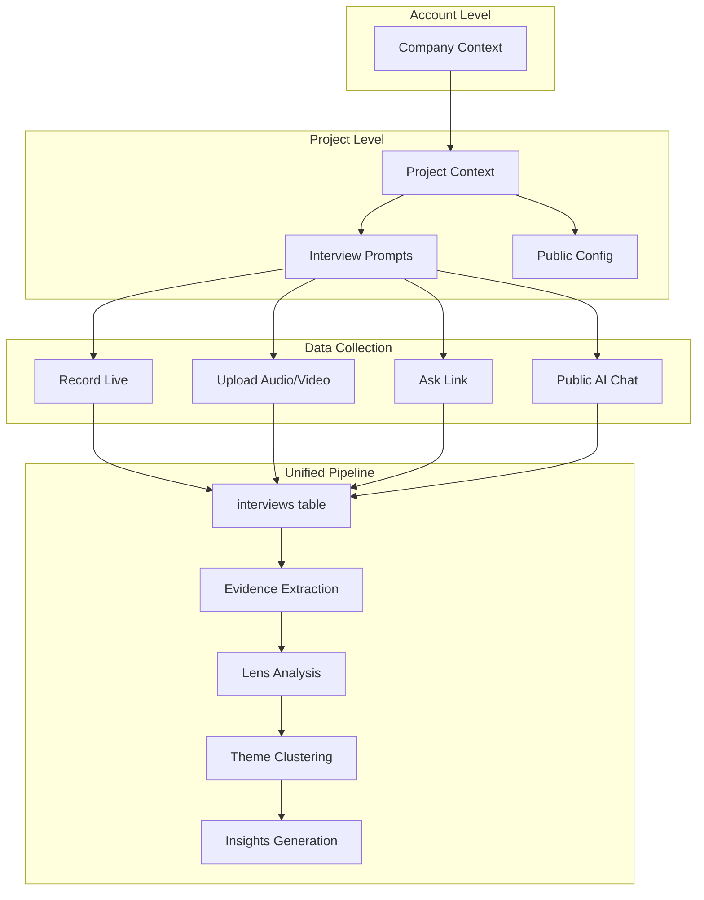
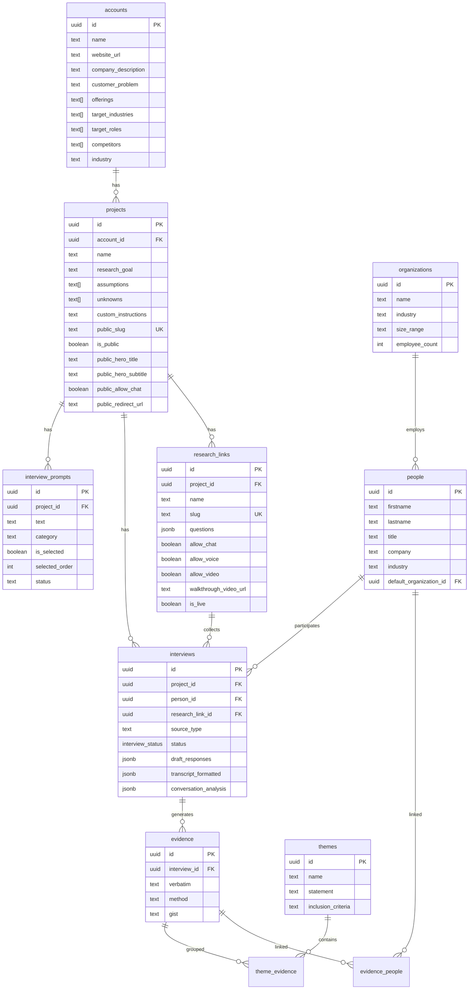

# Unified Conversation Architecture

> **Status:** Implementation in progress
> **Updated:** 2025-01-07
> **Created:** 2024-12-26

## Overview

This document describes the unified architecture for handling all conversation data—whether from recorded interviews, uploaded transcripts, public "Ask" links, or AI chat conversations. The core insight is that **all of these are conversations** and should flow through a single analysis pipeline via the `interviews` table.

### Terminology

| Term | Definition |
| ---- | ---------- |
| **Ask** | A shareable link (`/ask/:slug`) that collects responses from external participants using your project's prompts |
| **Prompts** | Questions defined in `interview_prompts` table, used for interviews and Ask links |
| **Conversation** | Any response collected—interview, upload, or Ask submission—stored in `interviews` table |

## Problem Statement

### Before: Fragmented Systems

```text
┌─────────────────────────────────────────────────────────────────────┐
│ PREVIOUS: 3 Separate Systems                                        │
├─────────────────────────────────────────────────────────────────────┤
│                                                                      │
│  interviews ──────────────> evidence ──────> lenses ──> insights    │
│     (audio/video)              ✓              ✓           ✓         │
│                                                                      │
│  research_links ──> research_link_responses                          │
│     (questions JSONB)    (answers JSONB)     ✗           ✗          │
│                          NO ANALYSIS PIPELINE!                       │
│                                                                      │
│  interview_prompts                                                   │
│     (internal planning)  NOT CONNECTED TO EITHER                     │
│                                                                      │
└─────────────────────────────────────────────────────────────────────┘
```

**Issues:**

- External responses never got analyzed by lenses
- Questions stored in two places (JSONB + table)
- External respondents weren't tracked as People
- No evidence extraction from external responses
- Duplicate code for similar functionality

### After: Unified Pipeline



## Architecture Decision: Consolidate into Interviews Table

### Rationale

The `interviews` table already has most capabilities needed for Ask responses:

| Need | interviews table | Notes |
| ---- | ---------------- | ----- |
| Track completion | `status = 'draft'` vs `'uploaded'` | Enum already supports this |
| Response mode | `source_type` field | Add: `survey_form`, `survey_chat`, `survey_voice` |
| Video attachment | `media_url` | Already exists |
| Person link | `person_id` FK | Already exists |
| Link config | Add `research_link_id` FK | New nullable column |
| Unique per link | Constraint on (research_link_id, person_id) | New constraint |
| In-progress saves | `draft_responses` JSONB | Already added in survey_support.sql |

### Decision: Deprecate research_link_responses

Instead of maintaining two parallel tables, Ask responses should create `interview` records directly:

- `source_type = 'survey_form' | 'survey_chat' | 'survey_voice'`
- `research_link_id` FK links to Ask link configuration
- `status = 'draft'` for in-progress, `'uploaded'` on completion
- `person_id` links to respondent (find or create by email)
- Existing analysis pipeline triggers automatically

### Migration Path

1. Add `research_link_id` column to interviews
2. Add unique constraint on (research_link_id, person_id)
3. Migrate existing `research_link_responses` to interviews
4. Update save/start APIs to use interviews
5. Deprecate and eventually drop `research_link_responses`

## Data Model



## Schema Changes

### interviews (New Columns)

```sql
-- Link to Ask link configuration (null for non-Ask interviews)
ALTER TABLE interviews ADD COLUMN IF NOT EXISTS
  research_link_id uuid REFERENCES research_links(id) ON DELETE SET NULL;

-- Ensure one response per person per Ask link
CREATE UNIQUE INDEX IF NOT EXISTS uniq_interviews_research_link_person
  ON interviews(research_link_id, person_id)
  WHERE research_link_id IS NOT NULL;

-- Index for finding Ask responses
CREATE INDEX IF NOT EXISTS idx_interviews_research_link_id
  ON interviews(research_link_id)
  WHERE research_link_id IS NOT NULL;
```

### source_type Values (Extended)

The `interviews.source_type` column now supports:

| Value | Description |
| ----- | ----------- |
| `realtime_recording` | Live recorded interview |
| `audio_upload` | Uploaded audio file |
| `video_upload` | Uploaded video file |
| `document_upload` | Uploaded document |
| `transcript_paste` | Pasted transcript text |
| `survey_form` | Ask link form submission |
| `survey_chat` | Ask link AI chat conversation |
| `survey_voice` | Ask link voice conversation |

## Demographic Questions

### Design Principles

1. **Optional by default** - Respondents aren't burdened; creators opt-in to require
2. **Upfront, not mixed** - Demographic questions come first, before research questions
3. **Field-mapped** - Answers auto-populate person/organization fields
4. **Included by default** - Template starts with demographics; creators can remove

### Question Schema Extension

```typescript
interface ResearchLinkQuestion {
  id: string;
  prompt: string;
  type: "short_text" | "long_text" | "single_choice" | "multiple_choice";
  required?: boolean; // Default: false (optional)
  is_demographic?: boolean; // Default: false
  field_mapping?: {
    entity: "person" | "organization";
    field: string; // e.g., "title", "company", "industry", "size_range"
  };
}
```

### Default Demographic Template

When creating a new Ask link, include these questions by default (all optional, user can remove or mark required):

```typescript
const DEFAULT_DEMOGRAPHIC_QUESTIONS: ResearchLinkQuestion[] = [
  {
    id: "demo_name",
    prompt: "What's your name?",
    type: "short_text",
    is_demographic: true,
    field_mapping: { entity: "person", field: "name" },
  },
  {
    id: "demo_title",
    prompt: "What's your job title?",
    type: "short_text",
    is_demographic: true,
    field_mapping: { entity: "person", field: "title" },
  },
  {
    id: "demo_company",
    prompt: "What company do you work for?",
    type: "short_text",
    is_demographic: true,
    field_mapping: { entity: "organization", field: "name" },
  },
  {
    id: "demo_company_size",
    prompt: "How many employees at your company?",
    type: "single_choice",
    options: ["1-10", "11-50", "51-200", "201-1000", "1000+"],
    is_demographic: true,
    field_mapping: { entity: "organization", field: "size_range" },
  },
  {
    id: "demo_industry",
    prompt: "What industry are you in?",
    type: "short_text",
    is_demographic: true,
    field_mapping: { entity: "person", field: "industry" },
  },
];
```

### Organization Matching Logic

When processing company name from demographic questions:

1. **Email domain match first** - Extract domain from respondent email, match to existing orgs
2. **Name match second** - Fuzzy match on organization name
3. **Create if no match** - Create new organization record

Existing utilities: `app/features/people/deduplicate.ts` has normalization functions. `app/mastra/tools/manage-person-organizations.ts` has org linking logic.

## Person Detail Page Enhancement

### Design Goals

- Support both **research** and **sales** perspectives
- Surface key takeaways prominently
- Hide complexity behind tabs
- Enable actions: create opportunities, add notes, link to orgs

### Tab Structure

```text
Person: Sarah Chen
[Overview] [Details] [Evidence] [Activity]

────────────────────────────────────────────────────────────────────
OVERVIEW TAB (default - high signal)
────────────────────────────────────────────────────────────────────
┌─────────────────────────────────────────────────────────────────┐
│ Quick Stats                                                      │
│ PM at Acme Corp • 3 conversations • Last: Jan 6, 2025           │
│ [+ Add Note] [+ Create Opportunity]                              │
└─────────────────────────────────────────────────────────────────┘

┌─────────────────────────────────────────────────────────────────┐
│ Key Takeaways (AI-generated summary)                            │
│ • Struggling with onboarding - almost gave up                   │
│ • Interested in Slack integration                               │
│ • Would recommend (NPS: 7)                                      │
│ • Decision maker for tools under $500/mo                        │
└─────────────────────────────────────────────────────────────────┘

┌─────────────────────────────────────────────────────────────────┐
│ Organization: Acme Corp                                          │
│ 51-200 employees • SaaS • Series B                              │
│ [View Organization]                                              │
└─────────────────────────────────────────────────────────────────┘

┌─────────────────────────────────────────────────────────────────┐
│ Recent Evidence (3 most recent)                                 │
│ [📹 Interview] "The onboarding was confusing..."    Jan 5       │
│ [📋 Survey] "Took me 3 days to figure out..."       Jan 6       │
│ [📋 Survey] "Would love Slack integration"          Jan 6       │
│ [View all evidence →]                                           │
└─────────────────────────────────────────────────────────────────┘

┌─────────────────────────────────────────────────────────────────┐
│ Open Opportunities                                               │
│ Acme Corp - Expansion • $5,000 ARR • Stage: Discovery           │
│ [View Opportunity]                                               │
└─────────────────────────────────────────────────────────────────┘

────────────────────────────────────────────────────────────────────
DETAILS TAB (demographics, contact info)
────────────────────────────────────────────────────────────────────
All current fields: name, title, company, email, phone, LinkedIn,
location, industry, segment, etc.

────────────────────────────────────────────────────────────────────
EVIDENCE TAB
────────────────────────────────────────────────────────────────────
All evidence linked to this person via evidence_people junction
Filterable by source: Interview, Survey, Note
Shows source badge and link to original conversation

────────────────────────────────────────────────────────────────────
ACTIVITY TAB
────────────────────────────────────────────────────────────────────
Timeline of all interactions:
- Interviews conducted
- Ask link responses submitted
- Notes added
- Opportunities created/updated
```

## Theme/Insights View Enhancement

### Source Badges

All evidence displays show source type badge:

- 📹 Interview
- 📋 Survey (Ask link)
- 📝 Note
- 🎙️ Voice Memo

### Theme Detail with Traceability

```text
┌─────────────────────────────────────────────────────────────────┐
│ Theme: "Users struggle with initial setup"                       │
│ 8 evidence pieces • 5 people                                    │
├─────────────────────────────────────────────────────────────────┤
│ Sources: 3 Interviews • 4 Surveys • 1 Note                      │
├─────────────────────────────────────────────────────────────────┤
│ Supporting Evidence                                              │
│                                                                  │
│ ┌─────────────────────────────────────────────────────────────┐ │
│ │ 📹 Interview                                    Sarah Chen   │ │
│ │ "The onboarding was really confusing..."                    │ │
│ │ [View Interview]                               Jan 5, 2025  │ │
│ └─────────────────────────────────────────────────────────────┘ │
│                                                                  │
│ ┌─────────────────────────────────────────────────────────────┐ │
│ │ 📋 Survey                                      Mike Johnson │ │
│ │ "Took me 3 days to figure out basic features"               │ │
│ │ [View Response]                                Jan 6, 2025  │ │
│ └─────────────────────────────────────────────────────────────┘ │
└─────────────────────────────────────────────────────────────────┘
```

## Analysis Pipeline Flow

### Ask Response Completion Trigger

When an Ask response is completed:

```text
1. Update interview.status = 'uploaded'
   ↓
2. Existing trigger: Extract evidence from transcript_formatted
   ↓
3. Create evidence_people junction (NEW - currently missing)
   ↓
4. Trigger embedding generation for semantic search
   ↓
5. Apply conversation lenses (automatic - interview exists)
   ↓
6. Theme clustering suggests themes from evidence
   ↓
7. Evidence appears in unified views with source badges
```

### Currently Missing (To Implement)

1. **evidence_people junction** - Create on Ask response completion
2. **Source badges in UI** - Add to evidence displays
3. **Person page tabs** - Reorganize layout
4. **Demographic field mapping** - Process on save

## Migration Plan

### Phase 1: Schema Consolidation

- [ ] Add `research_link_id` column to interviews
- [ ] Add unique constraint (research_link_id, person_id)
- [ ] Update source_type documentation

### Phase 2: API Updates

- [ ] Update save API to create/update interviews directly
- [ ] Update start API to create draft interview
- [ ] Add evidence_people creation on completion
- [ ] Add demographic field mapping processing

### Phase 3: Data Migration

- [ ] Migrate existing research_link_responses to interviews
- [ ] Backfill evidence_people for existing responses
- [ ] Verify all lenses run on migrated data

### Phase 4: UI Updates

- [ ] Add source badges to evidence displays
- [ ] Reorganize person detail page into tabs
- [ ] Add demographic question template to Ask link editor
- [ ] Update theme views with source breakdown

### Phase 5: Cleanup

- [ ] Deprecate research_link_responses table
- [ ] Remove old API routes
- [ ] Drop table after verification period

## Risk Mitigation

| Risk | Mitigation |
| ---- | ---------- |
| Interview orphans from abandoned responses | Cleanup job for draft interviews > 30 days old |
| Person duplicates from email casing | Always lowercase, unique index on lower(email) |
| Organization duplicates | Match by email domain first, then fuzzy name match |
| Data loss on tab close | Save on beforeunload + on "Next" click |
| Partial analysis | Only trigger on status='uploaded' |
| Public route auth | Admin client server-side, strict validation |

## Confidence Assessment

**High Confidence (90%+):**

- Consolidating into interviews table is the right approach
- Conversation lenses will work automatically once interviews exist
- Theme clustering will pick up Ask response evidence
- Demographic questions with field mapping is sound design

**Medium Confidence (70-90%):**

- Tab-based person page will improve UX (may need iteration)
- Default demographics included vs opt-in (user preference)
- Organization matching algorithm completeness

**Questions Resolved:**

1. ✅ Yes, create interview records for Ask responses - enables full pipeline
2. ✅ Demographic questions should be upfront, separate from research questions
3. ✅ Auto-match organizations by email domain first, then name
4. ✅ evidence_people junction is needed - currently missing link
