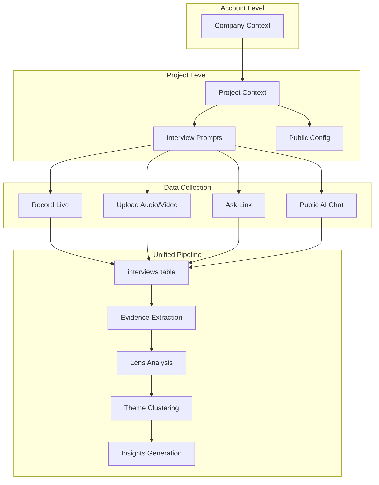
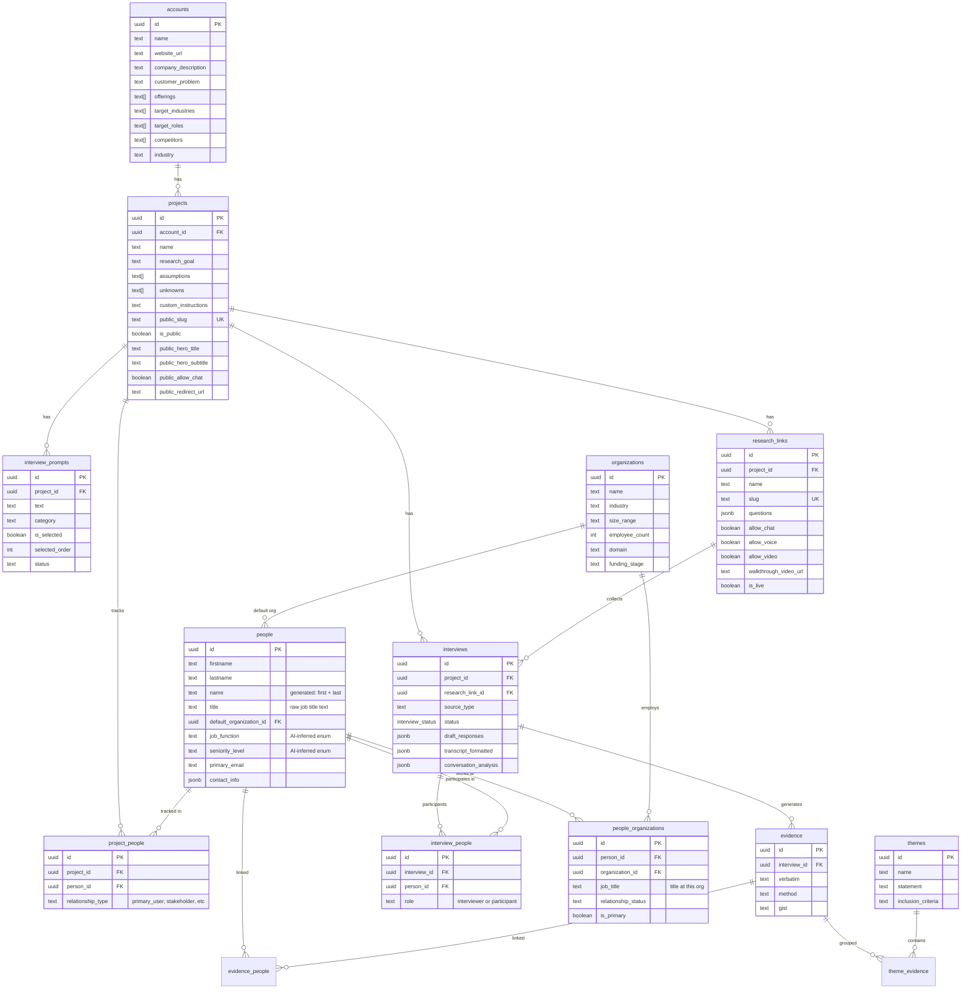
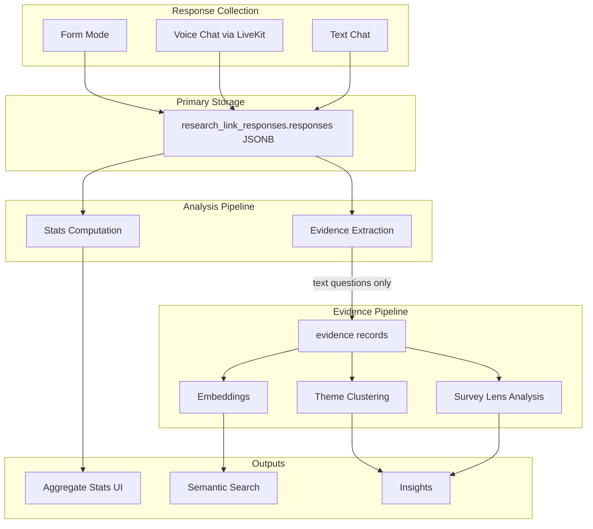
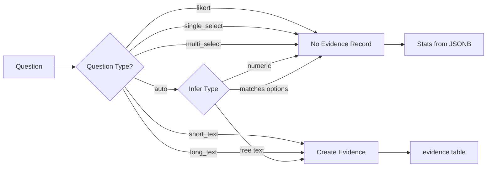
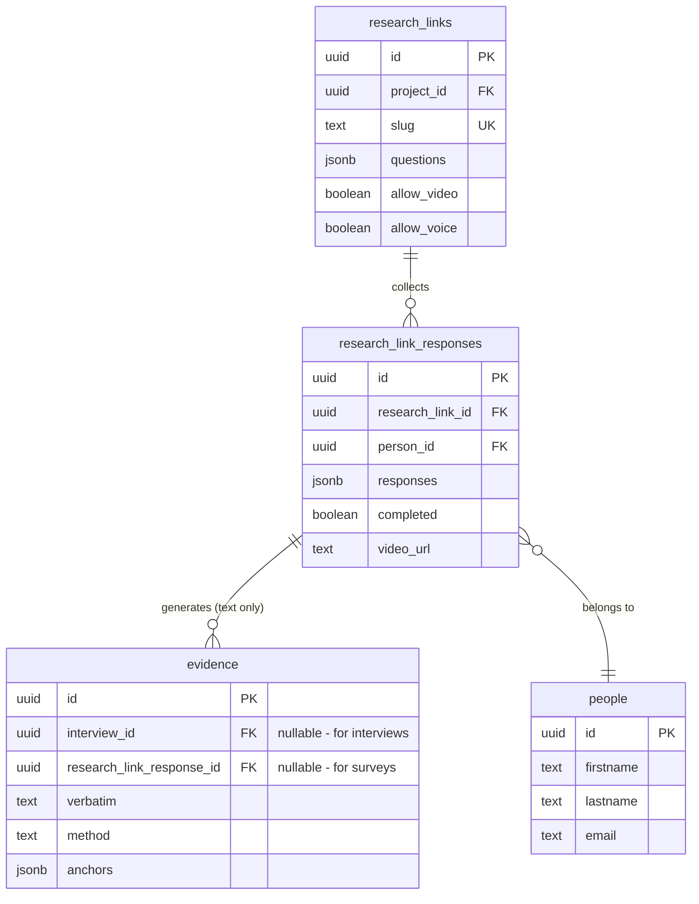
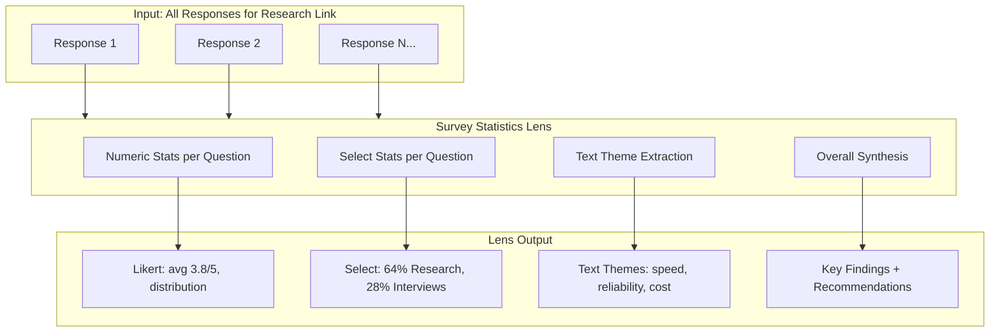
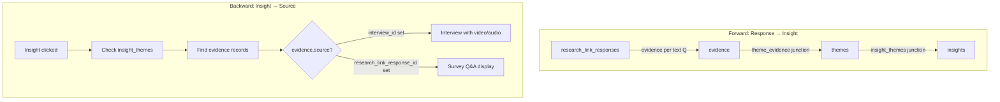

# Unified Conversation Architecture

> **Status:** Phase 1 complete (schema), Phase 2 in progress
> **Updated:** 2026-01-13
> **Created:** 2024-12-26

## Overview

This document describes the unified architecture for handling all conversation data—whether from recorded interviews, uploaded transcripts, public "Ask" links, or AI chat conversations. The core insight is that **all of these are conversations** and should flow through a single analysis pipeline via the `interviews` table.

### Terminology

| Term | Definition |
| ---- | ---------- |
| **Ask** | A shareable link (`/ask/:slug`) that collects responses from external participants using your project's prompts |
| **Prompts** | Questions defined in `interview_prompts` table, used for interviews and Ask links |
| **Conversation** | Any response collected—interview, upload, or Ask submission—stored in `interviews` table |

## Problem Statement

### Before: Fragmented Systems

```text
┌─────────────────────────────────────────────────────────────────────┐
│ PREVIOUS: 3 Separate Systems                                        │
├─────────────────────────────────────────────────────────────────────┤
│                                                                      │
│  interviews ──────────────> evidence ──────> lenses ──> insights    │
│     (audio/video)              ✓              ✓           ✓         │
│                                                                      │
│  research_links ──> research_link_responses                          │
│     (questions JSONB)    (answers JSONB)     ✗           ✗          │
│                          NO ANALYSIS PIPELINE!                       │
│                                                                      │
│  interview_prompts                                                   │
│     (internal planning)  NOT CONNECTED TO EITHER                     │
│                                                                      │
└─────────────────────────────────────────────────────────────────────┘
```

**Issues:**

- External responses never got analyzed by lenses
- Questions stored in two places (JSONB + table)
- External respondents weren't tracked as People
- No evidence extraction from external responses
- Duplicate code for similar functionality

### After: Unified Pipeline



## Architecture Decision: Consolidate into Interviews Table

### Rationale

The `interviews` table already has most capabilities needed for Ask responses:

| Need | interviews table | Notes |
| ---- | ---------------- | ----- |
| Track completion | `status = 'draft'` vs `'uploaded'` | Enum already supports this |
| Response mode | `source_type` field | Add: `survey_form`, `survey_chat`, `survey_voice` |
| Video attachment | `media_url` | Already exists |
| Person link | `person_id` FK | Already exists |
| Link config | Add `research_link_id` FK | New nullable column |
| Unique per link | Constraint on (research_link_id, person_id) | New constraint |
| In-progress saves | `draft_responses` JSONB | Already added in survey_support.sql |

### Decision: Keep research_link_responses (Revised)

> **Note:** This section was revised on 2026-01-13. The original plan to migrate surveys into the `interviews` table was reconsidered. Survey responses are fundamentally different from interviews (no audio/video transcript, structured Q&A format) and forcing them into the interviews model adds complexity without benefit.

**Current Architecture:**

| Data | Storage Location |
|------|------------------|
| Survey answers | `research_link_responses.responses` JSONB |
| Text evidence (for themes) | `evidence` table with `research_link_response_id` FK |
| Interview transcripts | `interviews.transcript_formatted` |
| Interview evidence | `evidence` table with `interview_id` FK |

**Why NOT create interview records for surveys:**

1. Surveys don't have transcripts or media - `transcript_formatted` would be misused
2. Existing interview lenses (Empathy Map, Research Lens) expect speaker turns, not Q&A
3. Creating interview records would bloat the interviews table with non-interview data
4. Survey statistics (likert averages, select percentages) are computed directly from JSONB

**What we DO:**

- Keep `research_link_responses` table as-is
- Create `evidence` records for text questions only (for theme clustering)
- Create new Survey Statistics Lens for aggregate analysis
- Link evidence to responses via new FK `evidence.research_link_response_id`

See "Ask Link Evidence & Lens Architecture" section below for full details.

## Data Model



> **Schema cleanup note (2026-02-09):** The `people` table previously had overlapping fields
> (`role`, `company`, `industry`, `occupation`, `segment`) that caused confusion.
> Phases 1-2 renamed ambiguous junction columns (`people_organizations.role` -> `job_title`,
> `project_people.role` -> `relationship_type`), deprecated `people.role`, and fixed facet kind
> mismatches. Phase 3 will remove `people.company` in favor of `default_organization_id` FK.
> See `_bmad-output/schema-cleanup-people-table.md` for full spec.

## Schema Changes

### interviews (New Columns)

```sql
-- Link to Ask link configuration (null for non-Ask interviews)
ALTER TABLE interviews ADD COLUMN IF NOT EXISTS
  research_link_id uuid REFERENCES research_links(id) ON DELETE SET NULL;

-- Ensure one response per person per Ask link
CREATE UNIQUE INDEX IF NOT EXISTS uniq_interviews_research_link_person
  ON interviews(research_link_id, person_id)
  WHERE research_link_id IS NOT NULL;

-- Index for finding Ask responses
CREATE INDEX IF NOT EXISTS idx_interviews_research_link_id
  ON interviews(research_link_id)
  WHERE research_link_id IS NOT NULL;
```

### source_type Values (Extended)

The `interviews.source_type` column now supports:

| Value | Description |
| ----- | ----------- |
| `realtime_recording` | Live recorded interview |
| `audio_upload` | Uploaded audio file |
| `video_upload` | Uploaded video file |
| `document_upload` | Uploaded document |
| `transcript_paste` | Pasted transcript text |
| `survey_form` | Ask link form submission |
| `survey_chat` | Ask link AI chat conversation |
| `survey_voice` | Ask link voice conversation |

## Demographic Questions

### Design Principles

1. **Optional by default** - Respondents aren't burdened; creators opt-in to require
2. **Upfront, not mixed** - Demographic questions come first, before research questions
3. **Field-mapped** - Answers auto-populate person/organization fields
4. **Included by default** - Template starts with demographics; creators can remove

### Question Schema Extension

```typescript
interface ResearchLinkQuestion {
  id: string;
  prompt: string;
  type: "short_text" | "long_text" | "single_choice" | "multiple_choice";
  required?: boolean; // Default: false (optional)
  is_demographic?: boolean; // Default: false
  field_mapping?: {
    entity: "person" | "organization";
    field: string; // e.g., "title", "company", "industry", "size_range"
  };
}
```

### Default Demographic Template

When creating a new Ask link, include these questions by default (all optional, user can remove or mark required):

```typescript
const DEFAULT_DEMOGRAPHIC_QUESTIONS: ResearchLinkQuestion[] = [
  {
    id: "demo_name",
    prompt: "What's your name?",
    type: "short_text",
    is_demographic: true,
    field_mapping: { entity: "person", field: "name" },
  },
  {
    id: "demo_title",
    prompt: "What's your job title?",
    type: "short_text",
    is_demographic: true,
    field_mapping: { entity: "person", field: "title" },
  },
  {
    id: "demo_company",
    prompt: "What company do you work for?",
    type: "short_text",
    is_demographic: true,
    field_mapping: { entity: "organization", field: "name" },
  },
  {
    id: "demo_company_size",
    prompt: "How many employees at your company?",
    type: "single_choice",
    options: ["1-10", "11-50", "51-200", "201-1000", "1000+"],
    is_demographic: true,
    field_mapping: { entity: "organization", field: "size_range" },
  },
  {
    id: "demo_industry",
    prompt: "What industry are you in?",
    type: "short_text",
    is_demographic: true,
    field_mapping: { entity: "person", field: "industry" },
  },
];
```

### Organization Matching Logic

When processing company name from demographic questions:

1. **Email domain match first** - Extract domain from respondent email, match to existing orgs
2. **Name match second** - Fuzzy match on organization name
3. **Create if no match** - Create new organization record

Existing utilities: `app/features/people/deduplicate.ts` has normalization functions. `app/mastra/tools/manage-person-organizations.ts` has org linking logic.

## Person Detail Page Enhancement

### Design Goals

- Support both **research** and **sales** perspectives
- Surface key takeaways prominently
- Hide complexity behind tabs
- Enable actions: create opportunities, add notes, link to orgs

### Tab Structure

```text
Person: Sarah Chen
[Overview] [Details] [Evidence] [Activity]

────────────────────────────────────────────────────────────────────
OVERVIEW TAB (default - high signal)
────────────────────────────────────────────────────────────────────
┌─────────────────────────────────────────────────────────────────┐
│ Quick Stats                                                      │
│ PM at Acme Corp • 3 conversations • Last: Jan 6, 2025           │
│ [+ Add Note] [+ Create Opportunity]                              │
└─────────────────────────────────────────────────────────────────┘

┌─────────────────────────────────────────────────────────────────┐
│ Key Takeaways (AI-generated summary)                            │
│ • Struggling with onboarding - almost gave up                   │
│ • Interested in Slack integration                               │
│ • Would recommend (NPS: 7)                                      │
│ • Decision maker for tools under $500/mo                        │
└─────────────────────────────────────────────────────────────────┘

┌─────────────────────────────────────────────────────────────────┐
│ Organization: Acme Corp                                          │
│ 51-200 employees • SaaS • Series B                              │
│ [View Organization]                                              │
└─────────────────────────────────────────────────────────────────┘

┌─────────────────────────────────────────────────────────────────┐
│ Recent Evidence (3 most recent)                                 │
│ [📹 Interview] "The onboarding was confusing..."    Jan 5       │
│ [📋 Survey] "Took me 3 days to figure out..."       Jan 6       │
│ [📋 Survey] "Would love Slack integration"          Jan 6       │
│ [View all evidence →]                                           │
└─────────────────────────────────────────────────────────────────┘

┌─────────────────────────────────────────────────────────────────┐
│ Open Opportunities                                               │
│ Acme Corp - Expansion • $5,000 ARR • Stage: Discovery           │
│ [View Opportunity]                                               │
└─────────────────────────────────────────────────────────────────┘

────────────────────────────────────────────────────────────────────
DETAILS TAB (demographics, contact info)
────────────────────────────────────────────────────────────────────
All current fields: name, title, company, email, phone, LinkedIn,
location, industry, segment, etc.

────────────────────────────────────────────────────────────────────
EVIDENCE TAB
────────────────────────────────────────────────────────────────────
All evidence linked to this person via evidence_people junction
Filterable by source: Interview, Survey, Note
Shows source badge and link to original conversation

────────────────────────────────────────────────────────────────────
ACTIVITY TAB
────────────────────────────────────────────────────────────────────
Timeline of all interactions:
- Interviews conducted
- Ask link responses submitted
- Notes added
- Opportunities created/updated
```

## Theme/Insights View Enhancement

### Source Badges

All evidence displays show source type badge:

- 📹 Interview
- 📋 Survey (Ask link)
- 📝 Note
- 🎙️ Voice Memo

### Theme Detail with Traceability

```text
┌─────────────────────────────────────────────────────────────────┐
│ Theme: "Users struggle with initial setup"                       │
│ 8 evidence pieces • 5 people                                    │
├─────────────────────────────────────────────────────────────────┤
│ Sources: 3 Interviews • 4 Surveys • 1 Note                      │
├─────────────────────────────────────────────────────────────────┤
│ Supporting Evidence                                              │
│                                                                  │
│ ┌─────────────────────────────────────────────────────────────┐ │
│ │ 📹 Interview                                    Sarah Chen   │ │
│ │ "The onboarding was really confusing..."                    │ │
│ │ [View Interview]                               Jan 5, 2025  │ │
│ └─────────────────────────────────────────────────────────────┘ │
│                                                                  │
│ ┌─────────────────────────────────────────────────────────────┐ │
│ │ 📋 Survey                                      Mike Johnson │ │
│ │ "Took me 3 days to figure out basic features"               │ │
│ │ [View Response]                                Jan 6, 2025  │ │
│ └─────────────────────────────────────────────────────────────┘ │
└─────────────────────────────────────────────────────────────────┘
```

## Analysis Pipeline Flow

### Ask Response Completion Trigger

When an Ask response is completed:

```text
1. Update interview.status = 'uploaded'
   ↓
2. Existing trigger: Extract evidence from transcript_formatted
   ↓
3. Create evidence_people junction (NEW - currently missing)
   ↓
4. Trigger embedding generation for semantic search
   ↓
5. Apply conversation lenses (automatic - interview exists)
   ↓
6. Theme clustering suggests themes from evidence
   ↓
7. Evidence appears in unified views with source badges
```

### Currently Missing (To Implement)

1. **evidence_people junction** - Create on Ask response completion
2. **Source badges in UI** - Add to evidence displays
3. **Person page tabs** - Reorganize layout
4. **Demographic field mapping** - Process on save

## Migration Plan

### Phase 1: Schema Consolidation ✅

- [x] Add `research_link_id` column to interviews
- [x] Add unique constraint (research_link_id, person_id)
- [x] Add index for efficient Ask response lookups
- [x] Update source_type enum to include `survey_form`, `survey_chat`, `survey_voice`

**Completed:** 2026-01-07 via migration `20250107000000_interviews_research_link_support.sql`

### Phase 2: Survey Evidence Pipeline (Revised)

> **Note:** Original plan to migrate to interviews table has been revised. See "Decision: Keep research_link_responses" above.

- [ ] Add `research_link_response_id` FK to evidence table
- [ ] Update completion handler to create evidence per text question
- [ ] Add evidence_people creation on completion
- [ ] Add demographic field mapping processing

### Phase 3: Survey Lens Integration

- [ ] Create `survey-statistics` lens template
- [ ] Build stats computation from JSONB
- [ ] Build text theme extraction via BAML
- [ ] Show lens results on Ask responses page

### Phase 4: UI Updates

- [ ] Add source badges to evidence displays
- [ ] Reorganize person detail page into tabs
- [ ] Add demographic question template to Ask link editor
- [ ] Update theme views with source breakdown
- [ ] Fix AI analysis error display on responses page

## Risk Mitigation

| Risk | Mitigation |
| ---- | ---------- |
| Interview orphans from abandoned responses | Cleanup job for draft interviews > 30 days old |
| Person duplicates from email casing | Always lowercase, unique index on lower(email) |
| Organization duplicates | Match by email domain first, then fuzzy name match |
| Data loss on tab close | Save on beforeunload + on "Next" click |
| Partial analysis | Only trigger on status='uploaded' |
| Public route auth | Admin client server-side, strict validation |

## Confidence Assessment

**High Confidence (90%+):**

- Keeping research_link_responses separate from interviews is cleaner
- Survey Statistics Lens will provide aggregate analysis
- Theme clustering will pick up Ask response text evidence
- Demographic questions with field mapping is sound design

**Medium Confidence (70-90%):**

- Tab-based person page will improve UX (may need iteration)
- Default demographics included vs opt-in (user preference)
- Organization matching algorithm completeness

**Questions Resolved:**

1. ✅ Yes, create interview records for Ask responses - enables full pipeline
2. ✅ Demographic questions should be upfront, separate from research questions
3. ✅ Auto-match organizations by email domain first, then name
4. ✅ evidence_people junction is needed - currently missing link

---

## Ask Link Evidence & Lens Architecture

> **Decision:** Keep responses in `research_link_responses.responses` JSONB, but create evidence records per-question for text answers that need theme clustering. Statistics for likert/select computed directly from JSONB.

### Why This Approach?

| Data Type | Storage | Analysis Method |
|-----------|---------|-----------------|
| **Likert responses** | JSONB | Direct computation (avg, distribution) |
| **Single/Multi select** | JSONB | Direct computation (% breakdown) |
| **Text responses** | JSONB + Evidence | Theme clustering via evidence pipeline |

This avoids creating interview records for survey responses (which don't have transcripts or media) while still enabling the full evidence → theme → insight pipeline for qualitative analysis.

### Survey Evidence Data Flow



### Evidence Extraction Rules



### Entity Relationships (Survey Extension)



**Key Change:** `evidence` table gets a new nullable FK `research_link_response_id`. Evidence can come from either:
- `interview_id` (traditional interviews/recordings)
- `research_link_response_id` (survey text responses)

Constraint: Exactly one should be set per evidence record.

### Likert Ratings in Search

**Problem:** If likert/select responses don't create evidence records, how do we search them?

**Solution:** Store searchable metadata in a dedicated column on `research_link_responses`:

```sql
-- Add searchable text representation of structured responses
ALTER TABLE research_link_responses ADD COLUMN
  search_text text GENERATED ALWAYS AS (
    -- Computed from responses JSONB for full-text search
    -- E.g., "satisfaction: 4/5, use case: Research & Analysis"
  ) STORED;

CREATE INDEX idx_research_link_responses_search
  ON research_link_responses USING gin(to_tsvector('english', search_text));
```

For semantic search, the person-level embedding already captures their survey responses via the `research_link_responses` → `people` link. The Survey Lens (below) also produces searchable summaries.

### Survey Statistics Lens

A new lens template specifically for aggregate survey analysis:



**Lens Template Definition:**

```sql
INSERT INTO conversation_lens_templates (
  template_key, template_name, summary, primary_objective,
  category, template_definition, is_active, is_system
) VALUES (
  'survey-statistics',
  'Survey Statistics',
  'Aggregate analysis of survey responses',
  'Surface patterns and insights across multiple survey respondents',
  'research',
  '{
    "sections": [
      {
        "section_key": "numeric_summary",
        "section_name": "Numeric Questions",
        "fields": [
          {"field_key": "question_id", "field_type": "text"},
          {"field_key": "average", "field_type": "numeric"},
          {"field_key": "distribution", "field_type": "text_array"}
        ]
      },
      {
        "section_key": "choice_summary",
        "section_name": "Choice Questions",
        "fields": [
          {"field_key": "question_id", "field_type": "text"},
          {"field_key": "percentages", "field_type": "text_array"}
        ]
      },
      {
        "section_key": "text_themes",
        "section_name": "Open Response Themes",
        "fields": [
          {"field_key": "question_id", "field_type": "text"},
          {"field_key": "themes", "field_type": "text_array"},
          {"field_key": "representative_quotes", "field_type": "text_array"}
        ]
      },
      {
        "section_key": "overall_insights",
        "section_name": "Overall Insights",
        "fields": [
          {"field_key": "key_findings", "field_type": "text_array"},
          {"field_key": "recommendations", "field_type": "text_array"}
        ]
      }
    ],
    "aggregation_mode": "research_link"
  }'::jsonb,
  true, true
);
```

### Survey Respondent Lens (Individual)

For per-person analysis (shown on Person page):

```sql
INSERT INTO conversation_lens_templates (
  template_key, template_name, summary, primary_objective,
  category, template_definition, is_active, is_system
) VALUES (
  'survey-respondent',
  'Survey Respondent Profile',
  'AI summary of a single respondent based on their survey answers',
  'Understand who this person is and what they care about',
  'research',
  '{
    "sections": [
      {
        "section_key": "respondent_summary",
        "section_name": "Respondent Summary",
        "fields": [
          {"field_key": "profile_summary", "field_type": "text"},
          {"field_key": "key_pain_points", "field_type": "text_array"},
          {"field_key": "key_goals", "field_type": "text_array"},
          {"field_key": "notable_quotes", "field_type": "text_array"}
        ]
      }
    ],
    "analysis_mode": "single_response"
  }'::jsonb,
  true, true
);
```

### Lenses on Survey Responses: What Works?

| Lens | Works on Surveys? | Notes |
|------|-------------------|-------|
| Empathy Map | ✅ Yes | Extracts pains/goals from text evidence |
| Research Lens | ✅ Yes | Answers DQs from survey responses |
| Sales BANT | ⚠️ Limited | Only if survey asks budget/timeline questions |
| Survey Statistics | ✅ Yes | **New lens** - aggregate stats + themes |
| Survey Respondent | ✅ Yes | **New lens** - per-person summary |

### Navigation Stack: Forward and Backward



**UI Implication:** When displaying evidence, check which FK is set:
- `interview_id` → Show video clip with timestamp seek
- `research_link_response_id` → Show Q&A card with question + answer

### Voice Chat via LiveKit

**Confirmed:** Voice chat responses are stored identically to form responses.
- `saveResearchResponseTool` saves each answer to `research_link_responses.responses` JSONB
- No audio is stored for chat mode - only transcribed text
- Same evidence extraction path as form submissions

### Implementation Phases

#### Phase 1: Evidence Per-Question (Foundation)
1. Add `research_link_response_id` FK to evidence table
2. Update completion handler to create evidence per text question
3. Link evidence to person via `evidence_people` junction
4. Update Person page to display survey evidence properly

#### Phase 2: Survey Statistics Lens
1. Create `survey-statistics` lens template in DB
2. Build stats computation (runs directly on JSONB)
3. Build text theme extraction (via BAML on evidence)
4. Store results in `conversation_lens_analyses`
5. Show lens results on Ask responses page

#### Phase 3: Survey Respondent Lens
1. Create `survey-respondent` lens template
2. Build BAML function for single-response profiling
3. Trigger on response completion
4. Show on Person page under their survey responses

#### Phase 4: Full Integration
1. Theme clustering includes survey text evidence
2. Insights can cite survey evidence with proper display
3. Project dashboard shows survey-derived insights
4. Cross-source analysis (interviews + surveys together)

### Evidence Extraction Code

```typescript
async function extractSurveyEvidence({
  responseId,
  questions,
  responses,
  personId,
  accountId,
  projectId,
}: SurveyEvidenceParams): Promise<string[]> {
  const evidenceIds: string[] = [];

  for (const question of questions) {
    const answer = responses[question.id];
    if (!answer) continue;

    // Skip structural responses - stats computed from JSONB
    if (['likert', 'single_select', 'multi_select', 'image_select'].includes(question.type)) {
      continue;
    }

    // Text responses → evidence records for theme clustering
    const { data: evidence } = await supabase
      .from('evidence')
      .insert({
        account_id: accountId,
        project_id: projectId,
        research_link_response_id: responseId,
        method: 'survey',
        modality: 'qual',
        verbatim: `${question.prompt}\n\n"${String(answer)}"`,
        context_summary: `Survey response to: ${question.prompt}`,
        anchors: [{
          type: 'survey_question',
          question_id: question.id,
          question_index: questions.indexOf(question),
        }],
      })
      .select('id')
      .single();

    if (evidence) {
      evidenceIds.push(evidence.id);

      // Link to person
      await supabase.from('evidence_people').insert({
        evidence_id: evidence.id,
        person_id: personId,
        account_id: accountId,
        project_id: projectId,
        role: 'respondent',
      });
    }
  }

  return evidenceIds;
}
```

### Theme Extraction: Per-Question AND Overall

Text analysis produces themes at two levels:

1. **Per-question themes:** "Q3 themes: speed, reliability, cost"
2. **Overall synthesis:** "Across all questions, users want faster, cheaper solutions"

Both are captured in the Survey Statistics Lens output.


## Respondent → User Conversion

> **Status:** Spec draft
> **Priority:** P2 (growth lever)

### Problem Statement

Survey respondents provide valuable feedback but have no ongoing relationship with UpSight. Meanwhile, they might be curious about:
- What happened with their feedback
- How their responses compared to others
- Their history of survey participation

### Value Proposition

| For Respondents | For UpSight |
|-----------------|-------------|
| See their survey response history | Convert respondents into users |
| Transparency into how feedback was used | Network effects (respondents invite others) |
| Build a "feedback profile" | Reduce CAC (warm leads) |

### User Journey

```text
1. Respondent completes survey at /ask/:slug
   ↓
2. Thank you screen shows:
   "Want to save your responses? Create a free account →"
   ↓
3. Sign up with SAME EMAIL used in survey
   ↓
4. System auto-links person record to new user
   ↓
5. Dashboard shows "My Responses" with their history
```

### Where Responses Appear

**Option A: Dedicated "My Responses" Section (Recommended)**

```text
Sidebar:
├── Dashboard
├── Projects
├── Conversations
├── Insights
├── My Responses  ← NEW (only if user has any)
│   ├── Survey: Product Feedback (Acme Corp) - Jan 10
│   ├── Survey: UX Research (Beta Inc) - Dec 15
│   └── Survey: NPS Survey (Acme Corp) - Nov 3
└── Settings
```

**Why this approach:**
- Clear separation from their own research work
- Doesn't pollute "Conversations" (which are interviews they conducted)
- Only visible if they have responses (no empty states)

**What they see per response:**

```text
┌─────────────────────────────────────────────────────────────────┐
│ Product Feedback Survey                                          │
│ From: Acme Corp • Submitted: Jan 10, 2026                        │
├─────────────────────────────────────────────────────────────────┤
│ Q1: How satisfied are you with our product?                      │
│ Your answer: 4/5                                                 │
│                                                                  │
│ Q2: What features would you like to see?                         │
│ Your answer: "Better mobile experience and dark mode"            │
│                                                                  │
│ Q3: How did you hear about us?                                   │
│ Your answer: Word of mouth                                       │
└─────────────────────────────────────────────────────────────────┘
```

### Technical Implementation

#### Linking Logic

```typescript
// On user signup, check for existing person record with same email
async function linkRespondentToUser(userId: string, email: string) {
  const normalizedEmail = email.toLowerCase().trim();

  // Find person record(s) with this email
  const { data: people } = await supabase
    .from('people')
    .select('id, account_id')
    .eq('primary_email', normalizedEmail);

  if (people?.length) {
    // Link user to their person records
    for (const person of people) {
      await supabase
        .from('people')
        .update({ user_id: userId })
        .eq('id', person.id);
    }
  }
}
```

#### Schema Changes

```sql
-- Add user_id to people table for respondent-to-user linking
ALTER TABLE people ADD COLUMN IF NOT EXISTS
  user_id uuid REFERENCES auth.users(id) ON DELETE SET NULL;

-- Index for finding user's person records
CREATE INDEX IF NOT EXISTS idx_people_user_id
  ON people(user_id) WHERE user_id IS NOT NULL;
```

#### Query: Get User's Responses

```sql
-- Get all survey responses for a user (via their person records)
SELECT
  rlr.id,
  rlr.responses,
  rlr.completed,
  rlr.created_at,
  rl.name as survey_name,
  rl.questions,
  a.name as account_name
FROM research_link_responses rlr
JOIN research_links rl ON rl.id = rlr.research_link_id
JOIN accounts.accounts a ON a.id = rl.account_id
JOIN people p ON p.id = rlr.person_id
WHERE p.user_id = :current_user_id
  AND rlr.completed = true
ORDER BY rlr.created_at DESC;
```

### Privacy & Access Control

| What | Respondent Can See | Respondent Cannot See |
|------|-------------------|----------------------|
| Their answers | ✅ Yes | |
| Survey questions | ✅ Yes | |
| Survey name | ✅ Yes | |
| Company that sent survey | ✅ Yes | |
| Aggregate results | ❌ No | Other people's answers |
| Insights derived | ❌ No | Theme analysis |
| Researcher identity | ❌ No | Who created the survey |

**Key Principle:** Respondents see only their own submissions, never the analysis or other responses.

### Growth Mechanics

#### 1. Post-Survey CTA

```text
┌─────────────────────────────────────────────────────────────────┐
│ ✓ Thanks for sharing!                                           │
│                                                                  │
│ Your responses have been saved.                                  │
│                                                                  │
│ ┌─────────────────────────────────────────────────────────────┐ │
│ │ 📋 Want to save your responses?                              │ │
│ │                                                              │ │
│ │ Create a free UpSight account to:                           │ │
│ │ • Keep a record of all your survey responses                │ │
│ │ • Get your own link to collect feedback                     │ │
│ │                                                              │ │
│ │ [Create Free Account]                                        │ │
│ └─────────────────────────────────────────────────────────────┘ │
│                                                                  │
│ Know someone else who should share? [Copy link]                  │
└─────────────────────────────────────────────────────────────────┘
```

#### 2. Email Follow-Up (Optional)

If researcher enables "Send response copy to participants":

```text
Subject: Your feedback was received

Hi [Name],

Thanks for sharing your thoughts on [Survey Name].

Your responses have been saved. Want to run your own AI-driven surveys
and keep a record of all your survey responses in one place?

[Create Your Free UpSight Account →]

---
Powered by UpSight
```

### Edge Cases

| Scenario | Handling |
|----------|----------|
| User exists with different email | No auto-link; they can manually claim via settings |
| Same email, multiple person records | Link all of them (one person per account they responded to) |
| User deletes account | Keep person record, unlink user_id |
| Respondent wants to delete response | Not supported initially (their data, researcher's property) |
| Email changed on user account | Re-run linking check on email change |

### Implementation Phases

#### Phase 1: Foundation
- [ ] Add `user_id` column to `people` table
- [ ] Run linking on signup (check for existing person records)
- [ ] Add "My Responses" nav item (conditional)
- [ ] Build read-only response history page

#### Phase 2: Growth
- [ ] Add post-survey CTA in thank you screen
- [ ] A/B test CTA placement and copy
- [ ] Track conversion: respondent → signup

#### Phase 3: Engagement
- [ ] Email copy of responses (opt-in by researcher)
- [ ] Notification when survey they responded to closes
- [ ] "Your feedback helped shape..." update (if researcher enables)

### Success Metrics

| Metric | Target |
|--------|--------|
| Respondent → Signup conversion | 5-10% of respondents |
| My Responses page visits | Weekly active by 20% of converted users |
| Time to first own survey created | < 7 days from signup |

### Open Questions

1. **Should respondents see if insights were generated from their feedback?**
   Pro: Transparency, feels valuable. Con: Privacy concerns, sets expectations.
	 answer: No

2. **Can respondents edit past responses?**
   Recommendation: No. The response is a point-in-time snapshot. Editing would complicate analysis.
	 answer: they should be able to go back as long as the survey is open/live.

3. **Should we show "X others also responded"?**
   Recommendation: No. Avoids comparison and protects response privacy.
	 answer: no.

4. **What if researcher deletes the survey?**
   Keep the response visible to respondent with "Survey no longer active" badge.
	 Answer: that seems technically problematic. i would say no.

5. **NEW from Owner: responses should be available to chat agents**
		Mastra and livekit agetns should be able to see/find these responses, whether text or likert,
		and use them in chat. ✅ Resolved - see "Agent Access to Survey Responses" section below.

---

## Agent Access to Survey Responses

> **Status:** Implementing
> **Priority:** P1 (enables agents to synthesize all user research)

### Problem

Chat agents (Mastra's `projectStatusAgent`, LiveKit voice agents) can search `evidence` via `semanticSearchEvidence`, but:
- Only **text question** responses create evidence records
- **Likert ratings, single-select, multi-select** responses are stored only in JSONB and invisible to agents
- Agents cannot answer questions like "What's our NPS score?" or "How many respondents chose option A?"

### Solution: `searchSurveyResponses` Tool

Create a new Mastra tool that searches `research_link_responses` directly, returning both structured (likert/select) and text responses in a format agents can use.

### Tool Design

```typescript
searchSurveyResponses({
  // Search parameters (all optional - defaults to project scope)
  query?: string,              // Natural language or keyword search
  researchLinkId?: string,     // Filter to specific survey
  personId?: string,           // Filter to specific respondent
  questionTypes?: string[],    // Filter: ['likert', 'single_select', 'text', ...]
  completedOnly?: boolean,     // Default: true
  limit?: number,              // Default: 20
})
```

### Return Schema

```typescript
{
  success: boolean,
  message: string,
  surveys: [{
    surveyId: string,
    surveyName: string,
    responseCount: number,
    questions: [{
      questionId: string,
      prompt: string,
      type: 'likert' | 'single_select' | 'multi_select' | 'text' | 'short_text',
      // For structured questions:
      stats?: {
        average?: number,        // likert only
        distribution?: Record<string, number>,  // count per option
        percentages?: Record<string, number>,   // % per option
      },
      // For text questions:
      responses?: [{
        answer: string,
        personName?: string,
        personId?: string,
      }],
    }],
  }],
  totalResponses: number,
}
```

### Use Cases

| Agent Query | Tool Behavior |
|-------------|---------------|
| "What's our average satisfaction score?" | Returns likert question stats with average |
| "How did people answer the budget question?" | Returns distribution/percentages for select |
| "What did Sarah say in her survey?" | Filters by person, returns all her answers |
| "Show me all NPS responses" | Searches for NPS-like questions, returns data |
| "Summarize survey feedback" | Returns all questions with stats + sample text |

### Integration with Existing Tools

The new tool complements existing tools:

| Tool | Searches | Best For |
|------|----------|----------|
| `semanticSearchEvidence` | evidence table (embeddings) | Finding quotes, insights, themes |
| `searchSurveyResponses` | research_link_responses JSONB | Survey stats, structured data |
| `fetchPeopleDetails` | people table | Person profiles, demographics |

### Agent Instructions Addition

Add to `projectStatusAgent` instructions:

```
**Survey Data** (searchSurveyResponses):
- Use when user asks about survey responses, ratings, or structured feedback
- Returns aggregate statistics for likert/select questions
- Returns text responses for open-ended questions
- Can filter by specific survey, person, or question type
- Example queries: "What's our NPS?", "How did respondents rate feature X?", "What did survey participants say about pricing?"
```

### Implementation Phases

#### Phase 1: Core Tool ✅ (current)
- [x] Create `searchSurveyResponses` tool
- [x] Add to `projectStatusAgent` tools
- [x] Update agent instructions

#### Phase 2: Enhanced Search
- [ ] Add embedding-based search across text responses
- [ ] Cross-survey aggregation ("NPS across all surveys")
- [ ] Person-level summary ("All of Sarah's survey responses")

#### Phase 3: LiveKit Integration
- [ ] Add tool to LiveKit voice agent
- [ ] Voice-optimized response formatting build out a tool for agents to use.
