# Unified Research Flow

> **Status:** Ready for Implementation
> **Builds On:** Adaptive Companion Spec, Agentic Strategy Implementation (Insights-43a)
> **Related Beads:** Insights-43a, Insights-4oj (simplify onboarding chat)

## The One-Question Entry

Users start with a single conversational question:

**"What do you want to learn about your customers?"**

Voice or text input. The system handles routing, context gathering, and execution.

---

## User Journey

```mermaid
flowchart TD
    START([User Arrives]) --> ENTRY["What do you want to learn?<br/>[🎤 Voice] [⌨️ Type]"]

    ENTRY --> INTENT{Intent<br/>Detection}

    INTENT -->|"I want to record a meeting"| SKIP_RECORD[Skip to Record]
    INTENT -->|"I want to create a survey"| SKIP_SURVEY[Skip to Survey]
    INTENT -->|"pricing/churn/discovery"| CONTEXT[Context Gathering]

    CONTEXT --> TWO_PANE["Chat + Captured Panel<br/>(Adaptive Companion)"]
    TWO_PANE --> CAPTURE["Extract:<br/>• Research Goal<br/>• Target Audience<br/>• Company Context"]

    CAPTURE --> QUESTIONS["Generate Smart Questions<br/>(from context + existing insights)"]

    QUESTIONS --> COLLECT{How to Collect?}

    COLLECT -->|Share link| SURVEY[Create Survey]
    COLLECT -->|Schedule| INTERVIEW[Set up Interviews]
    COLLECT -->|I'll handle it| SAVE[Save Questions]

    SKIP_RECORD --> RECORD[Record Now]
    SKIP_SURVEY --> SURVEY

    SURVEY --> INSIGHTS[Insights Dashboard]
    INTERVIEW --> INSIGHTS
    RECORD --> INSIGHTS
    SAVE --> INSIGHTS

    INSIGHTS --> PATTERNS["Patterns Emerge:<br/>• Themes<br/>• Personas<br/>• Evidence"]

    PATTERNS --> ACTIONS{Next Actions}

    ACTIONS -->|Validate theme| VALIDATE[Create Validation Survey]
    ACTIONS -->|Go deeper| DEEP[Schedule Deep-Dive]
    ACTIONS -->|Export| EXPORT[Share Findings]

    style ENTRY fill:#e8f5e9
    style TWO_PANE fill:#fff3e0
    style INSIGHTS fill:#e3f2fd
    style PATTERNS fill:#f3e5f5
```



---

## Escape Hatches (Don Norman Principle)

| User State | Escape Path | Storage |
|------------|-------------|---------|
| **Knows they want to record** | "I have a meeting to record" → Skip to recorder | User preference saved |
| **Knows they want survey** | "I want to create a survey" → Skip to survey builder | User preference saved |
| **Wants form not chat** | [📝 Show Form] button always visible | Mode switch stored |
| **Wants to skip context** | "Skip" on any question → Continues with minimal data | Partial save |
| **Needs to edit captured data** | Click any field in Captured panel → Inline edit | Real-time update |
| **Already has questions** | Import button always visible → Pulls from insights/prompts | Context-aware suggestions |

**User Settings:**
```typescript
{
  preferredEntryMode: 'chat' | 'voice' | 'form' | 'direct-record' | 'direct-survey',
  skipContextOnboarding: boolean,
  communicationStyle: 'concise' | 'detailed'
}
```

---

## Context Gathering (The Missing Piece)

### Current State
**Adaptive Companion Spec** (already designed) uses two-pane layout:
- **Chat Pane** (left): Conversational Q&A
- **Captured Pane** (right): Real-time field extraction

### Where It Fits
Context onboarding happens **between intent detection and question generation**:

1. **Minimal path (returning users, direct actions):**
   - Skip straight to record/survey if user says so
   - Use saved company context from previous sessions

2. **Full path (new projects, discovery mode):**
   - Adaptive Companion captures while chatting
   - Fields extracted in real-time (no separate form step)
   - User sees progress in Captured panel

### Context Questions (Chat-Based, Non-Blocking)
```
Agent: "What are you trying to learn?"
User: "Why customers are churning"

Agent: "Got it - churn research. Who should we talk to?"
[Suggestions: CTOs, Product Managers, Customer Success]
User: "Product managers"

Agent: "Perfect. Tell me briefly what your company does?"
User: "We're a project management tool for agencies"

✅ Context complete → Generate questions
```

**Total time:** 2-3 minutes (not "too long")

**Optimization:** If `accounts.company_description` exists, skip company question.

---

## Integration with Existing Architecture

### Uses Existing Agents
- **projectSetupAgent** → Context gathering (already built)
- **projectStatusAgent** (Uppy) → Orchestration, recommendations (enhanced per Insights-43a.3)
- **chiefOfStaffAgent** → Strategic next actions (already built)

### Uses Existing Patterns
- **Adaptive Companion UI** → Two-pane chat + captured (spec ready, not built)
- **Recommendation rules** → Deterministic logic (app/features/research-links/utils/recommendation-rules.ts)
- **Request context** → Account/project scoping (already enforced)

### New Components Needed
1. **Entry router** → Detects "record meeting" vs "create survey" vs "help me plan"
2. **Smart question generator** → Context + existing insights → tailored questions
3. **Unified progress tracker** → Single counter across surveys/interviews/uploads

---

## Progressive Disclosure

| User Maturity | Experience |
|---------------|------------|
| **First-time (no data)** | Full context gathering → Question generation → "How do you want to collect?" |
| **Returning (has goals)** | "Want to validate pricing theme?" → Skip to survey pre-filled with pricing questions |
| **Power user (preference set)** | Direct to recorder/survey builder, context auto-populated |

---

## Voice vs Chat Preference

**Default:** User chooses on first interaction
- [🎤 Speak] → Voice mode, transcription visible
- [⌨️ Type] → Text chat

**Stored:** `user_settings.preferred_input_mode`

**Switch anytime:** Buttons visible throughout (voice ↔ chat ↔ form)

**Mobile:** Voice button prominent, chat fallback

---

## Data Flow

```
User Input (voice/text)
    ↓
Intent Detection (LLM)
    ↓
    ├─ Direct Action → Skip to Record/Survey
    ├─ Discovery → Adaptive Companion (context extraction)
    └─ Ambiguous → Clarifying question
    ↓
Context Captured
    ↓
Generate Questions (from context + existing insights)
    ↓
User Reviews/Edits
    ↓
Create Collection Method (survey + interview guide in parallel)
    ↓
Unified Progress: "3 of 10 responses"
    ↓
Real-time Insights (as data arrives)
    ↓
Recommendations (validate/deep-dive/export)
```

---

## Implementation Phases

### Phase 1: Entry Router (Week 1)
- [ ] Single entry question with voice/text
- [ ] Intent detection (record/survey/plan)
- [ ] Skip paths for direct actions
- [ ] User preference storage

### Phase 2: Adaptive Companion (Week 2-3)
- [ ] Two-pane UI (chat + captured)
- [ ] Real-time field extraction
- [ ] Context questions (2-3 min flow)
- [ ] Form mode escape hatch

### Phase 3: Smart Question Gen (Week 4)
- [ ] Context-aware generation (not generic AI)
- [ ] Pull from existing insights/themes
- [ ] Pre-fill from project gaps
- [ ] Dual output: survey + interview guide

### Phase 4: Unified Progress (Week 5)
- [ ] Single counter across all inputs
- [ ] Real-time insight detection
- [ ] Smart recommendations (chiefOfStaffAgent)

---

## Success Metrics

| Metric | Target |
|--------|--------|
| Onboarding completion | 80%+ (from ~40%) |
| Time to first WOW | <5 min (from ~30 min) |
| Direct action usage | 30%+ (skip context) |
| Voice adoption | 20%+ |
| Survey↔Interview crossover | 60%+ (both created from same input) |

---

## Avoid Duplication

**DO NOT BUILD:**
- Separate "Plan/Analyze/Record/Explore" forks (kill existing)
- New agents (use projectSetupAgent + Uppy + chiefOfStaffAgent)
- Custom context extraction (Adaptive Companion already designed)

**BUILD ON:**
- Adaptive Companion Spec (docs/20-features-prds/features/onboarding/adaptive-companion-spec.md)
- Agentic Strategy (docs/architecture/agentic-system-strategy.md)
- Existing recommendation rules (app/features/research-links/utils/recommendation-rules.ts)

---

## Open Questions

1. **Voice quality threshold:** What transcription accuracy is acceptable?
2. **Context timeout:** How long before we auto-skip remaining questions?
3. **Preference override:** Can power users bypass saved preferences easily?
4. **Mobile-first:** Should voice be *default* on mobile?
