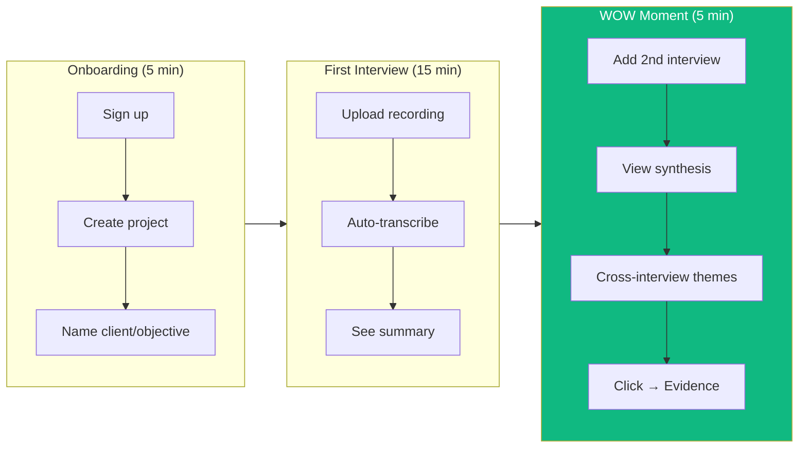
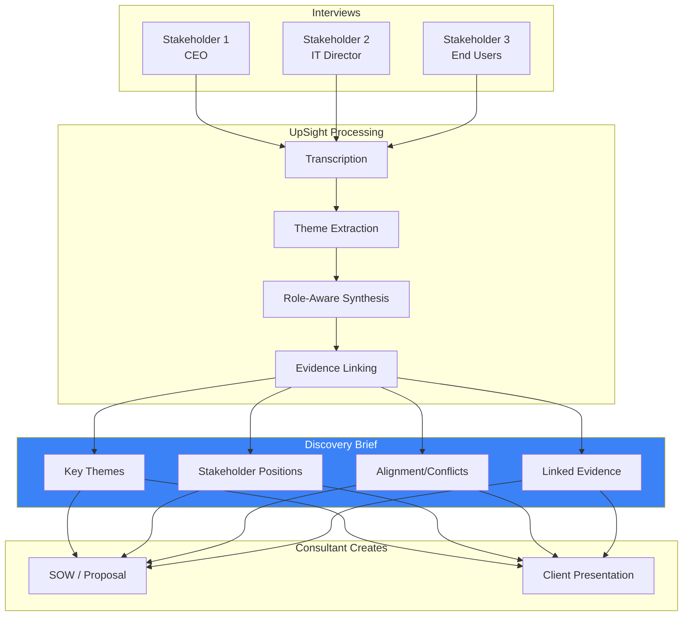
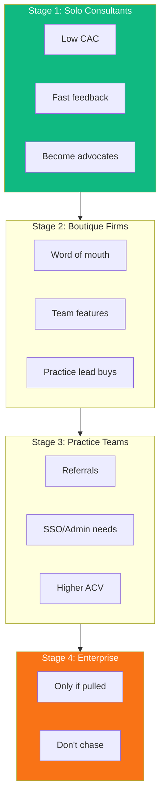

# Critical Analysis: UpSight for Consulting Practices

*Created: 2025-01-02*
*Updated: 2025-01-02 (incorporated external critique)*
*Status: Revised strategic analysis*

---

## Executive Summary

This document provides a critical analysis of the consulting practices positioning, revised after external strategic review.

**Strategic Reframe**: Consulting is a **beachhead market**, not a pivot. It's the highest-signal proving ground for UpSight's core value proposition: turning messy conversations into defensible decisions.

**Core Insight**: We are not selling AI summaries or faster note-taking. We are selling **decision defensibility**.

> "Turn stakeholder conversations into defensible decisions—fast."

---

## 0. Strategic Framing (Critical Correction)

### What We Got Wrong Initially

The original assessment framed consulting as a potential "new vertical" or "strategic shift." This is dangerous framing that risks:
- Feature sprawl
- Brand dilution
- Slower roadmap velocity
- Loss of focus

### Correct Framing

> **Consulting is the fastest path to revenue validation and proof of ROI—not a destination.**

Consulting works as a beachhead because:
- **Clear ROI math**: Hours saved = dollars reclaimed
- **Short sales cycles**: Solo consultants buy alone, fast
- **Zero tolerance for fluff**: Forces product discipline
- **High-signal feedback**: Consultants will tell you exactly what's broken

### Decision Rule

| Signal | Action |
|--------|--------|
| 5+ consultants convert and reuse within 60 days | Invest in consulting-specific features |
| Weak adoption after 60 days | Keep as secondary segment, don't build custom features |

---

## 1. The Real Value Proposition

### What We're Actually Selling

**NOT:**
- AI summaries
- Faster note-taking
- Research tooling
- SOW automation

**YES:**
- **Decision defensibility**

For consultants, this means:
- "Here's why we scoped this way"
- "Here's who said what"
- "Here's where stakeholders disagree"
- "Here's the risk, in their own words"

### Why This Matters

> "Anyone can summarize. Almost no one can prove."

The moat is **traceability + evidence linking**, not AI drafting. Once you own defensibility, SOWs, risks, and requirements all fall out naturally.

### Revised Positioning

| Old | Revised |
|-----|---------|
| "From stakeholder interviews to client-ready deliverables in hours, not weeks" | "Turn stakeholder conversations into defensible decisions—fast" |

Sub-line (consulting-specific):
> "Every recommendation backed by evidence. Every risk traceable to a voice."

---

## 2. Pricing Validation

### Economic Pain Model (Not Failure Stats)

Generic failure stats don't sell. Economic pain does:

```
CONSULTANT ROI MODEL
════════════════════

Discovery phase reality:
├─ Avg discovery phase: 2-4 weeks
├─ 30-50% non-billable synthesis time
├─ Senior consultants doing admin work
└─ SOW rework after stakeholder misalignment

Time saved per project: 8-12 hours
Consultant billing rate: $150-300/hr
Value reclaimed: $1,200-3,600 per project

At $99/month:
└─ Pays for itself in ONE project
└─ Every additional project = pure margin
```

### Price Sensitivity by Segment

| Segment | Monthly Budget | Sweet Spot | Max Willingness |
|---------|----------------|------------|-----------------|
| Solo Consultant | $50-200/mo | $49-99 | $150-200 |
| Small Practice (5-15) | $200-800/mo | $99-249 | $400-500 |
| Mid Practice (15-50) | $500-2,000/mo | $249-499 | $800-1,000 |

### Simplified Pricing Message

**One sentence:**
> "$99/month. Pay for usage when you run projects."

**Then layer:**
- Usage-based interview processing
- Export credits
- Premium templates (later)

**Key insight**: Pricing is not the risk. **Value articulation is the risk.** If we show "4 hours saved per project," pricing becomes trivial.

---

## 3. Competitive Landscape (Revised)

### The Whitespace

```
                    CONSULTING TOOL LANDSCAPE

    INTERVIEW ANALYSIS ──────────────────► STAKEHOLDER MANAGEMENT

    ┌─────────────┐                        ┌─────────────┐
    │  Dovetail   │                        │   Darzin    │
    │  Looppanel  │                        │   Jambo     │
    │  Grain      │                        │ Consultation│
    │             │                        │   Manager   │
    └─────────────┘                        └─────────────┘
          │                                      │
          │  Research-focused                    │  Tracking-focused
          │  UX/Product teams                    │  Enterprise/Gov
          │  Optimize for LEARNING               │  Optimize for LOGGING
          │                                      │
          └──────────────┐    ┌──────────────────┘
                         │    │
                         ▼    ▼
                    ┌─────────────┐
                    │  WHITESPACE │
                    │             │
                    │ Optimize for│
                    │  DECISIONS  │
                    │             │
                    │  (UpSight)  │
                    └─────────────┘
```

### Adjacent Threats (Previously Missing)

| Threat | Description | Risk Level |
|--------|-------------|------------|
| **Notion + AI templates** | Consulting-specific Notion templates with AI blocks | MEDIUM |
| **AI copilots in Docs/Office** | Copilot, Gemini in Google Docs for synthesis | MEDIUM-HIGH |
| **Internal GPT workflows** | Boutique firms building custom GPT pipelines | MEDIUM |
| **Otter.ai + ChatGPT** | DIY transcription + manual prompting | LOW-MEDIUM |

**Key insight**: "No one does this end-to-end" is true today but **fragile tomorrow**.

### Our Defensible Moat

The moat is NOT:
- AI drafting (anyone can do this)
- Transcription (commodity)
- Summarization (commodity)

The moat IS:
- **Evidence traceability** (click theme → see exactly who said it)
- **Cross-stakeholder synthesis** (not just one interview)
- **Role-aware analysis** (CEO vs. end user perspectives)

### Competitive Threat Assessment

| Competitor | Threat Level | Reason |
|------------|--------------|--------|
| **Dovetail** | MEDIUM | Could add consulting features, has $57M funding |
| **Looppanel** | LOW-MEDIUM | Closer to use case, but product-focused |
| **Notion + AI** | MEDIUM | Templates emerging, low friction |
| **MS Copilot / Gemini** | MEDIUM-HIGH | Will commoditize basic synthesis |
| **Grain** | LOW | Sales-focused |
| **Stakeholder tools** | VERY LOW | No AI, no voice, different market |

---

## 4. MVP Scope (Radically Reduced)

### What We Got Wrong

The original MVP included:
- SOW generator
- Risk identifier
- Requirements extractor
- Stakeholder matrices
- Executive summaries
- Interview guide templates
- Client-ready exports

**That's not an MVP. That's a suite.**

### True MVP (Hard Cut)

Consultants will forgive missing features if:
1. Synthesis is fast
2. Evidence is trustworthy
3. Output is editable

**Ship only:**

| Feature | Why |
|---------|-----|
| **Multi-interview synthesis** | Core wow moment |
| **Theme + evidence linking** | Click to see who said it |
| **Role-aware views** | CEO vs. user perspective |
| **Clean Word/Google Docs export** | Client-ready output |

**Everything else is earned, not assumed.**

### What Gets Delayed

| Feature | Status | Reason |
|---------|--------|--------|
| SOW generator | Phase 2 | Legally sensitive, firm-specific |
| Risk extraction | Phase 2 | Only if users request |
| Requirements extractor | Phase 2 | Only if users request |
| Stakeholder matrices | Phase 3 | Nice-to-have, not core |
| Templates library | Phase 3 | Build after learning patterns |

---

## 5. Deliverables Reframe

### The SOW Problem

SOWs are:
- Highly firm-specific
- Legally sensitive
- Politically loaded
- Easy to criticize, hard to perfect

**Leading with SOW generation is risky.**

### Better Angle: Pre-SOW Intelligence

Position UpSight as producing:
- **Discovery Brief** (not SOW)
- **Findings & Implications** (not requirements doc)
- **Decision Readout** (not executive summary)

Let consultants turn these into SOWs themselves.

### Revised Deliverable Hierarchy

```
WHAT WE PRODUCE          WHAT CONSULTANT CREATES
════════════════         ══════════════════════

Discovery Brief    ────►  SOW / Proposal
  │
  ├─ Key themes
  ├─ Stakeholder positions
  ├─ Evidence links
  └─ Alignment/conflicts

Findings Report    ────►  Client Presentation
  │
  ├─ Synthesized insights
  ├─ Role-based views
  └─ Supporting quotes

Risk Indicators    ────►  Risk Register
  │
  └─ Flagged concerns with sources
```

**Translation**: We enable revenue. We don't author contracts.

---

## 6. Buyer vs. User (Clarified)

### The Confusion

Managing Partner ≠ Daily User

### Reality

| Role | Relationship | Value Message |
|------|--------------|---------------|
| **User** (Senior consultant, principal) | Daily user | "I finish synthesis in hours, not days" |
| **Buyer** (Partner, practice lead) | Signs check | "Projects close faster, fewer write-offs" |
| **Blocker** (IT, legal, clients) | Can kill deal | Security story, data handling |

### Internal Champion Story (Missing)

How does tool adoption spread inside a firm?

1. Solo consultant tries it on personal project
2. Shows partner the output
3. Partner asks "how did you do that so fast?"
4. Team trial starts
5. Practice-wide adoption

**Key insight**: Win the senior consultant first. They become the internal champion.

---

## 7. Time-to-Wow (North Star)

### The Wow Moment

First time they see AI-synthesized themes across multiple stakeholder interviews with clickable evidence.

**This is more important than any feature.**

### Time-to-Wow Target: < 33 Minutes

| Step | Time | Action | What They See |
|------|------|--------|---------------|
| 1 | 2 min | Sign up | Welcome |
| 2 | 1 min | Create project | Dashboard |
| 3 | 2 min | Name client/objective | Ready |
| 4 | 15 min | Upload/record first interview | Summary |
| 5 | 10 min | Upload/record second interview | Summary |
| 6 | 2 min | View synthesis | **Cross-interview themes** |
| 7 | 1 min | Click theme | **Evidence from both interviews** |

### Faster Path Options

| Optimization | Time to Wow |
|--------------|-------------|
| Pre-loaded sample project | 5 min |
| Upload existing Zoom recordings | 15 min |
| "Show me the magic" demo button | 2 min |

---

## 8. Go-to-Market Ladder

### The Trojan Horse Strategy

Don't start with firms. Start with individuals who become advocates.

**GTM Ladder:**

```
STAGE 1: Solo Consultants
├─ Buy alone, move fast
├─ Feel pain immediately
├─ Low CAC, fast feedback
└─ Become advocates when hired by firms

         ▼

STAGE 2: Boutique Firms (5-15 people)
├─ Word of mouth from Stage 1
├─ Team features matter
├─ Practice lead is buyer
└─ Still fast sales cycle

         ▼

STAGE 3: Practice Teams (15-50)
├─ Referrals from boutiques
├─ Need SSO, admin controls
├─ Longer sales cycle
└─ Higher ACV

         ▼

STAGE 4: Enterprise (Optional)
├─ Only if pulled
├─ Don't chase
└─ Customization pressure is real
```

### Entry Point Focus

**Primary target:**
- Independent consultants
- Fractional leaders
- Interim executives

**Why:**
- Buy alone (no procurement)
- Move fast (pain is personal)
- Become internal advocates when hired full-time

---

## 9. Execution Strategy (Revised)

### Phase 0: Proof (Weeks 1-4)

**Goal**: Validate core insight, not features.

**Ship:**
- Multi-interview synthesis
- Evidence linking
- Word/Google Docs export

**Recruit:**
- 5-7 independent consultants

**Measure:**
- Time saved (self-reported)
- Trust in output ("would you show this to a client?")
- Willingness to reuse on next project

**Kill criteria:**
> If consultants don't reuse it on a second project → stop.

### Phase 1: Monetize (Months 1-2)

**Goal**: Convert trust into payment.

**Add:**
- Discovery Brief template
- Role-based synthesis views

**Price:**
- $49 solo / $99 pro

**Market:**
- "Stop rewriting discovery decks"

### Phase 2: Expand (Only if Pulled)

**Goal**: Let consultants ask for more.

**Add (only if requested):**
- Risk extraction
- Requirements views

**Prototype (don't ship):**
- SOW scaffolding (not full automation)

SOW generation should be **requested**, not pushed.

---

## 10. Risk Assessment (Honest)

### Undersold Risk: Customization Pressure

Consulting customers:
- Do not scale usage linearly
- Demand heavy customization
- Want bespoke everything

**Mitigation:**
- Strong opinionated defaults
- Narrow discovery templates
- Refuse to over-customize early

**Key discipline:**
> "This is how discovery works here."
> Or you become a services company.

### Risk Matrix

| Risk | Likelihood | Impact | Mitigation |
|------|------------|--------|------------|
| Feature creep | HIGH | HIGH | Hard MVP scope, kill criteria |
| SOW quality complaints | MEDIUM | MEDIUM | Position as "Discovery Brief," not SOW |
| Slow adoption | MEDIUM | HIGH | Start with pain-driven solos |
| Research tools add features | MEDIUM | MEDIUM | Double down on traceability moat |
| AI copilots commoditize synthesis | HIGH | MEDIUM | Multi-interview + role-aware = harder to copy |

---

## 11. Success Metrics & Kill Criteria

### Success Metrics

| Metric | Target | Why |
|--------|--------|-----|
| Time-to-wow | < 33 min | Prove value fast |
| Second project usage | > 60% | Shows real adoption |
| Time saved per project | 4+ hours | Tangible ROI |
| NPS | > 50 | Referral potential |
| Paid conversion (60 days) | > 5% | Business viability |

### Kill Criteria

| Signal | Action |
|--------|--------|
| < 3 consultants complete 2+ projects in 60 days | Pause consulting focus |
| < 1 paid conversion in 90 days | Deprioritize segment |
| Heavy customization requests dominate feedback | Reconsider fit |

---

## 12. Final Verdict

### Net Assessment

| Factor | Status |
|--------|--------|
| Market viability | **Confirmed** - clear pain, clear budget |
| Pricing headroom | **Confirmed** - $99-249 justified by ROI |
| Scope risk | **Real** - must maintain discipline |
| Focus risk | **Real** - only avoided with kill criteria |

### Recommendation

> **Proceed—but treat consulting as a truth serum, not a destination.**

If UpSight wins with consultants, the core value prop (synthesis + traceability + decisions) works everywhere.

If it fails here, no amount of product-team positioning will save it.

---

## Appendix: Mermaid Diagrams

### Time-to-Wow Flow



### Discovery Brief Flow



### GTM Ladder



---

*This analysis incorporates external strategic critique. Key change: consulting is a proving ground with kill criteria, not a vertical commitment.*
