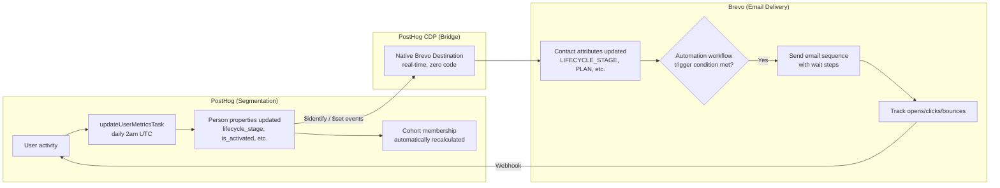

# Email Campaigns: PostHog + Brevo Implementation

## Overview

**PostHog handles segmentation. Brevo handles email delivery. No sync code needed.**

PostHog's native CDP destination pushes contact attributes to Brevo in real-time. Brevo automation workflows trigger when those attributes change. There is no custom sync task — it's all built-in.

**Related docs:**
- [Email Sequences](./email-sequences.md) - Full email content for all 18 templates
- [Activation Strategy](../strategy/activation-strategy.md) - Campaign strategy and messaging
- [PostHog Tracking](../../60-ops-observability/posthog-tracking.md) - Event definitions and cohorts
- [Email Setup](../../20-features-prds/features/email.md) - DNS and deliverability

---

## How It Works



### Single source of truth

`updateUserMetricsTask` (Trigger.dev, daily 2am UTC) is the **single source of truth** for all segmentation logic. It computes properties like `is_activated`, `is_power_user`, `lifecycle_stage`, `days_since_signup`, etc. Everything downstream just reacts:

- **PostHog cohorts** = saved filters on those properties, for dashboard monitoring only
- **Brevo automations** = trigger on the same properties, pushed via CDP

Brevo has **no awareness of PostHog cohorts**. It only sees contact attributes. The segmentation logic lives in one place (the metrics task), not duplicated across platforms.

### The chain

```
updateUserMetricsTask runs (daily 2am)
  → Sets person properties via $set
    → PostHog CDP destination fires (real-time)
      → Brevo contact attributes updated
        → Brevo workflow evaluates entry/exit conditions
          → Emails sent (or contact exits sequence)
```

**If the daily task doesn't run, nothing updates.** That's the one dependency to monitor.

### What lives where

| Concern | Where | Why there |
|---------|-------|-----------|
| Segmentation logic | `updateUserMetricsTask` | Single source of truth, all computed properties |
| Segment monitoring | PostHog cohorts | Dashboard visibility into segment sizes |
| Attribute sync | PostHog CDP → Brevo | Automatic, real-time, zero code |
| Email trigger + timing | Brevo automation workflows | Reacts to attribute values pushed from PostHog |
| Email content | Brevo templates (IDs 1-18) | Managed via API or Brevo UI |
| Engagement tracking | Brevo → PostHog webhook | Opens, clicks, bounces flow back to PostHog |

**Why Brevo:**
- **Cost-effective**: Free tier (300 emails/day), then $25/mo for 20k emails
- **All-in-one**: Transactional + marketing emails in one platform
- **Strong API**: Templates, contacts, and lists all manageable via API

---

## PostHog Cohort Configuration

### Person Properties (Set by updateUserMetricsTask)

These properties are updated daily at 2am UTC and used for cohort definitions:

| Property | Type | Description |
|----------|------|-------------|
| `email` | string | User email |
| `account_id` | string | Account UUID |
| `company_name` | string | Account name |
| `interview_count` | number | Total interviews |
| `survey_count` | number | Total surveys |
| `insight_count` | number | Total insights |
| `task_completed_count` | number | Completed tasks |
| `team_size` | number | Account members count |
| `plan` | string | free/starter/pro/team |
| `has_pro_trial` | boolean | Currently in trial |
| `trial_end` | date | Trial expiration |
| `has_paid_subscription` | boolean | Has active paid plan |
| `data_ingested` | number | interviews + surveys |
| `insight_published` | boolean | Has any insights |
| `is_activated` | boolean | Meets activation criteria |
| `is_power_user` | boolean | High engagement |
| `is_churn_risk` | boolean | Activated but inactive 14d+ |
| `days_since_last_activity` | number | Inactivity days |
| `days_since_signup` | number | Days since account created |
| `lifecycle_stage` | string | new/onboarding/activated/power_user/at_risk/churned |

### Required Cohorts for Email Sequences

Create these in PostHog Dashboard → People → Cohorts.

**See [email-sequences.md](./email-sequences.md) for the full email content.**

---

#### 1. `lc-new-no-content` (Welcome & First Data sequence)

Users who signed up but haven't added any content.

```
Matching users who:
- Have person property "days_since_signup" >= 2
- AND have person property "data_ingested" = 0
- AND do NOT have person property "has_paid_subscription" = true
```

**Trigger for:** Welcome & First Data Playbook (4 emails, Days 0-5)

---

#### 2. `lc-stalled-no-insight` (Aha Activation sequence)

Users who have data but haven't generated insights.

```
Matching users who:
- Have person property "data_ingested" >= 1
- AND have person property "insight_published" = false
- AND have person property "days_since_signup" >= 7
- AND do NOT have person property "has_paid_subscription" = true
```

**Trigger for:** Aha Activation Sequence (3 emails, Days 7-14)

---

#### 3. `lc-power-user` (Power User Expansion sequence)

Highly engaged solo users ready for team expansion.

```
Matching users who:
- Have person property "is_power_user" = true
- AND have person property "team_size" = 1
```

**Trigger for:** Power User Expansion (3 emails, Days 21-35)

---

#### 4. `lc-dormant-14d` (Churn Rescue sequence)

Previously activated users who have gone inactive.

```
Matching users who:
- Have person property "is_activated" = true
- AND have person property "days_since_last_activity" >= 14
- AND do NOT have person property "has_paid_subscription" = true
```

**Trigger for:** Churn Rescue Sequence (4 emails, Days 14-28)

---

#### 5. `trial-active` (Trial Conversion sequence)

Currently in Pro trial.

```
Matching users who:
- Have person property "has_pro_trial" = true
```

**Trigger for:** Trial Conversion Sequence - Value Recap (Day -7)

---

#### 6. `trial-expiring` (Trial Ending sequence)

Trial ending within 3 days.

```
Matching users who:
- Have person property "has_pro_trial" = true
- AND have person property "trial_end" is within 3 days of now
```

**Trigger for:** Trial Conversion Sequence - Urgency emails (Days -3 to 0)

---

#### 7. `trial-expired`

Trial ended, not converted.

```
Matching users who:
- Have person property "has_pro_trial" = true
- AND have person property "trial_end" is in the past
- AND do NOT have person property "has_paid_subscription" = true
```

**Trigger for:** Trial Ended email (Day 0)

---

## Brevo Configuration

### 1. Account Setup

1. Sign up at https://www.brevo.com
2. Verify email and add sending domain (`mail.getupsight.com`)
3. Configure DNS records (SPF, DKIM, DMARC) - see [Email Setup](../20-features-prds/features/email.md)
4. Create API key: Account → SMTP & API → API Keys → Create new key

### 2. Lists to Create

Navigate to Contacts → Lists, create these lists that mirror the PostHog cohorts:

| List Name | PostHog Cohort | Email Sequence | Update Frequency |
|-----------|----------------|----------------|------------------|
| `all-users` | — | — | Daily |
| `lc-new-no-content` | `lc-new-no-content` | Welcome & First Data | Daily |
| `lc-stalled-no-insight` | `lc-stalled-no-insight` | Aha Activation | Daily |
| `lc-power-user` | `lc-power-user` | Power User Expansion | Daily |
| `lc-dormant-14d` | `lc-dormant-14d` | Churn Rescue | Daily |
| `trial-active` | `trial-active` | Trial Conversion | Every 6 hours |
| `trial-expiring` | `trial-expiring` | Trial Conversion | Every 6 hours |
| `trial-expired` | `trial-expired` | Trial Conversion | Daily |

**Note:** List membership is managed by Brevo automation rules based on contact attributes synced from PostHog.

### 3. Contact Attributes

Set up custom attributes for personalization (Contacts → Settings → Contact Attributes):

| Attribute | Type | PostHog Property | Description |
|-----------|------|------------------|-------------|
| `USER_ID` | Text | `user_id` | User UUID |
| `ACCOUNT_ID` | Text | `account_id` | Account UUID |
| `PLAN` | Text | `plan` | Current plan (free/starter/pro/team) |
| `TRIAL_END` | Date | `trial_end` | Trial end date |
| `COMPANY_NAME` | Text | `company_name` | Company name for personalization |
| `LIFECYCLE_STAGE` | Text | `lifecycle_stage` | new/onboarding/activated/power_user/at_risk/churned |
| `INTERVIEW_COUNT` | Number | `interview_count` | Total interviews uploaded |
| `INSIGHT_COUNT` | Number | `insight_count` | Total insights generated |
| `TASK_COMPLETED_COUNT` | Number | `task_completed_count` | Tasks completed |
| `TEAM_SIZE` | Number | `team_size` | Number of team members |
| `DAYS_SINCE_SIGNUP` | Number | `days_since_signup` | Days since account created |

**Setup:** Add these attribute mappings in PostHog → Data Pipeline → Destinations → Brevo → Edit

### 4. Automation Workflows

Navigate to Automation → Create a new workflow.

**For full email content and templates, see [email-sequences.md](./email-sequences.md).**

---

#### Workflow 1: Welcome & First Data Playbook

**Trigger:** Contact attribute `days_since_signup` >= 0 (new signup via PostHog identify)
**Goal:** Get user to add their first data (survey or interview upload)
**Exit:** Contact has `data_ingested` >= 1 (interview or survey added)

| Day | Template | Subject |
|-----|----------|---------|
| 0 | `welcome-context-setup` | Welcome to UpSight — let's capture your first insight |
| 2 | `welcome-survey-cta` | The fastest way to get insights? A 2-minute survey |
| 4 | `welcome-concierge-import` | Need help importing your existing research? |
| 5 | `welcome-video-demo` | See UpSight in action (90-second demo) |

---

#### Workflow 2: Aha Activation Sequence

**Trigger:** Contact attribute `data_ingested` >= 1 AND `insight_published` = false AND `days_since_signup` >= 7
**Goal:** User publishes their first insight
**Exit:** Contact has `insight_count` >= 1

| Day | Template | Subject |
|-----|----------|---------|
| 7 | `aha-insight-checklist` | You're one step away from your first insight |
| 10 | `aha-ai-draft-offer` | Let AI write your first insight (you just approve) |
| 14 | `aha-success-story` | How [Company] turned 5 interviews into a product decision |

---

#### Workflow 3: Power User Expansion

**Trigger:** Contact attribute `is_power_user` = true AND `team_size` = 1
**Goal:** Add team members / expand seats
**Exit:** Contact has `team_size` >= 2

| Day | Template | Subject |
|-----|----------|---------|
| 21 | `expansion-impact-stats` | You've saved {{ time_saved_hours }} hours this month |
| 28 | `expansion-team-roi` | What if everyone on your team could search customer conversations? |
| 35 | `expansion-invite-offer` | Invite 2 teammates — we'll extend your trial |

---

#### Workflow 4: Churn Rescue Sequence

**Trigger:** Contact attribute `is_activated` = true AND `days_since_last_activity` >= 14
**Goal:** Re-engage with clear next step
**Exit:** Contact performs any event in PostHog (tracked via webhook)

| Day | Template | Subject |
|-----|----------|---------|
| 14 | `rescue-friendly-checkin` | Quick question, {{ contact.FIRSTNAME \| default: "there" }} |
| 18 | `rescue-meeting-bot` | What if insights captured themselves? |
| 24 | `rescue-last-project` | Your {{ project_name \| default: "research project" }} is waiting |
| 28 | `rescue-final-offer` | Before we stop emailing you... |

---

#### Workflow 5: Trial Conversion Sequence

**Trigger:** Contact attribute `has_pro_trial` = true
**Goal:** Convert to paid plan
**Exit:** Contact has `has_paid_subscription` = true

| Day | Template | Subject |
|-----|----------|---------|
| -7 | `trial-value-recap` | Your Pro trial: Here's what you've unlocked |
| -3 | `trial-urgency-discount` | 3 days left — save 25% on Pro |
| -1 | `trial-last-chance` | Tomorrow: Your Pro features pause |
| 0 | `trial-ended` | Your Pro features are now paused |

**Note:** Day numbers are relative to `trial_end` date.

---

## PostHog → Brevo Integration Setup

### ✅ Already Configured!

The PostHog native Brevo destination is already set up and working (39 triggers in last 7 days).

**Current configuration:**
- **Status:** Enabled
- **Email field:** `{person.properties.email}`
- **Attributes mapped:**
  - FIRSTNAME → `{person.properties.firstname}`
  - LASTNAME → `{person.properties.lastname}`
  - EMAIL → `{person.properties.email}`
- **Filters:** Internal and test users filtered out
- **Trigger:** On "Identify" and "Set person properties" events

### Adding More Attribute Mappings

To add more attributes for email personalization:

1. Go to PostHog → **Data Pipeline** → **Destinations** → **Brevo**
2. Click **Edit** next to the Brevo destination
3. Under **Attributes** section, click **+ Add entry**
4. Add mappings for:

| Brevo Attribute | PostHog Property | Purpose |
|-----------------|------------------|---------|
| `USER_ID` | `{person.properties.user_id}` | Unique user identifier |
| `ACCOUNT_ID` | `{person.properties.account_id}` | Account grouping |
| `PLAN` | `{person.properties.plan}` | Current subscription plan |
| `TRIAL_END` | `{person.properties.trial_end}` | Trial expiration date |
| `COMPANY_NAME` | `{person.properties.company_name}` | Company for B2B personalization |
| `LIFECYCLE_STAGE` | `{person.properties.lifecycle_stage}` | new/activated/power_user/at_risk/churned |
| `INTERVIEW_COUNT` | `{person.properties.interview_count}` | Total interviews created |
| `TASK_COMPLETED_COUNT` | `{person.properties.task_completed_count}` | Tasks completed |

**Note:** These properties are set by the `updateUserMetricsTask` (runs daily at 2am UTC). New users will have these attributes populated within 24 hours of signup.

---

## Brevo → PostHog Webhook (Email Events)

To track email engagement (opens, clicks, bounces) in PostHog, configure a webhook in Brevo.

### Setup Instructions

1. Go to Brevo Dashboard → **Settings** → **Webhooks** (or visit https://app.brevo.com/settings/webhooks)
2. Click **Add a new webhook**
3. Configure webhook:
   - **URL:** `https://getupsight.com/api/webhooks/brevo`
   - **Description:** "PostHog email engagement tracking"
   - **Events to track:**
     - ✅ `opened` - Email opened
     - ✅ `click` - Link clicked
     - ✅ `hardBounce` - Hard bounce (invalid email)
     - ✅ `softBounce` - Soft bounce (temporary failure)
     - ✅ `unsubscribed` - User unsubscribed
     - ✅ `spam` - Marked as spam
   - **Webhook type:** Both Marketing and Transactional (to track nurture campaigns + Supabase auth emails)
4. Save webhook

### Events Sent to PostHog

| Brevo Event | PostHog Event | Properties |
|-------------|---------------|------------|
| `opened`, `uniqueOpened` | `email_opened` | email, campaign_name, timestamp |
| `click` | `email_clicked` | email, campaign_name, clicked_url, timestamp |
| `hardBounce`, `softBounce` | `email_bounced` | email, campaign_name, bounce_type, timestamp |
| `unsubscribed` | `email_unsubscribed` | email, campaign_name, timestamp |
| `spam` | `email_spam` | email, campaign_name, timestamp |

**Note:** Events use email address as `distinct_id` in PostHog. PostHog will automatically merge these events with existing user profiles created by the native Brevo destination.

### Testing

After configuring the webhook:

1. Send a test email from Brevo (Campaigns → Test emails)
2. Open the email and click a link
3. Check PostHog → Events → Live events (within 1-2 minutes)
4. Verify `email_opened` and `email_clicked` events appear

### Troubleshooting

**Webhook not receiving events:**
- Check webhook status in Brevo dashboard (should show "Active")
- Verify URL is correct: `https://getupsight.com/api/webhooks/brevo`
- Check application logs for webhook errors: `fly logs -a insights-app`

**Events not appearing in PostHog:**
- Verify POSTHOG_API_KEY and POSTHOG_HOST are configured
- Check application logs for PostHog capture errors
- Ensure email address matches a user in PostHog

---

## Email Templates

### Template Variables

Available in all Brevo templates (use `{{ contact.ATTRIBUTE_NAME }}`):

| Variable | Description | Example |
|----------|-------------|---------|
| `{{ contact.FIRSTNAME }}` | First name | "Sarah" |
| `{{ contact.EMAIL }}` | Email address | "sarah@acme.com" |
| `{{ contact.PLAN }}` | Current plan | "free" |
| `{{ contact.TRIAL_END }}` | Trial end date | "2026-02-01" |
| `{{ contact.COMPANY_NAME }}` | Company name | "Acme Inc" |
| `{{ contact.INTERVIEW_COUNT }}` | Total interviews | "5" |
| `{{ contact.TASK_COMPLETED_COUNT }}` | Completed tasks | "3" |

### Sample Template: Trial Welcome (Day 0)

**Template name:** `trial-welcome`
**Subject:** Welcome to UpSight Pro - Your trial starts now

**HTML Body:**
```html
<p>Hi {{ contact.FIRSTNAME | default: "there" }},</p>

<p>Welcome to UpSight Pro! For the next 14 days, you have full access to:</p>

<ul>
  <li>✅ Unlimited AI analyses (vs 5/month on Free)</li>
  <li>✅ Smart Personas generation</li>
  <li>✅ 60 minutes of voice chat with AI</li>
  <li>✅ Custom Conversation Lenses</li>
</ul>

<h3>Quick wins to try today:</h3>

<ol>
  <li><strong>Upload an interview</strong> and watch themes emerge automatically</li>
  <li><strong>Generate your first Smart Persona</strong> from 3+ interviews</li>
  <li><strong>Try voice chat</strong> for a customer call recording</li>
</ol>

<p>Your trial ends on <strong>{{ contact.TRIAL_END | date: "%B %d, %Y" }}</strong>. Upgrade anytime to keep Pro features.</p>

<p style="margin-top: 30px;">
  <a href="https://getupsight.com/app" style="background: #0066ff; color: white; padding: 12px 24px; text-decoration: none; border-radius: 6px; display: inline-block;">Start Exploring →</a>
</p>

<p style="margin-top: 40px; color: #666; font-size: 14px;">
  — The UpSight Team<br>
  <a href="mailto:support@getupsight.com">support@getupsight.com</a>
</p>

<p style="margin-top: 20px; color: #999; font-size: 12px;">
  Don't want these emails? <a href="{{ unsubscribe }}">Unsubscribe</a>
</p>
```

---

## Testing Checklist

### Before Launch

- [ ] Create Brevo account and verify domain
- [ ] Configure DNS records (SPF, DKIM, DMARC)
- [ ] Create all contact lists in Brevo
- [ ] Set up custom contact attributes in Brevo
- [ ] Add attribute mappings to PostHog Brevo destination
- [ ] Create all cohorts in PostHog dashboard
- [ ] Configure Brevo → PostHog webhook for email events
- [ ] Test webhook with a test email (verify events in PostHog)
- [ ] Create email templates in Brevo
- [ ] Set up automation workflows
- [ ] Send test emails to internal team
- [ ] Verify unsubscribe links work
- [ ] Check email renders in Gmail, Outlook, Apple Mail

### After Launch

- [ ] Monitor webhook activity in Brevo dashboard (Settings → Webhooks)
- [ ] Check email events appearing in PostHog (Events → Live events)
- [ ] Check email delivery rates in Brevo dashboard
- [ ] Review PostHog cohort sizes trending
- [ ] Track conversion metrics weekly
- [ ] A/B test subject lines after 100+ sends

---

## Monitoring & Optimization

### Key Metrics (Track in Brevo)

| Metric | Target | Where to Find |
|--------|--------|---------------|
| Delivery rate | >98% | Statistics → Email campaigns |
| Open rate | >25% | Statistics → Email campaigns |
| Click rate | >5% | Statistics → Email campaigns |
| Unsubscribe rate | <0.5% | Statistics → Email campaigns |
| Bounce rate | <2% | Contacts → Invalid contacts |

### Weekly Tasks

1. Review Brevo statistics dashboard
2. Check for hard bounces and remove invalid emails
3. Monitor automation workflow performance
4. Update cohort definitions if needed

### Monthly Tasks

1. Review email content based on feedback
2. A/B test subject lines and CTAs
3. Analyze conversion funnel (email → upgrade)
4. Deprecate underperforming workflows

---

## Troubleshooting

### Sync Issues

**Problem:** Cohort returns 0 members
- Check cohort definition in PostHog
- Verify events are being tracked
- Check person properties are set correctly (run `updateUserMetricsTask` manually)

**Problem:** Brevo API errors
- Verify API key is correct
- Check rate limits (free tier: 300 emails/day)
- Ensure email format is valid
- Check Trigger.dev logs for detailed errors

### Email Delivery Issues

**Problem:** Emails going to spam
- Verify DNS records (SPF, DKIM, DMARC) in Brevo dashboard
- Review email content for spam triggers (too many links, all caps subject)
- Warm up sending domain gradually (start with 50 emails/day, increase 20% daily)
- Check sender reputation with mail-tester.com

**Problem:** Low open rates
- Test different subject lines (A/B test in Brevo)
- Check send times (best: Tue-Thu 10am-2pm)
- Verify emails aren't being clipped (keep <100KB)
- Ensure "from" name is recognizable ("UpSight Team" not "noreply")

**Problem:** High unsubscribe rate
- Review email frequency (max 2/week per user)
- Check content relevance (wrong cohort targeting?)
- Ensure value in every email (not just "upgrade now")

---

## Cost Planning

### Brevo Pricing Tiers

| Plan | Monthly Cost | Emails/Month | Contacts | Features |
|------|-------------|--------------|----------|----------|
| Free | $0 | 300/day (9k/month) | Unlimited | Email + automations |
| Starter | $25 | 20,000 | Unlimited | + A/B testing, advanced stats |
| Business | $65 | 20,000 | Unlimited | + Send time optimization, phone support |

### Recommendation

Start with **Free tier** until you exceed 300 emails/day, then upgrade to **Starter** ($25/mo).

**Estimated costs:**
- 100 users × 3 emails/week = 1,200 emails/month → Free tier
- 500 users × 3 emails/week = 6,000 emails/month → Free tier
- 1,000 users × 3 emails/week = 12,000 emails/month → Starter ($25/mo)

---

## Next Steps

1. **Set up Brevo account** (~30 min)
   - Sign up, verify domain, configure DNS

2. **Create PostHog cohorts** (~20 min)
   - Use definitions above

3. **Implement sync task** (~1 hour)
   - Copy code above, update mappings, test

4. **Create email templates** (~3 hours)
   - Write 10 emails based on sample above

5. **Set up automations** (~1 hour)
   - Configure workflows in Brevo

6. **Test end-to-end** (~1 hour)
   - Add yourself to test cohort, verify emails send

**Total setup time:** ~7 hours to go live
