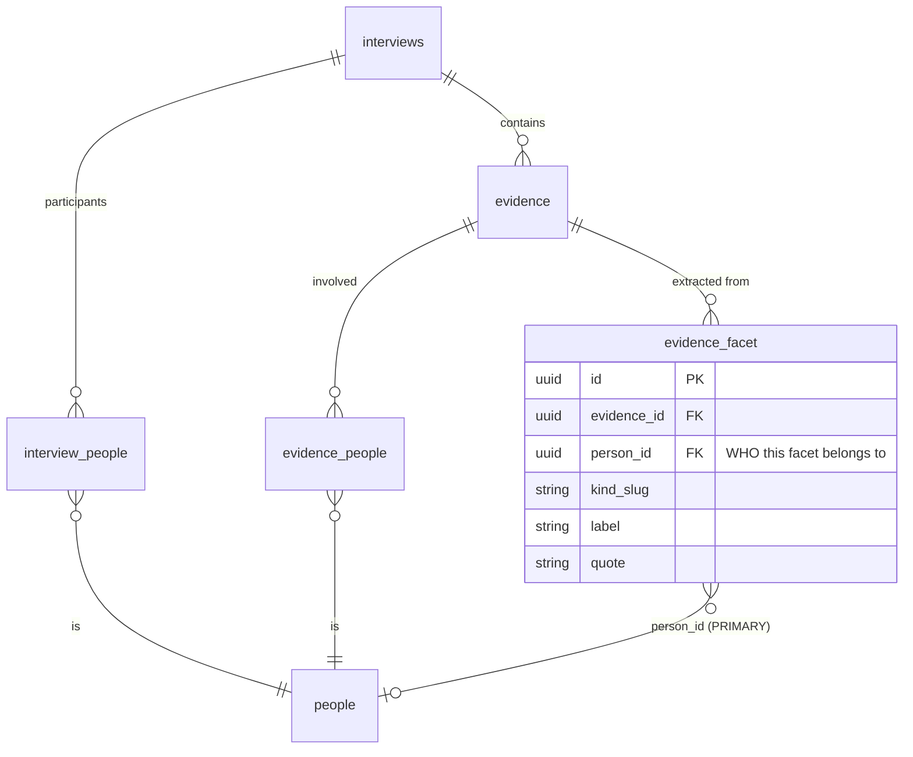
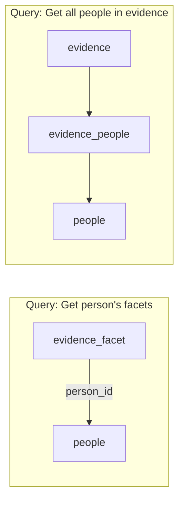

# Evidence-Based Data Architecture

## Core Principle

This is an **AI-native system** designed around **structured evidence chunks**, not raw text extraction from `observations_and_notes`.

## Why Evidence Chunks?

### Traditional Approach (What We DON'T Do)
```
Interview Transcript
  ↓
observations_and_notes (free text)
  ↓
String parsing / regex extraction
  ↓
Structured data (fragile, inconsistent)
```

**Problems**:
- ❌ Unstructured text is hard to query
- ❌ No semantic search capability
- ❌ Can't link to entities (people, orgs)
- ❌ No confidence scores
- ❌ No audit trail or versioning
- ❌ Brittle extraction (regex breaks on variations)

### Our Approach (Evidence-First)
```
Interview Transcript
  ↓ AI Processing (during upload)
Evidence Chunks (structured, typed, linked)
  ↓ Evidence consumed by:
    - Facets (persona attributes)
    - Sales Lens (BANT slots)
    - Product Lens (pain points)
    - Insights (published findings)
  ↓
Aggregated Views (matrices, dashboards)
```

**Benefits**:
- ✅ **Typed**: Each chunk has a `kind` (pain, gain, need, budget, timeline)
- ✅ **Linked**: Connected to people, organizations, interviews
- ✅ **Searchable**: Vector embeddings enable semantic queries
- ✅ **Confident**: AI provides 0.0-1.0 confidence scores
- ✅ **Auditable**: Immutable trail of what was extracted when
- ✅ **Versioned**: Can track evidence evolution over time
- ✅ **Reusable**: Same evidence feeds multiple lenses

## Data Model: Evidence Table

**Schema**: `supabase/schemas/31_evidence.sql`

```sql
create table evidence (
  id uuid primary key,
  account_id uuid not null,
  project_id uuid not null,
  interview_id uuid not null references interviews,

  -- Structured content
  kind text not null,            -- Facet kind: pain, gain, need, budget, etc.
  content text not null,         -- Extracted text snippet
  context text,                  -- Surrounding context for interpretation

  -- Entity links
  person_ids uuid[],             -- Who said this / who it's about
  organization_ids uuid[],       -- Which company / product
  related_evidence_ids uuid[],   -- Links to supporting evidence

  -- Semantic search
  embedding vector(1536),        -- OpenAI ada-002 embedding
  embedding_model text,          -- Track model version

  -- Metadata
  confidence numeric,            -- 0.0-1.0 extraction confidence
  source_location jsonb,         -- Timestamp/line in transcript
  tags text[],                   -- Custom tags
  metadata jsonb,                -- Extensible properties

  created_at timestamptz not null,
  updated_at timestamptz not null
);
```

### Example Evidence Records

From interview: *"We have a $500K budget allocated for Q2 2025 to solve our customer churn problem"*

**Budget Evidence**:
```json
{
  "id": "uuid-1",
  "kind": "budget",
  "content": "$500K budget allocated for Q2 2025",
  "context": "discussing annual planning and priorities",
  "person_ids": ["cfo-uuid"],
  "organization_ids": ["acme-corp-uuid"],
  "confidence": 0.95,
  "embedding": [0.123, -0.456, ...],
  "source_location": {
    "timestamp": 325.5,
    "speaker": "CFO Jane Smith"
  }
}
```

**Pain Evidence**:
```json
{
  "id": "uuid-2",
  "kind": "pain",
  "content": "customer churn problem",
  "context": "We lose 15% of customers annually, costing us millions",
  "person_ids": ["cso-uuid"],
  "organization_ids": ["acme-corp-uuid"],
  "confidence": 0.88,
  "related_evidence_ids": ["uuid-3"], // Links to metric: "15% churn rate"
  "embedding": [0.789, -0.234, ...]
}
```

**Timeline Evidence**:
```json
{
  "id": "uuid-3",
  "kind": "timeline",
  "content": "Q2 2025",
  "context": "Implementation timeline for churn solution",
  "confidence": 0.92,
  "metadata": {
    "date_start": "2025-04-01",
    "date_end": "2025-06-30",
    "urgency": "high"
  }
}
```

## Evidence Consumption Patterns

### 1. Sales Lens (BANT Extraction)

**File**: `app/utils/salesLens.server.ts`

```typescript
// Query evidence for BANT-relevant kinds
const { data: evidence } = await supabase
  .from("evidence")
  .select("*")
  .eq("interview_id", interviewId)
  .in("kind", ["budget", "need", "timeline", "authority"])

// Group by kind for easy access
const evidenceByKind = evidence.reduce((acc, ev) => {
  acc[ev.kind] = acc[ev.kind] || []
  acc[ev.kind].push(ev)
  return acc
}, {})

// Create BANT slots from evidence
const bantSlots = []

// Budget slot
const budgetEvidence = evidenceByKind.budget?.[0]
if (budgetEvidence) {
  bantSlots.push({
    slot: "budget",
    summary: budgetEvidence.content,
    numericValue: extractNumeric(budgetEvidence.content),
    confidence: budgetEvidence.confidence,
    evidenceRefs: [{ evidenceId: budgetEvidence.id, ... }]
  })
}

// Need slot
const needEvidence = evidenceByKind.need
if (needEvidence.length > 0) {
  bantSlots.push({
    slot: "need",
    summary: needEvidence.map(e => e.content).join("; "),
    confidence: Math.max(...needEvidence.map(e => e.confidence)),
    evidenceRefs: needEvidence.map(e => ({ evidenceId: e.id, ... }))
  })
}
```

### 2. Product Lens (Pain Matrix)

**File**: `app/features/lenses/services/generatePainMatrix.server.ts`

```typescript
// Query pain/gain evidence
const { data: painEvidence } = await supabase
  .from("evidence")
  .select(`
    *,
    people(id, name, facets)
  `)
  .eq("project_id", projectId)
  .in("kind", ["pain", "gain"])

// Group by pain × user facet
for (const evidence of painEvidence) {
  const pain = evidence.content
  const user = evidence.people?.[0] // Primary person who mentioned it

  // Get user facets (job_function, seniority, etc.)
  const userSegment = deriveUserGroup(user)

  // Add to matrix cell
  const key = `${pain}|${userSegment}`
  matrix[key].count++
  matrix[key].severity = Math.max(
    matrix[key].severity,
    evidence.confidence * evidence.metadata.severity
  )
}
```

### 3. Facet Classification

**File**: `app/features/people/services/deriveUserGroups.server.ts`

```typescript
// Query evidence about a person to classify them
const { data: personEvidence } = await supabase
  .from("evidence")
  .select("*")
  .contains("person_ids", [personId])
  .in("kind", ["job_function", "seniority", "industry"])

// Use evidence to populate person facets
for (const evidence of personEvidence) {
  await supabase.from("person_facet").upsert({
    person_id: personId,
    facet_kind_slug: evidence.kind,
    facet_value: evidence.content,
    confidence: evidence.confidence
  })
}
```

### 4. Semantic Search

**File**: `app/features/evidence/services/searchEvidence.server.ts`

```typescript
// Search for evidence similar to a query
const queryEmbedding = await openai.embeddings.create({
  input: "budget constraints in enterprise deals",
  model: "text-embedding-ada-002"
})

const { data: similarEvidence } = await supabase.rpc("match_evidence", {
  query_embedding: queryEmbedding.data[0].embedding,
  match_threshold: 0.8,
  match_count: 10,
  filter_project_id: projectId
})

// Returns evidence chunks semantically similar to query
// Even if exact words don't match!
```

## Why observations_and_notes is Sparse

### Current Purpose
The `observations_and_notes` field on interviews is for:
- ✅ Ad-hoc notes added by human interviewers
- ✅ Quick context not captured in structured fields
- ✅ Temporary workspace before formal extraction

### NOT For
- ❌ AI extraction source (use evidence instead)
- ❌ Structured data storage (use slots/facets instead)
- ❌ Long-term knowledge base (use evidence instead)

### Example Usage

**Good Use**:
```typescript
// Interviewer adds quick note after call
interview.observations_and_notes = "Strong signals, follow up on pricing next week"
```

**Bad Use** (Anti-Pattern):
```typescript
// DON'T do this - use evidence instead
interview.observations_and_notes = `
  Budget: $500K
  Timeline: Q2 2025
  Decision maker: Jane Smith (CFO)
  Pain points: Customer churn, high CAC
`
// This is unstructured, unsearchable, can't be queried!
```

**Better Approach**:
```typescript
// Create structured evidence
await supabase.from("evidence").insert([
  { kind: "budget", content: "$500K", person_ids: [jane_id], ... },
  { kind: "timeline", content: "Q2 2025", ... },
  { kind: "pain", content: "Customer churn", ... },
  { kind: "pain", content: "High customer acquisition cost", ... }
])
```

## Evidence Extraction Pipeline

### Step 1: Interview Upload
**Trigger**: User uploads audio/video or starts live transcription

**Process**:
1. Transcribe audio → text segments
2. Identify speakers → link to people
3. Generate embeddings for each segment

### Step 2: Evidence Extraction
**Trigger**: Transcript processing complete

**Process** (`app/utils/transcript-processing.server.ts`):
```typescript
async function extractEvidenceFromTranscript(
  transcript: Transcript
): Promise<Evidence[]> {
  // Call AI model (GPT-4, Claude, etc.)
  const extraction = await ai.extractEvidence({
    transcript: transcript.segments,
    targetFacets: ["pain", "gain", "need", "budget", "timeline"],
    projectContext: project.objectives
  })

  // Structure results
  return extraction.evidence.map(e => ({
    kind: e.type,
    content: e.text,
    context: e.surroundingContext,
    confidence: e.confidence,
    person_ids: linkPersons(e.speakers),
    organization_ids: linkOrgs(e.mentions),
    embedding: await generateEmbedding(e.text)
  }))
}
```

### Step 3: Evidence Consumption
**Trigger**: User views lens, generates report, or runs search

**Process**:
- Query evidence by `kind`, `person_ids`, `organization_ids`
- Aggregate into lenses (BANT, Product, etc.)
- Display with attribution and confidence

## Evidence Quality & Hygiene

### Confidence Scoring
Evidence has `confidence` field (0.0-1.0):
- **0.9-1.0**: High confidence (explicit statement, verified)
- **0.7-0.9**: Good confidence (implied, contextual)
- **0.5-0.7**: Moderate confidence (inferred, needs validation)
- **0.3-0.5**: Low confidence (speculative, unclear)
- **0.0-0.3**: Very low confidence (uncertain, conflicting)

### Hygiene Checks
**File**: `app/utils/evidenceHygiene.server.ts`

```typescript
export function calculateEvidenceHygiene(evidence: Evidence): HygieneScore {
  return {
    hasContext: !!evidence.context,
    hasPersonLink: evidence.person_ids.length > 0,
    hasOrgLink: evidence.organization_ids.length > 0,
    hasEmbedding: !!evidence.embedding,
    contentLength: evidence.content.length,
    confidence: evidence.confidence,

    // Overall score
    score: calculateHygieneScore(...)
  }
}
```

**Hygiene Warnings**:
- ⚠️ Evidence with no person links → "Who said this?"
- ⚠️ Evidence with low confidence (<0.5) → "Needs validation"
- ⚠️ Evidence with no embedding → "Not searchable"
- ⚠️ Evidence with short content (<10 chars) → "Too vague"

## Migration Path: From observations_and_notes to Evidence

### For Existing Data
If you have old interviews with populated `observations_and_notes`:

**One-Time Migration Script**:
```typescript
// app/mastra/tools/migrate-observations-to-evidence.ts

async function migrateObservationsToEvidence() {
  // Get interviews with observations
  const { data: interviews } = await supabase
    .from("interviews")
    .select("id, observations_and_notes")
    .not("observations_and_notes", "is", null)

  for (const interview of interviews) {
    // Use AI to extract structured evidence from notes
    const evidence = await ai.extractEvidence({
      text: interview.observations_and_notes,
      interviewId: interview.id
    })

    // Insert evidence
    await supabase.from("evidence").insert(evidence)

    // Archive original notes
    await supabase.from("interviews").update({
      observations_and_notes: null, // Clear after migration
      metadata: {
        ...interview.metadata,
        migrated_notes: interview.observations_and_notes // Keep backup
      }
    }).eq("id", interview.id)
  }
}
```

### For New Workflows
When implementing new features:

**✅ DO**:
```typescript
// Create evidence during extraction
await supabase.from("evidence").insert({
  interview_id: interviewId,
  kind: "budget",
  content: "$500K",
  confidence: 0.9,
  embedding: await embed("$500K budget for Q2")
})
```

**❌ DON'T**:
```typescript
// Append to observations_and_notes
await supabase.from("interviews").update({
  observations_and_notes: `${existing}\nBudget: $500K`
})
```

## Benefits Realized

### 1. Multi-Lens Reuse
Same evidence powers multiple views:
```
Evidence: "Customer churn is killing us, losing 15% annually"
  ↓
  ├─→ BANT Lens: "Need" slot (pain point)
  ├─→ Product Lens: Pain matrix cell
  ├─→ Insights: Published finding
  └─→ Segments: Filter users mentioning "churn"
```

### 2. Semantic Search
Find related evidence even without keyword matches:
```
Query: "revenue challenges"
Results:
  - "Customer churn is killing us" (semantic: churn → revenue)
  - "Can't scale sales team fast enough" (semantic: sales → revenue)
  - "Pricing pressure from competitors" (semantic: pricing → revenue)
```

### 3. Entity Linkage
Track which people/orgs mentioned what:
```sql
-- Who mentioned budget constraints?
SELECT DISTINCT p.name, p.job_title
FROM evidence e
JOIN people p ON p.id = ANY(e.person_ids)
WHERE e.kind = 'budget'
  AND e.content ILIKE '%constraint%'
```

### 4. Confidence Filtering
Focus on high-quality data:
```sql
-- High-confidence pains only
SELECT content, confidence
FROM evidence
WHERE kind = 'pain'
  AND confidence > 0.8
ORDER BY confidence DESC
```

### 5. Audit Trail
See when evidence was extracted and from where:
```sql
-- Evidence timeline for an opportunity
SELECT e.kind, e.content, e.created_at, i.title as interview
FROM evidence e
JOIN interviews i ON i.id = e.interview_id
JOIN sales_lens_summaries s ON s.interview_id = i.id
WHERE s.opportunity_id = $1
ORDER BY e.created_at
```

## Comparison Table

| Aspect | observations_and_notes | Evidence Chunks |
|--------|------------------------|-----------------|
| **Structure** | Free text | Typed by `kind` |
| **Search** | Text search only | Semantic + text |
| **Links** | None | People, orgs, interviews |
| **Confidence** | N/A | 0.0-1.0 score |
| **Reusability** | Single use | Multi-lens |
| **Versioning** | Overwrites | Immutable history |
| **Embeddings** | No | Yes (vector search) |
| **Aggregation** | Manual parsing | SQL queries |
| **AI-Friendly** | No | Yes |

## Future Enhancements

### Evidence Graph
Link related evidence to form knowledge graphs:
```
"Customer churn problem"
  ├─ causes: ["Poor onboarding", "Lack of support"]
  ├─ impact: ["15% annual loss", "$2M revenue hit"]
  └─ solutions: ["Improve onboarding flow", "24/7 support"]
```

### Evidence Validation Workflow
Human-in-the-loop to validate AI extractions:
```typescript
// Evidence needs review if confidence < 0.6
if (evidence.confidence < 0.6) {
  await createValidationTask({
    type: "evidence_review",
    evidence_id: evidence.id,
    question: "Is this pain point accurately captured?"
  })
}
```

### Cross-Interview Evidence Synthesis
Merge similar evidence from multiple interviews:
```typescript
// Find duplicate evidence across interviews
const duplicates = await findSimilarEvidence(evidence.embedding)

// Synthesize into single high-confidence evidence
const synthesized = {
  content: mostCommonPhrasing(duplicates),
  confidence: Math.max(...duplicates.map(d => d.confidence)),
  source_evidence_ids: duplicates.map(d => d.id),
  occurrence_count: duplicates.length
}
```

## Linking Evidence & Facets to People

### Target Model (Unified)

All facets use `evidence_facet.person_id` for direct attribution:



**Key principle**: `evidence_facet.person_id` = "Whose facet is this?" (direct, unambiguous)



### Two Tables, Two Purposes

| Table | Purpose | Cardinality |
|-------|---------|-------------|
| `evidence_facet.person_id` | "Who does this facet belong to?" | 1:1 (one owner per facet) |
| `evidence_people` | "Who was involved in this evidence?" | 1:many (multiple participants) |

### Content Type Examples

**Conversation:**
```
evidence: "John mentioned the API is slow"
  │
  ├── evidence_people: John (speaker), Mary (listener)  ← All participants
  │
  └── evidence_facet: kind=pain, label="API performance"
          └── person_id: John  ← Who expressed this pain
```

**Survey:**
```
evidence: "Q: Biggest challenge? A: Slow deployments"
  │
  ├── evidence_people: Alice (respondent)  ← Participant
  │
  └── evidence_facet: kind=survey_response, label="Biggest challenge?", quote="Slow deployments"
          └── person_id: Alice  ← Who answered
```

### Unified Query Pattern

```sql
-- Get all pains for a specific person (works for BOTH conversations and surveys)
SELECT ef.label, ef.quote, ef.kind_slug
FROM evidence_facet ef
WHERE ef.person_id = $personId
  AND ef.kind_slug = 'pain';

-- Get all people involved in an evidence record (context query)
SELECT p.name, ep.role
FROM evidence_people ep
JOIN people p ON ep.person_id = p.id
WHERE ep.evidence_id = $evidenceId;
```

### Migration Status

| Component | Status | Notes |
|-----------|--------|-------|
| Schema: `evidence_facet.person_id` | ✅ Done | Column added, indexed, FK to people |
| Backfill existing facets | ✅ Done | 5,547 of 5,865 facets backfilled from `evidence_people` |
| Survey import | ✅ Done | Sets `person_id` on each facet |
| Conversation extraction | ✅ Done | Sets `person_id` = speaker after person resolution |
| Query: `generatePainMatrix` | 🔲 Optional | Can simplify from 2 queries to 1 |
| Query: `generatePersonas` | 🔲 Optional | Can simplify from 2 queries to 1 |
| UI: Person detail page | ✅ Done | Uses `person_id` directly |

### Migration Scope

**Completed (extraction pipeline):**
```
src/trigger/interview/v2/extractEvidenceCore.ts (~lines 1934-1986)
  └── Sets person_id = speaker's person_id on each evidence_facet row
  └── Happens after person resolution so personIdByKey is populated
```

**Optional (query simplification):**
```
app/features/lenses/services/generatePainMatrix.server.ts
  └── Currently: 2 queries (evidence_facet + evidence_people)
  └── After: 1 query with person_id join
  └── ~30 lines simplified

app/features/personas/services/generatePersonas.server.ts
  └── Currently: 2 queries (evidence_people + evidence_facet)
  └── After: 1 query with person_id filter
  └── ~20 lines simplified
```

**No change needed:**
```
app/features/themes/db.autoThemes.server.ts      - Doesn't need person attribution
app/features/evidence/pages/index.tsx            - Doesn't need person attribution
app/features/evidence/pages/evidenceDetail.tsx   - Shows evidence, not person-scoped
```

**Completed effort:** ~50 lines across extraction pipeline + backfill migration
**Optional remaining:** ~50 lines for query simplification (can be done incrementally)

### Design Confidence: 85-90%

**Why this model is better:**
1. ✅ Single query pattern for "get person's facets" everywhere
2. ✅ Explicit attribution - no ambiguity about whose facet it is
3. ✅ Simpler mental model - facet knows its owner directly
4. ✅ Query efficiency - no junction table traversal

**Remaining edge cases (exist in BOTH models):**
1. Multi-speaker quotes: "John and Mary both complained" → We pick primary speaker
2. Reported speech: "John said Mary is frustrated" → Facet attributed to John (speaker)
3. Unknown speaker: → `person_id` = NULL (same as no `evidence_people` link)

**Why not 95%+:**
- Edge cases above require smarter extraction logic regardless of model
- `evidence_people` still needed for "all participants" queries
- Some redundancy between `person_id` and `evidence_people` for single-speaker evidence

### Future: Multi-Person Disambiguation

The current model attributes each facet to a single person. Multi-person scenarios (e.g., "John and Mary both expressed frustration with the API") are theoretical but could exist in practice.

**Current behavior:** We pick the primary speaker and attribute the facet to them.

**Future enhancement:** With smarter extraction prompts, we could:
1. Detect when multiple people express the same sentiment
2. Create separate evidence_facet rows for each person
3. Link them via `related_evidence_ids` or a shared `group_id`

This would require:
- Updated BAML prompts to detect multi-person expressions
- Extraction logic to fan out into multiple facet rows
- UI to show "shared" facets appropriately

The `evidence_facet.person_id` model supports this naturally - each facet simply gets its own `person_id`. The junction table `evidence_people` continues to track all participants in the source evidence for context.

## Key Takeaway

> **observations_and_notes is sparse BY DESIGN**
>
> This system is built evidence-first. All structured data comes from evidence chunks, not free-text notes. If you find yourself writing extraction logic that parses `observations_and_notes`, you're doing it wrong - create evidence instead.

## References

- [Evidence Schema](../../supabase/schemas/31_evidence.sql)
- [Sales Lens Extraction](../../app/utils/salesLens.server.ts)
- [Product Lens Service](../../app/features/lenses/services/generatePainMatrix.server.ts)
- [Facet Classification](../../app/features/people/services/deriveUserGroups.server.ts)
