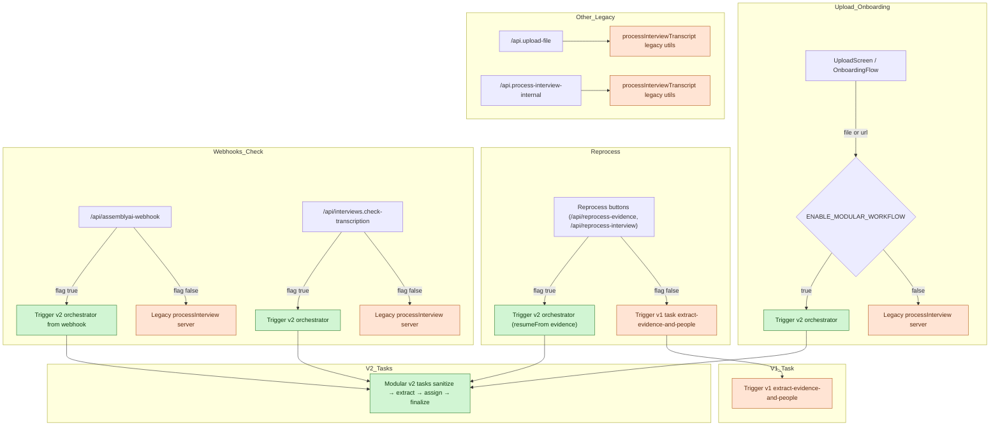
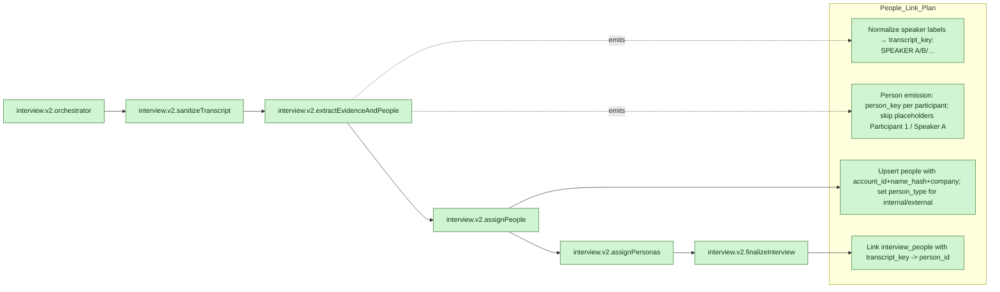

# Diagram of Ingestion pipeline

Supports People Linking

## Current (v2 orchestrator enabled with v1 and legacy)

## V2 people-linking plan (task-level view)

### Notes
- Consolidate on `person_key` (pipeline ID) and `transcript_key` (speaker label) — deprecate `participant_key`.
- Skip placeholder speakers (“Participant 1”, “Speaker A”) when upserting people; apply company-aware onConflict.
- After mapping, persist `transcript_key` on `interview_people` so UI linking stays stable.
