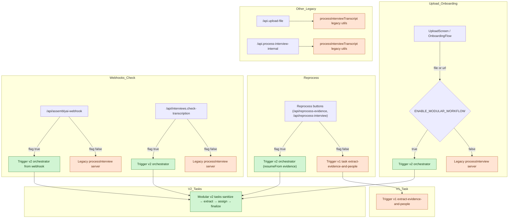
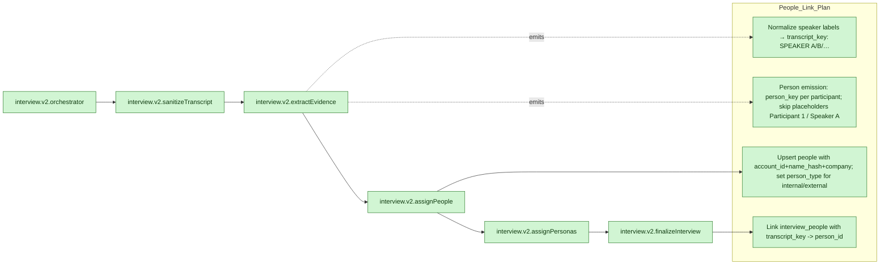

# Diagram of Ingestion pipeline

Supports People Linking

## Current (v2 orchestrator enabled with v1 and legacy)

## V2 people-linking plan (task-level view)

### Notes
- Consolidate on `person_key` (pipeline ID) and `transcript_key` (speaker label) — deprecate `participant_key`.
- Skip placeholder speakers (“Participant 1”, “Speaker A”) when upserting people; apply company-aware onConflict.
- After mapping, persist `transcript_key` on `interview_people` so UI linking stays stable.

## Ingest consolidation (action plan)
- Default to v2 everywhere: remove ENABLE_MODULAR_WORKFLOW branches and stop invoking legacy/v1 routes (`/api.upload-file`, `/api.process-interview-internal`, v1 trigger ids).
- Shared helpers: use `normalizeSpeakerLabel`, `isPlaceholderPerson`, and `upsertPersonWithCompanyAwareConflict` (account_id,name_hash,company) across v2 tasks.
- V2 tasks:
  - `extractEvidenceTaskV2`: inline/replace legacy core (no import from processInterview.server); apply shared helpers; skip placeholders; emit transcript_key + person_key mapping directly.
  - `assignPersonasTaskV2`: port persona logic from legacy core.
  - `enrichPersonTaskV2`: ensure person upserts use company-aware conflict/person_type.
  - `finalizeInterviewTaskV2`: write `transcript_key` onto `interview_people` after mapping.
- Identifier cleanup: drop `participant_key`, use `person_key` + `transcript_key` only.
- Delete legacy after burn-in: `processInterview.server.ts`, v1 trigger IDs, and their route callers once v2 parity is verified.

> Mermaid tip: Each node is on its own line; IDs avoid slashes; labels in quotes; avoid parentheses/linebreaks in labels.

## Status & remaining concerns

- Duplicate key collisions: mitigated by queue/idempotency on extract and lowercase company normalization; requires migration `20251235000000_people_unique_with_company.sql` applied.
- Legacy dependency: `extractEvidenceTaskV2` still imports `extractEvidenceAndPeopleCore`; must inline to delete `processInterview.server.ts`.
- Persona synthesis: still in legacy core; needs port into `assignPersonasTaskV2`.
- Placeholder enforcement: helpers exist, but full enforcement depends on inlining the legacy core.
- Transcript_key: v2 sets it after mapping; ensure the inlined core preserves this.
- Import-from-URL uses a shim; safe post-legacy deletion once inlining is done.

Confidence: Medium. The plan is clear and helpers/migration are in place, but risk remains until the legacy extract and persona logic are fully inlined into v2 and verified end-to-end.
