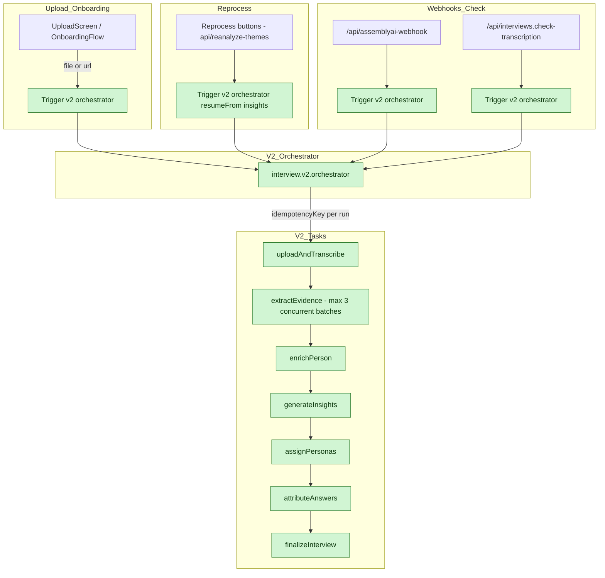

# Diagram of Ingestion pipeline

Supports People Linking

## Current (v2 orchestrator - feature flag removed)

All entry points now use v2 orchestrator. Legacy/v1 code paths removed.

## V2 people-linking plan (task-level view)

### Notes
- Consolidate on `person_key` (pipeline ID) and `transcript_key` (speaker label) — deprecate `participant_key`.
- Skip placeholder speakers (“Participant 1”, “Speaker A”) when upserting people; apply company-aware onConflict.
- After mapping, persist `transcript_key` on `interview_people` so UI linking stays stable.

## Ingest consolidation (action plan)
- Default to v2 everywhere: remove ENABLE_MODULAR_WORKFLOW branches and stop invoking legacy/v1 routes (`/api.upload-file`, `/api.process-interview-internal`, v1 trigger ids).
- Shared helpers: use `normalizeSpeakerLabel`, `isPlaceholderPerson`, and `upsertPersonWithCompanyAwareConflict` (account_id,name_hash,company) across v2 tasks.
- V2 tasks:
  - `extractEvidenceTaskV2`: inline/replace legacy core (no import from processInterview.server); apply shared helpers; skip placeholders; emit transcript_key + person_key mapping directly.
  - `assignPersonasTaskV2`: port persona logic from legacy core.
  - `enrichPersonTaskV2`: ensure person upserts use company-aware conflict/person_type.
  - `finalizeInterviewTaskV2`: write `transcript_key` onto `interview_people` after mapping.
- Identifier cleanup: drop `participant_key`, use `person_key` + `transcript_key` only.
- Delete legacy after burn-in: `processInterview.server.ts`, v1 trigger IDs, and their route callers once v2 parity is verified.

> Mermaid tip: Each node is on its own line; IDs avoid slashes; labels in quotes; avoid parentheses/linebreaks in labels.

## Status & remaining concerns

### Completed (2024-12-18)

- [x] **Feature flag removed**: `ENABLE_MODULAR_WORKFLOW` branches deleted from all API routes
- [x] **Idempotency keys**: All child tasks now have idempotency keys (`extract-${interviewId}-${ctx.run.id}`, etc.)
- [x] **Batch concurrency**: Limited to 3 parallel BAML calls (was unlimited `Promise.all`)
- [x] **People constraint fix**:
  - Plain index `uniq_people_account_name_company_plain` for ON CONFLICT
  - Normalized existing data (NULL→'', uppercase→lowercase)
  - Added `NOT NULL DEFAULT ''` constraint on `people.company`
- [x] **Step order fix**: Added missing `enrich-person` step in `shouldExecuteStep`
- [x] **Facet kinds seeded**: 12 new kinds (emotion, workflow, goal, pain, behavior, tool, value, requirements, preference, demographic, context, artifact)
- [x] **Progress callbacks**: Heartbeat updates throughout extractEvidenceCore
- [x] **Monolith refactoring (Phase 1)**:
  - `timestampMapping.ts` (204 lines) - Pure timestamp resolution utilities
  - `facetProcessing.ts` (159 lines) - Facet catalog and mention handling
  - `peopleResolution.ts` (207 lines) - Name parsing, normalization, resolution
  - `personaSynthesis.ts` (165 lines) - Persona facet derivation types/utilities
  - Main `extractEvidenceCore.ts` reduced from ~2400 to ~2071 lines

### Remaining work

| Issue | Severity | Notes |
|-------|----------|-------|
| **extractEvidenceCore still large** | Medium | 2071 lines; DB ops and workflow logic harder to extract |
| **No transaction boundaries** | Medium | Evidence, people, facets in separate DB calls; partial failure = orphaned records |
| **No partial checkpointing** | Low | Full step retry is acceptable for now |
| **Legacy code deletion** | Low | `processInterview.server.ts` ready to delete after verification |

### Extracted modules (src/trigger/interview/v2/)

| Module | Lines | Purpose |
|--------|-------|---------|
| `timestampMapping.ts` | 204 | Timestamp coercion, word/segment timeline building, snippet anchoring |
| `facetProcessing.ts` | 159 | Facet catalog resolution, lookup building, mention matching |
| `peopleResolution.ts` | 207 | Name parsing, generic label detection, fallback names, name resolution |
| `personaSynthesis.ts` | 165 | Persona facet grouping, observation building from BAML output |

All modules are <500 lines, have clear single responsibilities, are independently testable, and accept dependencies via parameters (no global state).

### Further refactoring opportunities

The remaining ~2071 lines in extractEvidenceCore contain tightly coupled DB operations and workflow orchestration. Further decomposition would require:
1. Transaction boundaries (wrap multiple inserts in single transaction)
2. Separate evidence row builder from DB insert logic
3. Extract interview_people linking into its own module

### Confidence: High (85%)

Core reliability fixes are in place. Module extraction complete for pure utilities. Remaining code is workflow orchestration that works correctly but could benefit from transaction boundaries.
