# Gen-UI Bidirectional Flow Gap Analysis (2026-02-20)

## 1. Business Outcome / JTBD Lens

Primary JTBD: "When I ask the assistant for project guidance and interact with widgets, I want one continuous decision workflow so I can move from data to action without context switching."

Success outcomes:
1. User asks in chat and sees both: clear chat summary + correct canvas widget.
2. User clicks/edits/filter on canvas and the agent continues from that interaction.
3. Agent updates guidance/widgets based on those actions with minimal friction.

## 2. Current Flow Map (A2UI + Chat)

### Chat -> Canvas
1. User sends message in `ProjectStatusAgentChat`.
2. `/api/chat/project-status` routes to `project-status-agent` or delegated sub-agent.
3. Tool (for example `displayComponent`, `recommendNextActions`) returns `a2ui` payload.
4. Chat client detects tool result with `a2ui` and applies messages via `A2UISurfaceContext`.
5. `CanvasPanel` / `A2UIRenderer` renders active surface.

### Canvas -> Agent (after fixes)
1. User interacts with widget (`onAction` from `A2UIRenderer`).
2. Action is optionally persisted via `persistCanvasAction`.
3. Action is sent as typed `uiEvents` payload in the chat request body.
4. Agent sees action event and can respond with next-step guidance + refreshed widget.

### Inline Choice -> Agent (after fixes)
1. Agent tool emits `requestUserInput` payload.
2. `ProjectStatusAgentChat` extracts and renders `<InlineUserInput>` inside message bubble.
3. User confirms selection/free text.
4. Chat sends typed `user_input` event via `uiEvents`.
5. Agent continues workflow from that structured response.

## 3. Ideal Design + Residual Risks (Diagram)

```mermaid
flowchart LR
    subgraph ideal["Ideal Closed Loop (Target)"]
        U["User"] --> Chat["Chat input"]
        Chat --> API["/api/chat/project-status"]
        API --> Agent["Intent routing + agent reasoning"]
        Agent --> Tools["Tool calls"]
        Tools --> A2UI["Typed A2UI surface messages"]
        A2UI --> Surface["A2UISurfaceContext"]
        Surface --> Renderer["A2UIRenderer (full adjacency graph walk)"]
        Renderer --> Canvas["Canvas widgets"]
        Canvas --> EventChannel["Typed UI event channel"]
        EventChannel --> Agent
        Agent --> Reply["Chat summary + updated widget"]
        Reply --> U
    end

    subgraph current["Residual Risks (post-fix)"]
        GapA["Residual A: advanced template bindings still depend on conventions (@item or ./path)"]
        GapA2["Consequence: malformed bindings degrade gracefully but may render partial data"]
        GapB["Residual B: legacy text envelopes are still supported for backwards compatibility"]
        GapB2["Consequence: dual-path handling remains until old thread flows are retired"]
        GapA --> GapA2
        GapB --> GapB2
    end

    Renderer -. "convention risk" .-> GapA
    EventChannel -. "compatibility path" .-> GapB
```

## 4. Gap Analysis + RCA

| Priority | Gap | Root Cause | Status |
|---|---|---|---|
| P0 | Canvas actions were not reaching agent | `CanvasPanel` did not pass `onAction`; no bridge into chat send path | Fixed |
| P0 | `requestUserInput` not visible in production chat | Tool existed + test page existed, but no renderer integration in `ProjectStatusAgentChat` | Fixed |
| P0 | `requestUserInput` unavailable in main status agent | `project-status-agent` tool map did not include `requestUserInput` | Fixed |
| P1 | Progress widget brittle with null optional fields | `ProgressRail` schema used `.optional()` (rejects null) + LLM/tool output included nulls | Fixed |
| P1 | Status questions could end with no widget when recommendations empty | `recommendNextActions` only rendered `DecisionSupport` if recommendations > 0 | Fixed |
| P1 | Rapid canvas actions could be dropped | Context stored only one `pendingUserMessage`; new action overwrote previous before chat consumed it | Fixed |
| P1 | Repeated inline prompts could collide in answer state | Answer map keyed only by prompt text | Fixed |
| P1 | Top-theme asks often returned text-only output | No deterministic top-theme mode for prompts like "show top theme"; relied on LLM to call `displayComponent` | Fixed |
| P1 | DecisionSupport looked non-interactive | Component had links only; no explicit action controls emitting `onAction` | Fixed |
| P1 | Chat link clicks could trigger inconsistent full-page nav | Internal short routes (e.g. `/people`) were treated as out-of-scope and fell back to browser navigation | Fixed |
| P1 | Structured UI events could be misrouted by classifier | `[CanvasAction]` / `[UserInput]` messages looked like generic text; routing not deterministic | Fixed |
| P2 | Multi-component A2UI surfaces are not truly adjacency-driven | Renderer currently maps and renders all components; full parent-child graph walk is limited | Fixed |
| P2 | Action protocol is string-convention based (`[CanvasAction]`) | No first-class typed action channel/tool yet; currently text envelope in user stream | Fixed |

## 5. Changes Applied

1. `requestUserInput` rendered inline in chat with answered-state tracking.
2. `project-status-agent` now includes `requestUserInput` tool aliases.
3. Bidirectional bridge added:
   - Desktop canvas: `CanvasPanel` forwards `onAction` -> chat message.
   - Mobile inline canvas: `ProjectStatusAgentChat` forwards `onAction` -> chat message.
4. Canvas action persistence attempts now run before sending event context.
5. `recommendNextActions` now emits `ProgressRail` A2UI payload for status/progress intents.
6. `ProgressRail` schema now accepts nullish optional fields (`activeMoment`, `nextAction`, `nextActionUrl`).
7. Pending user-message bridge now uses a queue, preventing dropped actions under rapid widget interactions.
8. Inline user-input responses now include a deterministic `promptKey` for robust answer mapping across repeated prompts.
9. `fetchTopThemesWithPeople` now emits a `PatternSynthesis` A2UI surface directly from tool output.
10. Deterministic routing now treats "show top theme"/"top themes"/"strongest theme" as `theme_people_snapshot`.
11. `DecisionSupport` and `PatternSynthesis` include explicit action controls that emit `onAction` events.
12. Internal short links in chat are remapped to project-scoped routes to avoid accidental full-page navigations.
13. Added focused tests for `recommendNextActions` routing behavior.
14. Routing now bypasses classifier for typed UI events and keeps sticky agent continuity where applicable.
15. `project-status-agent` prompt now explicitly handles typed `canvas_action` and `user_input` events as structured workflow responses.
16. Added route tests for `"show top theme"` deterministic mode and sticky structured-event routing.
17. Added root-based adjacency render planning (`buildRenderPlan`) with support for `explicitList` and `template` child expansion.
18. Replaced runtime string-envelope action transport with a typed `uiEvents` request channel (validated via Zod), while keeping legacy marker support for backward compatibility.

## 6. Confidence Notes

High confidence (implemented + validated by targeted tests):
1. Progress/status fallback rendering path from `recommendNextActions`.
2. Null-tolerant `ProgressRail` schema behavior.
3. Inline request-user-input extraction/render/send loop.
4. Canvas action queueing path (no single-message overwrite).
5. Deterministic routing behavior for top-theme shorthand and structured UI event messages.
6. Root-based adjacency render planning behavior (explicit and template children).
7. Typed UI event channel routing and request-context injection.

Medium confidence (needs live E2E in running app):
1. Provider-specific message-part shapes for all tool invocation variants.
2. UX polish for repeated prompts with identical text across long thread histories.
3. Agent behavior quality on typed UI events (prompting is in place, but response quality is model-dependent).
4. Template-binding hygiene (`@item` / `./path`) for future multi-component compositions.

## 7. Validation Run

Executed:
- `pnpm exec vitest run app/lib/gen-ui/__tests__/render-plan.test.ts app/lib/gen-ui/__tests__/a2ui.test.ts app/lib/gen-ui/__tests__/tool-helpers.test.ts app/lib/gen-ui/__tests__/data-binding.test.ts app/mastra/tools/__tests__/schema-validation.test.ts app/mastra/tools/__tests__/fetch-top-themes-with-people.test.ts app/mastra/tools/__tests__/recommend-next-actions.test.ts app/routes/api.chat.project-status.test.ts`

Result: 8 files, 81 tests, all passing.

Not executed end-to-end in this pass:
- Full app typecheck (repository currently has many unrelated baseline errors).
- Manual browser walkthrough of live chat + canvas interactions.
