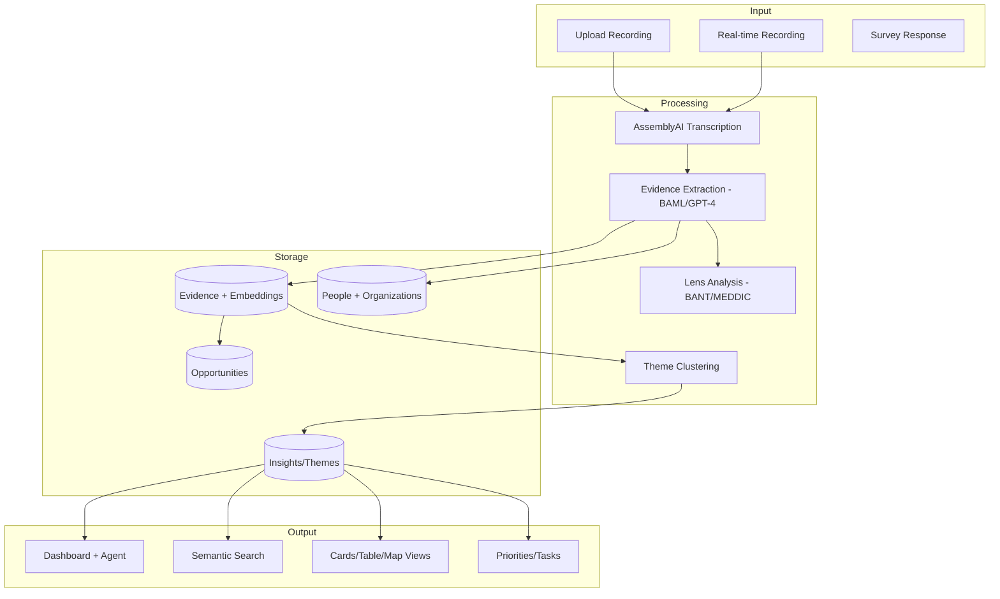
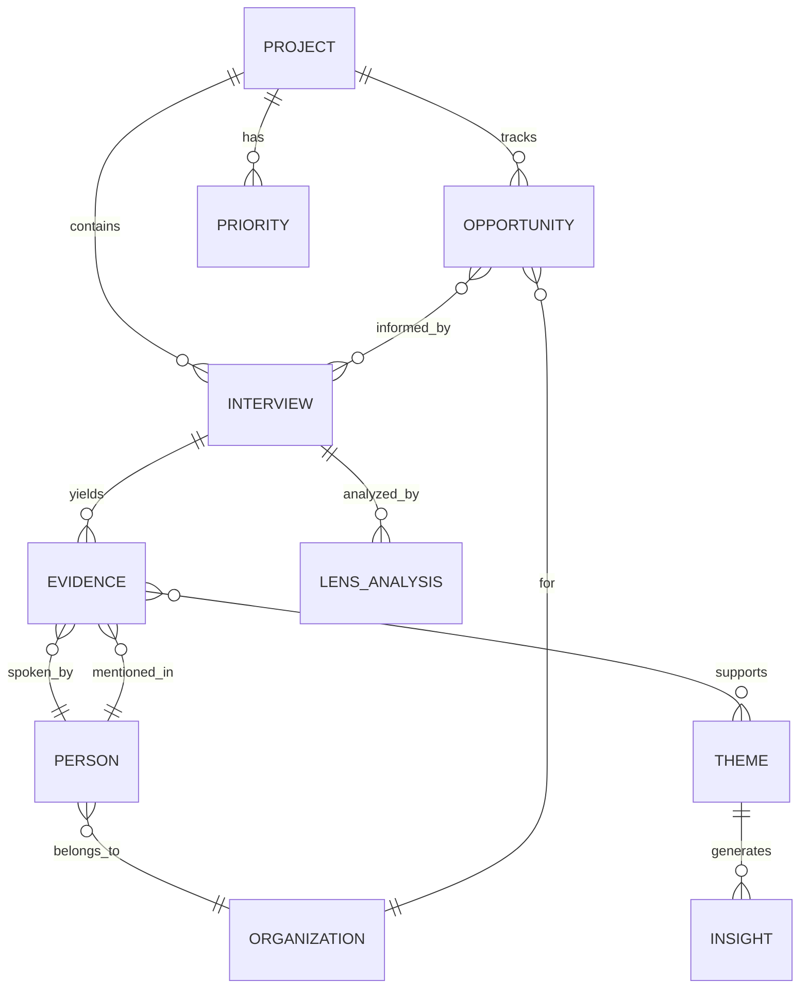

# UpSight: Customer Intelligence That Drives Action

## The Problem We Solve

**For Product Teams:** Customer insights are scattered across Notion docs, Slack threads, and slide decks. When it's time to prioritize, teams debate opinions instead of referencing what customers actually said. Research gets done, then forgotten.

**For Sales Teams:** Every call generates notes, but extracting actionable intelligence requires manual review. Qualification signals get missed. Deal context lives in individual reps' heads, not shared systems.

**The common pain:** Customer conversations contain gold, but extracting and acting on it takes too long. By the time insights reach decision-makers, they're stale or stripped of context.

---

## One-Sentence Promise

> UpSight transforms customer conversations into verified insights with receipts—so Product knows what to build and Sales knows how to close.

---

## Value Propositions by Persona

### For Product Leaders & Researchers

| Value | How We Deliver It |
|-------|-------------------|
| **Evidence-backed prioritization** | Every insight links to timestamped quotes. No more "I think customers want X"—show the receipts. |
| **Faster synthesis** | AI extracts evidence and clusters themes. Turn 10 interviews into actionable insights in hours, not weeks. |
| **Institutional memory** | Insights persist across team changes. New PMs inherit a living library of customer reality. |
| **Cross-segment analysis** | See how needs differ by job function, seniority, industry. Stop building for imaginary "average users." |
| **Research-to-roadmap connection** | Link insights to priorities. Track which customer problems you're solving (or ignoring). |

**Key Outcome:** Make product decisions faster, with confidence that you're solving real problems for real customers.

---

### For Sales Leaders & Account Executives

| Value | How We Deliver It |
|-------|-------------------|
| **Qualification on autopilot** | BANT/MEDDIC analysis extracts Budget, Authority, Need, Timeline from every call. Stop guessing, start qualifying. |
| **Deal intelligence** | See stakeholders, objections, and next steps pulled directly from conversations. |
| **Competitive patterns** | Spot what competitors promise (and where they fall short) across multiple deals. |
| **Faster ramp** | New reps learn from winning conversations. See exactly what top performers say that works. |
| **Opportunity context** | CRM-style tracking with conversation intelligence built in. Every deal has full context. |

**Key Outcome:** Close more deals by understanding what customers actually care about—and proving you listened.

---

## Core User Journeys

### Journey 1: Product Discovery to Insight

**Persona:** Product Manager, UX Researcher, Founder
**Goal:** Understand customer needs and prioritize what to build
**Time to Value:** First insights in 30-60 minutes after uploading interviews

#### Steps in UpSight

| Step | Action | Where in Product |
|------|--------|------------------|
| 1 | Create a project with research goals | `/projects/new` → Project Setup wizard |
| 2 | Define what you're trying to learn | Setup: "What problem are you solving?" + "What do you want to learn?" |
| 3 | Upload interview recordings | `/projects/{id}/interviews/upload` — supports audio/video |
| 4 | Wait for AI processing | 2-5 min per interview for transcription + evidence extraction |
| 5 | Review extracted evidence | `/projects/{id}/evidence` — grid/list of quotes with timestamps |
| 6 | Explore auto-generated themes | `/projects/{id}/insights` — AI clusters similar evidence |
| 7 | Drill into evidence receipts | Click any insight → see linked quotes with audio playback |
| 8 | Segment analysis | `/projects/{id}/insights/table` — view by job function, seniority, industry |
| 9 | Create priorities from insights | Link insights to `/projects/{id}/priorities` |

#### Friction Points & Gaps

| Issue | Impact | Workaround |
|-------|--------|------------|
| **No bulk upload** | Must upload interviews one at a time | Plan for sequential uploads |
| **Processing wait time** | 2-5 min per interview blocks immediate analysis | Start with 2-3 interviews, add more while analyzing |
| **Theme quality varies** | AI-generated themes sometimes need manual curation | Use "regenerate" or manually create insights |
| **Cross-project synthesis missing** | Can't combine insights across multiple projects | Export and synthesize externally |
| **Limited export options** | Basic data export only | Use API or copy content manually |

#### Time to Value

| Milestone | Time | Condition |
|-----------|------|-----------|
| First evidence extracted | 5-10 min | After first interview uploads |
| Usable insights | 30-60 min | After 3+ interviews processed |
| Segment-level patterns | 2-4 hours | After 5+ interviews with diverse participants |
| Comprehensive research synthesis | 1-2 days | After 10+ interviews + manual curation |

---

### Journey 2: Sales Call Intelligence

**Persona:** Account Executive, Sales Manager, Revenue Leader
**Goal:** Extract qualification signals and deal intelligence from customer calls
**Time to Value:** Qualification summary in 5-10 minutes after upload

#### Steps in UpSight

| Step | Action | Where in Product |
|------|--------|------------------|
| 1 | Upload or record sales call | `/projects/{id}/interviews/upload` or realtime recording |
| 2 | Wait for AI processing | 2-5 min for transcription + lens analysis |
| 3 | Review BANT analysis | Interview detail → Lens section shows Budget/Authority/Need/Timeline |
| 4 | See stakeholder extraction | Lens identifies decision-makers, champions, blockers |
| 5 | Review objections & next steps | AI pulls out concerns raised and commitments made |
| 6 | Link to opportunity | Associate call with deal in `/projects/{id}/opportunities` |
| 7 | Track deal progression | Kanban view by stage or calendar view by close date |

#### Friction Points & Gaps

| Issue | Impact | Workaround |
|-------|--------|------------|
| **No CRM integration** | Must manually sync with Salesforce/HubSpot | Use opportunities as lightweight CRM or export |
| **Lens configuration limited** | BANT/MEDDIC frameworks are preset | Customize via project settings, but UI is basic |
| **No deal scoring** | No automatic qualification scoring | Manually interpret BANT signals |
| **No multi-call threading** | Each call analyzed separately, not as deal progression | Use opportunity notes to synthesize across calls |
| **No email/meeting integration** | Only processes audio/video, not written communications | Upload call recordings only |

#### Time to Value

| Milestone | Time | Condition |
|-----------|------|-----------|
| Qualification signals extracted | 5-10 min | After single call processed |
| Full deal context | 15-30 min | After reviewing lens analysis + creating opportunity |
| Pipeline visibility | 1-2 hours | After adding multiple opportunities |
| Team-wide adoption | 1-2 weeks | After onboarding AEs to upload consistently |

---

### Journey 3: Customer Success Signal Detection

**Persona:** Customer Success Manager, Account Manager
**Goal:** Spot churn risk and expansion signals early
**Time to Value:** Risk signals visible in 10-15 minutes after QBR upload

#### Steps in UpSight

| Step | Action | Where in Product |
|------|--------|------------------|
| 1 | Upload QBR or customer call | `/projects/{id}/interviews/upload` |
| 2 | Review evidence for sentiment | Evidence shows pain points, frustrations, goals |
| 3 | Check for churn signals | Look for evidence tagged with negative facets |
| 4 | Link evidence to customer (person) | Associate with person record in `/projects/{id}/people` |
| 5 | Create follow-up priority | Link concerning evidence to priority/task |
| 6 | Track customer health over time | Person detail shows all evidence across conversations |

#### Friction Points & Gaps

| Issue | Impact | Workaround |
|-------|--------|------------|
| **No health scoring** | No automatic churn risk calculation | Manually assess based on evidence sentiment |
| **No alerts/notifications** | Won't proactively surface concerning signals | Regular review of new evidence required |
| **No CSM-specific views** | General-purpose UI, not CS-optimized | Use people list filtered by role |
| **No playbook triggers** | Can't auto-trigger CS playbooks based on signals | Manual priority creation |

#### Time to Value

| Milestone | Time | Condition |
|-----------|------|-----------|
| Initial risk signals | 10-15 min | After first QBR processed |
| Customer context view | 30 min | After linking evidence to person records |
| Portfolio health view | 2-3 hours | After processing multiple customer calls |

---

### Journey 4: Cross-Team Alignment

**Persona:** Executive, Department Head, Program Manager
**Goal:** Get teams working from the same customer truth
**Time to Value:** Shared view in 1 day after initial setup

#### Steps in UpSight

| Step | Action | Where in Product |
|------|--------|------------------|
| 1 | Create shared project for initiative | `/projects/new` with clear goals |
| 2 | Invite team members | Account settings → Team management |
| 3 | Establish research questions | Project setup defines what you're learning |
| 4 | Aggregate evidence from multiple sources | Team uploads interviews, calls, QBRs |
| 5 | Review synthesized insights | Dashboard shows top themes, Agent chat for Q&A |
| 6 | Assign priorities across teams | `/projects/{id}/priorities` with owners |
| 7 | Track execution | Priority status updates (Planned → In Progress → Done) |

#### Friction Points & Gaps

| Issue | Impact | Workaround |
|-------|--------|------------|
| **No role-based permissions** | Everyone sees everything (no read-only, etc.) | Trust-based access at account level |
| **No workflow automation** | Can't auto-assign or auto-route insights | Manual assignment required |
| **Limited notifications** | No digest emails or Slack alerts | Check dashboard regularly |
| **No cross-project views** | Each project is siloed | Create umbrella project or synthesize manually |

#### Time to Value

| Milestone | Time | Condition |
|-----------|------|-----------|
| Team access established | 30 min | After invites sent and accepted |
| Initial shared context | 1 day | After team uploads first batch of conversations |
| Alignment on priorities | 3-5 days | After reviewing insights together and assigning work |

---

### Journey 5: Semantic Search & Discovery

**Persona:** Any team member needing answers
**Goal:** Find specific customer evidence without digging through transcripts
**Time to Value:** Answers in seconds (after project has data)

#### Steps in UpSight

| Step | Action | Where in Product |
|------|--------|------------------|
| 1 | Open Project Status Agent | Dashboard chat interface |
| 2 | Ask natural language question | "What are the top pain points for enterprise customers?" |
| 3 | Get synthesized answer with sources | Agent returns answer with evidence links |
| 4 | Drill into specific evidence | Click through to timestamped quotes |
| 5 | Explore related themes | See which insights connect to your query |

#### Friction Points & Gaps

| Issue | Impact | Workaround |
|-------|--------|------------|
| **Agent quality varies** | Sometimes returns generic or incomplete answers | Rephrase question or browse evidence directly |
| **No saved searches** | Can't save frequent queries | Re-ask each time |
| **Limited filtering in search** | Can't combine search with segment filters | Browse evidence view with filters instead |

#### Time to Value

| Milestone | Time | Condition |
|-----------|------|-----------|
| First useful answer | Seconds | If project has processed interviews |
| Trusted search resource | 1 week | After team builds habit of asking agent |

---

## Product Maturity Assessment

### What's Strong

| Capability | Maturity | Notes |
|------------|----------|-------|
| Interview transcription | High | AssemblyAI integration is reliable |
| Evidence extraction | High | AI quality is good, links to timestamps |
| BANT/qualification analysis | Medium-High | Frameworks work well, configuration limited |
| Insight clustering | Medium | Auto-themes useful but need curation |
| People/Organization tracking | Medium | Basic CRM features, no external sync |
| Dashboard & Agent | Medium | Useful for quick answers, improving |
| Opportunities pipeline | Medium | Functional Kanban, no integrations |

### Where We Have Gaps

| Gap | User Impact | Priority to Fix |
|-----|-------------|-----------------|
| **No CRM integrations** | Sales teams must double-enter data | High |
| **No Slack/email notifications** | Users must check app proactively | High |
| **No bulk operations** | Tedious for large research projects | Medium |
| **No cross-project synthesis** | Can't see patterns across initiatives | Medium |
| **Limited export/reporting** | Hard to share outside UpSight | Medium |
| **No role-based permissions** | Can't give stakeholders limited access | Low-Medium |
| **No deal/health scoring** | Manual interpretation required | Low |

---

## Competitive Positioning

### vs. Gong/Chorus (Revenue Intelligence)
- **We're different:** Evidence-first, not just transcription. Insights link to receipts.
- **We're weaker:** No native CRM integrations, no real-time coaching.
- **Best for:** Teams who want research + sales intelligence unified.

### vs. Dovetail/Condens (Research Repositories)
- **We're different:** CRM features built in. Opportunities + People + Insights together.
- **We're weaker:** Fewer research-specific features (tagging, highlights, video clips).
- **Best for:** Teams who want discovery-to-action in one tool.

### vs. Notion/Confluence (Knowledge Management)
- **We're different:** AI does the extraction. Evidence links to timestamps automatically.
- **We're weaker:** Less flexible for general documentation.
- **Best for:** Teams drowning in interview recordings with no time to synthesize.

---

## Implementation Recommendations

### Quick Win Setup (First Week)

1. Create one project focused on current priority
2. Upload 5-10 recent customer conversations
3. Review evidence and refine any obvious errors
4. Share 3 key insights with stakeholders—demonstrate receipts value
5. Create 2-3 priorities linked to insights

### Scaling Adoption (First Month)

1. Establish upload habits (post-call ritual)
2. Train team on evidence review workflow
3. Set up opportunities tracking for sales
4. Create segments to enable cross-customer analysis
5. Weekly insight review meeting using dashboard

### Full Value Realization (First Quarter)

1. All customer conversations flowing through UpSight
2. Research-backed prioritization is default
3. Sales uses qualification analysis consistently
4. Cross-team visibility into customer truth
5. Historical evidence informs new initiatives

---

## Appendix: Technical Architecture

---

## Entity Relationships

