# UpSight: Customer Intelligence That Drives Action

## Positioning

**Category:** Customer Intelligence Platform (conversation-first CRM for Product + Sales)

**Ideal customer:** B2B teams doing recurring customer conversations (discovery interviews, sales calls, support/QBRs) who need a shared system of record for what customers said and what it implies.

**Wedge:** Start from *recordings → evidence → insights* (with receipts), then layer in lightweight CRM objects (people, orgs, opportunities, tasks) so action stays connected to proof.

**Differentiators:**

- **Receipts, not summaries**: Every insight is backed by timestamped evidence.
- **One model across Product + Sales**: Same underlying conversation graph, different lenses (Research, Customer Discovery, BANT).
- **Institutional memory**: Insights persist and remain queryable as the team changes.
- **Segmented truth**: Patterns by role, seniority, org type—avoid averaging away the signal.

**Why now:** Teams have more customer conversations than ever (Zoom/Meet/Slack huddles), but the intelligence is trapped in unstructured notes. AI can extract and maintain a living, evidence-backed customer memory—*if* it’s grounded in provenance.

## The Problem We Solve

**For Product Teams:** Customer insights are scattered across Notion docs, Slack threads, and slide decks. When it's time to prioritize, teams debate opinions instead of referencing what customers actually said. Research gets done, then forgotten.

**For Sales Teams:** Every call generates notes, but extracting actionable intelligence requires manual review. Qualification signals get missed. Deal context lives in individual reps' heads, not shared systems.

**The common pain:** Customer conversations contain gold, but extracting and acting on it takes too long. By the time insights reach decision-makers, they're stale or stripped of context.

---

## One-Sentence Promise

> UpSight transforms customer conversations into verified insights with receipts—so Product knows what to build and Sales knows how to close.

---

## Value Propositions by Persona

### For Product Leaders & Researchers

| Value | How We Deliver It |
|-------|-------------------|
| **Evidence-backed prioritization** | Every insight links to timestamped quotes. No more "I think customers want X"—show the receipts. |
| **Faster synthesis** | AI extracts evidence and clusters into insights. Turn 10 conversations into actionable patterns in hours, not weeks. |
| **Institutional memory** | Insights persist across team changes. New PMs inherit a living library of customer reality. |
| **Cross-segment analysis** | See how needs differ by job function, seniority, industry. Stop building for imaginary "average users." |
| **Research-to-roadmap connection** | Link insights to tasks. Track which customer problems you're solving (or ignoring). |

**Key Outcome:** Make product decisions faster, with confidence that you're solving real problems for real customers.

---

### For Sales Leaders & Account Executives

| Value | How We Deliver It |
|-------|-------------------|
| **Qualification on autopilot** | Sales BANT lens extracts Budget, Authority, Need, Timeline from every call. Stop guessing, start qualifying. |
| **Deal intelligence** | See stakeholders, objections, and next steps pulled directly from conversations. |
| **Competitive patterns** | Spot what competitors promise (and where they fall short) across multiple deals. |
| **Faster ramp** | New reps learn from winning conversations. See exactly what top performers say that works. |
| **Opportunity context** | CRM-style tracking with conversation intelligence built in. Every deal has full context. |

**Key Outcome:** Close more deals by understanding what customers actually care about—and proving you listened.

---

## Core Concepts

### Entity Model

| Entity | Description |
|--------|-------------|
| **Conversations** | Audio/video recordings of customer interactions (interviews, sales calls, QBRs, support calls) |
| **Evidence** | AI-extracted quotes and moments from conversations with timestamps |
| **Insights** | Clustered patterns and findings supported by multiple pieces of evidence |
| **People** | Individuals who appear in or are mentioned in conversations |
| **Organizations** | Companies and institutions that people belong to |
| **Opportunities** | Sales deals tracked through pipeline stages |
| **Tasks** | Action items linked to insights and opportunities |
| **Annotations** | Comments and notes attached to any entity |
| **Conversation Lenses** | Analytical frameworks applied to extract structured data |
| **Project Assets** | Imported files, tables, PDFs, and external data |

### Key Relationships

```
Conversations → Evidence → Insights
     ↓              ↓          ↓
   People    ←→  Organizations
     ↓              ↓
Opportunities ←→ Tasks
```

**Tasks can link to:** Evidence, People, Organizations, Opportunities, Conversations, Insights, Personas

**Annotations can attach to:** Insights, Personas, Opportunities, Conversations, People, Projects, Organizations, Tasks

---

## Conversation Lenses

Lenses are analytical frameworks that extract structured data from conversations. Each lens focuses on different aspects:

### Research Lenses

| Lens | Purpose | Key Extractions |
|------|---------|-----------------|
| **Project Research** | Map findings to project goals | Goal answers, decision insights, unknown resolutions, target fit |
| **Question Coverage** | Track what was asked/answered | Answered questions, unanswered questions, skipped topics, follow-ups |
| **Customer Discovery** | Profile customers and validate problems | Interviewee profile, org context, behavioral characteristics, problem validation, segment signals |
| **Empathy Map / JTBD** | Understand motivations | Says/Thinks/Does/Feels, functional/social/emotional jobs |

### Product Lenses

| Lens | Purpose | Key Extractions |
|------|---------|-----------------|
| **User Testing** | Evaluate usability | Task completion, friction points, feature feedback, satisfaction |
| **Product Insights** | Identify opportunities | Jobs to be done, feature requests, product gaps, competitive insights |

### Sales Lenses

| Lens | Purpose | Key Extractions |
|------|---------|-----------------|
| **Sales BANT** | Qualify opportunities | Budget, Authority, Need, Timeline, deal size, blockers |

### Consulting Lenses

| Lens | Purpose | Key Extractions |
|------|---------|-----------------|
| **Consulting Project** | Align delivery expectations | Context/brief, stakeholder inputs, alignment gaps, plan/milestones, risks |

---

## Core User Journeys

### Journey 1: Product Discovery to Insight

**Persona:** Product Manager, UX Researcher, Founder
**Goal:** Understand customer needs and prioritize what to build
**Time to Value:** First insights in 30-60 minutes after uploading conversations

#### Steps in UpSight

| Step | Action | Where in Product |
|------|--------|------------------|
| 1 | Create a project with research goals | `/projects/new` → Project Setup wizard |
| 2 | Define what you're trying to learn | Setup: "What problem are you solving?" + "What do you want to learn?" |
| 3 | Upload conversation recordings | `/projects/{id}/interviews/upload` — supports audio/video |
| 4 | Wait for AI processing | 2-5 min per conversation for transcription + evidence extraction |
| 5 | Review extracted evidence | `/projects/{id}/evidence` — grid/list of quotes with timestamps |
| 6 | Apply Customer Discovery lens | Conversation detail → Lenses tab |
| 7 | Explore auto-generated insights | `/projects/{id}/insights` — AI clusters similar evidence |
| 8 | Drill into evidence receipts | Click any insight → see linked quotes with audio playback |
| 9 | Segment analysis | `/projects/{id}/insights/table` — view by job function, seniority, industry |
| 10 | Create tasks from insights | Link insights to `/projects/{id}/priorities` |

#### Friction Points & Gaps

| Issue | Impact | Workaround |
|-------|--------|------------|
| **No bulk upload** | Must upload conversations one at a time | Plan for sequential uploads |
| **Processing wait time** | 2-5 min per conversation blocks immediate analysis | Start with 2-3 conversations, add more while analyzing |
| **Insight quality varies** | AI-generated insights sometimes need manual curation | Use "regenerate" or manually create insights |
| **Cross-project synthesis missing** | Can't combine insights across multiple projects | Export and synthesize externally |
| **Limited export options** | Basic data export only | Use API or copy content manually |

#### Time to Value

| Milestone | Time | Condition |
|-----------|------|-----------|
| First evidence extracted | 5-10 min | After first conversation uploads |
| Usable insights | 30-60 min | After 3+ conversations processed |
| Segment-level patterns | 2-4 hours | After 5+ conversations with diverse participants |
| Comprehensive research synthesis | 1-2 days | After 10+ conversations + manual curation |

---

### Journey 2: Sales Call Intelligence

**Persona:** Account Executive, Sales Manager, Revenue Leader
**Goal:** Extract qualification signals and deal intelligence from customer calls
**Time to Value:** Qualification summary in 5-10 minutes after upload

#### Steps in UpSight

| Step | Action | Where in Product |
|------|--------|------------------|
| 1 | Upload or record sales call | `/projects/{id}/interviews/upload` or realtime recording |
| 2 | Wait for AI processing | 2-5 min for transcription + lens analysis |
| 3 | Apply Sales BANT lens | Conversation detail → Lenses tab → Sales BANT |
| 4 | Review BANT analysis | See Budget, Authority, Need, Timeline extracted |
| 5 | See stakeholder extraction | Lens identifies decision-makers, champions, blockers |
| 6 | Review objections & next steps | AI pulls out concerns raised and commitments made |
| 7 | Link to opportunity | Associate call with deal in `/projects/{id}/opportunities` |
| 8 | Track deal progression | Kanban view by stage or calendar view by close date |
| 9 | Add annotations | Comment on key moments for team visibility |

#### Friction Points & Gaps

| Issue | Impact | Workaround |
|-------|--------|------------|
| **No CRM integration** | Must manually sync with Salesforce/HubSpot | Use opportunities as lightweight CRM or export |
| **No deal scoring** | No automatic qualification scoring | Manually interpret BANT signals |
| **No multi-call threading** | Each call analyzed separately, not as deal progression | Use opportunity notes to synthesize across calls |
| **No email/meeting integration** | Only processes audio/video, not written communications | Upload call recordings only |

#### Time to Value

| Milestone | Time | Condition |
|-----------|------|-----------|
| Qualification signals extracted | 5-10 min | After single call processed |
| Full deal context | 15-30 min | After reviewing lens analysis + creating opportunity |
| Pipeline visibility | 1-2 hours | After adding multiple opportunities |
| Team-wide adoption | 1-2 weeks | After onboarding AEs to upload consistently |

---

### Journey 3: Customer Success Signal Detection

**Persona:** Customer Success Manager, Account Manager
**Goal:** Spot churn risk and expansion signals early
**Time to Value:** Risk signals visible in 10-15 minutes after QBR upload

#### Steps in UpSight

| Step | Action | Where in Product |
|------|--------|------------------|
| 1 | Upload QBR or customer call | `/projects/{id}/interviews/upload` |
| 2 | Review evidence for sentiment | Evidence shows pain points, frustrations, goals |
| 3 | Apply Question Coverage lens | See what questions were asked/unanswered |
| 4 | Check for churn signals | Look for evidence tagged with negative facets |
| 5 | Link evidence to customer (person) | Associate with person record in `/projects/{id}/people` |
| 6 | Add annotations | Comment on concerning signals for team visibility |
| 7 | Create follow-up task | Link concerning evidence to task with owner |
| 8 | Track customer health over time | Person detail shows all evidence across conversations |

#### Friction Points & Gaps

| Issue | Impact | Workaround |
|-------|--------|------------|
| **No health scoring** | No automatic churn risk calculation | Manually assess based on evidence sentiment |
| **No alerts/notifications** | Won't proactively surface concerning signals | Regular review of new evidence required |
| **No CSM-specific views** | General-purpose UI, not CS-optimized | Use people list filtered by role |
| **No playbook triggers** | Can't auto-trigger CS playbooks based on signals | Manual task creation |

#### Time to Value

| Milestone | Time | Condition |
|-----------|------|-----------|
| Initial risk signals | 10-15 min | After first QBR processed |
| Customer context view | 30 min | After linking evidence to person records |
| Portfolio health view | 2-3 hours | After processing multiple customer calls |

---

### Journey 4: Cross-Team Alignment

**Persona:** Executive, Department Head, Program Manager
**Goal:** Get teams working from the same customer truth
**Time to Value:** Shared view in 1 day after initial setup

#### Steps in UpSight

| Step | Action | Where in Product |
|------|--------|------------------|
| 1 | Create shared project for initiative | `/projects/new` with clear goals |
| 2 | Invite team members | Account settings → Team management |
| 3 | Establish research questions | Project setup defines what you're learning |
| 4 | Aggregate evidence from multiple sources | Team uploads conversations, calls, QBRs |
| 5 | Apply Project Research lens | Map findings to project goals and decisions |
| 6 | Review synthesized insights | Dashboard shows top patterns, Agent chat for Q&A |
| 7 | Add annotations across entities | Comment on insights, people, opportunities for context |
| 8 | Assign tasks across teams | `/projects/{id}/priorities` with owners |
| 9 | Track execution | Task status updates (Planned → In Progress → Done) |

#### Friction Points & Gaps

| Issue | Impact | Workaround |
|-------|--------|------------|
| **No role-based permissions** | Everyone sees everything (no read-only, etc.) | Trust-based access at account level |
| **No workflow automation** | Can't auto-assign or auto-route insights | Manual assignment required |
| **Limited notifications** | No digest emails or Slack alerts | Check dashboard regularly |
| **No cross-project views** | Each project is siloed | Create umbrella project or synthesize manually |

#### Time to Value

| Milestone | Time | Condition |
|-----------|------|-----------|
| Team access established | 30 min | After invites sent and accepted |
| Initial shared context | 1 day | After team uploads first batch of conversations |
| Alignment on priorities | 3-5 days | After reviewing insights together and assigning work |

---

### Journey 5: Semantic Search & Discovery

**Persona:** Any team member needing answers
**Goal:** Find specific customer evidence without digging through transcripts
**Time to Value:** Answers in seconds (after project has data)

#### Steps in UpSight

| Step | Action | Where in Product |
|------|--------|------------------|
| 1 | Open Project Status Agent | Dashboard chat interface |
| 2 | Ask natural language question | "What are the top pain points for enterprise customers?" |
| 3 | Get synthesized answer with sources | Agent returns answer with evidence links |
| 4 | Drill into specific evidence | Click through to timestamped quotes |
| 5 | Explore related insights | See which insights connect to your query |
| 6 | Search project assets | Find relevant imported documents and tables |

#### Friction Points & Gaps

| Issue | Impact | Workaround |
|-------|--------|------------|
| **Agent quality varies** | Sometimes returns generic or incomplete answers | Rephrase question or browse evidence directly |
| **No saved searches** | Can't save frequent queries | Re-ask each time |
| **Limited filtering in search** | Can't combine search with segment filters | Browse evidence view with filters instead |

#### Time to Value

| Milestone | Time | Condition |
|-----------|------|-----------|
| First useful answer | Seconds | If project has processed conversations |
| Trusted search resource | 1 week | After team builds habit of asking agent |

---

## Product Maturity Assessment

### What's Strong

| Capability | Maturity | Notes |
|------------|----------|-------|
| Conversation transcription | High | AssemblyAI integration is reliable |
| Evidence extraction | High | AI quality is good, links to timestamps |
| Conversation Lenses | High | 8 lens types with structured extraction |
| Sales BANT analysis | Medium-High | Framework works well for qualification |
| Insight clustering | Medium | Auto-generation useful but needs curation |
| People/Organization tracking | Medium | Basic CRM features, no external sync |
| Dashboard & Agent | Medium | Useful for quick answers, improving |
| Opportunities pipeline | Medium | Functional Kanban, no integrations |
| Annotations | Medium | Comments work, but no notifications |
| Project Assets | Medium | Can import tables/docs, basic search |

### Where We Have Gaps

| Gap | User Impact | Priority to Fix |
|-----|-------------|-----------------|
| **No CRM integrations** | Sales teams must double-enter data | High |
| **No Slack/email notifications** | Users must check app proactively | High |
| **No bulk operations** | Tedious for large research projects | Medium |
| **No cross-project synthesis** | Can't see patterns across initiatives | Medium |
| **Limited export/reporting** | Hard to share outside UpSight | Medium |
| **No role-based permissions** | Can't give stakeholders limited access | Low-Medium |
| **No deal/health scoring** | Manual interpretation required | Low |
| **No video clip extraction** | Can't create shareable highlight reels | Low |

---

## Competitive Positioning

### vs. Gong/Chorus (Revenue Intelligence)
- **We're different:** Evidence-first with multiple lenses beyond sales. Insights link to receipts for verification.
- **We're weaker:** No native CRM integrations, no real-time coaching, no email analysis.
- **Best for:** Teams who want research + sales intelligence unified with product discovery.

### vs. Dovetail/Condens (Research Repositories)
- **We're different:** CRM features built in. Opportunities + People + Insights together. Conversation Lenses for structured extraction.
- **We're weaker:** Fewer research-specific features (tagging, highlights, video clips).
- **Best for:** Teams who want discovery-to-action in one tool.

### vs. Notion/Confluence (Knowledge Management)
- **We're different:** AI does the extraction. Evidence links to timestamps automatically. Lenses provide structured analysis.
- **We're weaker:** Less flexible for general documentation.
- **Best for:** Teams drowning in conversation recordings with no time to synthesize.

---

## Implementation Recommendations

### Quick Win Setup (First Week)

1. Create one project focused on current priority
2. Upload 5-10 recent customer conversations
3. Apply relevant lenses (Customer Discovery, Sales BANT)
4. Review evidence and refine any obvious errors
5. Share 3 key insights with stakeholders—demonstrate receipts value
6. Create 2-3 tasks linked to insights

### Scaling Adoption (First Month)

1. Establish upload habits (post-call ritual)
2. Train team on lens selection for different conversation types
3. Set up opportunities tracking for sales
4. Create people/organization records for key accounts
5. Weekly insight review meeting using dashboard

### Full Value Realization (First Quarter)

1. All customer conversations flowing through UpSight
2. Research-backed prioritization is default
3. Sales uses BANT analysis consistently
4. Cross-team visibility into customer truth
5. Historical evidence informs new initiatives
6. Annotations create institutional knowledge

---

## Appendix: Technical Architecture

```mermaid
%%{init: {'theme': 'base', 'themeVariables': { 'primaryColor': '#e0e7ff', 'primaryTextColor': '#1e1b4b', 'primaryBorderColor': '#6366f1', 'lineColor': '#6366f1', 'secondaryColor': '#fef3c7', 'tertiaryColor': '#dcfce7'}}}%%
graph TD
  subgraph Input["📥 Input"]
    upload[Upload Recording]
    realtime[Real-time Recording]
    assets[Import Assets]
  end

  subgraph Processing["⚙️ Processing"]
    transcribe[AssemblyAI Transcription]
    extract[Evidence Extraction]
    lens[Conversation Lenses]
    cluster[Insight Clustering]
  end

  subgraph Storage["💾 Storage"]
    evidence[(Evidence)]
    people[(People & Orgs)]
    insights[(Insights)]
    opportunities[(Opportunities)]
    tasks[(Tasks)]
  end

  subgraph Output["📊 Output"]
    dashboard[Dashboard & Agent]
    search[Semantic Search]
    views[Cards / Table / Map]
  end

  upload --> transcribe
  realtime --> transcribe
  assets --> evidence
  transcribe --> extract
  extract --> evidence
  extract --> lens
  extract --> people
  evidence --> cluster
  cluster --> insights
  insights --> dashboard
  insights --> search
  insights --> views
  insights --> tasks
  opportunities --> tasks

  style Input fill:#dbeafe,stroke:#3b82f6
  style Processing fill:#fef3c7,stroke:#f59e0b
  style Storage fill:#dcfce7,stroke:#22c55e
  style Output fill:#f3e8ff,stroke:#a855f7
```



---

## Entity Relationships

### Core Data Model

```mermaid
%%{init: {'theme': 'base', 'themeVariables': { 'lineColor': '#64748b', 'primaryColor': '#e2e8f0' }}}%%
flowchart TB
  subgraph project_scope["Project Scope"]
    PROJECT[🗂️ Project]
    CONVERSATION[💬 Conversation]
    OPPORTUNITY[💰 Opportunity]
    TASK[✅ Task]
    ASSET[📎 Asset]
  end

  subgraph intelligence["Intelligence Layer"]
    EVIDENCE[📝 Evidence]
    INSIGHT[💡 Insight]
    LENS[🔍 Lens Analysis]
  end

  subgraph crm["People & Orgs"]
    PERSON[👤 Person]
    ORGANIZATION[🏢 Organization]
    PERSONA[🎭 Persona]
  end

  PROJECT --> CONVERSATION
  PROJECT --> OPPORTUNITY
  PROJECT --> TASK
  PROJECT --> ASSET

  CONVERSATION --> EVIDENCE
  CONVERSATION --> LENS
  EVIDENCE --> INSIGHT
  EVIDENCE -.-> PERSON

  PERSON -.-> ORGANIZATION
  INSIGHT -.-> PERSONA

  TASK -.-> INSIGHT
  TASK -.-> OPPORTUNITY
  TASK -.-> EVIDENCE

  style project_scope fill:#dbeafe,stroke:#3b82f6
  style intelligence fill:#fef3c7,stroke:#f59e0b
  style crm fill:#dcfce7,stroke:#22c55e
```



### Annotation Layer (Comments & Collaboration)

Annotations provide a collaboration layer across the system. They can attach to any core entity:

| Entity | Annotation Use Case |
|--------|---------------------|
| **Insight** | Discuss findings, add context, flag for review |
| **Conversation** | Comment on specific moments, tag team members |
| **Person** | Add notes about relationship, preferences |
| **Organization** | Track company intel, competitive notes |
| **Opportunity** | Deal strategy, win/loss notes |
| **Task** | Progress updates, blockers |
| **Persona** | Refine persona definition collaboratively |

```mermaid
%%{init: {'theme': 'base', 'themeVariables': { 'primaryColor': '#fef3c7' }}}%%
graph LR
  subgraph Annotations["💬 Annotation Layer"]
    ann[Annotations]
  end

  subgraph Entities["Core Entities"]
    insight[Insight]
    conv[Conversation]
    person[Person]
    org[Organization]
    opp[Opportunity]
    task[Task]
    persona[Persona]
  end

  ann -.->|comments| insight
  ann -.->|comments| conv
  ann -.->|comments| person
  ann -.->|comments| org
  ann -.->|comments| opp
  ann -.->|comments| task
  ann -.->|comments| persona

  style ann fill:#fef3c7,stroke:#f59e0b,stroke-width:2px
  style Annotations fill:#fffbeb,stroke:#f59e0b
  style Entities fill:#f8fafc,stroke:#94a3b8
```


