# UpSight: Customer Intelligence That Drives Action

## Positioning

**Category:** Customer Intelligence Platform (conversation-first CRM for Product + Sales)

**Ideal customer:** B2B teams doing recurring customer conversations (discovery interviews, sales calls, support/QBRs) who need a shared system of record for what customers said and what it implies.

**Wedge:** Start from *responses → evidence → insights* (with receipts), then layer in lightweight CRM objects (people, orgs, opportunities, tasks) so action stays connected to proof.

**Differentiators:**

- **Receipts, not summaries**: Every insight is backed by timestamped evidence.
- **One model across Product + Sales**: Same underlying conversation graph, different lenses (Research, Customer Discovery, BANT).
- **Multi-channel input**: Collect feedback via survey forms, AI chat, AI voice, or human interviews—all flowing into the same intelligence pipeline.
- **Institutional memory**: Insights persist and remain queryable as the team changes.
- **Segmented truth**: Patterns by role, seniority, org type—avoid averaging away the signal.

**Why now:** Teams have more customer conversations than ever (Zoom/Meet/Slack huddles), but the intelligence is trapped in unstructured notes. AI can extract and maintain a living, evidence-backed customer memory—*if* it's grounded in provenance.

## The Problem We Solve

**For Product Teams:** Customer insights are scattered across Notion docs, Slack threads, and slide decks. When it's time to prioritize, teams debate opinions instead of referencing what customers actually said. Research gets done, then forgotten.

**For Sales Teams:** Every call generates notes, but extracting actionable intelligence requires manual review. Qualification signals get missed. Deal context lives in individual reps' heads, not shared systems.

**The common pain:** Customer conversations contain gold, but extracting and acting on it takes too long. By the time insights reach decision-makers, they're stale or stripped of context.

---

## One-Sentence Promise

> UpSight transforms customer feedback into verified insights with receipts—so Product knows what to build and Sales knows how to close.

---

## Value Propositions by Persona

### For Product Leaders & Researchers

| Value | How We Deliver It |
|-------|-------------------|
| **Evidence-backed prioritization** | Every insight links to timestamped quotes. No more "I think customers want X"—show the receipts. |
| **Faster synthesis** | AI extracts evidence and clusters into insights. Turn 10 conversations into actionable patterns in hours, not weeks. |
| **Institutional memory** | Insights persist across team changes. New PMs inherit a living library of customer reality. |
| **Cross-segment analysis** | See how needs differ by job function, seniority, industry. Stop building for imaginary "average users." |
| **Research-to-roadmap connection** | Link insights to tasks. Track which customer problems you're solving (or ignoring). |

**Key Outcome:** Make product decisions faster, with confidence that you're solving real problems for real customers.

---

### For Sales Leaders & Account Executives

| Value | How We Deliver It |
|-------|-------------------|
| **Qualification on autopilot** | Sales BANT lens extracts Budget, Authority, Need, Timeline from every call. Stop guessing, start qualifying. |
| **Deal intelligence** | See stakeholders, objections, and next steps pulled directly from conversations. |
| **Competitive patterns** | Spot what competitors promise (and where they fall short) across multiple deals. |
| **Faster ramp** | New reps learn from winning conversations. See exactly what top performers say that works. |
| **Opportunity context** | CRM-style tracking with conversation intelligence built in. Every deal has full context. |

**Key Outcome:** Close more deals by understanding what customers actually care about—and proving you listened.

---

## Core Concepts

### The Unified Project Model

A **Project** is a research initiative built around a core set of questions. Participants can respond through multiple input channels, and all responses flow into the same intelligence pipeline.

```
┌─────────────────────────────────────────────────────────────┐
│                        PROJECT                               │
│  "Customer Discovery Q4"                                     │
│                                                              │
│  Questions:                                                  │
│  1. What's your biggest challenge with [X]?                 │
│  2. How are you solving it today?                           │
│  3. What would success look like?                           │
│                                                              │
│  ┌─────────────────────────────────────────────────────────┐│
│  │              INPUT CHANNELS (admin enables)             ││
│  │                                                         ││
│  │  📝 Survey    💬 AI Chat    🎙️ AI Voice    👤 Interview ││
│  │   (form)    (conversational) (voice bot)   (human-led)  ││
│  └─────────────────────────────────────────────────────────┘│
│                           ↓                                  │
│              All responses → Evidence → Insights             │
└─────────────────────────────────────────────────────────────┘
```

### Input Channels

Each project can enable one or more input channels. Participants choose their preferred method (if multiple are enabled).

| Channel | Experience | Best For |
|---------|------------|----------|
| **Survey (Form)** | Structured questions, one at a time | High volume, async feedback, quick pulse checks |
| **AI Chat** | Conversational AI guides discussion | Deeper exploration, follow-up questions, flexible pacing |
| **AI Voice** | Voice-based AI conversation | Hands-free, accessibility, natural conversation feel |
| **Interview** | Human researcher conducts live call | Complex topics, relationship building, nuanced probing |

**Key principle:** One project = one set of questions. The questions remain consistent across channels, but the *experience* adapts to each channel's strengths.

### Entity Model

| Entity | Description |
|--------|-------------|
| **Projects** | Research initiatives with questions and enabled input channels |
| **Responses** | Individual participant submissions via any input channel |
| **Evidence** | AI-extracted quotes and moments with timestamps/attribution |
| **Insights** | Clustered patterns and findings supported by multiple pieces of evidence |
| **People** | Individuals who respond or are mentioned in conversations |
| **Organizations** | Companies and institutions that people belong to |
| **Opportunities** | Sales deals tracked through pipeline stages |
| **Tasks** | Action items linked to insights and opportunities |
| **Annotations** | Comments and notes attached to any entity |
| **Conversation Lenses** | Analytical frameworks applied to extract structured data |

### Key Relationships

```
Project (Questions + Channels)
     ↓
Responses (via Survey, Chat, Voice, Interview)
     ↓
Evidence → Insights
     ↓         ↓
  People ←→ Organizations
     ↓         ↓
Opportunities ←→ Tasks
```

**Tasks can link to:** Evidence, People, Organizations, Opportunities, Responses, Insights, Personas

**Annotations can attach to:** Insights, Personas, Opportunities, Responses, People, Projects, Organizations, Tasks

---

## Onboarding Flow: Path to Aha

The fastest path to value depends on the user's immediate need. UpSight guides new users through a quick setup that delivers their first insight within minutes.

### Step 1: What Do You Want to Learn?

```
┌─────────────────────────────────────────────────────────────┐
│  What's your research goal?                                  │
│                                                              │
│  ○ Understand customer problems (Product Discovery)          │
│  ○ Qualify sales opportunities (BANT Analysis)              │
│  ○ Gather product feedback (User Testing)                    │
│  ○ Something else (Custom)                                   │
└─────────────────────────────────────────────────────────────┘
```

This choice pre-configures:
- Suggested questions template
- Recommended lenses
- Dashboard widgets

### Step 2: How Will You Collect Feedback?

```
┌─────────────────────────────────────────────────────────────┐
│  How will participants share feedback?                       │
│                                                              │
│  ☑️ Survey form (structured, async)                          │
│  ☑️ AI chat bot (conversational, async)                      │
│  ☐ AI voice bot (coming soon)                                │
│  ☑️ Upload recordings (interviews you've conducted)          │
└─────────────────────────────────────────────────────────────┘
```

Enabling channels generates:
- Public link for survey/chat: `yoursite.com/r/{project-slug}`
- Upload interface for recordings

### Step 3: Quick Start Options

Based on selections, offer the fastest path to value:

| If User Has... | Quick Start Path | Time to First Insight |
|----------------|------------------|----------------------|
| **Existing recordings** | Upload 1-2 calls → AI extracts evidence | 5-10 minutes |
| **Access to customers** | Share survey/chat link → Review first responses | 15-30 minutes |
| **Neither yet** | Use AI to draft questions → Share link | 5 minutes to link, insights when responses arrive |

### Step 4: The Aha Moment

The "Aha" happens when users see:

1. **Evidence with receipts** — "This quote came from Sarah at Acme, 2:34 into the call"
2. **Patterns emerging** — "3 of 5 enterprise users mentioned this same pain point"
3. **Segmented truth** — "SMBs care about price, Enterprise cares about security"

```
┌─────────────────────────────────────────────────────────────┐
│  🎉 Your First Insight                                       │
│                                                              │
│  "Integration complexity is the #1 blocker"                  │
│                                                              │
│  Supported by 4 pieces of evidence:                          │
│  • "We spent 3 months just on integrations" - Sarah, Acme    │
│  • "Our team doesn't have bandwidth for APIs" - Mike, Beta   │
│  • "Integration was why we churned from [competitor]" - Li   │
│  • Survey: 73% rated "ease of integration" as critical       │
│                                                              │
│  [View Evidence] [Create Task] [Ask AI for More]             │
└─────────────────────────────────────────────────────────────┘
```

### Onboarding Success Metrics

| Milestone | Target | Measurement |
|-----------|--------|-------------|
| Project created | < 2 minutes | Time from signup to project saved |
| First response collected | < 24 hours | Via any input channel |
| First evidence viewed | < 5 minutes after response | User clicks into evidence |
| First insight generated | < 1 hour of first 3 responses | AI clustering produces insight |
| Shared with team | < 1 week | Invited at least 1 teammate |

---

## Conversation Lenses

Lenses are analytical frameworks that extract structured data from conversations. Each lens focuses on different aspects:

### Research Lenses

| Lens | Purpose | Key Extractions |
|------|---------|-----------------|
| **Project Research** | Map findings to project goals | Goal answers, decision insights, unknown resolutions, target fit |
| **Question Coverage** | Track what was asked/answered | Answered questions, unanswered questions, skipped topics, follow-ups |
| **Customer Discovery** | Profile customers and validate problems | Interviewee profile, org context, behavioral characteristics, problem validation, segment signals |
| **Empathy Map / JTBD** | Understand motivations | Says/Thinks/Does/Feels, functional/social/emotional jobs |

### Product Lenses

| Lens | Purpose | Key Extractions |
|------|---------|-----------------|
| **User Testing** | Evaluate usability | Task completion, friction points, feature feedback, satisfaction |
| **Product Insights** | Identify opportunities | Jobs to be done, feature requests, product gaps, competitive insights |

### Sales Lenses

| Lens | Purpose | Key Extractions |
|------|---------|-----------------|
| **Sales BANT** | Qualify opportunities | Budget, Authority, Need, Timeline, deal size, blockers |

### Consulting Lenses

| Lens | Purpose | Key Extractions |
|------|---------|-----------------|
| **Consulting Project** | Align delivery expectations | Context/brief, stakeholder inputs, alignment gaps, plan/milestones, risks |

---

## Core User Journeys

### Journey 1: Async Feedback Collection (Survey + Chat)

**Persona:** Product Manager, UX Researcher, Founder
**Goal:** Collect feedback from many customers without scheduling calls
**Time to Value:** First responses in hours, insights same day

#### Steps in UpSight

| Step | Action | Where in Product |
|------|--------|------------------|
| 1 | Create a project with research questions | Project Setup wizard |
| 2 | Enable Survey and/or Chat channels | Input Channels settings |
| 3 | Customize public link appearance | Hero title, subtitle, CTA |
| 4 | Share link with customers | Email, Slack, in-app prompt |
| 5 | Responses arrive and process automatically | Notifications when new responses |
| 6 | Review extracted evidence | Evidence grid with quotes and attribution |
| 7 | Explore auto-generated insights | AI clusters similar evidence |
| 8 | Segment analysis | View patterns by role, company size, etc. |
| 9 | Create tasks from insights | Link to priorities board |

#### Channel Comparison

| Aspect | Survey (Form) | AI Chat |
|--------|---------------|---------|
| Completion rate | Higher (structured) | Variable (conversational) |
| Depth of response | Moderate | Higher (follow-ups) |
| Time per response | 2-5 minutes | 5-15 minutes |
| Best for | Quick pulse, many respondents | Deep discovery, fewer respondents |

---

### Journey 2: Product Discovery to Insight

**Persona:** Product Manager, UX Researcher, Founder
**Goal:** Understand customer needs and prioritize what to build
**Time to Value:** First insights in 30-60 minutes after uploading conversations

#### Steps in UpSight

| Step | Action | Where in Product |
|------|--------|------------------|
| 1 | Create a project with research goals | Project Setup wizard |
| 2 | Define what you're trying to learn | Setup: "What problem are you solving?" + "What do you want to learn?" |
| 3 | Upload conversation recordings | Upload interface — supports audio/video |
| 4 | Wait for AI processing | 2-5 min per conversation for transcription + evidence extraction |
| 5 | Review extracted evidence | Evidence grid — quotes with timestamps |
| 6 | Apply Customer Discovery lens | Conversation detail → Lenses tab |
| 7 | Explore auto-generated insights | AI clusters similar evidence |
| 8 | Drill into evidence receipts | Click any insight → see linked quotes with audio playback |
| 9 | Segment analysis | View by job function, seniority, industry |
| 10 | Create tasks from insights | Link insights to priorities board |

#### Time to Value

| Milestone | Time | Condition |
|-----------|------|-----------|
| First evidence extracted | 5-10 min | After first conversation uploads |
| Usable insights | 30-60 min | After 3+ conversations processed |
| Segment-level patterns | 2-4 hours | After 5+ conversations with diverse participants |
| Comprehensive research synthesis | 1-2 days | After 10+ conversations + manual curation |

---

### Journey 3: Sales Call Intelligence

**Persona:** Account Executive, Sales Manager, Revenue Leader
**Goal:** Extract qualification signals and deal intelligence from customer calls
**Time to Value:** Qualification summary in 5-10 minutes after upload

#### Steps in UpSight

| Step | Action | Where in Product |
|------|--------|------------------|
| 1 | Upload or record sales call | Upload interface or realtime recording |
| 2 | Wait for AI processing | 2-5 min for transcription + lens analysis |
| 3 | Apply Sales BANT lens | Conversation detail → Lenses tab → Sales BANT |
| 4 | Review BANT analysis | See Budget, Authority, Need, Timeline extracted |
| 5 | See stakeholder extraction | Lens identifies decision-makers, champions, blockers |
| 6 | Review objections & next steps | AI pulls out concerns raised and commitments made |
| 7 | Link to opportunity | Associate call with deal in opportunities pipeline |
| 8 | Track deal progression | Kanban view by stage or calendar view by close date |
| 9 | Add annotations | Comment on key moments for team visibility |

#### Time to Value

| Milestone | Time | Condition |
|-----------|------|-----------|
| Qualification signals extracted | 5-10 min | After single call processed |
| Full deal context | 15-30 min | After reviewing lens analysis + creating opportunity |
| Pipeline visibility | 1-2 hours | After adding multiple opportunities |
| Team-wide adoption | 1-2 weeks | After onboarding AEs to upload consistently |

---

### Journey 4: Customer Success Signal Detection

**Persona:** Customer Success Manager, Account Manager
**Goal:** Spot churn risk and expansion signals early
**Time to Value:** Risk signals visible in 10-15 minutes after QBR upload

#### Steps in UpSight

| Step | Action | Where in Product |
|------|--------|------------------|
| 1 | Upload QBR or customer call | Upload interface |
| 2 | Review evidence for sentiment | Evidence shows pain points, frustrations, goals |
| 3 | Apply Question Coverage lens | See what questions were asked/unanswered |
| 4 | Check for churn signals | Look for evidence tagged with negative facets |
| 5 | Link evidence to customer (person) | Associate with person record |
| 6 | Add annotations | Comment on concerning signals for team visibility |
| 7 | Create follow-up task | Link concerning evidence to task with owner |
| 8 | Track customer health over time | Person detail shows all evidence across conversations |

---

### Journey 5: Cross-Team Alignment

**Persona:** Executive, Department Head, Program Manager
**Goal:** Get teams working from the same customer truth
**Time to Value:** Shared view in 1 day after initial setup

#### Steps in UpSight

| Step | Action | Where in Product |
|------|--------|------------------|
| 1 | Create shared project for initiative | Project Setup with clear goals |
| 2 | Invite team members | Account settings → Team management |
| 3 | Establish research questions | Project setup defines what you're learning |
| 4 | Enable multiple input channels | Survey for scale, Chat for depth, Upload for existing calls |
| 5 | Aggregate evidence from multiple sources | All channels flow into same evidence pool |
| 6 | Apply Project Research lens | Map findings to project goals and decisions |
| 7 | Review synthesized insights | Dashboard shows top patterns, Agent chat for Q&A |
| 8 | Assign tasks across teams | Priorities board with owners |
| 9 | Track execution | Task status updates (Planned → In Progress → Done) |

---

### Journey 6: Semantic Search & Discovery

**Persona:** Any team member needing answers
**Goal:** Find specific customer evidence without digging through transcripts
**Time to Value:** Answers in seconds (after project has data)

#### Steps in UpSight

| Step | Action | Where in Product |
|------|--------|------------------|
| 1 | Open Project Status Agent | Dashboard chat interface |
| 2 | Ask natural language question | "What are the top pain points for enterprise customers?" |
| 3 | Get synthesized answer with sources | Agent returns answer with evidence links |
| 4 | Drill into specific evidence | Click through to timestamped quotes |
| 5 | Explore related insights | See which insights connect to your query |

---

## Product Maturity Assessment

### What's Strong

| Capability | Maturity | Notes |
|------------|----------|-------|
| Conversation transcription | High | AssemblyAI integration is reliable |
| Evidence extraction | High | AI quality is good, links to timestamps |
| Conversation Lenses | High | 8 lens types with structured extraction |
| Multi-channel input | Medium-High | Survey + Chat working, Voice coming |
| Sales BANT analysis | Medium-High | Framework works well for qualification |
| Insight clustering | Medium | Auto-generation useful but needs curation |
| People/Organization tracking | Medium | Basic CRM features, no external sync |
| Dashboard & Agent | Medium | Useful for quick answers, improving |
| Opportunities pipeline | Medium | Functional Kanban, no integrations |
| Annotations | Medium | Comments work, but no notifications |

### Where We Have Gaps

| Gap | User Impact | Priority to Fix |
|-----|-------------|-----------------|
| **No CRM integrations** | Sales teams must double-enter data | High |
| **No Slack/email notifications** | Users must check app proactively | High |
| **AI Voice channel** | Missing hands-free option | Medium-High |
| **No bulk operations** | Tedious for large research projects | Medium |
| **No cross-project synthesis** | Can't see patterns across initiatives | Medium |
| **Limited export/reporting** | Hard to share outside UpSight | Medium |
| **No role-based permissions** | Can't give stakeholders limited access | Low-Medium |
| **No deal/health scoring** | Manual interpretation required | Low |
| **No video clip extraction** | Can't create shareable highlight reels | Low |

---

## Competitive Positioning

### vs. Gong/Chorus (Revenue Intelligence)
- **We're different:** Evidence-first with multiple lenses beyond sales. Multi-channel input (survey, chat, voice, interview). Insights link to receipts for verification.
- **We're weaker:** No native CRM integrations, no real-time coaching, no email analysis.
- **Best for:** Teams who want research + sales intelligence unified with product discovery.

### vs. Dovetail/Condens (Research Repositories)
- **We're different:** CRM features built in. Multi-channel collection (not just interviews). Opportunities + People + Insights together.
- **We're weaker:** Fewer research-specific features (tagging, highlights, video clips).
- **Best for:** Teams who want discovery-to-action in one tool.

### vs. Typeform/SurveyMonkey (Survey Tools)
- **We're different:** AI-powered analysis. Multi-channel (add chat or voice to surveys). Evidence extraction, not just response aggregation.
- **We're weaker:** Less sophisticated survey logic and branching.
- **Best for:** Teams who want insight synthesis, not just data collection.

### vs. Notion/Confluence (Knowledge Management)
- **We're different:** AI does the extraction. Evidence links to timestamps automatically. Lenses provide structured analysis.
- **We're weaker:** Less flexible for general documentation.
- **Best for:** Teams drowning in conversation recordings with no time to synthesize.

---

## Implementation Recommendations

### Quick Win Setup (First Hour)

1. Create one project focused on current priority
2. Choose your fastest path:
   - **Have recordings?** Upload 2-3 → see evidence in 10 minutes
   - **Have customer access?** Share survey/chat link → see responses same day
   - **Neither?** Draft questions with AI → be ready when customers respond
3. Review first evidence and share with 1 stakeholder
4. Demonstrate the "receipt" value: "This is exactly what Sarah said at 2:34"

### Scaling Adoption (First Month)

1. Enable multiple input channels based on use case
2. Establish habits: post-call upload ritual, survey link in signatures
3. Train team on lens selection for different conversation types
4. Set up opportunities tracking for sales
5. Create people/organization records for key accounts
6. Weekly insight review meeting using dashboard

### Full Value Realization (First Quarter)

1. All customer conversations flowing through UpSight
2. Survey/chat links embedded in product and emails
3. Research-backed prioritization is default
4. Sales uses BANT analysis consistently
5. Cross-team visibility into customer truth
6. Historical evidence informs new initiatives
7. Annotations create institutional knowledge

---

## Appendix: Technical Architecture


---

## Entity Relationships

### Core Data Model

```mermaid
%%{init: {'theme': 'base', 'themeVariables': { 'lineColor': '#64748b', 'primaryColor': '#e2e8f0' }}}%%
flowchart TB
  subgraph project_scope["Project Scope"]
    PROJECT[🗂️ Project]
    QUESTIONS[❓ Questions]
    CHANNELS[📡 Input Channels]
    RESPONSE[💬 Response]
    OPPORTUNITY[💰 Opportunity]
    TASK[✅ Task]
    ASSET[📎 Asset]
  end

  subgraph intelligence["Intelligence Layer"]
    EVIDENCE[📝 Evidence]
    INSIGHT[💡 Insight]
    LENS[🔍 Lens Analysis]
  end

  subgraph crm["People & Orgs"]
    PERSON[👤 Person]
    ORGANIZATION[🏢 Organization]
    PERSONA[🎭 Persona]
  end

  PROJECT --> QUESTIONS
  PROJECT --> CHANNELS
  PROJECT --> OPPORTUNITY
  PROJECT --> TASK
  PROJECT --> ASSET

  CHANNELS --> RESPONSE
  QUESTIONS --> RESPONSE
  RESPONSE --> EVIDENCE
  RESPONSE --> LENS
  EVIDENCE --> INSIGHT
  EVIDENCE -.-> PERSON

  PERSON -.-> ORGANIZATION
  INSIGHT -.-> PERSONA

  TASK -.-> INSIGHT
  TASK -.-> OPPORTUNITY
  TASK -.-> EVIDENCE

  style project_scope fill:#dbeafe,stroke:#3b82f6
  style intelligence fill:#fef3c7,stroke:#f59e0b
  style crm fill:#dcfce7,stroke:#22c55e
```



### Input Channel Flow


### Annotation Layer (Comments & Collaboration)

Annotations provide a collaboration layer across the system. They can attach to any core entity:

| Entity | Annotation Use Case |
|--------|---------------------|
| **Insight** | Discuss findings, add context, flag for review |
| **Response** | Comment on specific moments, tag team members |
| **Person** | Add notes about relationship, preferences |
| **Organization** | Track company intel, competitive notes |
| **Opportunity** | Deal strategy, win/loss notes |
| **Task** | Progress updates, blockers |
| **Persona** | Refine persona definition collaboratively |


