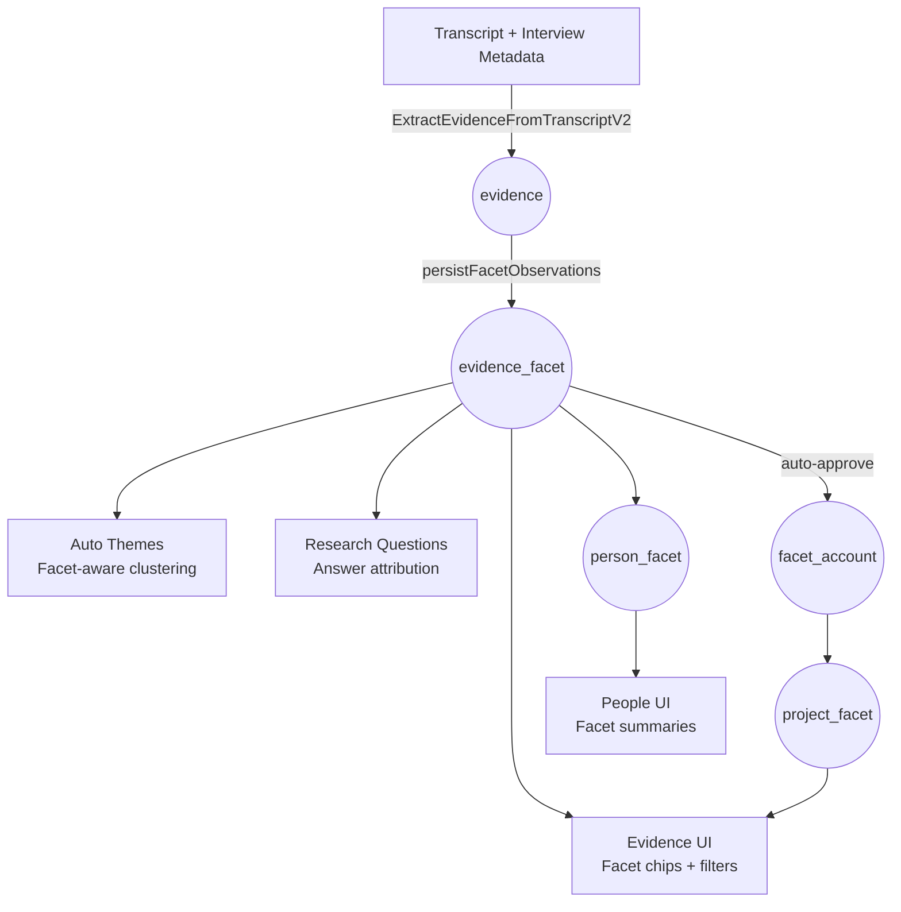

# Facet Catalog & People Attributes

This guide explains the multi-tenant facet catalog, how interview ingestion auto-tags people, and how researchers can manage new candidates.

## Catalog Layers

1. **Global seeds** (`facet_kind_global`, `facet_global`)
   - Shared vocabulary shipped with the product.
   - Read-only to tenants; seeds live in migrations + `_NORUN_seed.sql`.
2. **Account vocabulary** (`facet_account`)
   - Team-specific terms (active or disabled) available to ingestion and the UI.
   - Each record references the global kind and optionally links back to a global facet.

Resolution order shown in the UI + BAML: `account facets → global seeds`.

## Interview Ingestion Pipeline

1. `processInterview.server.ts` loads the merged catalog via `getFacetCatalog(accountId, projectId)`.
2. The catalog is passed into `ExtractEvidenceFromTranscript`, so BAML can:
   - Prefer existing facets (`facet_ref` like `g:12` or `a:45`).
   - Emit per-person scales on the defined `scale` kind.
   - Produce `candidate` payloads when no safe match exists.
3. `persistFacetObservations` writes the results:
   - Matched facets go to `person_facet` (one row per person/facet pair).
   - Scales go to `person_scale` (normalised `0…1` score + optional band).
   - Candidates land in `facet_candidate` with evidence pointers for analyst review.

Every new candidate carries the originating person, evidence, synonyms, and free-form notes. Approving a candidate promotes it to `facet_account`, links it to the current project (via `project_facet`), and optionally seeds back the person-facet relationship.

## Managing the Catalog

Navigate to **Project → Facets** to:

- View the merged catalog for the current project.
- Enable/disable facets or set project-specific aliases.
- Review candidates generated from interviews.
- Suggestions from the ingestion pipeline are auto-approved and enabled for the project so teams can use them immediately. You can still reject or adjust them afterwards from the management view.

You can open the management screen directly from **People → Manage Facets**. The table shows
pending candidates alongside existing account/project facets so analysts can make decisions
without leaving the participant workflow.

Approving a candidate will:

1. Create an account-level facet (unique slug per kind, per account).
2. Enable it for the current project.
3. Mark the candidate as `approved` and link it back to the new facet reference.
4. Optionally attach the facet to the originating person (if known).

Use the aliases/toggles to keep project language consistent without fragmenting the shared vocabulary.

### Editing People Facets

- Person cards now surface the top three facets so researchers can spot key traits quickly.
- The person detail page lists all facets and scales that were inferred from interviews.
- The **Edit Person** form includes:
  - A multi-select of the enabled catalog entries so you can attach/remove facets manually.
  - A "Suggest New Facet" block that creates a `facet_candidate` entry (kind, label, optional
    synonyms/notes). Suggestions appear in the Facet Management queue for approval.

### Candidate Review Actions

The management page supports:

- Approve / reject individual candidates (records promoted on approval, removed on rejection).
- Auto-accept all pending candidates.
- Inline editing of project aliases, enable toggles, pinning, and sort weights for catalog entries.

## Tables Overview

| Table | Purpose |
| --- | --- |
| `facet_kind_global` | Canonical facet kinds (goal, pain, behavior, etc.). |
| `facet_global` | Seed facets shipped with the platform. |
| `facet_account` | Account-level terms promoted by analysts. |
| `project_facet` | Project overrides, aliases, and project-only facets. |
| `facet_candidate` | Queue of AI-suggested facets awaiting review. |
| `person_facet` | Person ↔ facet assignments with evidence + confidence. |
| `person_scale` | Person ↔ scale score (0–1) for behavioural spectra. |
| `evidence_facet` | Evidence ↔ facet linkage used for filtering, theming, and research questions. |

> **What is `facet_ref`?** When a mention matches an existing catalog entry, we store the stable reference (like `g:12` or `a:45`) in both `evidence_facet` and `person_facet`. If the mention is brand new, the reference is `null` and the auto-approval flow will promote it into the catalog. Keeping the reference lets the UI collapse synonyms and aliases down to the same single facet.

## Evidence → Facet Flow

### Analyst Journey

1. **Upload or stream interviews.** Extraction now emits facet mentions per evidence unit instead of raw kind tags.
2. **Evidence review.** The evidence inbox shows per-facet chips sourced from `evidence_facet`. Analysts can filter/group without dealing with ad-hoc tags.
3. **Facet management.** High-confidence matches attach directly to catalogue entries. Unknown labels surface in the Facet Management queue (`facet_candidate`) for a quick approve/alias flow.
4. **Person & theme insights.** Approved facets flow through to people cards and auto-theming, ensuring consistent language from first ingestion to strategy decks.
5. **Research questions.** When evidence aligns with question categories (goal, pain, workflow, etc.), we link it automatically using the facet kind, producing cleaner project answers.

The result is a single vocabulary that analysts can reason about once and reuse across evidence, personas, and reporting.

## Developer Notes

- Use `getFacetCatalog` / `persistFacetObservations` for server logic.
- BAML contract lives in `baml_src/extract_evidence.baml`; ensure new fields stay in sync.
- Multi-tenant enforcement relies on RLS; always pass `accountId` + `projectId` when querying.
- Seeds for global kinds/facets live in `_NORUN_seed.sql` so local resets remain deterministic.
- UI state lives under `app/features/facets`; update that feature when adding new management flows.
- Automated verification lives in `app/lib/database/facets.server.test.ts` (catalog merge rules) and `app/utils/processInterview.server.integration.test.ts` (ingestion pipeline + persistence) — keep them aligned with schema changes.
- Global seed kinds now cover goals, pains, behaviors, workflows, preferences, demographics,
  and decision criteria. Enable or promote any new kind at the project/account layer before
  expecting BAML to emit observations for it.
