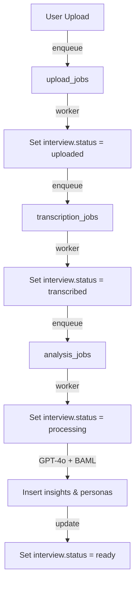

# Transcription & Insight Pipeline – Queue-Based Architecture

## 1&nbsp;– Goals

* Provide a **robust, resumable pipeline** for long-running media processing (upload → transcribe → analyze → ready).
* **Decouple** each heavy step with Postgres job queues so that failure in any step can be retried without re-playing previous steps.
* Expose **live status** to the UI via Supabase Realtime so users can watch progress in the Onboard/Processing widget.
* Keep implementation inside the existing Remix + Supabase stack using **Postgres** workers (or Supabase Functions as an alternative) and **Row Level Security**.
* Follow “Personas” design language for UI polish.

---

## 2 – High-Level Flow



Each queue table stores checkpoints so workers can **resume** idempotently.

---

## 3 – Postgres Changes

### 3.1 Enums

```sql
create type job_status as enum ('pending','in_progress','done','error','retry');
-- Existing interview_status already covers UI states.
```

### 3.2 Queue Tables

```sql
-- 1. upload_jobs
create table upload_jobs (
  id uuid primary key default gen_random_uuid(),
  interview_id uuid not null references interviews(id) on delete cascade,
  media_file bytea,        -- temporary storage for direct uploads (or external_url)
  external_url text,
  attempts int default 0,
  last_error text,
  status job_status not null default 'pending',
  created_at timestamptz default now(),
  updated_at timestamptz default now()
);

-- 2. transcription_jobs
create table transcription_jobs (
  id uuid primary key default gen_random_uuid(),
  interview_id uuid not null references interviews(id) on delete cascade,
  upload_url text,           -- URL returned by AssemblyAI /upload
  transcript text,
  attempts int default 0,
  last_error text,
  status job_status not null default 'pending',
  created_at timestamptz default now(),
  updated_at timestamptz default now()
);

-- 3. analysis_jobs
create table analysis_jobs (
  id uuid primary key default gen_random_uuid(),
  interview_id uuid not null references interviews(id) on delete cascade,
  transcript text,
  progress int default 0,    -- % of BAML chunks processed
  attempts int default 0,
  last_error text,
  status job_status not null default 'pending',
  created_at timestamptz default now(),
  updated_at timestamptz default now()
);
```

*All tables inherit **RLS** from `interviews` via policy: only account members can access rows of interviews they own.*

### 3.3 Triggers

```sql
create trigger set_timestamp before insert or update
  on upload_jobs for each row execute procedure accounts.trigger_set_timestamps();
-- repeat for each queue table
```

---

## 4 – Workers

| Worker | Queue | Responsibilities | Checkpoints / Resume |
|--------|-------|------------------|----------------------|
| **upload-worker** (Edge Function or Node cron) | upload_jobs | • Stream multipart file to AssemblyAI `/upload` &rarr; save `upload_url` in transcription_jobs<br>• Update interview.status = 'uploaded' | Job row holds `last_error`, increments `attempts`; on retry, skip upload if `upload_url` already set |
| **transcription-worker** | transcription_jobs | • Call `/transcript` polling until complete<br>• Store full transcript text in row &rarr; enqueue analysis_job<br>• Update interview.status = 'transcribed' | If interrupted after transcript saved, worker detects and proceeds to enqueue analysis_jobs |
| **analysis-worker** | analysis_jobs | • Run `processInterviewTranscript` (modified to accept raw transcript) chunk-by-chunk, updating `progress` | `progress` field allows resume mid-analysis; failures keep partial DB inserts but are idempotent via UPSERT |

Workers use **pg_boss** (runs inside Supabase pg) or **supabase-js** polling if pg_boss not available.

---

## 5 – UI Integration

### 5.1 Realtime Subscription Hook

```ts
const { data: interview } = useRealtimeRow<Interview>('interviews', interviewId);
```

Hook subscribes to `UPDATE` events on `interviews`. Onboard widget maps:

| interview.status | Progress % | Label |
|------------------|-----------|-------|
| uploaded | 20 | "File uploaded" |
| transcribed | 50 | "Transcription complete" |
| processing | 70…99 (analysis_jobs.progress) | "Analyzing…" |
| ready | 100 | "Ready!" |
| error | -- | show red banner |

### 5.2 Styling Notes

* Use existing `Card` + `progress bar` but adopt **Personas palette**: primary ‑-> teal, secondary ‑-> neutral 100.
* Icons: `Upload`, `Waveform`, `Sparkles`, `CheckCircle`.
* Motion: subtle fade/slide as steps complete.

---

## 6 – Error-Handling & Resumes

1. **Transactional updates**: each worker step wrapped in `begin … commit`.
2. On error, set `status = 'error'`, store message, **do not** delete partial data.
3. Retry scheduler picks oldest `error` or `pending` with `attempts < 5`.
4. Resume logic checks which columns already filled to skip completed sub-steps.

---

## 7 – Monitoring & Alerts (Future)

* Expose **pg_boss_statistics** view in Grafana.
* Slack webhook on queue backlog > threshold or job error.
* Sentry integration in worker runtimes.

---

## 8 – Deployment

* Local & prod: Supabase Edge Functions schedule or Fly.io sidecar.
* Schemas `supabase/schemas/80_jobs` generate migrations in `/supabase/migrations/*_transcription_pipeline.sql`.

---

## 9 – Open Tasks

* [ ] Implement schemas
* [ ] Write workers (eg `/supabase/functions/transcription_worker/index.ts`)
* [ ] Refactor API upload to enqueue job
* [ ] Frontend subscription & styling updates. define the UI components needed and generate with 21stdev
* [ ] Tests
* [ ] Docs updates


## 10 – Queue Retrieval Strategy (Cron vs Triggers)

Supabase scheduled **Edge Function cron** jobs currently execute at a minimum 1-minute granularity.
That is acceptable for low-volume workloads but too slow for “near-real-time” UX.
To achieve sub-second latency we will use Postgres **LISTEN / NOTIFY**:

1. Each worker issues `LISTEN upload_jobs_channel` (or transcription/analysis).
2. A simple **AFTER INSERT trigger** on each queue table does
   `PERFORM pg_notify('upload_jobs_channel', NEW.id::text);`
3. Worker wakes instantly, starts the job, and later sets `status = 'in_progress'`.

Fallback: if the worker dies, a periodic cron (every 1 min) scans for `status = 'pending' AND created_at < now() - interval '1 minute'` to guarantee progress.

This hybrid model = fast path (trigger) + safety net (cron).

---

## 11 – Enhanced Job Status & User-Facing States

Internal `job_status` enum remains (`pending / in_progress / done / error / retry`).
Add a **`status_detail text`** column to each queue table for granular messages (“AssemblyAI upload 60 %”, “GPT chunk 3/10”).

Interview table still drives the **user-facing enum**:

| interview.status | Meaning shown in UI |
|------------------|---------------------|
| uploaded         | “Uploading file” or **20 %** |
| transcribed      | “Transcribing” or **50 %** |
| processing       | “Analyzing insights” (progress bar reads 70-99 %) |
| ready            | “Ready” (100 %) |
| error            | “Processing failed – retrying” |

The frontend subscription hook maps interview.status + optional analysis_jobs.progress to the progress bar.

---

## 12 – Fly.io Sidecar Pattern

For production we deploy **two processes** in one Fly.io app:

* `web`  – Remix/React server (existing Dockerfile).
* `worker` – Node container (same image) launched via `[processes]` in `fly.toml`.

Both share environment vars (`SUPABASE_URL`, `SUPABASE_SERVICE_ROLE_KEY`).
The sidecar pattern keeps Postgres connection latency low (worker runs next to web) and simplifies CI/CD (single deploy command).

---

## 13 – Declarative Schema & Migration Generation

The project uses **Supabase declarative SQL** (`supabase/schemas/*.sql`).
Running `supabase db diff` automatically generates migration files (placed in `supabase/migrations/`).
The new queue tables and enum are added declaratively first, then the diff tool created
[`20250807000100_create_transcription_pipeline.sql`](../../supabase/migrations/20250807000100_create_transcription_pipeline.sql).

---

## 14 – Future “Generation” Queue

Add a generic **`generation_jobs`** table (same pattern) for large-scale content creation:

```sql
create table generation_jobs (
  id uuid primary key default gen_random_uuid(),
  account_id uuid references accounts.accounts(id) on delete cascade,
  project_id uuid references projects(id) on delete cascade,
  payload jsonb,          -- arbitrary generation parameters
  result  jsonb,
  status  job_status default 'pending',
  status_detail text,
  attempts int default 0,
  last_error text,
  created_at timestamptz default now(),
  updated_at timestamptz default now()
);
```

Trigger + LISTEN/NOTIFY channel `generation_jobs_channel`.
UI “Generate report” button inserts a row; worker picks it up to build topic clusters, summaries, or other AI-generated artefacts.
