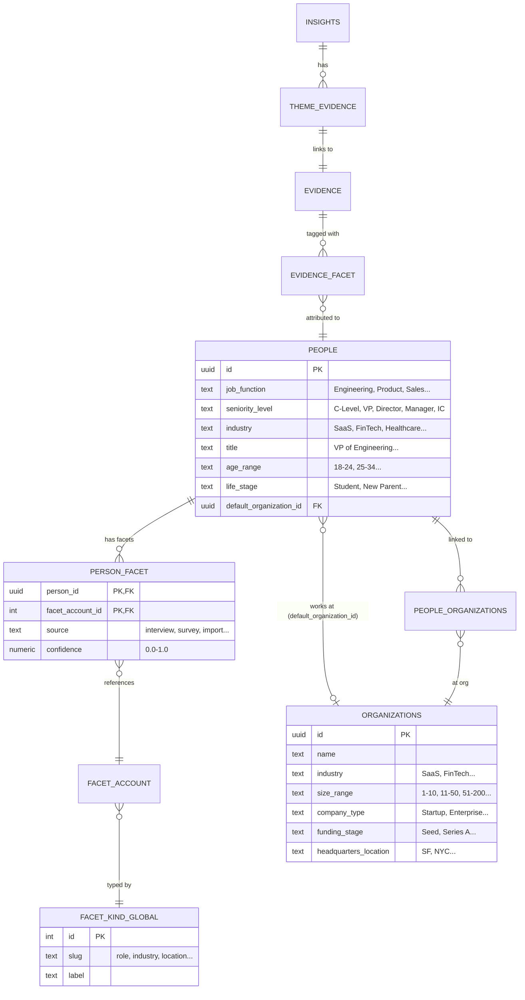

# Insight × Segment Matrix

## User Story

**As a** product researcher or PM
**I want to** see which insights resonate with which types of people
**So that** I can prioritize features for specific customer segments and make data-driven decisions

## The Problem (Current State)

Today, the Insight Matrix requires users to:
1. **Run "Generate Personas" first** — an extra step that feels like busywork
2. **Wait for enough data** — personas aren't meaningful with just 1-2 interviews
3. **Interpret abstract labels** — "Relational Producer" is a psychographic label that doesn't help me find real customers

**Result:** Users skip the matrix entirely because it's empty or confusing.

## The Solution (New Approach)

Replace psychographic personas with **demographic segments** users already understand:

| Instead of... | Show... |
|---------------|---------|
| "Relational Producer" | "Engineering Managers at Enterprise companies" |
| Empty matrix waiting for personas | Data from day 1 |
| Abstract clusters | Actionable segments you can filter by |

### Key Benefits

1. **Immediate value** — Works after your first interview (if person has job_function/seniority)
2. **Actionable segments** — "Engineers" and "Enterprise" are segments you can find in the real world
3. **Compounding value** — More interviews = richer breakdown across segments
4. **No extra steps** — No "Generate" button required

---

## Requirements

### Must Have (P0)
- [x] Matrix shows Insights (rows) × Segments (columns)
- [x] Segments include: Job Function, Seniority Level, Company Size
- [x] Cells show count of unique people in that segment who contributed evidence to that insight
- [x] Heatmap coloring indicates relative density (darker = more people)
- [x] Works with 1 person (shows their segments lit up)
- [x] Empty segments are hidden or shown as `-`

### Should Have (P1)
- [x] Grouped column headers (Job Function group, Seniority group, Company Size group)
- [x] Click insight name → navigate to insight detail
- [ ] Click cell → show list of people who match that intersection
- [x] Legend explaining the visualization

### Nice to Have (P2)
- [ ] Toggle between segment groups (show all vs just Job Function)
- [ ] Industry segment (from person or organization)
- [ ] Export matrix to CSV
- [ ] Filter insights by clicking segment header

---

## Specification

### Data Flow

```
Interview → Evidence → Evidence-Person Link → Person Demographics → Segment Counts
```

**Step by step:**
1. User uploads interview
2. AI extracts evidence (quotes with timestamps)
3. Evidence is linked to people (via `evidence_facet.person_id`)
4. People have demographic fields (`job_function`, `seniority_level`, organization's `size_range`)
5. Evidence is clustered into Insights (via `theme_evidence`)
6. Matrix counts unique people per segment per insight

### Segment Sources

| Segment | Source | Field |
|---------|--------|-------|
| Job Function | `people` table | `job_function` |
| Seniority | `people` table | `seniority_level` |
| Company Size | `organizations` table (via person's `default_organization_id`) | `size_range` |
| Industry | `people` table (fallback: `organizations.industry`) | `industry` |

### Matrix Cell Calculation

For each cell (Insight × Segment):
```
count = number of UNIQUE people where:
  - person contributed evidence to this insight (via theme_evidence + evidence_facet)
  - person belongs to this segment (via people.job_function, etc.)
```

### Visual Design

```
                    │ Job Function                     │ Seniority              │
                    │ Eng   Prod  Sales  Mkt   Other   │ Exec  VP  Dir  Mgr  IC │
────────────────────┼──────────────────────────────────┼────────────────────────┤
Need faster builds  │  5     1     -      -     1      │  1    1   2    3    -  │
Want better docs    │  3     4     1      2     -      │  -    2   1    4    3  │
Integration gaps    │  2     3     4      -     1      │  2    1   3    2    2  │
```

- **Darker cells** = more people (higher count)
- **`-`** = no people in this intersection
- **Row labels** = Insight names (clickable)
- **Column groups** = Visual separator between segment types

---

## Data Model

### Mermaid ER Diagram



### Data Sources Table

| Source | Table | Fields | Type | When Available |
|--------|-------|--------|------|----------------|
| **Person Demographics** | `people` | `job_function` | B2B | Import/Interview |
| | | `seniority_level` | B2B | Import/Interview |
| | | `industry` | B2B | Import/Interview |
| | | `title` | B2B | Import/Interview |
| | | `age_range` | B2C | Import/Interview |
| | | `life_stage` | B2C | Import/Interview |
| **Person Facets** | `person_facet` → `facet_account` | `role` | B2B | Interview extraction |
| | | `industry` | Both | Interview extraction |
| | | `location` | Both | Interview extraction |
| | | `use_case` | Both | Interview extraction |
| | | `custom` | Both | Manual/Import |
| **Organization Data** | `organizations` (via `people.default_organization_id`) | `industry` | B2B | Import/Interview |
| | | `sub_industry` | B2B | Import/Interview |
| | | `company_type` | B2B | Import/Interview |
| | | `size_range` | B2B | Import/Interview |
| | | `funding_stage` | B2B | Import/Interview |
| | | `headquarters_location` | B2B | Import/Interview |

---

## Implementation

### Files

| File | Purpose |
|------|---------|
| `app/features/insights/pages/matrix.tsx` | Page with loader that builds segment counts |
| `app/features/insights/components/InsightSegmentMatrix.tsx` | Matrix visualization component |
| `app/features/insights/components/SegmentMatrixTypes.ts` | Shared type definitions |

### Type Definitions

```typescript
// SegmentMatrixTypes.ts
export type SegmentGroup = {
  id: string;
  label: string;
  segments: SegmentColumn[];
};

export type SegmentColumn = {
  id: string;
  label: string;
  value: string;
};

export type MatrixInsight = {
  id: string;
  name: string | null;
  person_count: number;
};

export type SegmentCount = {
  insight_id: string;
  segment_id: string; // Format: "job_function:Engineering" or "seniority:VP"
  count: number;
};
```

### Loader Query Flow

```typescript
// matrix.tsx loader

// 1. Get top 10 insights
const topInsights = await getInsights({ supabase, accountId, projectId }).slice(0, 10);

// 2. Get theme_evidence for those insights
const { data: themeEvidence } = await supabase
  .from("theme_evidence")
  .select("theme_id, evidence_id")
  .eq("project_id", projectId)
  .in("theme_id", insightIds);

// 3. Get people linked to evidence (with org data)
const { data: evidencePeople } = await supabase
  .from("evidence_facet")
  .select(`
    evidence_id,
    person_id,
    people:person_id (
      id,
      job_function,
      seniority_level,
      industry,
      default_organization_id,
      organizations:default_organization_id (
        size_range,
        industry
      )
    )
  `)
  .eq("project_id", projectId)
  .in("evidence_id", evidenceIds)
  .not("person_id", "is", null);

// 4. Build insight → segment counts
const segmentCounts = buildSegmentCounts(themeEvidence, evidencePeople);
```

---

## How Personas Layer On Top (Future)

The segment matrix creates the **foundation** for richer persona generation:

### Current Flow (Segments)
```
Interview → Evidence → Person → Demographics → Segment Matrix
```

### Future Flow (Personas as Segment Clusters)
```
Interview → Evidence → Person → Demographics → Segment Matrix
                                     ↓
                              Segment Patterns
                                     ↓
                         AI-Generated Persona Clusters
                                     ↓
                           Persona × Insight Matrix
```

### How It Works

1. **Collect segment patterns**
   - "5 Engineers at Enterprise companies all mentioned CI/CD pain"
   - "3 Product Managers at Startups care about docs"

2. **Cluster into personas**
   - AI identifies: "Enterprise DevOps Leader" (Engineers + Enterprise + CI/CD)
   - AI identifies: "Startup PM" (Product + Startup + Docs)

3. **Personas become named segments**
   - Instead of "Engineering × Enterprise" show "Enterprise DevOps Leader"
   - User gets actionable persona + demographic grounding

### Key Insight

**Personas are just named segment intersections.**

By building segment matrix first:
- Users get value immediately (no "Generate" step)
- Personas become an **optional enhancement**, not a prerequisite
- AI persona generation has richer input (segment patterns, not just facets)
- Users can validate AI personas against segment data

### Rollout Strategy

| Phase | Feature | Value |
|-------|---------|-------|
| 1 (Now) | Segment Matrix | Immediate demographic breakdown |
| 2 | Segment Patterns | "Most Engineers mentioned X" insights |
| 3 | AI Persona Suggestions | "We detected an 'Enterprise DevOps' cluster" |
| 4 | Named Personas | User confirms/edits AI suggestions |
| 5 | Persona Matrix | Original matrix, but with data-backed personas |

---

## Risks & Mitigations

| Risk | Impact | Mitigation |
|------|--------|------------|
| **Missing demographic data** | Empty matrix if people don't have `job_function` set | Show "Unknown" segment column; add banner prompting data enrichment |
| **Too many segment values** | Sparse matrix with 50+ columns | Limit to top 5-7 values per group; collapse rest into "Other" |
| **Inconsistent segment labels** | "Engineering" vs "Engineer" vs "Eng" creates duplicates | Normalize values during import; create canonical lookup table |
| **Organization not linked** | Company size column empty if `default_organization_id` null | Fallback to "Unknown"; count missing orgs in legend |
| **N+1 query performance** | Nested joins could be slow with many insights | Use single JOIN query; consider materializing segment counts |

---

## Summary

This feature replaces an empty, confusing persona matrix with an immediately useful segment matrix while creating the foundation for smarter AI-generated personas in the future.

**Ship order:**
1. ✅ Segment matrix with Job Function + Seniority + Company Size
2. Data quality indicators
3. Industry segment
4. Segment → Persona clustering (later)
