> **⚠️ ARCHIVED** - This document has been superseded by [onboarding-spec.md](../onboarding-spec.md).
> Research data and design rationale have been incorporated into the main spec.

# Onboarding Redesign: A Design Critique & Plan

## Research Data: Conversational UI vs Forms

Before critiquing, let's look at the evidence:

### The Case FOR Conversational UI

| Metric | Finding | Source |
|--------|---------|--------|
| **Response rates** | 40% higher with conversational forms | [SurveySparrow](https://surveysparrow.com/blog/how-can-conversational-forms-increase-survey-response-rates/) |
| **Conversion lift** | Up to 300% higher vs traditional forms | [Formstack/Venture Harbour via Ideta](https://www.ideta.io/blog-posts-english/conversational-form-beats-web-form) |
| **Lead quality** | 21% stronger acceptance, 36% higher conversion | [Aberdeen via Qualified](https://www.qualified.com/plus/articles/40-conversational-marketing-stats-you-need-to-know) |
| **Marketing conversion** | 42% increase with conversational techniques | [HubSpot via Qualified](https://www.qualified.com/plus/articles/40-conversational-marketing-stats-you-need-to-know) |
| **E-commerce** | 12.3% conversion with AI chat vs 3.1% without (4X) | [Rep AI](https://www.hellorep.ai/blog/the-future-of-ai-in-ecommerce-40-statistics-on-conversational-ai-agents-for-2025) |
| **Form abandonment** | Traditional forms: 81% abandonment rate | [Manifest via Ideta](https://www.ideta.io/blog-posts-english/conversational-form-beats-web-form) |
| **User preference** | Only 14% prefer forms over chatbots | [ICMI via Ideta](https://www.ideta.io/blog-posts-english/conversational-form-beats-web-form) |
| **Completion time** | 47% faster purchases with AI assistance | [Rep AI](https://www.hellorep.ai/blog/the-future-of-ai-in-ecommerce-40-statistics-on-conversational-ai-agents-for-2025) |

### Important Caveats

| Finding | Implication | Source |
|---------|-------------|--------|
| Chatbot-ONLY onboarding: **3x higher abandonment** | Need escape hatches | [UserGuiding](https://userguiding.com/blog/user-onboarding-statistics) |
| **78% want at least one live interaction** | Pure bot isn't enough | [UserGuiding](https://userguiding.com/blog/user-onboarding-statistics) |
| Hybrid achieves **73% satisfaction vs 41% digital-only** | Combine approaches | [UserGuiding](https://userguiding.com/blog/user-onboarding-statistics) |
| B2B: chat ~1% vs forms ~7% in some cases | Context matters | [Databox](https://databox.com/forms-vs-chat) |
| Forms >3 minutes: **47% abandonment** | Keep it short | [Zuko](https://www.zuko.io/blog/25-conversion-rate-statistics-you-need) |
| Progress indicators boost completion **43%** | Show progress | [Zuko](https://www.zuko.io/blog/25-conversion-rate-statistics-you-need) |

### Verdict: Conversational Wins, But...

**The data supports conversational UI** with these requirements:
- Must have escape/skip options (not chatbot-only)
- Progress indicators are essential
- Keep interactions short
- Hybrid approach beats pure digital

---

## Critical User Context (What I Missed)

### Three Entry States (Not User Types)

These aren't personas - they're **where someone is starting right now**. The same person (PM, researcher, salesperson) might enter from different states on different days.

```mermaid
%%{init: {'theme':'base', 'themeVariables': { 'fontSize':'18px'}}}%%
flowchart TD
    subgraph "WHERE ARE THEY STARTING?"
        A["👤 User Arrives"] --> B{"What do they have<br/>RIGHT NOW?"}

        B -->|"~60% of sessions"| C["🎯 PLANNING STATE<br/><br/>No recordings yet<br/>Needs research plan<br/>Needs interview questions<br/>Needs outreach strategy"]

        B -->|"~30% of sessions"| D["📊 ANALYZING STATE<br/><br/>Has recordings in hand<br/>Wants insights NOW<br/>May have Gong/Chorus exports"]

        B -->|"~10% of sessions"| E["🔍 EXPLORING STATE<br/><br/>Checking out the tool<br/>Wants to see value first<br/>Not ready to commit data"]
    end

    style C fill:#e8f5e9,stroke:#2e7d32,stroke-width:4px
    style D fill:#e3f2fd,stroke:#1565c0,stroke-width:3px
    style E fill:#fff3e0,stroke:#ef6c00,stroke-width:2px
```



**Important:** A Product Manager might be in "Planning State" on Monday and "Analyzing State" on Friday. A salesperson might start in "Exploring State" then move to "Analyzing State" once they see value.

### User Goals (The WHY)

Entry state tells us WHERE they're starting. But we also need to understand WHY they're here:

| Role | Their Goal | How They Use Insights |
|------|------------|----------------------|
| **Salesperson** | Close deals, nurture leads | Find objections, understand buying signals, prep for calls |
| **Product Manager** | Build the right features | Validate assumptions, prioritize roadmap, find pain points |
| **UX Researcher** | Inform design decisions | Pattern recognition, user journey mapping, needs discovery |
| **Founder** | Find product-market fit | Customer development, pivot decisions, positioning |
| **Customer Success** | Reduce churn, increase expansion | Early warning signs, upsell triggers, satisfaction drivers |

**This matters because:**
- A salesperson analyzing calls cares about deal progression
- A PM analyzing the same calls cares about feature requests
- The SAME data, filtered through DIFFERENT goals

The system should ask about goals (not just context) and use that to prioritize what it surfaces.

### Planning State (~60% of first sessions)

**They don't have recordings yet because:**
- They haven't done customer interviews yet
- They need help figuring out WHAT to ask
- They need help reaching customers (survey link, chatbot, calendar)
- The onboarding IS their research planning process

**What they need:**
1. Help defining research goals → generates interview prompts
2. Help identifying who to talk to → target roles/orgs
3. Ways to REACH those people → share form, chatbot link, calendar
4. THEN they'll have conversations to analyze

### Analyzing State (~30% of first sessions)

**They have data ready to go:**
- Sales calls from this week
- Existing interview recordings
- Gong/Chorus exports

**What they need:**
1. Fast upload path
2. Quick processing
3. Immediate value demonstration
4. Context helps but isn't blocking

### Exploring State (~10% of first sessions)

**They're evaluating:**
- Checking if this tool fits their workflow
- Want to see capabilities before committing data
- May be evaluating for a team purchase

**What they need:**
1. See real examples of insights
2. Understand the value proposition
3. Easy path to try it themselves when ready

---

## Current State: Fragmented Experience

The current onboarding flow is disjointed:
1. Entry screen looks like a chat input but isn't connected to the actual chat
2. User's initial message gets discarded when transitioning
3. Multiple disconnected screens (entry → dashboard → chat sidebar)
4. Mode switching (voice/chat/form) adds cognitive overhead
5. Company vs Project context separation isn't clear to users

---

## Don Norman's Critique

*As if written by Don Norman, author of "The Design of Everyday Things"*

### The Fundamental Problem: Designing for the System, Not the User

Your proposed "chat-first" approach makes a critical error: **it assumes users want to have a conversation**. Many don't. You've designed for your system's needs (collecting structured data) rather than the user's actual goal (getting insights from their research).

### Violations of Core Design Principles

**1. Forced Linearity Violates User Autonomy**

> "When you force users down a single path, you're treating them as components in your system rather than as intelligent beings with their own goals."

Your flow demands: Company → Project → Collect → Learn. But what if a user:
- Already has a recording and just wants to see what the tool does?
- Wants to explore before committing personal/company information?
- Is evaluating the tool for their team and needs to see value first?

**2. The "Empty State Interrogation" Anti-Pattern**

Opening with a chat that immediately asks questions feels like an interrogation, not assistance. The user hasn't yet developed trust in the system. Why should they share their company's problems with a tool they just opened?

> "Trust must be earned through demonstrated value, not demanded upfront."

**3. Hidden System Status**

Your current design hides what the system knows vs. doesn't know. Users can't see:
- What information is missing
- Why certain features are locked
- What benefit completing setup provides

**4. No Graceful Degradation**

The system should WORK without setup, and work BETTER with setup. Currently, you block users until they complete your preferred flow.

**5. Conceptual Model Mismatch**

Your model: "Company Context → Project Goals → Data Collection → Insights"

User's mental model: "I have interviews. I want insights. Help me."

These don't match. You're forcing users to learn YOUR model before they can accomplish THEIR goal.

### What Good Design Looks Like

**Progressive Disclosure**: Start with the minimum, reveal complexity as the user engages deeper.

**Multiple Valid Paths**: Let users enter from wherever makes sense to THEM.

**Value Before Commitment**: Show what you can do before asking for information.

**Visible System Status**: Always show what's complete, what's missing, and WHY it matters.

**Reversibility**: Let users skip things and come back. Never trap them.

---

## Revised Design: Chat-First for Planners, Fast-Track for Analyzers

### Core Philosophy

> **"Meet users where they are. Planners need guidance. Analyzers need speed."**

### The Entry Decision

```mermaid
%%{init: {'theme':'base', 'themeVariables': { 'fontSize':'18px'}}}%%
flowchart TD
    A["👤 User lands on<br/>empty project"] --> B["🏠 Single Entry Screen"]

    B --> C{"What do you<br/>want to do?"}

    C -->|"Plan my research"| D["🎯 PLANNER PATH<br/><br/>Chat opens full-screen<br/>AI guides through planning"]

    C -->|"Analyze recordings"| E["📊 ANALYZER PATH<br/><br/>Upload interface opens<br/>Quick context form"]

    C -->|"Just exploring"| F["🔍 EVALUATOR PATH<br/><br/>Sample project loads<br/>See value immediately"]

    style D fill:#e8f5e9,stroke:#2e7d32,stroke-width:4px
    style E fill:#e3f2fd,stroke:#1565c0,stroke-width:3px
    style F fill:#fff3e0,stroke:#ef6c00,stroke-width:2px
    style B fill:#f5f5f5,stroke:#424242,stroke-width:2px
```



### Entry Screen Design (Chat-First with Escape Hatches)

**Lead with chat. Provide clear alternatives.**

```
┌─────────────────────────────────────────────────────────────────┐
│                                                                 │
│              🔬 Let's set up your research                      │
│                                                                 │
│  ┌─────────────────────────────────────────────────────────┐   │
│  │                                                         │   │
│  │  Tell me what you're trying to learn...                 │   │
│  │                                                         │   │
│  │  ________________________________________________  🎤   │   │
│  │                                                         │   │
│  │                                        [Start Chat →]   │   │
│  └─────────────────────────────────────────────────────────┘   │
│                                                                 │
│  ─────────────────── or ───────────────────                     │
│                                                                 │
│  [📤 I have recordings to upload]    [🔍 Show me how it works] │
│                                                                 │
└─────────────────────────────────────────────────────────────────┘
```

### Signifier Inventory

| Element | What It Signifies |
|---------|-------------------|
| Big text input | "This is a conversation, type naturally" |
| 🎤 mic icon | "You can speak instead of type" |
| Placeholder text | "Tell me what you're trying to learn" - goal-focused |
| "Start Chat →" | "This begins a dialogue, not a form submit" |
| "── or ──" | "There are other valid paths" |
| "I have recordings" | "Skip the chat if you have data" |
| "Show me how it works" | "You can explore without committing" |

**Why this works:**
- Chat is the DEFAULT (60% of users need guidance)
- Alternatives are VISIBLE but secondary
- No mode confusion (voice/chat/form) - just intent
- First input captures their GOAL immediately

---

### PATH 1: The Planner Journey (60% of users)

**This is the PRIMARY path.** Chat-first makes sense here because:
- They need guidance, not just data entry
- The output (questions, outreach plan) requires understanding
- Conversation naturally surfaces edge cases

```mermaid
%%{init: {'theme':'base', 'themeVariables': { 'fontSize':'18px'}}}%%
flowchart TD
    A["🎯 User selects<br/>'Plan my research'"] --> B["💬 Full-screen chat opens<br/><br/>Context sidebar visible"]

    B --> C["🤖 'What company are you<br/>researching for? Drop your<br/>website and I'll learn about you.'"]

    C --> D["👤 'deeplight.digital'"]

    D --> E["🔍 Researching...<br/><br/>Results appear in sidebar:<br/>✓ Company: DeepLight<br/>✓ Industry: Research Tools"]

    E --> F["🤖 'Got it! What do you want<br/>to learn from this research?'"]

    F --> G["👤 'Why customers churn<br/>after 3 months'"]

    G --> H["💾 Saved to sidebar:<br/>✓ Goal: Churn research<br/><br/>🤖 'Who are you trying to<br/>talk to? Job titles?'"]

    H --> I["👤 'Product managers and<br/>customer success leads'"]

    I --> J["💾 Saved to sidebar:<br/>✓ Audience: PM, CS<br/><br/>🤖 'Perfect. I've generated<br/>interview questions for you.<br/>How do you want to reach people?'"]

    J --> K{"Outreach options"}

    K --> L["📝 Share survey form"]
    K --> M["🤖 Deploy chatbot"]
    K --> N["📅 Book via calendar"]
    K --> O["🎤 Record live interview"]

    style A fill:#e8f5e9,stroke:#2e7d32,stroke-width:3px
    style B fill:#e3f2fd,stroke:#1565c0,stroke-width:2px
    style J fill:#fff3e0,stroke:#ef6c00,stroke-width:3px
```



**Key UX Elements:**
- Full-screen chat (not sidebar) - this IS the experience
- Context sidebar shows what's being captured in real-time
- Each answer immediately saves and updates sidebar
- Natural progression: Company → Goal → Audience → Questions → Outreach
- Ends with ACTION: how to reach people

---

### PATH 2: The Analyzer Journey (30% of users)

**Fast-track to value.** They have data, don't make them wait.

```mermaid
%%{init: {'theme':'base', 'themeVariables': { 'fontSize':'18px'}}}%%
flowchart TD
    A["📊 User selects<br/>'Analyze recordings'"] --> B["📤 Upload interface opens"]

    B --> C["Drag & drop files<br/>or connect Gong/Chorus"]

    C --> D["⏳ Processing starts<br/><br/>Meanwhile, quick context form:<br/>'Help me understand these better'"]

    D --> E{"User fills optional context"}

    E -->|"Fills form"| F["✓ Better insights generated"]
    E -->|"Skips"| G["✓ Generic insights generated"]

    F --> H["📊 Results ready<br/>Dashboard with insights"]
    G --> H

    H --> I["🤖 'I found themes about X.<br/>Want me to focus on anything<br/>specific?'"]

    style A fill:#e3f2fd,stroke:#1565c0,stroke-width:3px
    style C fill:#e8f5e9,stroke:#2e7d32,stroke-width:2px
    style H fill:#fff3e0,stroke:#ef6c00,stroke-width:3px
```



**Key UX Elements:**
- Upload is the FIRST action
- Context gathering happens DURING processing (not blocking)
- Context is optional - tool works without it
- Contextual prompts AFTER they see value

---

### PATH 3: The Evaluator Journey (10% of users)

**Show, don't tell.** Let them experience value with zero commitment.

```mermaid
%%{init: {'theme':'base', 'themeVariables': { 'fontSize':'18px'}}}%%
flowchart TD
    A["🔍 User selects<br/>'Just exploring'"] --> B["📂 Sample project loads<br/><br/>Pre-populated with demo data"]

    B --> C["👀 User explores:<br/>• Sample insights<br/>• Sample themes<br/>• Sample evidence"]

    C --> D["🤖 Contextual prompts:<br/>'This insight is about churn.<br/>Want to find similar patterns<br/>in YOUR data?'"]

    D --> E{"User ready to try?"}

    E -->|"Yes"| F["→ Route to Planner<br/>or Analyzer path"]
    E -->|"Not yet"| G["Continue exploring<br/>More prompts over time"]

    style A fill:#fff3e0,stroke:#ef6c00,stroke-width:3px
    style B fill:#e3f2fd,stroke:#1565c0,stroke-width:2px
    style D fill:#e8f5e9,stroke:#2e7d32,stroke-width:2px
```



---

### Context Sidebar (Visible During Chat)

Always visible, always updating:

```
┌──────────────────────────────────────────────────────────────┐
│  YOUR RESEARCH CONTEXT                              [Edit ✏️] │
├──────────────────────────────────────────────────────────────┤
│                                                              │
│  COMPANY                                          ✓ Complete │
│  ┌────────────────────────────────────────────────────────┐ │
│  │ DeepLight                                              │ │
│  │ Research tools • B2B SaaS                              │ │
│  │ "Helps teams extract insights from conversations"      │ │
│  └────────────────────────────────────────────────────────┘ │
│                                                              │
│  RESEARCH GOAL                                    ✓ Complete │
│  ┌────────────────────────────────────────────────────────┐ │
│  │ Understand why customers churn after 3 months          │ │
│  └────────────────────────────────────────────────────────┘ │
│                                                              │
│  TARGET AUDIENCE                                  ✓ Complete │
│  ┌────────────────────────────────────────────────────────┐ │
│  │ Product Managers • Customer Success Leads              │ │
│  └────────────────────────────────────────────────────────┘ │
│                                                              │
│  INTERVIEW QUESTIONS                             ⚙️ Generated │
│  ┌────────────────────────────────────────────────────────┐ │
│  │ 12 questions ready • [View] [Edit]                     │ │
│  └────────────────────────────────────────────────────────┘ │
│                                                              │
│  ──────────────────────────────────────────────────────────  │
│  Context Quality: ████████░░ 80%                             │
│  [+ Add more context for better insights]                    │
│                                                              │
└──────────────────────────────────────────────────────────────┘
```

---

### Smart Prompting: Context-Aware Throughout

Even after onboarding, the system asks for context when relevant:

```mermaid
%%{init: {'theme':'base', 'themeVariables': { 'fontSize':'18px'}}}%%
flowchart TD
    Q["👤 User views<br/>first insight"] --> R{"Has research<br/>goal set?"}

    R -->|"No"| S["🤖 'This insight is about X.<br/><br/>Is that what you're researching?<br/><br/>Telling me helps me prioritize.'"]
    R -->|"Yes"| T["✓ Show insight with<br/>goal-relevance score<br/><br/>🎯 85% match to your goals"]

    U["👤 User views<br/>people/contacts"] --> V{"Has target<br/>roles set?"}

    V -->|"No"| W["🤖 'Who are you trying<br/>to learn from?<br/><br/>I can highlight relevant quotes.'"]
    V -->|"Yes"| X["✓ Highlight people matching<br/>target roles<br/><br/>⭐ 3 Product Managers found"]

    style S fill:#e8f5e9,stroke:#388e3c,stroke-width:3px
    style T fill:#e3f2fd,stroke:#1976d2,stroke-width:3px
    style W fill:#fff3e0,stroke:#f57c00,stroke-width:3px
    style X fill:#e3f2fd,stroke:#1976d2,stroke-width:3px
```



### Key Design Decisions

#### 1. Intent-Based Entry (Not Mode-Based)

**Old approach**: "Voice Chat / Text Chat / Form" - modes are about HOW
**New approach**: "Plan Research / Analyze Recordings / Explore" - intents are about WHAT

Users think in terms of goals, not input methods.

#### 2. Full-Screen Chat for Planners

For the Planner path, chat isn't a sidebar - it IS the interface:
- Takes over the screen
- Context sidebar visible alongside
- No distractions, full focus on the conversation
- Natural flow to outreach options at the end

#### 3. Upload-First for Analyzers

Don't interrogate people who have data:
- Let them upload immediately
- Gather context DURING processing (optional)
- Show value first, ask questions after

#### 4. Live Context Sidebar

As the conversation progresses, users SEE their context building:
- Each answer immediately appears in sidebar
- Visual confirmation that input was captured
- Can edit any item at any time
- Progress indicator shows completion

#### 5. Conversation Ends with ACTION

The Planner flow doesn't just collect data - it generates outputs:
1. Interview questions (generated from goals + audience)
2. Outreach options (survey, chatbot, calendar, live recording)
3. Clear next step that moves them forward

---

## Implementation Phases

### Phase 1: Three-Path Entry Screen
- [ ] Replace current SetupModeSelector with intent-based options
- [ ] "Plan my research" → Full-screen chat with sidebar
- [ ] "Analyze recordings" → Upload interface
- [ ] "Just exploring" → Sample project

### Phase 2: Planner Chat Flow
- [ ] Full-screen chat layout with context sidebar
- [ ] Company URL research with inline results
- [ ] Real-time sidebar updates as user answers
- [ ] Interview question generation at end
- [ ] Outreach options (survey link, chatbot, calendar)

### Phase 3: Analyzer Fast-Track
- [ ] Upload-first interface
- [ ] Optional context form during processing
- [ ] Post-processing contextual prompts
- [ ] "I found X, want me to focus on anything?" flow

### Phase 4: Sample Project for Evaluators
- [ ] Pre-populated demo project
- [ ] Guided tour of features
- [ ] Contextual CTAs to start their own project

---

## Success Metrics

| Metric | Current | Target | Notes |
|--------|---------|--------|-------|
| **Planner Path** |
| Time to first outreach action | N/A | < 5 min | Survey shared, chatbot deployed, etc. |
| Interview questions generated | N/A | 90%+ | Most planners should get questions |
| Context completion rate | ~40% | ~85% | Chat should naturally capture more |
| **Analyzer Path** |
| Time to first upload | ~3 min | < 30 sec | No blocking setup |
| Post-upload context capture | N/A | ~50% | Optional, during processing |
| **Evaluator Path** |
| Conversion to real project | N/A | ~30% | From sample to their own data |
| **Overall** |
| User-reported confusion | High | Low | Single entry question |
| Path completion rate | ~40% | ~75% | Intent-aligned flows |

---

## Summary: The Revised Approach

### Two Dimensions to Capture

We need to understand TWO things about each user:

```
┌─────────────────────────────────────────────────────────────┐
│                                                             │
│   WHERE are they starting?     WHY are they here?           │
│   (Entry State)                (Goal)                       │
│                                                             │
│   □ Planning - no data yet     □ Close deals (Sales)        │
│   □ Analyzing - have data      □ Build features (PM)        │
│   □ Exploring - evaluating     □ Research users (UXR)       │
│                                □ Find PMF (Founder)         │
│                                □ Reduce churn (CS)          │
│                                                             │
└─────────────────────────────────────────────────────────────┘
```

**Entry State** determines the FLOW (chat-guided vs upload-first)
**Goal** determines WHAT WE SURFACE (deal signals vs feature requests vs churn indicators)

### What Changed From the Original Critique

| Original Critique | Revised Understanding |
|-------------------|----------------------|
| "Users don't want to chat" | **In Planning State, they DO want guidance** - chat is right |
| "Show value before asking" | **In Analyzing State, upload-first** - context during processing |
| "Don't force a path" | **Ask entry state, not input mode** - routes to right experience |
| "Most users have data" | **Many DON'T** - they need help planning research first |
| "User types are fixed" | **Entry states are fluid** - same person, different days |

### The Key Insight

The old design asked: "HOW do you want to input?" (voice/chat/form)

The new design asks:
1. "WHAT do you have right now?" (data or not) → determines flow
2. "WHAT are you trying to accomplish?" (goal) → determines what we surface

### Research Supports This Approach

The data shows conversational UI wins for guided experiences:
- 40% higher completion rates
- 300% better conversion than traditional forms
- But ONLY with escape hatches and progress indicators

For Planning State, chat-first is right. For Analyzing State, upload-first is better.

---

## Appendix: If We DO Go Chat-First

If we decide chat is the right entry point, here's what Don Norman would require:

### Required Affordances

**Affordances** = What actions are actually possible

| Affordance | Implementation |
|------------|----------------|
| **Escape** | User can ALWAYS exit chat and access the full app |
| **Skip** | User can skip any question without penalty |
| **Edit** | User can change any previous answer at any time |
| **Upload** | User can drop a file INTO the chat at any point |
| **Voice** | User can speak instead of type (reduce friction) |

### Required Signifiers

**Signifiers** = Visual/audio cues that communicate affordances

```
┌─────────────────────────────────────────────────────────────┐
│  ╭─────────────────────────────────────────────────────╮    │
│  │ 🤖 What's your company website?                     │    │
│  │    I'll auto-fill your company info.                │    │
│  │                                                     │    │
│  │    [Skip this →]  ← SIGNIFIER: Can skip             │    │
│  ╰─────────────────────────────────────────────────────╯    │
│                                                             │
│  ┌─────────────────────────────────────────────────────┐    │
│  │ https://...                           🎤  📎  ➤    │    │
│  └─────────────────────────────────────────────────────┘    │
│       ↑ SIGNIFIER: Voice    ↑ SIGNIFIER: Attach file        │
│                                                             │
│  ───────────────────────────────────────────────────────    │
│  [✕ Exit to Dashboard]  ← SIGNIFIER: Can leave anytime      │
│                                                             │
│  Context: ██░░░░░░░░ 20%  ← SIGNIFIER: Progress visible     │
│  [Company ○] [Goals ○]                                      │
└─────────────────────────────────────────────────────────────┘
```

### Signifier Inventory

| Signifier | What It Communicates | Visual Treatment |
|-----------|---------------------|------------------|
| **[Skip this →]** | "This question is optional" | Text link below each question |
| **Progress bar** | "Here's how much is done" | Always visible, non-judgmental |
| **[✕ Exit]** | "You can leave anytime" | Persistent in corner |
| **🎤 Mic icon** | "You can speak" | In input field |
| **📎 Attach icon** | "You can add files here" | In input field |
| **"Saved ✓"** | "Your answer was captured" | Toast after each save |
| **Edit pencil** | "You can change this" | Next to saved answers |
| **Context chips** | "This is what I know" | Visible summary in sidebar |

### Feedback Loops

Every action needs immediate feedback:

| User Action | Immediate Feedback |
|-------------|-------------------|
| Types URL | "🔍 Researching..." + spinner |
| Research completes | Inline card showing what was found |
| Skips question | "Okay, we can come back to this" + progress updates |
| Answers question | "✓ Saved" + context bar updates |
| Exits chat | Dashboard shows what was captured |
| Returns to chat | Chat remembers where they were |

### The "Context Sidebar" Pattern

While chatting, show what's being captured in real-time:

```
┌──────────────────────┬───────────────────────────┐
│                      │  📋 Your Context          │
│   Chat Area          │  ─────────────────────    │
│                      │  Company: DeepLight ✓     │
│   🤖 ...             │    → Research tools       │
│                      │    → B2B SaaS             │
│   👤 ...             │                           │
│                      │  Goals: ○ Not set yet     │
│                      │    [Add now]              │
│                      │                           │
│                      │  Audience: ○ Not set yet  │
│                      │    [Add now]              │
│                      │                           │
│                      │  ─────────────────────    │
│                      │  [Edit in Settings →]    │
└──────────────────────┴───────────────────────────┘
```

**Why**: User always sees what's happening. No hidden state. No surprises.

### Critical Don Norman Requirement: Reversibility

> "Every action should be reversible. The user should never feel trapped."

This means:
1. **No "point of no return"** - User can always go back
2. **Edit anything** - Click on any captured info to change it
3. **Delete anything** - User controls their data
4. **Restart option** - "Start over" always available
5. **Partial saves** - Even if they quit mid-flow, save what they gave

---

## Summary

**Stop**: Forcing users through an interrogation before they can use the product.

**Start**: Letting users experience value immediately, then earning the right to ask questions through demonstrated usefulness.

**Continue**: Using AI to assist—but as a helpful guide, not a gatekeeper.

> "The best designs are invisible. Users shouldn't have to think about your onboarding—they should just find themselves onboarded."
> — Don Norman (paraphrased)
