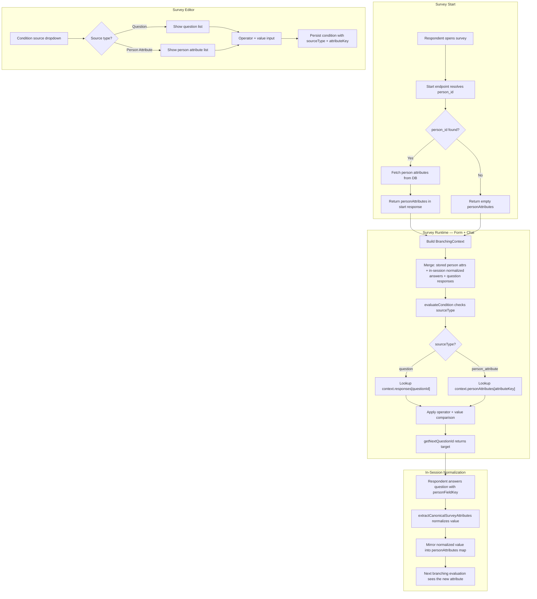
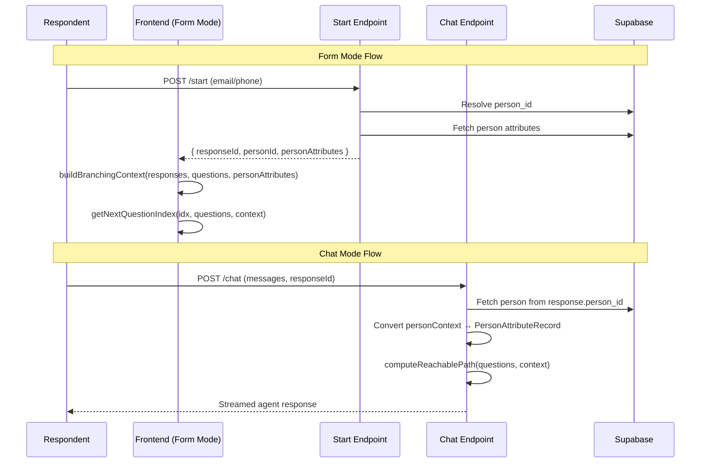
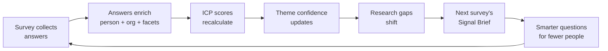

# Feature Spec: Person-Attribute-Aware Survey Branching

**Bead**: `Insights-nwzd`
**Status**: Draft
**Goal**: Let branching rules reference person/CRM data and in-session normalized answers, so respondents only see relevant questions.

---

## Context

Today the branching engine (`branching.ts`) only evaluates conditions against `ResponseRecord` (question ID -> answer). Person data is fetched in chat mode but only used by the AI agent for conversation -- deterministic branching ignores it. The start endpoint resolves `person_id` but returns no attributes. Post-answer person profile sync runs only at survey completion, too late for mid-survey branching.

This means: you can't skip "What's your role?" for someone whose role is already in the CRM, and you can't branch on seniority unless you ask a question about it first.

---

## System Flow



---

## Data Flow: Form Mode vs Chat Mode



---

## Interface Contracts

### 1. Extended Condition Schema (`branching.ts`)

```typescript
/** Source of the condition value */
export const ConditionSourceTypeSchema = z.enum(["question", "person_attribute"]);
export type ConditionSourceType = z.infer<typeof ConditionSourceTypeSchema>;

/** Single condition to evaluate */
export const ConditionSchema = z.object({
  sourceType: ConditionSourceTypeSchema.default("question"),
  questionId: z.string().min(1),           // Used when sourceType = "question"
  attributeKey: z.string().optional(),      // Used when sourceType = "person_attribute"
  operator: ConditionOperatorSchema,
  value: z.union([z.string(), z.array(z.string())]).optional(),
});

export type Condition = z.infer<typeof ConditionSchema>;
```

**Backwards-compatible**: `.default("question")` means existing persisted JSON without `sourceType` parses as `"question"`. `attributeKey` is optional and ignored for question conditions.

### 2. Branching Context (`branching-context.ts` — new file)

```typescript
import type { ResponseValue, ResponseRecord } from "./branching";
import type { ResearchLinkQuestion } from "./schemas";

/** Person attributes flattened for branching lookup */
export type PersonAttributeRecord = Record<string, ResponseValue>;

/** Unified context for branching evaluation */
export interface BranchingContext {
  responses: ResponseRecord;
  personAttributes: PersonAttributeRecord;
}

/** Well-known person attribute keys available for branching conditions */
export const PERSON_ATTRIBUTE_KEYS = [
  { key: "title",           label: "Job Title",       example: "VP of Engineering" },
  { key: "job_function",    label: "Job Function",     example: "Engineering" },
  { key: "seniority_level", label: "Seniority Level",  example: "Leadership" },
  { key: "role",            label: "Role Type",        example: "IC" },
  { key: "segment",         label: "Segment",          example: "Enterprise" },
  { key: "icp_band",        label: "ICP Band",         example: "Strong" },
  { key: "company",         label: "Company",          example: "Acme Inc" },
  { key: "persona",         label: "Persona",          example: "Decision Maker" },
  { key: "industry",        label: "Industry",         example: "SaaS" },
] as const;

export type PersonAttributeKey = (typeof PERSON_ATTRIBUTE_KEYS)[number]["key"];

/**
 * Build a BranchingContext merging:
 * 1. Stored person attributes (from CRM/DB)
 * 2. In-session normalized answers (questions with personFieldKey)
 * 3. Raw question responses
 */
export function buildBranchingContext(
  responses: ResponseRecord,
  questions: ResearchLinkQuestion[],
  personAttributes?: PersonAttributeRecord
): BranchingContext;

/** Create a minimal context from just responses (backwards-compat helper) */
export function responsesOnlyContext(responses: ResponseRecord): BranchingContext;
```

### 3. Start Endpoint Response Extension (`api.research-links.$slug.start.tsx`)

```typescript
// Added to all start response payloads
type StartSignupResult = {
  responseId: string;
  responses: ResponseRecord;
  completed: boolean;
  personId: string | null;
  personAttributes: Record<string, string | null>;  // NEW
};
```

### 4. Updated Engine Signatures (`branching.ts`)

```typescript
// Before (current)
evaluateCondition(condition: Condition, responses: ResponseRecord): boolean
evaluateConditionGroup(group: ConditionGroup, responses: ResponseRecord): boolean
evaluateBranchRules(branching, responses: ResponseRecord): BranchResult | null
getNextQuestionId(currentQuestion, questions, responses: ResponseRecord): string | null
getNextQuestionIndex(currentIndex, questions, responses: ResponseRecord): number

// After (new)
evaluateCondition(condition: Condition, context: BranchingContext): boolean
evaluateConditionGroup(group: ConditionGroup, context: BranchingContext): boolean
evaluateBranchRules(branching, context: BranchingContext): BranchResult | null
getNextQuestionId(currentQuestion, questions, context: BranchingContext): string | null
getNextQuestionIndex(currentIndex, questions, context: BranchingContext): number
```

### 5. NL Parser Extension (`parse-branch-rule.tsx`)

```typescript
// Extended ParsedRuleSchema output
const ParsedRuleSchema = z.object({
  sourceType: z.enum(["question", "person_attribute"]).default("question"),  // NEW
  attributeKey: z.string().optional(),  // NEW — e.g. "seniority_level"
  triggerValue: z.string(),
  operator: ConditionOperatorSchema,
  // ... rest unchanged
});
```

---

## Implementation Phases

### Phase 1: Engine + Types (Pure Logic, No UI)

**Files to modify:**
- `app/features/research-links/branching.ts` — extend ConditionSchema, update eval functions to accept BranchingContext
- `app/features/research-links/branching-context.ts` — **NEW** — `BranchingContext`, `buildBranchingContext()`, `responsesOnlyContext()`, `PERSON_ATTRIBUTE_KEYS`

**Files to update (callers):**
- `app/routes/research.$slug.tsx:1278` — `getNextQuestionIndex` call, wrap responses in context
- `app/routes/api.research-links.$slug.chat.tsx:53,317` — `getNextQuestionId` and `computeReachablePath`, build context from personContext
- `app/features/research-links/survey-flow.ts:84` — `getNextQuestionId` in `simulatePath`, use `responsesOnlyContext()`

**Key logic in `buildBranchingContext`:**
1. Start with `personAttributes` from DB (or `{}` if anonymous)
2. Walk `questions`, for each with a `personFieldKey` that has a response value, mirror it into `personAttributes` (in-session normalization)
3. Return `{ responses, personAttributes: merged }`

**Key logic in `evaluateCondition`:**
```typescript
const answer = condition.sourceType === "person_attribute"
  ? context.personAttributes[condition.attributeKey ?? ""]
  : context.responses[condition.questionId];
// ... existing operator logic unchanged
```

**Tests** (new file `branching-context.test.ts`):
- Person attribute condition evaluates against `personAttributes`
- Question condition evaluates against `responses` (unchanged behavior)
- Mixed AND group: one person attr + one question condition
- In-session normalization: question with `personFieldKey: "title"` and answer `"VP"` makes `personAttributes.title === "VP"`
- Missing person attributes fail gracefully (treated as not answered)
- Backwards compat: condition without `sourceType` field defaults to `"question"`

### Phase 2: Data Delivery

**Files to modify:**
- `app/routes/api.research-links.$slug.start.tsx` — all 4 handlers add `personAttributes` fetch when `personId` is resolved
- `app/routes/research.$slug.tsx` — `StartSignupResult` type, store `personAttributes` in state, pass to `buildBranchingContext`
- `app/routes/api.research-links.$slug.chat.tsx` — convert existing `personContext` to `PersonAttributeRecord` and pass to `buildBranchingContext`

**Shared helper:**
```typescript
async function fetchPersonAttributesForBranching(
  supabase: AdminClient,
  personId: string
): Promise<Record<string, string | null>> {
  const { data: person } = await supabase
    .from("people")
    .select("title, job_function, seniority_level, role, segment")
    .eq("id", personId)
    .maybeSingle();

  if (!person) return {};

  return {
    title: person.title,
    job_function: person.job_function,
    seniority_level: person.seniority_level,
    role: person.role,
    segment: person.segment,
  };
}
```

### Phase 3: Editor UI

**Files to modify:**
- `app/features/research-links/components/QuestionBranchingEditor.tsx` — add person attribute source group to condition source dropdown, handle `sourceType` in rule CRUD
- `app/features/research-links/api/parse-branch-rule.tsx` — extend prompt with person attribute awareness, extend `ParsedRuleSchema` with `sourceType` + `attributeKey`

**Editor changes:**
- Condition source `<Select>` gets two `<SelectGroup>`s: "Person Attributes" (from `PERSON_ATTRIBUTE_KEYS`) and "Questions" (existing)
- When person attribute selected: set `sourceType: "person_attribute"`, `attributeKey`, clear `questionId` to placeholder
- Value input: free text for most attributes, select dropdown for `icp_band` (Strong/Moderate/Weak) and `seniority_level` (Leadership/Senior/Manager/Mid/Entry)
- Rule display: show attribute label instead of "Q3: ..." when `sourceType === "person_attribute"`

**NL parser changes:**
- Add person attribute list to the system prompt
- Map NL references like "if they're a VP" to `sourceType: "person_attribute", attributeKey: "seniority_level", triggerValue: "Leadership"`

### Phase 4: Polish (Deferred/P2)

- Pre-fill question answers from person attributes when `personFieldKey` matches
- Show "We have you as X" confirmation for pre-filled answers
- Badge in question editor showing which person field a question writes to
- Smart question skipping (auto-answer + skip when attribute already known)

---

## Verification Plan

1. **Unit tests**: `pnpm vitest run app/features/research-links/branching-context.test.ts`
2. **Existing tests pass**: `pnpm vitest run app/features/research-links/` — no regressions
3. **Form mode manual test**:
   - Create survey with rule: `seniority_level equals Leadership → skip to Q7`
   - Start as known person with `seniority_level = "Leadership"` in DB
   - Verify branch fires before answering any questions
   - Start as anonymous — verify branch does NOT fire (falls through)
4. **Chat mode manual test**:
   - Same survey in chat mode
   - Verify `computeReachablePath` skips correctly when person has matching attribute
5. **Editor manual test**:
   - Open branching editor, verify "Person Attributes" group appears in condition source
   - Create rule with Seniority Level equals Leadership, verify persists
6. **NL parser test**:
   - "If they're in leadership, skip to strategy section"
   - Verify parsed rule has `sourceType: "person_attribute"`, `attributeKey: "seniority_level"`

---

## Risks

| Risk | Mitigation |
|------|-----------|
| Schema change breaks existing rules | `sourceType` defaults to `"question"`, `attributeKey` is optional — zero migration |
| Anonymous surveys break on person conditions | `personAttributes` is `{}`, conditions fail gracefully (undefined = not answered) |
| Form mode bundle size | `BranchingContext` + `buildBranchingContext` are ~30 lines, trivial |
| Stale person attributes | Fetched at survey start — correct behavior, branch on current data |
| `questionId` meaningless for person conditions | Use sentinel `"__person__"` to satisfy `.min(1)`, or discriminated union |

---

## Design Decision: `questionId` handling

**Recommendation**: Keep `questionId` required with default `"__person__"` sentinel for person attribute conditions. This is simpler than a discriminated union, avoids a complex Zod schema, and the sentinel is only an internal detail — the editor UI and NL parser abstract it away. The `evaluateCondition` function ignores `questionId` when `sourceType === "person_attribute"`.

---

## Vision: Signal-Maximizing Adaptive Surveys

> This section describes the longer-term direction that person-attribute branching enables. Phases 1-3 above are the foundation; the vision below is the system these primitives unlock.

### The Story

Sarah is a product leader using UpSight to understand why mid-market fintech companies churn after onboarding. She opens the survey editor and, before she types a single question, UpSight already knows things: 14 of her HIGH-ICP contacts have never been surveyed. The "onboarding friction" theme has only 3 evidence quotes and LOW confidence. Her `target_roles` criteria emphasizes "Implementation Manager," but she has zero facet data on that segment's workflows or tools.

UpSight surfaces all of this as a **Signal Brief** at the top of the editor: _"You have 6 knowledge gaps that a survey could close. Want us to draft questions?"_ Sarah clicks yes. The system generates five questions — two that would validate the weak onboarding-friction theme, one that captures `job_function` for contacts missing it, and two that probe `workflow` and `tool` facets for her undersampled Implementation Manager persona. She edits the wording, reorders them, and hits publish.

When Marcus, a HIGH-ICP Implementation Manager at a 200-person fintech company, opens the survey, UpSight recognizes him. His `person_scale` ICP band is HIGH, his org's `size_range` matches `target_company_sizes`, but his `person_facet` entries show no `pain` or `goal` facets. The survey runtime injects two additional questions about his biggest onboarding pain points — questions that weren't in the default flow but that Marcus is uniquely positioned to answer. Meanwhile, Devon, a LOW-ICP respondent whose persona is already well-represented across 12 evidence quotes, gets a shorter survey that skips the theme-validation questions entirely.

When Marcus submits, his answers flow back immediately: his pain-point response becomes a new evidence quote linked to the onboarding-friction theme, pushing its confidence from LOW to MEDIUM. His tool and workflow answers write back to `person_facet` entries. His ICP score recalculates with the new data. And the next time Sarah builds a survey, the Signal Brief has shifted — onboarding friction no longer tops the gap list. The system now recommends validating a _different_ emerging theme.

### Capability Tiers

**Tier 1 — Signal-Aware Design** (builds on Phases 1-3 above). The survey editor analyzes the project's research state — theme confidence scores, missing `person_facet` kinds, ICP criteria coverage gaps from the research-recommendations engine — and suggests questions mapped to specific gaps. Each suggestion is annotated: _"This question targets the 'tool' facet, which is missing for 73% of your HIGH-ICP contacts."_ Designers see exactly what signal each question would produce before they add it.

**Tier 2 — Adaptive Runtime.** During survey execution, the system evaluates the respondent's full profile — `person_scale` ICP band, org `industry` and `size_range`, existing `person_facet` entries, and how well-represented their persona is across current evidence — to dynamically adjust the question set. High-signal respondents get deeper probes. Already-saturated segments get shorter paths. Branching conditions reference not just answer values but the entire person-org-facet-theme graph.

**Tier 3 — Closed-Loop Intelligence.** Survey completions trigger real-time writes: answers with `taxonomyKey` populate `person_facet` entries, `personFieldKey` responses update person and org fields, and qualifying quotes are proposed as theme evidence. ICP scores recalculate. The research-recommendations engine re-prioritizes. The next survey's Signal Brief reflects the updated state automatically — no manual analysis step.

### The Flywheel



Each survey simultaneously _collects_ signal and _improves the targeting model_ for the next one. Early surveys cast wide nets because the facet graph is sparse and theme confidence is low. As responses fill in `person_facet` entries and validate themes, the system gets more precise — asking fewer, sharper questions of exactly the right people. The survey stops being a static instrument and becomes a continuously self-tuning research engine.

---

## Critique: UX Review

### Cognitive Load

The biggest danger is turning survey design into a dashboard. If the designer sees person facets, ICP scores, theme confidence levels, and coverage gaps all at once, they will freeze. **Question recommendations should be automatic and presented as a ranked shortlist** (3-5 suggestions with one-line rationale), not as a raw view of the data graph. The moment someone has to cross-reference ICP criteria against theme confidence to decide what to ask, you have lost them.

### Respondent Experience

Adaptive surveys risk two failure modes: **uncanny precision** ("How do they know I use that tool?") and **unpredictable length** ("I thought this was 5 minutes"). Every respondent should see an honest time estimate that accounts for their adaptive path. Questions injected from CRM data should feel like natural follow-ups, not surveillance. **Hard-cap the total question count per respondent regardless of how many gaps exist.**

### Trust and Transparency

The designer needs a **simulation mode**: pick a known person, see exactly which questions they would receive and why. Without this, adaptive logic is a black box that nobody will trust enough to ship. Every auto-recommended question should show its provenance in a tooltip. Post-collection, show which questions were actually served to whom.

### Progressive Disclosure

- **Default view**: question list with AI-suggested additions marked inline. One toggle: "Adapt questions to respondent" (on/off).
- **Advanced panel** (collapsed): branching rules, CRM field conditions, coverage gap weights, ICP-based prioritization.
- **Admin/debug view**: per-respondent question trace, data graph impact preview.

> **UX Principle**: The system should be smarter than the interface looks — use the full data graph aggressively behind the scenes, but present the designer with simple, overridable recommendations rather than exposing the complexity that produced them.

---

## Critique: Analyst Review

### Data Sparsity Reality

The cold-start problem is severe. For a typical project, fewer than 20% of person records have enough populated facets (persona, pain, goal, workflow) to power meaningful branching. ICP scores only exist when the user has configured criteria, which many projects never do. Organization linkage is similarly sparse. **The adaptive engine will fall back to a generic question path for the majority of respondents until the project is mature.** This is acceptable if the system degrades gracefully, but the value proposition must not assume data richness that doesn't exist yet.

### Signal vs Noise

There's no natural stopping criterion. Every unanswered research question and every null facet becomes a reason to inject another question, but the signal-per-question curve drops steeply after 8-10 questions. **The feature needs a hard per-respondent question budget with a priority stack, not an open-ended injection model.** Injecting "just one more" adaptive question risks degrading completion rates, which destroys more signal than it captures.

### Statistical Validity

If each respondent receives a materially different question set, you cannot compute valid response distributions or cross-segment comparisons. **Any adaptive branching must preserve a shared "core block" of identical questions large enough to support comparison, with adaptive questions treated as supplemental enrichment only.** Without this, adaptive routing fundamentally breaks the aggregation that makes survey data useful for theme detection.

### Feedback Loop Risks

The system recommends questions based on themes derived from prior evidence, then feeds answers back into the same theme-detection pipeline. This creates a confirmation loop: if early interviews surface "pricing concerns," the adaptive engine will ask more pricing questions, surfacing more pricing evidence, reinforcing the theme — regardless of whether pricing is the dominant concern in the population.

> **Analyst Principle**: Optimize for comparable, completable data across your whole population before optimizing for depth on the subset you already know the most about.

---

## Conviction Assessment

### What we're confident about (HIGH — build now)

**Person-attribute branching (Phases 1-3)** is a clear win with no downside risk. The data model already supports it, the branching engine extension is clean, and the value is immediate: skip redundant questions for known people, route enterprise vs SMB respondents to different paths, and stop asking for job title when you already have it. This ships incrementally, degrades gracefully for anonymous respondents, and doesn't require data richness to be useful. **Build this now.**

### What needs validation (MEDIUM — design + prototype)

**Signal Brief in the editor (Tier 1 vision)** is the next highest-conviction bet. The `generate-research-recommendations` tool already computes coverage gaps, stale contacts, and low-confidence themes. Surfacing this context _inside the survey editor_ as question suggestions is a natural extension. The UX challenge is progressive disclosure (don't overwhelm), not feasibility. **Design a prototype after Phases 1-3 ship, test with 3-5 users.**

### What needs more thinking (LOW — research first)

**Adaptive runtime question injection (Tier 2 vision)** has the most upside but also the most risk. The analyst critique is right: variable question sets break statistical comparison, and the feedback loop creates confirmation bias. The UX critique is right: respondents need predictable survey length. Before building this, we need:

1. A clear "core block vs adaptive enrichment" architecture
2. A hard question budget model with priority ordering
3. A plan for how adaptive responses aggregate alongside static responses
4. User research on whether survey designers actually want this control

**Don't build Tier 2 until the data sparsity problem naturally resolves through Tier 1 usage.** The flywheel needs a few turns before adaptive injection has enough signal to be better than static question design.

### What to defer (BACKLOG)

**Closed-loop intelligence (Tier 3)** is mostly already happening — survey-to-person sync, facet creation, and evidence linking all exist today. The gap is ICP re-scoring on completion (currently manual) and surfacing the updated Signal Brief without a page refresh. These are incremental improvements, not a separate phase.

### Summary

| Tier | Conviction | Action |
|------|-----------|--------|
| Person-attribute branching (Phases 1-3) | HIGH | Build now |
| Signal Brief in editor (Tier 1 vision) | MEDIUM | Design after Phase 3 ships |
| Adaptive runtime injection (Tier 2) | LOW | Research first, defer |
| Closed-loop re-scoring (Tier 3) | MEDIUM | Incremental improvements |
