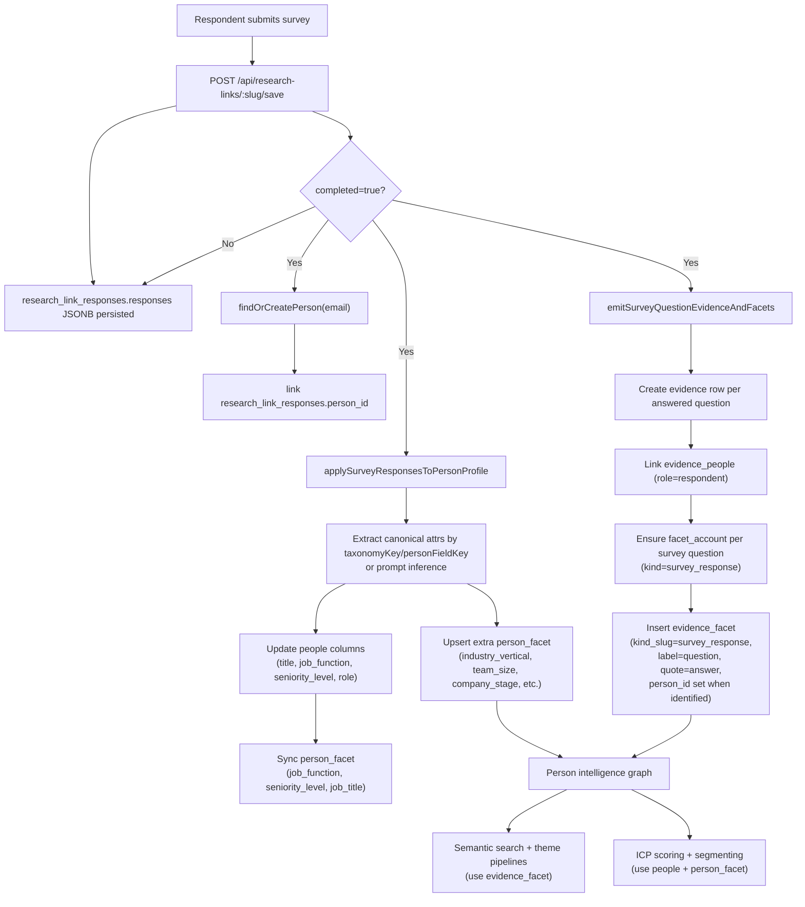

# Survey Response to Person Intelligence Data Flow

## JTBD and outcome
- JTBD: As a research/GTM operator, I need survey answers to become reusable person intelligence so I can score ICP fit and find the right people without manually normalizing fields.
- Outcome: A completed survey response now writes canonical records that support both:
  - semantic retrieval (`evidence_facet` with `kind_slug=survey_response`)
  - structured segmentation/ICP (`people` fields + `person_facet`)

## End-to-end flow

## How downstream systems use this
- Semantic/facet retrieval: reads `evidence_facet` (question/answer-level, embedded) to cluster/search survey statements.
- ICP scoring: reads `people` (title/job_function/etc.), org fields, and `person_facet` for target facet matching.
- People views/timelines: can consume both canonical profile facets and per-response Q/A facets.

## Notes
- `survey_response` facet kind uses per-question `facet_account` entries (question label as facet label).
- `quote` stores normalized answer text (including select/likert values) so all question types become searchable.
- For anonymous responses, `person_id` remains null on survey facets; identified responses attach `person_id`.
