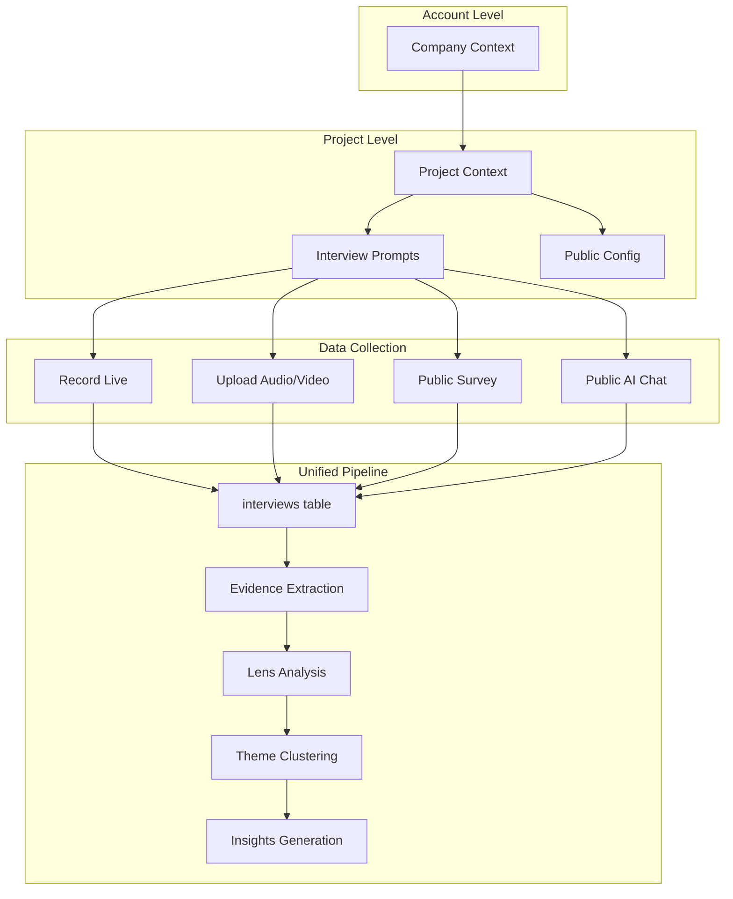
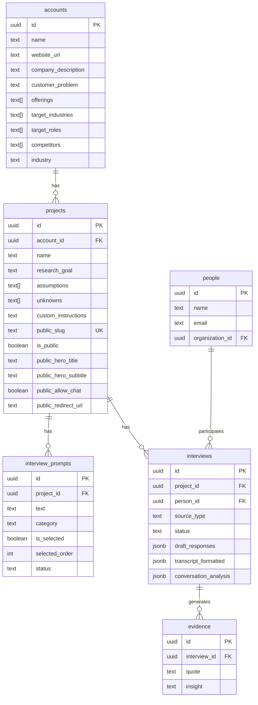
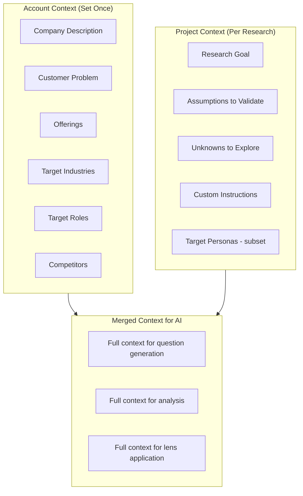
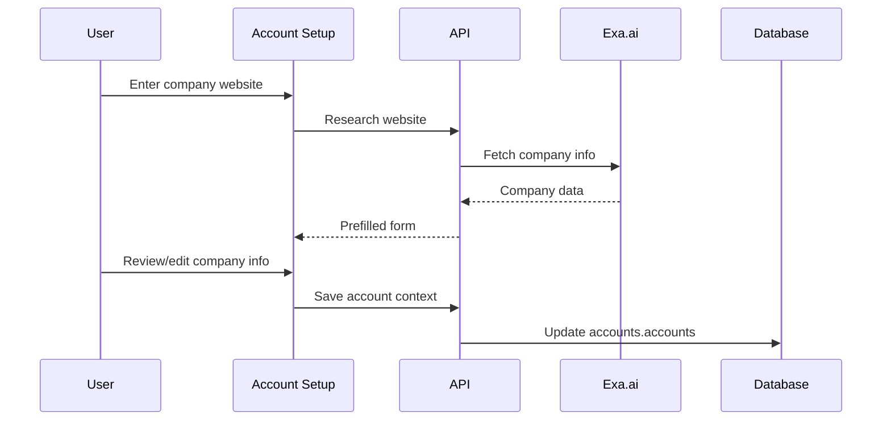
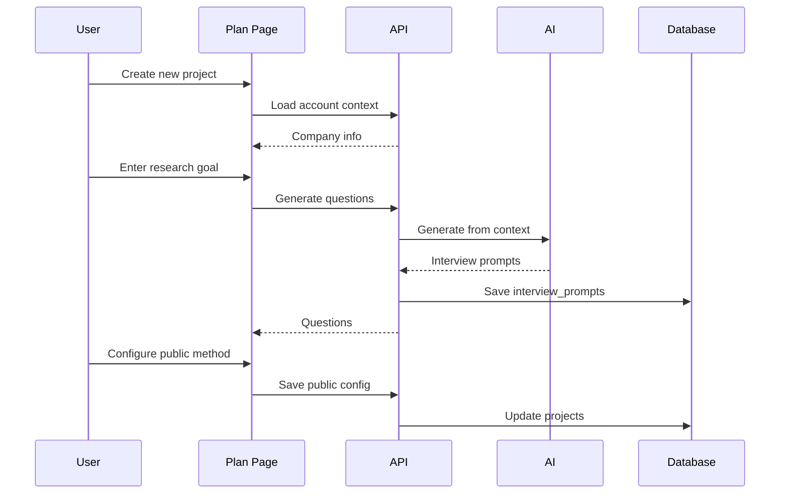
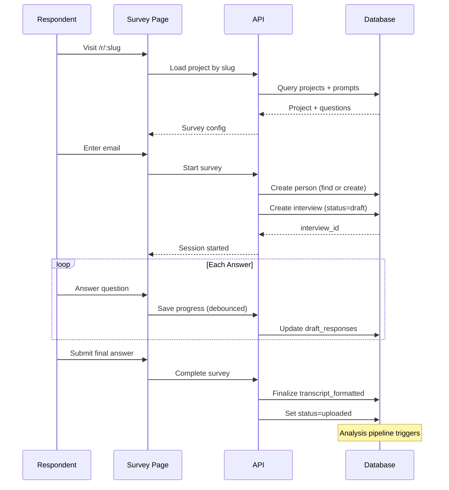

# Unified Conversation Architecture

> **Status:** Implementation in progress
> **Supersedes:** `research-links-architecture.md`
> **Created:** 2024-12-26

## Overview

This document describes the unified architecture for handling all conversation data—whether from recorded interviews, uploaded transcripts, public surveys, or AI chat conversations. The core insight is that **all of these are conversations** and should flow through a single analysis pipeline.

## Problem Statement

### Before: Fragmented Systems

```
┌─────────────────────────────────────────────────────────────────────┐
│ PREVIOUS: 3 Separate Systems                                        │
├─────────────────────────────────────────────────────────────────────┤
│                                                                      │
│  interviews ──────────────> evidence ──────> lenses ──> insights    │
│     (audio/video)              ✓              ✓           ✓         │
│                                                                      │
│  research_links ──> research_link_responses                          │
│     (questions JSONB)    (answers JSONB)     ✗           ✗          │
│                          NO ANALYSIS PIPELINE!                       │
│                                                                      │
│  interview_prompts                                                   │
│     (internal planning)  NOT CONNECTED TO EITHER                     │
│                                                                      │
└─────────────────────────────────────────────────────────────────────┘
```

**Issues:**
- Survey responses never get analyzed by lenses
- Questions stored in two places (JSONB + table)
- Survey respondents aren't tracked as People
- No evidence extraction from surveys
- Duplicate code for similar functionality

### After: Unified Pipeline



## Architecture

### Data Model



### Context Hierarchy



## Schema Changes

### accounts.accounts (New Columns)

```sql
ALTER TABLE accounts.accounts ADD COLUMN IF NOT EXISTS website_url text;
ALTER TABLE accounts.accounts ADD COLUMN IF NOT EXISTS company_description text;
ALTER TABLE accounts.accounts ADD COLUMN IF NOT EXISTS customer_problem text;
ALTER TABLE accounts.accounts ADD COLUMN IF NOT EXISTS offerings text[];
ALTER TABLE accounts.accounts ADD COLUMN IF NOT EXISTS target_industries text[];
ALTER TABLE accounts.accounts ADD COLUMN IF NOT EXISTS target_roles text[];
ALTER TABLE accounts.accounts ADD COLUMN IF NOT EXISTS competitors text[];
ALTER TABLE accounts.accounts ADD COLUMN IF NOT EXISTS industry text;
```

### projects (New Columns)

```sql
-- Public access configuration
ALTER TABLE projects ADD COLUMN IF NOT EXISTS public_slug text UNIQUE;
ALTER TABLE projects ADD COLUMN IF NOT EXISTS is_public boolean DEFAULT false;
ALTER TABLE projects ADD COLUMN IF NOT EXISTS public_hero_title text;
ALTER TABLE projects ADD COLUMN IF NOT EXISTS public_hero_subtitle text;
ALTER TABLE projects ADD COLUMN IF NOT EXISTS public_cta_label text DEFAULT 'Share your feedback';
ALTER TABLE projects ADD COLUMN IF NOT EXISTS public_allow_chat boolean DEFAULT false;
ALTER TABLE projects ADD COLUMN IF NOT EXISTS public_redirect_url text;
ALTER TABLE projects ADD COLUMN IF NOT EXISTS public_calendar_url text;

-- Index for public slug lookup
CREATE UNIQUE INDEX IF NOT EXISTS idx_projects_public_slug
  ON projects(public_slug) WHERE public_slug IS NOT NULL;
```

### interviews (New Column)

```sql
-- In-progress survey answers
ALTER TABLE interviews ADD COLUMN IF NOT EXISTS
  draft_responses jsonb DEFAULT '{}'::jsonb;

COMMENT ON COLUMN interviews.draft_responses IS
  'In-progress survey answers saved in real-time. Cleared when finalized.';
```

### source_type Values

The `interviews.source_type` column now supports:

| Value | Description |
|-------|-------------|
| `realtime_recording` | Live recorded interview |
| `audio_upload` | Uploaded audio file |
| `video_upload` | Uploaded video file |
| `document_upload` | Uploaded document |
| `transcript_paste` | Pasted transcript text |
| `survey_response` | Public survey form submission |
| `public_chat` | Public AI chat conversation |

## User Flows

### Account Setup (Once)



### Project Creation with Plan Step



### Public Survey Response



## Slug Generation

### Strategy
Generate unique 6-character slugs using nanoid with BASE58 alphabet:

```typescript
import { customAlphabet } from "nanoid/non-secure";

const BASE58 = "123456789ABCDEFGHJKLMNPQRSTUVWXYZabcdefghijkmnopqrstuvwxyz";
const generateSlug = customAlphabet(BASE58, 6);

// Examples:
// generateSlug() → 'f3GkQp'
// generateSlug() → 'aBc123'
// generateSlug() → 'XyZ789'
```

**Why BASE58?**
- Excludes ambiguous characters: 0, O, I, l
- URL-safe without encoding
- Readable and easy to share verbally
- ~56.8 billion possible combinations (58^6)

### UI Behavior
1. Generate slug automatically when enabling public access
2. Show preview: "Your link: /r/f3GkQp"
3. Slug is permanent once generated (no collisions possible)
4. Keep it simple - no manual editing needed

## Real-time Answer Saving

### Form Mode
```typescript
// Debounce saves to avoid excessive API calls
const saveAnswer = useDebouncedCallback(async (questionId: string, value: string) => {
  await fetch(`/api/r/${slug}/save-progress`, {
    method: 'POST',
    body: JSON.stringify({ interviewId, questionId, value })
  });
}, 500);

// Also save on:
// - "Next" button click (immediate)
// - beforeunload event (best effort)
```

### Chat Mode
```typescript
// Save after each AI response
const saveChatProgress = async (messages: Message[]) => {
  await fetch(`/api/r/${slug}/save-progress`, {
    method: 'POST',
    body: JSON.stringify({ interviewId, chatHistory: messages })
  });
};
```

## Analysis Pipeline Integration

### Survey → Evidence Flow

1. Survey completed → `interviews.status = 'uploaded'`
2. Analysis job triggered → extracts evidence from Q&A
3. Evidence linked to interview and person
4. Lenses applied → Customer Discovery shows Q&A directly

### Customer Discovery Lens Q&A Section

The lens should render structured Q&A clearly:

```
┌─────────────────────────────────────────────────────────────────────┐
│ QUESTIONS & ANSWERS                                                  │
├─────────────────────────────────────────────────────────────────────┤
│                                                                      │
│ Q: What's your biggest challenge with [topic]?                       │
│ A: "We struggle with coordinating across teams when..."              │
│    — Sarah Chen, PM @ Acme Corp                                      │
│                                                                      │
│ Q: How do you currently solve this?                                  │
│ A: "We've tried spreadsheets but they get out of sync..."            │
│    — Sarah Chen, PM @ Acme Corp                                      │
│                                                                      │
└─────────────────────────────────────────────────────────────────────┘
```

## Migration Plan

### Phase 1: Schema Changes
- [x] Add company context columns to accounts
- [x] Add public config columns to projects
- [x] Add draft_responses to interviews

### Phase 2: UI Updates
- [ ] Account company setup page
- [ ] Project Plan page (goals + questions + method)
- [ ] Update project loaders to include account context

### Phase 3: Public Route Rewrite
- [ ] Rewrite `/r/:slug` to query projects.public_slug
- [ ] Create interviews from survey submissions
- [ ] Create/find people from email

### Phase 4: Cleanup
- [ ] Drop research_links table
- [ ] Drop research_link_responses table
- [ ] Remove deprecated code

## Risk Mitigation

| Risk | Mitigation |
|------|------------|
| Interview orphans from abandoned surveys | Cleanup job for drafts > 30 days old |
| Person duplicates from email casing | Always lowercase, unique index on lower(email) |
| Data loss on tab close | Save on beforeunload + on "Next" click |
| Partial analysis | Only trigger on status='uploaded' |
| Public route auth | Admin client server-side, strict validation |

## Deprecated

The following will be removed after migration:

- `research_links` table
- `research_link_responses` table
- `research_links.questions` JSONB column
- `app/features/research-links/` (most files)
- `app/routes/api.research-links.$slug.*` routes
