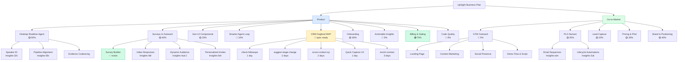

```mermaid
graph TD
    BIZ["UpSight Business Plan"]

    BIZ --> PROD["Product"]
    BIZ --> GTM["Go-to-Market"]

    PROD --> DESKTOP["Desktop Realtime Agent<br/>🟡 50%"]
    PROD --> SURVEYS["Surveys & Outreach<br/>🟡 40%"]
    PROD --> GENUI["Gen-UI Components<br/>🟡 25%"]
    PROD --> AGENT["Smarter Agent Loop<br/>🔴 10%"]
    PROD --> CRM["CRM Dogfood MVP<br/>🔴 spec ready"]
    PROD --> ONBOARD["Onboarding<br/>🟡 60%"]
    PROD --> INSIGHTS_ICP["Actionable Insights<br/>🔴 5%"]
    PROD --> BILLING["Billing & Gating<br/>🟢 75%"]
    PROD --> QUALITY["Code Quality<br/>🔴 0%"]

    DESKTOP --> SPEAKER["Speaker ID<br/>Insights-32v"]
    DESKTOP --> PIPELINE["Pipeline Alignment<br/>Insights-65r"]
    DESKTOP --> COALESCE["Evidence Coalescing"]

    SURVEYS --> BUILDER["Survey Builder<br/>✅ exists"]
    SURVEYS --> VIDEO["Video Responses<br/>Insights-4dl"]
    SURVEYS --> AUDIENCE["Dynamic Audience<br/>Insights-4ud.1"]
    SURVEYS --> PERSONALIZE["Personalized Invites<br/>Insights-0xh"]

    CRM --> FOLLOWUPS["check-followups<br/>1 day"]
    CRM --> STAGE["suggest-stage-change<br/>2 days"]
    CRM --> ICP["score-contact-icp<br/>2 days"]
    CRM --> CAPTURE["Quick Capture UX<br/>1 day"]
    CRM --> ENRICH["enrich-contact<br/>3 days"]

    GTM --> OUTREACH["GTM Outreach<br/>🔴 5%"]
    GTM --> PLG_S["PLG Nurture<br/>🟡 20%"]
    GTM --> LEADS["Lead Capture<br/>🟡 10%"]
    GTM --> PRICING["Pricing & Pilot<br/>🟡 30%"]
    GTM --> BRAND["Brand & Positioning<br/>🟡 40%"]

    OUTREACH --> LANDING["Landing Page"]
    OUTREACH --> CONTENT["Content Marketing"]
    OUTREACH --> SOCIAL["Social Presence"]
    OUTREACH --> DEMO["Demo Flow & Script"]
    PLG_S --> EMAIL["Email Sequences<br/>Insights-aim"]
    PLG_S --> NURTURE["Lifecycle Automations<br/>Insights-2uk"]

    style PROD fill:#dbeafe,stroke:#3b82f6
    style GTM fill:#dcfce7,stroke:#22c55e
    style CRM fill:#fef3c7,stroke:#f59e0b
    style BILLING fill:#d1fae5,stroke:#10b981
    style BUILDER fill:#d1fae5,stroke:#10b981
```