# UpSight Business Roadmap

For this week's focus, see `/_SPRINT.md`. For daily workflow, see `/_WORKFLOW.md`.

## Current Priorities

1. **Desktop realtime meeting agent** — killer demo, needs pipeline alignment + speaker ID
2. **Surveys quick wow** — personalized video invites, voice responses. PLG differentiator
3. **GTM outreach** — landing page, demo script, content. Need pipeline to survive
4. **Actionable insights for ICP** — the "so what" of research. Why users stay
5. **Smarter agent loop** — context-aware recommendations. Compounds everything else

---

## BMad Spec Flow

How new features go from idea to shipped. Each BMad step runs in a **fresh chat session** (Cmd+N) to keep context clean. Output lands in `_bmad-output/`, not `docs/`.


**BMad session types:**

| Scope | Command | When |
|-------|---------|------|
| Small feature (< 15 stories) | `/bmad-quick-spec` | Most features |
| Major feature | `/bmad-create-prd` → `/bmad-create-architecture` → `/bmad-create-stories` | Each in fresh session |
| Complex story | `/bmad-create-story` | When implementation needs detail |

**Context loading** — start each BMad session with:

```text
Read docs/_information_architecture.md, docs/_lens-based-architecture-v2.md,
and docs/interview-processing-explained.md for existing product context.
Then run /bmad-quick-spec for: [your feature]
```

---

## Epic Roadmap

Multi-week view. Completeness is estimated from codebase state + epic descriptions. Current beads: 50 open, 6 in_progress, 50 closed.

### Product Epics

| # | Epic | Why Important | Status | Done | LOE | Bead | Label |
|---|------|--------------|--------|------|-----|------|-------|
| 1 | **Desktop Realtime Agent** | Killer demo. Realtime evidence + speaker ID + pipeline alignment. | 🟡 Phase 1 done | ~50% | 2 wk | Insights-xph, Insights-32v | `desktop` |
| 2 | **Surveys & Video Outreach** | Quick wow — personalized video invites, voice responses. PLG hook. | 🟡 Builder exists | ~40% | 2 wk | Insights-4ud | `product` |
| 4 | **Actionable Insights for ICP** | The "so what" of research. Evidence-backed recs for target personas. | � Not started | ~5% | 2 wk | Insights-wj3, Insights-5am | `product` |
| 5 | **Smarter Agent Loop** | Context-aware Chief of Staff. Knows goals, people, conversations. | 🔴 Not started | ~10% | 2 wk | Insights-43a.10 | `agents` |
| — | **CRM Dogfood MVP** | Dogfood UpSight as our CRM. 5 targeted gaps. | 🔴 Spec ready | ~0% | 1.5 wk | — | `crm-dogfood` |
| — | **Onboarding Flow** | First-run experience. Adaptive companion, context cards. | 🟡 Improving | ~60% | 1 wk | Insights-dwy, Insights-a41 | `product` |
| — | **Billing & Feature Gating** | Polar integration, usage tracking, plan tiers. | 🟢 Mostly done | ~75% | 1 wk | Insights-ky0 | `infra` |
| — | **Gen-UI Component Library** | AI assistant widgets. 6/25+ built. | � In progress | ~25% | 3 wk | Insights-1yh | `product` |
| — | **Code Quality** | Lint errors, type errors, pre-commit hooks. CI confidence. | 🔴 Not started | ~0% | 1 wk | Insights-hab | `infra` |

### GTM & Business Epics

| # | Epic | Why Important | Status | Done | LOE | Label |
|---|------|--------------|--------|------|-----|-------|
| 3a | **GTM Outreach** | Need pipeline. Landing page, demo script, content, social. | 🔴 Not started | ~5% | 2 wk | `gtm` |
| 3b | **PLG Nurture Flows** | Email sequences, lifecycle automations in Brevo. | 🟡 Designed | ~20% | 1.5 wk | `plg` |
| — | **Brand & Positioning** | Value prop docs done. Need landing page, case studies, demo flow. | 🟡 Docs done | ~40% | 1.5 wk | `gtm` |
| — | **Pricing & Pilot Design** | Pricing model, discount codes, pilot structure. | 🟡 Polar live | ~30% | 1 wk | `gtm` |
| — | **Lead Capture & Attribution** | UTM tracking, waitlist analytics, conversion funnels. | 🟡 Spec exists | ~10% | 1 wk | `gtm` |

---

## Roadmap Hierarchy (with Status)

Note: Copy to separate `plan-roadmap` file and open in preview full screen to navigate properly.

```mermaid
graph TD
    BIZ["UpSight Business Plan"]

    BIZ --> PROD["Product"]
    BIZ --> GTM["Go-to-Market"]

    PROD --> DESKTOP["Desktop Realtime Agent<br/>🟡 50%"]
    PROD --> SURVEYS["Surveys & Outreach<br/>🟡 40%"]
    PROD --> GENUI["Gen-UI Components<br/>🟡 25%"]
    PROD --> AGENT["Smarter Agent Loop<br/>🔴 10%"]
    PROD --> CRM["CRM Dogfood MVP<br/>🔴 spec ready"]
    PROD --> ONBOARD["Onboarding<br/>🟡 60%"]
    PROD --> INSIGHTS_ICP["Actionable Insights<br/>🔴 5%"]
    PROD --> BILLING["Billing & Gating<br/>🟢 75%"]
    PROD --> QUALITY["Code Quality<br/>🔴 0%"]

    DESKTOP --> SPEAKER["Speaker ID<br/>Insights-32v"]
    DESKTOP --> PIPELINE["Pipeline Alignment<br/>Insights-65r"]
    DESKTOP --> COALESCE["Evidence Coalescing"]

    SURVEYS --> BUILDER["Survey Builder<br/>✅ exists"]
    SURVEYS --> VIDEO["Video Responses<br/>Insights-4dl"]
    SURVEYS --> AUDIENCE["Dynamic Audience<br/>Insights-4ud.1"]
    SURVEYS --> PERSONALIZE["Personalized Invites<br/>Insights-0xh"]

    CRM --> FOLLOWUPS["check-followups<br/>1 day"]
    CRM --> STAGE["suggest-stage-change<br/>2 days"]
    CRM --> ICP["score-contact-icp<br/>2 days"]
    CRM --> CAPTURE["Quick Capture UX<br/>1 day"]
    CRM --> ENRICH["enrich-contact<br/>3 days"]

    GTM --> OUTREACH["GTM Outreach<br/>🔴 5%"]
    GTM --> PLG_S["PLG Nurture<br/>🟡 20%"]
    GTM --> LEADS["Lead Capture<br/>🟡 10%"]
    GTM --> PRICING["Pricing & Pilot<br/>🟡 30%"]
    GTM --> BRAND["Brand & Positioning<br/>🟡 40%"]

    OUTREACH --> LANDING["Landing Page"]
    OUTREACH --> CONTENT["Content Marketing"]
    OUTREACH --> SOCIAL["Social Presence"]
    OUTREACH --> DEMO["Demo Flow & Script"]
    PLG_S --> EMAIL["Email Sequences<br/>Insights-aim"]
    PLG_S --> NURTURE["Lifecycle Automations<br/>Insights-2uk"]

    style PROD fill:#dbeafe,stroke:#3b82f6
    style GTM fill:#dcfce7,stroke:#22c55e
    style CRM fill:#fef3c7,stroke:#f59e0b
    style BILLING fill:#d1fae5,stroke:#10b981
    style BUILDER fill:#d1fae5,stroke:#10b981
```



**Legend:** 🟢 75%+ | 🟡 25-74% | 🔴 < 25% | ✅ Done

---

## Dual-Track Sprints

You wear two hats. Run parallel tracks so you (and future team members) can context-switch cleanly.

### Track 1: Product (Builder Hat)

Triage: `bv --robot-triage --label product`

Focus: shipping features, fixing bugs, improving UX. This is where agent sessions implement code.

### Track 2: Business (Operator Hat)

Triage: `bv --robot-triage --label gtm`

Focus: outreach, content, demos, pricing, PLG flows. This is where you write copy, design funnels, and dogfood UpSight as the CRM.

### How the Dual Track Works in `_SPRINT.md`

Each week, pick goals from **both** tracks:

```markdown
## Week of YYYY-MM-DD

### Product Track (Builder)
1. [ ] [epic] specific deliverable
2. [ ] [epic] specific deliverable

### Business Track (Operator)
1. [ ] [epic] specific deliverable
2. [ ] [epic] specific deliverable

### Parking Lot (either track)
- ...
```

Max 2 goals per track per week. If one track is hot, shift to 3/1.

---

## Beads Label Strategy

Labels separate work streams for independent triage.

```bash
# Triage by track
bv --robot-triage --label product        # Product track
bv --robot-triage --label gtm            # Business track
bv --robot-triage --label crm-dogfood    # CRM-specific

# Cross-cutting views
bv --robot-plan                          # Parallel execution tracks
bv --robot-priority                      # Priority misalignment detection
bv --robot-alerts                        # Stale issues, blocking cascades
```

### Labels

| Label | Track | Use For |
|-------|-------|---------|
| `product` | Product | Core features, bugs, tech debt |
| `desktop` | Product | Desktop app, realtime agent, speaker ID |
| `agents` | Product | AI agent tools and capabilities |
| `crm-dogfood` | Product | CRM MVP (5 gaps) |
| `infra` | Product | Billing, CI/CD, code quality |
| `gtm` | Business | Marketing, outreach, content, demos |
| `plg` | Business | Email sequences, nurture, landing pages |
| `sales` | Business | Demo flow, pricing, pilot program |

### Beads Hygiene

**50 open, 6 in_progress, 50 closed.** Label existing open issues for stream-based triage:

```bash
# Label existing issues by stream
bd update Insights-xph --label desktop
bd update Insights-32v --label desktop
bd update Insights-4ud --label product
bd update Insights-aim --label plg
bd update Insights-7r5 --label plg
```

---

## Reference

### Shipped Features (Foundation)

- **Conversation Lenses** — [PRD](20-features-prds/features/conversation-lenses/PRD.md), [Architecture](00-foundation/_lens-based-architecture-v2.md)
- **Insights System** — [PRD](20-features-prds/features/insights/PRD.md)
- **Interview Processing** — [Spec](20-features-prds/features/feature-spec-transcription-pipeline.md)
- **Task System** — [Design](20-features-prds/features/task-system-technical-design.md), [Planning Workflows](20-features-prds/features/task-planning-workflows.md)
- **People & Organizations** — CRUD, search, org linking, segment inference
- **Opportunities Pipeline** — Kanban, stages, AI deal advisor, stakeholder matrix
- **Sales Lens Extraction** — BANT/MEDDIC/SPICED/MAP frameworks
- **AI Assistant (Chief of Staff)** — 14+ Mastra tools, gen-ui widgets

### Architecture

- [Information Architecture](00-foundation/_information_architecture.md)
- [Lens Architecture](00-foundation/_lens-based-architecture-v2.md)

### Market & Positioning

- [Customer-Centric CRM Value Prop](50-market/customer-centric-crm-value-prop.md)
- [User Value Proposition](50-market/user-value-prop.md)
- [Brand Brief](50-market/brand-brief.md)
- [CRM Dogfood Kickoff](90-roadmap/crm-dogfood-kickoff.md)

### How-To Guides

- [Database & Migrations](30-howtos/supabase-howto.md)
- [Deployment](30-howtos/deploy-howto.md)
- [Testing](30-howtos/testing-howto.md)

### Task Hierarchy (Future)

The task system supports hierarchical views via `parent_task_id` + `depends_on_task_ids`. See [task-planning-workflows.md](20-features-prds/features/task-planning-workflows.md) for the spec (sequence view, schedule view, energy levels). Wiring this into the UpSight UI is a product feature on the backlog.
